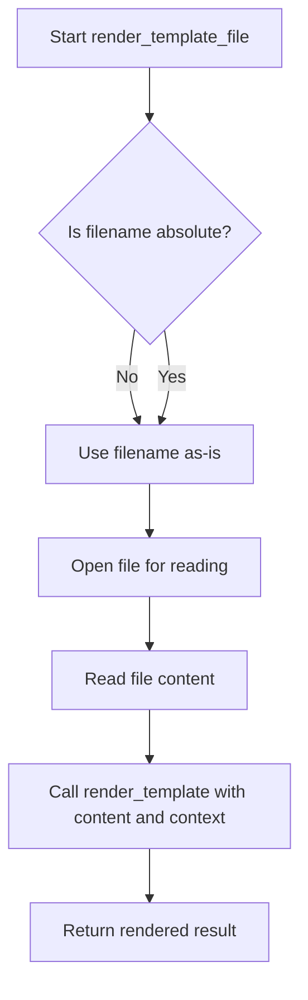

# `templating.py`

## `src.exodus_bundler.templating.render_template` · *function*

## Summary:
Replaces template placeholders in a string with provided context values.

## Description:
This function performs simple string substitution by replacing placeholders formatted as `{{key}}` with corresponding values from the provided context dictionary. It is designed to be a lightweight templating solution for basic string formatting needs.

## Args:
    string (str): The template string containing placeholders in the format `{{key}}` that need to be replaced.
    **context (dict): Keyword arguments representing the context values to substitute into the template. Each key corresponds to a placeholder in the string.

## Returns:
    str: A copy of the input string with all matching placeholders replaced by their respective values from the context.

## Raises:
    None

## Constraints:
    Preconditions:
        - The input string must be a valid string object.
        - All keys in the context dictionary must be strings.
    Postconditions:
        - The returned string will have all occurrences of `{{key}}` replaced with their respective values from context.
        - The original input string remains unmodified.

## Side Effects:
    None

## Control Flow:
```mermaid
flowchart TD
    A[Start render_template] --> B[Iterate through context items]
    B --> C{Key exists in string?}
    C -- Yes --> D[Replace all instances of '{{key}}' with value]
    D --> E[Continue iteration]
    C -- No --> E[Continue iteration]
    E --> F{More items?}
    F -- Yes --> B
    F -- No --> G[Return modified string]
```

## Examples:
    Basic usage:
        >>> render_template("Hello {{name}}!", name="World")
        "Hello World!"

    Multiple replacements:
        >>> render_template("{{greeting}}, {{name}}! Today is {{day}}.", greeting="Hi", name="Alice", day="Monday")
        "Hi, Alice! Today is Monday."

    No replacements:
        >>> render_template("Hello World!")
        "Hello World!"

## `src.exodus_bundler.templating.render_template_file` · *function*

## Summary:
Reads a template file and renders it with provided context variables.

## Description:
This function loads a template file from disk and processes it using the render_template function with the provided context. It handles both absolute and relative file paths by resolving relative paths against a global template directory. This extraction allows for clean separation between file I/O operations and template rendering logic.

## Args:
    filename (str): Path to the template file. Can be absolute or relative to template_directory.
    **context (dict): Keyword arguments containing values to substitute into the template.

## Returns:
    str: The rendered template content with all placeholders replaced by context values.

## Raises:
    FileNotFoundError: When the specified template file does not exist.

## Constraints:
    Preconditions:
        - The filename parameter must be a valid string.
        - The template_directory global variable must be defined and accessible.
    Postconditions:
        - The original template file remains unmodified.
        - The returned string contains all placeholders replaced with context values.

## Side Effects:
    - Reads from the filesystem to load the template file.
    - Makes a call to render_template function.

## Control Flow:


## Examples:
Basic usage:
    >>> render_template_file('welcome.txt', name='Alice')
    "Welcome, Alice!"

Relative path resolution:
    >>> render_template_file('emails/welcome.html', user='Bob', product='MyApp')
    "<html><body>Welcome, Bob! Thanks for trying MyApp.</body></html>"

