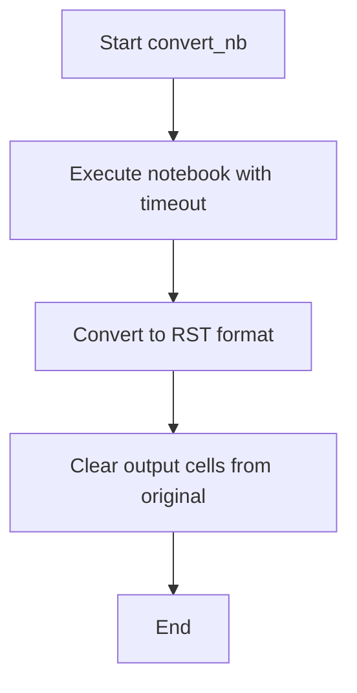

# `nb_to_doc.py`

## `docs.tutorials.tools.nb_to_doc.convert_nb` · *function*

## Summary:
Executes a Jupyter notebook, converts it to RST format, and cleans output cells from the original notebook.

## Description:
This function performs a three-step process on a Jupyter notebook: first executes the notebook with a 60-second timeout, then converts it to RST format for documentation purposes, and finally removes all output cells from the original notebook file. This utility is commonly used in documentation pipelines to prepare notebooks for publication while maintaining clean, executable versions.

## Args:
    nbname (str): The base name of the notebook file (without .ipynb extension). Must correspond to a valid notebook file in the working directory.

## Returns:
    None: This function does not return any value.

## Raises:
    subprocess.CalledProcessError: If any of the jupyter nbconvert commands fail during execution.

## Constraints:
    Preconditions:
    - The notebook file (nbname + ".ipynb") must exist in the current working directory.
    - Jupyter and nbconvert must be installed and available in the system PATH.
    - The user must have appropriate permissions to execute the notebook and modify files.

    Postconditions:
    - The original notebook file will be executed and modified in-place.
    - An RST version of the notebook will be created alongside the original.
    - The original notebook will have its output cells cleared and be saved in-place.

## Side Effects:
    - Executes shell commands via subprocess calls (likely via a wrapper function `sh`).
    - Modifies the original notebook file in-place during execution and cleanup steps.
    - Creates a new RST file with the same base name as the notebook.
    - May write to standard output/error streams from the subprocess calls.

## Control Flow:

## Examples:
    convert_nb("my_notebook")
    # This will execute my_notebook.ipynb, create my_notebook.rst, and clean outputs from my_notebook.ipynb

