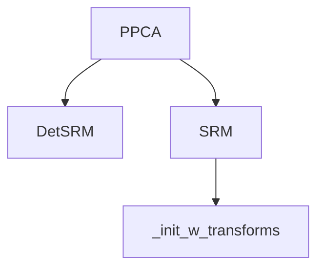

# `hypertools._externals`

## Tree:
```
_externals/
├── ppca.py
└── srm.py
```

## Role:
Provides specialized implementations of dimensionality reduction and shared response modeling algorithms for scientific data analysis.

## Description:
The `_externals` module contains external algorithm implementations that extend the core functionality of the hypertools library. It provides two main categories of algorithms: probabilistic principal component analysis (PPCA) for robust dimensionality reduction with missing data handling, and shared response models (SRM) for aligning multi-subject neuroimaging data. These implementations are designed to work seamlessly with the broader hypertools ecosystem while providing specialized capabilities for scientific data analysis.

## Components:
- **PPCA** (class): Probabilistic Principal Component Analysis implementation for handling missing data through probabilistic estimation
- **DetSRM** (class): Deterministic Shared Response Model for aligning multi-subject neuroimaging data into a common shared response space
- **SRM** (class): Probabilistic Shared Response Model for aligning multi-subject neuroimaging data into a common shared response space
- **_init_w_transforms** (function): Helper function for initializing orthogonal transformation matrices for SRM



## Public API:
- **PPCA**: Class for probabilistic PCA with fit(), transform(), save(), and load() methods for dimensionality reduction with missing data handling
- **DetSRM**: Class implementing deterministic shared response model with fit() and transform() methods for neuroimaging data alignment
- **SRM**: Class implementing probabilistic shared response model with fit() and transform() methods for neuroimaging data alignment
- **_init_w_transforms**: Function for initializing orthogonal transformation matrices for SRM

## Dependencies:
- Internal: None
- External: numpy, scipy, sklearn.utils

## Constraints:
- All algorithms require numeric input data with consistent dimensions
- PPCA handles missing data through probabilistic estimation during fitting
- SRM algorithms require at least 2 subjects for fitting
- Models must be fitted before transformation operations

---

## Files

- [`ppca.py`](_externals/ppca.md)
- [`srm.py`](_externals/srm.md)

