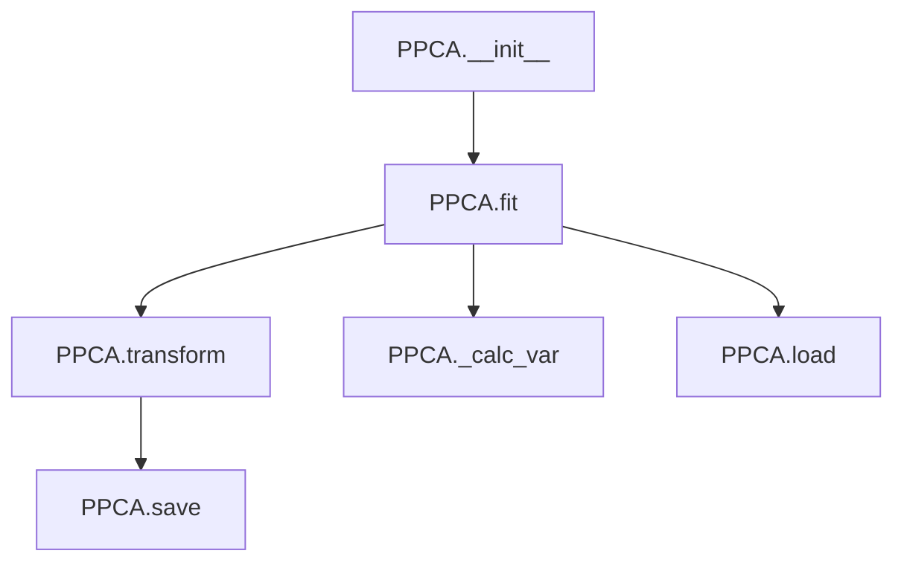

# `ppca.py`

## `hypertools._externals.ppca.PPCA` · *class*

## Summary:
Probabilistic Principal Component Analysis (PPCA) class for dimensionality reduction with missing data handling.

## Description:
The PPCA class implements a probabilistic approach to principal component analysis that can handle datasets with missing values. It provides methods for fitting the model to data, transforming data into lower-dimensional space, and saving/loading the learned model parameters. This class is particularly useful when dealing with incomplete datasets where traditional PCA would fail due to NaN values.

## State:
- raw: Original input data array (numpy.ndarray or None)
- data: Standardized data used for model fitting (numpy.ndarray or None)  
- C: Projection matrix (numpy.ndarray or None)
- means: Mean values for each feature (numpy.ndarray or None)
- stds: Standard deviation values for each feature (numpy.ndarray or None)

## Lifecycle:
- Creation: Instantiate with `PPCA()` constructor
- Usage: Call `fit()` with data first, then `transform()` for dimensionality reduction
- Destruction: No explicit cleanup required; uses standard Python garbage collection

## Method Map:


## Raises:
- RuntimeError: When attempting to transform data before fitting the model (self.C is None)
- AssertionError: When loading from a non-existent file path

## Example:
```python
# Create and fit the model
ppca = PPCA()
data = [[1, 2, np.nan], [4, 5, 6], [7, 8, 9]]
ppca.fit(data, d=2)

# Transform data
transformed = ppca.transform()

# Save model
ppca.save('model.npy')

# Load model
new_ppca = PPCA()
new_ppca.load('model.npy')
```

### `hypertools._externals.ppca.PPCA.__init__` · *method*

## Summary:
Initializes the PPCA object by setting all internal state attributes to None.

## Description:
This method serves as the constructor for the PPCA class, initializing all internal attributes to their default None values. These attributes will be populated during subsequent operations like fitting the model with data. The method is called automatically when creating a new PPCA instance and establishes the initial state of the object before any data processing occurs.

## Args:
    None

## Returns:
    None

## Raises:
    None

## State Changes:
    Attributes READ: None
    Attributes WRITTEN: 
    - self.raw: Set to None
    - self.data: Set to None  
    - self.C: Set to None
    - self.means: Set to None
    - self.stds: Set to None

## Constraints:
    Preconditions: None
    Postconditions: All internal state attributes are initialized to None

## Side Effects:
    None

### `hypertools._externals.ppca.PPCA._standardize` · *method*

## Summary:
Standardizes input data using stored mean and standard deviation values from model fitting.

## Description:
This method applies z-score normalization to input data using previously computed mean and standard deviation statistics. It is called during the model fitting process to normalize training data before PCA computation. The method ensures that data is properly scaled for numerical stability in subsequent computations.

## Args:
    X (array-like): Input data array to be standardized with shape (n_samples, n_features)

## Returns:
    array-like: Standardized data with same shape as input X, where each feature has zero mean and unit variance

## Raises:
    RuntimeError: When model has not been fitted yet (self.means or self.stds is None)

## State Changes:
    Attributes READ: self.means, self.stds
    Attributes WRITTEN: None

## Constraints:
    Preconditions: Model must be fitted first (self.means and self.stds must not be None)
    Postconditions: Output data has zero mean and unit variance for each feature dimension

## Side Effects:
    None

### `hypertools._externals.ppca.PPCA.fit` · *method*

## Summary:
Fits a probabilistic principal component analysis model to the provided data, estimating the underlying low-dimensional representation and model parameters.

## Description:
This method implements the Expectation-Maximization algorithm for probabilistic PCA (PPCA) to learn a low-dimensional latent space representation of the input data. It handles missing values and infinite values in the data, performs standardization, and iteratively optimizes the model parameters until convergence. The method is typically called during the training phase of a PPCA model before performing dimensionality reduction via the transform method.

## Args:
    data (numpy.ndarray): Input data matrix of shape (N, D) where N is the number of observations and D is the number of features.
    d (int, optional): Dimensionality of the latent space. If None, defaults to the number of features in the data.
    tol (float, optional): Convergence tolerance for the EM algorithm. Defaults to 1e-4.
    min_obs (int, optional): Minimum number of valid observations required for a feature to be included. Defaults to 10.
    verbose (bool, optional): If True, prints convergence diagnostics during iterations. Defaults to False.

## Returns:
    None: This method updates the object's attributes in-place and does not return any value.

## Raises:
    RuntimeError: If _standardize is called before fit has been executed (when means or stds are None), or if the data is empty or contains only NaN values.

## State Changes:
    Attributes READ: self.raw, self.C, self.means, self.stds
    Attributes WRITTEN: self.raw, self.means, self.stds, self.data, self.C, self.eig_vals, self.var_exp

## Constraints:
    Preconditions: 
    - Input data should be a 2D numpy array
    - Data should not be completely empty or contain only NaN values
    - If self.C exists, it should be compatible with the data dimensions
    Postconditions:
    - self.C contains the learned projection matrix
    - self.data contains the standardized data
    - self.means and self.stds contain the mean and standard deviation of the input data
    - self.eig_vals contains the eigenvalues of the covariance matrix
    - self.var_exp contains the cumulative variance explained by each component

## Side Effects:
    None: This method does not perform I/O operations or mutate external objects. However, it may print diagnostic information if verbose=True.

### `hypertools._externals.ppca.PPCA.transform` · *method*

## Summary:
Projects input data onto the principal component space learned during model fitting.

## Description:
This method transforms new data points into the lower-dimensional principal component space using the previously computed projection matrix C. It serves as the core transformation mechanism for applying PCA to unseen data samples. The method is typically called after fitting the model with training data to project new samples into the same principal component space.

## Args:
    data (numpy.ndarray, optional): New data points to transform. If None, uses the training data stored in self.data. Expected shape is (n_samples, n_features).

## Returns:
    numpy.ndarray: Transformed data in the principal component space with shape (n_samples, n_components).

## Raises:
    RuntimeError: When the model has not been fitted yet (self.C is None).

## State Changes:
    Attributes READ: self.C, self.data
    Attributes WRITTEN: None

## Constraints:
    Preconditions: The model must be fitted first (self.C must not be None). Data should have compatible dimensions with the fitted model.
    Postconditions: Output shape is (data.shape[0], self.C.shape[1]).

## Side Effects:
    None

### `hypertools._externals.ppca.PPCA._calc_var` · *method*

## Summary:
Computes and stores the cumulative variance explained by principal components as a ratio of total variance.

## Description:
This method calculates the variance explained by each principal component and determines the cumulative proportion of total variance captured. It is typically invoked after fitting the PCA model to compute variance statistics that help assess model performance. The method requires that data has been fitted (self.data is not None) and that eigenvalues have been computed (self.eig_vals exists).

## Args:
    None

## Returns:
    None

## Raises:
    RuntimeError: When the data model has not been fitted yet (i.e., self.data is None).

## State Changes:
    Attributes READ: self.data, self.eig_vals
    Attributes WRITTEN: self.var_exp

## Constraints:
    Preconditions: The data must be fitted (self.data must not be None) and eig_vals must be computed.
    Postconditions: The self.var_exp attribute is set to the cumulative sum of eigenvalues normalized by total variance.

## Side Effects:
    None

### `hypertools._externals.ppca.PPCA.save` · *method*

## Summary:
Saves the principal component matrix to a NumPy binary file for model persistence.

## Description:
This method serializes the principal component matrix (self.C) to disk using NumPy's binary format (.npy). It enables model persistence by storing the fitted PCA components so they can be reloaded later using the companion load method. This is typically called during model checkpointing or export operations in machine learning workflows.

## Args:
    fpath (str): Absolute or relative file path where the NumPy array will be saved.

## Returns:
    None: This method does not return any value.

## Raises:
    IOError: If the file cannot be written due to permission issues, invalid path, or insufficient disk space.
    TypeError: If fpath is not a string or is None.

## State Changes:
    - Attributes READ: self.C (the principal component matrix computed during fitting)
    - Attributes WRITTEN: None

## Constraints:
    - Preconditions: The object must have been fitted (self.C must be initialized as a NumPy array) and fpath must be a valid string path.
    - Postconditions: The file at fpath will contain the serialized NumPy array representation of self.C, which can be loaded back using the load method.

## Side Effects:
    - I/O operation: Writes data to the filesystem at the specified path.

### `hypertools._externals.ppca.PPCA.load` · *method*

## Summary:
Loads a pre-computed projection matrix from a NumPy file and assigns it to the object's C attribute, restoring previously computed PCA projections.

## Description:
This method reads a saved NumPy array from disk and assigns it to the instance's C attribute, which represents the principal component matrix. It is typically called during model initialization or when loading a pre-trained PCA model from disk to restore previously computed projections. This method encapsulates the loading logic to separate concerns and enable reuse of saved models.

## Args:
    fpath (str): Absolute or relative path to the NumPy file containing the projection matrix.

## Returns:
    None: This method does not return any value.

## Raises:
    AssertionError: If the specified file path does not correspond to an existing regular file.

## State Changes:
    Attributes READ: None
    Attributes WRITTEN: self.C

## Constraints:
    Preconditions: The file at fpath must exist and be a valid NumPy array file containing the projection matrix.
    Postconditions: The self.C attribute will be assigned the loaded NumPy array representing the principal components.

## Side Effects:
    I/O: Reads data from the filesystem at the specified file path.

