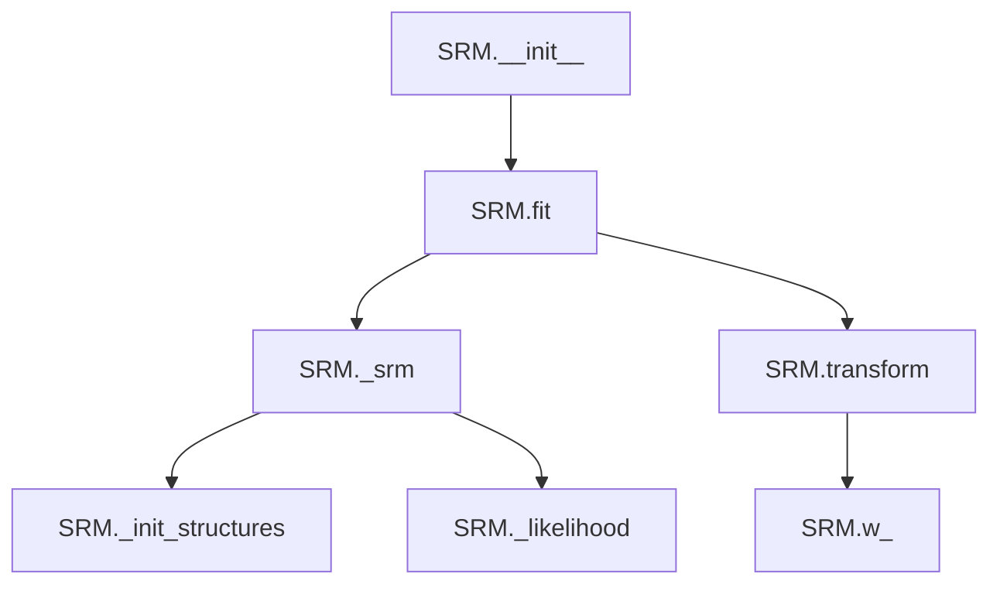

# `srm.py`

## `hypertools._externals.srm._init_w_transforms` · *function*

## Summary:
Initializes orthogonal transformation matrices for each subject in neuroimaging data using QR decomposition of random matrices.

## Description:
This function prepares initialization data for SRM (Shared Response Model) by creating orthogonal transformation matrices for each subject. It generates random matrices and applies QR decomposition to ensure orthogonality, which is essential for the mathematical foundation of the SRM algorithm. The function is typically called during the initialization phase of SRM fitting processes.

## Args:
    data (list): A list of numpy arrays, where each array represents neuroimaging data for a subject. Each array should have shape (n_voxels, n_features) where n_voxels varies by subject.
    features (int): Number of features to use for the transformation matrices. Must be a positive integer.

## Returns:
    tuple: A tuple containing two elements:
        - w (list): List of orthogonal transformation matrices, one for each subject. Each matrix has shape (n_voxels, features) where n_voxels is the number of voxels for that subject.
        - voxels (numpy.ndarray): Array of integers representing the number of voxels for each subject.

## Raises:
    None explicitly raised, but may raise exceptions from numpy operations if inputs are invalid.

## Constraints:
    - Preconditions: 
        * data must be a list of numpy arrays
        * Each array in data must have at least one row (voxel)
        * features must be a positive integer
    - Postconditions:
        * w contains orthogonal matrices for each subject
        * voxels contains the correct voxel count for each subject

## Side Effects:
    - Generates random numbers using numpy.random.random()
    - Creates new numpy arrays in memory

## Control Flow:
```mermaid
flowchart TD
    A[Start _init_w_transforms] --> B{data is list?}
    B -- No --> C[Throw TypeError]
    B -- Yes --> D{features > 0?}
    D -- No --> E[Throw ValueError]
    D -- Yes --> F[Initialize w=[], voxels array]
    F --> G[For each subject in data]
    G --> H[Get voxels count]
    H --> I[Generate random matrix]
    I --> J[Apply QR decomposition]
    J --> K[Append Q to w]
    K --> L[Return w, voxels]
```

## Examples:
```python
# Basic usage
data = [numpy.random.rand(100, 50), numpy.random.rand(120, 50)]
w, voxels = _init_w_transforms(data, 25)
print(f"Number of subjects: {len(w)}")
print(f"Voxel counts: {voxels}")
print(f"First subject matrix shape: {w[0].shape}")
```

## `hypertools._externals.srm.SRM` · *class*

## Summary:
SRM is a probabilistic Shared Response Model estimator that aligns neuroimaging data across multiple subjects by finding a common shared response space.

## Description:
The SRM class implements a probabilistic shared response model for neuroimaging data alignment. It is designed to find a common representation across multiple subjects by learning shared response patterns while accounting for subject-specific variations. This class follows scikit-learn's BaseEstimator and TransformerMixin interfaces, making it compatible with standard machine learning workflows.

## State:
- n_iter: int, default=10
  - Number of iterations for the Expectation-Maximization algorithm
  - Valid range: positive integers
  - Invariant: must be >= 1 for proper execution
- features: int, default=50
  - Number of features in the shared response space
  - Valid range: positive integers
  - Invariant: must be <= number of samples per subject for training
- rand_seed: int, default=0
  - Random seed for reproducible results
  - Valid range: any integer
  - Invariant: affects random initialization only
- sigma_s_: numpy.ndarray
  - Shared covariance matrix of the response space
  - Type: (features, features) shaped array
  - Invariant: symmetric positive definite matrix
- w_: list of numpy.ndarray
  - Subject-specific transformation matrices
  - Type: list of arrays, each with shape (subject_voxels, features) where subject_voxels varies by subject
  - Invariant: each matrix is orthogonal
- mu_: list of numpy.ndarray
  - Subject-specific mean vectors
  - Type: list of arrays, each with shape (subject_voxels,) where subject_voxels varies by subject
  - Invariant: corresponds to each subject's data mean
- rho2_: numpy.ndarray
  - Subject-specific noise variances
  - Type: (subjects,) shaped array
  - Invariant: positive values
- s_: numpy.ndarray
  - Shared response matrix
  - Type: (features, samples) shaped array
  - Invariant: represents aligned shared responses

## Lifecycle:
- Creation: Instantiate with n_iter, features, and rand_seed parameters
- Usage: Call fit() with list of subject data (minimum 2 subjects required), then transform() to align new data
- Destruction: No explicit cleanup required; uses standard Python garbage collection

## Method Map:


## Raises:
- ValueError: Raised in fit() when:
  - Number of subjects is less than or equal to 1
  - Insufficient samples for requested features
  - Inconsistent number of samples across subjects
- NotFittedError: Raised in transform() when model hasn't been fitted yet
- ValueError: Raised in transform() when number of subjects doesn't match training data

## Example:
```python
import numpy as np
from hypertools._externals.srm import SRM

# Create sample neuroimaging data for 3 subjects
subjects_data = [
    np.random.rand(100, 50),  # Subject 1: 100 voxels, 50 samples
    np.random.rand(120, 50),  # Subject 2: 120 voxels, 50 samples
    np.random.rand(110, 50)   # Subject 3: 110 voxels, 50 samples
]

# Initialize and fit SRM model
srm = SRM(n_iter=20, features=30, rand_seed=42)
srm.fit(subjects_data)

# Transform new data using fitted model
transformed_data = srm.transform(subjects_data)
```

### `hypertools._externals.srm.SRM.__init__` · *method*

## Summary:
Initializes the SRM object with configuration parameters for iterative feature extraction.

## Description:
This method sets up the initial state of the SRM (Shared Response Model) estimator by storing the provided hyperparameters. It is called during object instantiation to configure the model's behavior before fitting or transforming data.

## Args:
    n_iter (int): Number of iterations for the optimization algorithm. Defaults to 10.
    features (int): Number of features to extract. Defaults to 50.
    rand_seed (int): Random seed for reproducible results. Defaults to 0.

## Returns:
    None: This method does not return any value.

## Raises:
    None: This method does not raise any exceptions.

## State Changes:
    Attributes READ: None
    Attributes WRITTEN: self.n_iter, self.features, self.rand_seed

## Constraints:
    Preconditions: None
    Postconditions: The instance attributes self.n_iter, self.features, and self.rand_seed are set to the provided values.

## Side Effects:
    None: This method performs no I/O operations or external service calls.

### `hypertools._externals.srm.SRM.fit` · *method*

## Summary:
Fits the Shared Response Model (SRM) to multi-subject neuroimaging data by estimating shared neural response patterns and subject-specific transformation matrices.

## Description:
This method trains the SRM model on a list of neuroimaging datasets from multiple subjects. It validates input data integrity, performs necessary preprocessing checks, and invokes the core SRM optimization algorithm via the private `_srm` method to compute shared response patterns and subject-specific alignment matrices. The method is typically called during the model training phase as part of a scikit-learn compatible estimator workflow.

This method exists separately from the core computation to provide proper validation, error handling, and integration with scikit-learn's estimator interface. It ensures data consistency across subjects and prepares the model for subsequent transformation operations.

## Args:
    X (list): A list of numpy arrays, where each array represents neuroimaging data for a subject. Each array should have shape (n_voxels, n_samples) where n_voxels varies by subject and n_samples is constant across all subjects.
    y (None): Ignored parameter to maintain scikit-learn estimator interface compatibility.

## Returns:
    SRM: Returns self to enable method chaining for fluent API usage, maintaining scikit-learn estimator conventions.

## Raises:
    ValueError: Raised when:
        - There are fewer than 2 subjects in the input data
        - The number of samples in the first subject is less than the requested number of features
        - Subjects have inconsistent numbers of samples (timepoints)

## State Changes:
    Attributes READ: self.features
    Attributes WRITTEN: self.sigma_s_, self.w_, self.mu_, self.rho2_, self.s_

## Constraints:
    Preconditions:
        - X must be a list of at least 2 numpy arrays
        - Each array in X must contain finite numerical values
        - All arrays in X must have the same number of columns (samples)
        - The first array in X must have at least as many columns as self.features
    Postconditions:
        - The model is fitted and ready for transformation
        - All estimated parameters are stored in instance attributes
        - The fitted model maintains consistency with scikit-learn estimator conventions

## Side Effects:
    - Logs informational messages about the fitting process using the logger
    - Calls sklearn.utils.assert_all_finite to validate input data
    - Invokes the private _srm method which performs intensive numerical computations

### `hypertools._externals.srm.SRM.transform` · *method*

## Summary:
Transforms input data using pre-computed weight matrices from a fitted SRM model.

## Description:
This method applies the spatial regression model (SRM) transformation to new data samples using previously computed weight matrices. It is typically called after the SRM model has been fitted on training data. The method performs a matrix multiplication between each subject's weight matrix and corresponding input data to produce transformed output.

## Args:
    X (list): A list of numpy arrays, where each array represents data from a subject
    y (None): Placeholder parameter for scikit-learn compatibility, not used in implementation

## Returns:
    list: A list of transformed numpy arrays, one for each subject in X

## Raises:
    NotFittedError: When the method is called before the SRM model has been fitted (i.e., when w_ attribute is not present)
    ValueError: When the number of subjects in X doesn't match the number of subjects in the fitted model

## State Changes:
    Attributes READ: self.w_
    Attributes WRITTEN: None

## Constraints:
    Preconditions: 
    - The SRM model must have been fitted previously (w_ attribute must exist)
    - The number of subjects in X must match the number of subjects in the fitted model
    - Each element of X must be a numpy array compatible with matrix operations
    
    Postconditions:
    - Returns a list of transformed arrays with dimensions determined by the weight matrices and input data

## Side Effects:
    None

### `hypertools._externals.srm.SRM._init_structures` · *method*

## Summary:
Initializes and computes structural components for multi-subject data processing in SRM by centering data and computing statistics.

## Description:
This method prepares the initial data structures needed for Shared Response Model (SRM) computations by centering each subject's data around its mean and calculating key statistical measures. It is typically called during the initialization phase of SRM fitting or when preparing data for iterative optimization steps.

## Args:
    data (list of numpy.ndarray): List of subject data matrices, where each matrix represents neuroimaging data from a different subject. Each matrix should have shape (features, samples).
    subjects (int): Number of subjects in the dataset.

## Returns:
    tuple: Four elements in order:
        - x (list of numpy.ndarray): Centered data matrices for each subject (data minus subject mean). Each matrix has the same shape as the corresponding input data.
        - mu (list of numpy.ndarray): Mean vectors for each subject. Each vector has shape (features, 1).
        - rho2 (numpy.ndarray): Regularization parameters initialized to 1 for each subject. Shape is (subjects,).
        - trace_xtx (numpy.ndarray): Sum of squared elements for each subject's data matrix. Shape is (subjects,).

## Raises:
    None explicitly raised.

## State Changes:
    - Attributes READ: None
    - Attributes WRITTEN: None

## Constraints:
    - Preconditions: 
        * data must be a list of numpy arrays where each array represents a subject's data
        * subjects must equal the length of the data list
        * Each data matrix should have consistent number of features across subjects
    - Postconditions:
        * x contains centered data matrices (each column centered around its mean)
        * mu contains mean vectors for each subject
        * rho2 is initialized to ones for all subjects
        * trace_xtx contains sum of squares for each subject's data

## Side Effects:
    - None

### `hypertools._externals.srm.SRM._likelihood` · *method*

## Summary:
Computes the negative log-likelihood for the Shared Response Model (SRM) given current parameter estimates.

## Description:
This method implements the log-likelihood calculation for the SRM model, which quantifies how well the current parameter estimates explain the observed neuroimaging data. It computes the likelihood using matrix operations involving Cholesky decompositions, traces, and quadratic forms. This method is typically invoked during the Expectation-Maximization algorithm iterations to evaluate model fit at each optimization step.

## Args:
    self: The SRM instance.
    chol_sigma_s_rhos (numpy.ndarray): Cholesky decomposition of the shared response covariance matrix Σ_sρ.
    log_det_psi (float): Log determinant of the noise covariance matrix Ψ.
    chol_sigma_s (numpy.ndarray): Cholesky decomposition of the shared response covariance matrix Σ_s.
    trace_xt_invsigma2_x (float): Quadratic form x^T Ψ^(-1) x where x is the data matrix.
    inv_sigma_s_rhos (numpy.ndarray): Inverse of the shared response covariance matrix Σ_sρ.
    wt_invpsi_x (numpy.ndarray): Weighted data matrix transformed by inverse noise covariance W^T Ψ^(-1) X.
    samples (int): Number of samples in the dataset.

## Returns:
    float: The computed negative log-likelihood value for the SRM model.

## Raises:
    None explicitly raised.

## State Changes:
    Attributes READ: None
    Attributes WRITTEN: None

## Constraints:
    Preconditions: All input matrices must be valid and finite. The samples parameter must be a positive integer.
    Postconditions: Returns a real-valued scalar representing the negative log-likelihood.

## Side Effects:
    None.

### `hypertools._externals.srm.SRM._srm` · *method*

## Summary:
Computes shared neural responses and subject-specific transformation matrices using an iterative optimization algorithm for the Shared Response Model (SRM).

## Description:
This method implements the core Expectation-Maximization-like optimization algorithm for the Shared Response Model. It iteratively estimates shared neural response patterns across subjects while computing subject-specific transformation matrices that align individual brain data to the shared space. The method is invoked internally by the `fit` method during model training to learn the shared response structure from multi-subject neuroimaging data.

## Args:
    data (list): A list of numpy arrays, where each array represents neuroimaging data for a subject. Each array should have shape (n_voxels, n_samples) where n_voxels varies by subject and n_samples is constant across all subjects.

## Returns:
    tuple: A tuple containing five elements:
        - sigma_s (numpy.ndarray): The shared covariance matrix of shape (features, features) representing the shared response structure.
        - w (list): List of subject-specific transformation matrices, one for each subject. Each matrix has shape (n_voxels, features) where n_voxels is the number of voxels for that subject.
        - mu (list): List of mean vectors for each subject, each with shape (n_voxels,).
        - rho2 (numpy.ndarray): Array of noise variance parameters for each subject, shape (subjects,).
        - shared_response (numpy.ndarray): The computed shared response matrix with shape (features, samples).

## Raises:
    None explicitly raised, but may propagate exceptions from underlying numpy/scipy operations such as:
    - numpy.linalg.LinAlgError: When matrix operations fail due to numerical instability
    - scipy.linalg.LinAlgError: When Cholesky factorization fails

## State Changes:
    - Attributes READ: self.n_iter, self.features, self.rand_seed
    - Attributes WRITTEN: None (modifies local variables only)

## Constraints:
    - Preconditions:
        * data must be a list of numpy arrays
        * Each array in data must have the same number of columns (samples)
        * data must contain at least one subject
        * Each subject's data must have at least one row (voxel)
        * The number of samples must be greater than or equal to the number of features
    - Postconditions:
        * All returned matrices and arrays have the expected shapes and properties
        * The algorithm converges after self.n_iter iterations
        * The shared response captures common neural patterns across subjects

## Side Effects:
    - Sets the random seed using numpy.random.seed() with value from self.rand_seed
    - Logs iteration progress and objective function values when logging level is INFO or lower
    - Uses scipy.linalg.cho_factor and scipy.linalg.cho_solve for efficient Cholesky decomposition operations
    - Uses numpy.linalg.svd for singular value decomposition with numerical stabilization

## `hypertools._externals.srm.DetSRM` · *class*

## Summary:
Deterministic Shared Response Model (SRM) for aligning multi-subject neuroimaging data into a common shared response space.

## Description:
The DetSRM class implements a deterministic version of the Shared Response Model (SRM) algorithm, designed to identify common neural response patterns across multiple subjects in neuroimaging studies. It aligns individual subject data by learning subject-specific transformation matrices that map each subject's brain activity to a shared response space. This enables comparison and analysis of neural responses across different individuals while preserving subject-specific variations.

The class follows scikit-learn's estimator interface with fit() and transform() methods, making it compatible with standard machine learning workflows. It is particularly useful for fMRI and other neuroimaging analyses where researchers want to identify common activation patterns across subjects.

## State:
- n_iter: int, default=10
  - Number of iterations for the alternating optimization algorithm
  - Valid range: positive integers
  - Invariant: must be >= 1 for meaningful optimization
- features: int, default=50
  - Number of features (components) in the shared response space
  - Valid range: positive integers
  - Invariant: must be <= number of timepoints in input data
- rand_seed: int, default=0
  - Random seed for reproducible initialization of transformation matrices
  - Valid range: any integer
  - Invariant: affects only the initial random matrix generation
- w_: list of numpy arrays, None initially
  - Subject-specific transformation matrices computed during fitting
  - Each matrix has shape (n_voxels, features) where n_voxels varies by subject
  - Invariant: populated after successful fit() execution
- s_: numpy array, None initially
  - Shared response matrix with shape (features, n_timepoints)
  - Invariant: populated after successful fit() execution

## Lifecycle:
- Creation: Instantiate with n_iter, features, and rand_seed parameters
- Usage: Call fit() with list of subject data arrays, then transform() with new data arrays having the same number of subjects
- Destruction: No explicit cleanup required; relies on Python garbage collection

## Method Map:
```mermaid
graph TD
    A[DetSRM.__init__] --> B[DetSRM.fit]
    B --> C[DetSRM._srm]
    C --> D[DetSRM._compute_shared_response]
    C --> E[DetSRM._objective_function]
    C --> F[DetSRM._srm (loop)]
    F --> D
    F --> E
    A --> G[DetSRM.transform]
    G --> H[NotFittedError check]
    H --> I[Length validation]
    I --> J[Transform operation]
    J --> K[Return transformed data]
```

## Raises:
- ValueError: Raised in fit() when:
  - There are fewer than 2 subjects in input data
  - Any subject's data doesn't have enough timepoints to support requested features
  - Subjects have inconsistent numbers of timepoints
- NotFittedError: Raised in transform() when model hasn't been fitted yet

## Example:
```python
import numpy as np
from hypertools._externals.srm import DetSRM

# Create sample neuroimaging data for 3 subjects
subjects_data = [
    np.random.rand(100, 50),  # Subject 1: 100 voxels, 50 timepoints
    np.random.rand(120, 50),  # Subject 2: 120 voxels, 50 timepoints  
    np.random.rand(110, 50)   # Subject 3: 110 voxels, 50 timepoints
]

# Initialize and fit the model
model = DetSRM(n_iter=20, features=30, rand_seed=42)
model.fit(subjects_data)

# Transform new data using the fitted model
transformed_data = model.transform(subjects_data)
print(f"Original shapes: {[s.shape for s in subjects_data]}")
print(f"Transformed shapes: {[s.shape for s in transformed_data]}")
```

### `hypertools._externals.srm.DetSRM.__init__` · *method*

## Summary:
Initializes the Deterministic Shared Response Model (SRM) with configuration parameters for iterative optimization.

## Description:
Configures the SRM algorithm's hyperparameters including the number of optimization iterations, shared response dimensions, and random seed for reproducible results. This method sets up the object's internal state with user-specified parameters that control the behavior of the subsequent fitting process.

## Args:
    n_iter (int): Number of iterations for alternating optimization algorithm. Must be a positive integer. Defaults to 10.
    features (int): Number of features in the shared response space. Must be a positive integer. Defaults to 50.
    rand_seed (int): Random seed for initializing transformation matrices. Defaults to 0.

## Returns:
    None: This method does not return any value.

## Raises:
    None: This method does not raise any exceptions.

## State Changes:
    Attributes READ: No self attributes are read during initialization.
    Attributes WRITTEN: 
    - self.n_iter: Set to the provided n_iter parameter value
    - self.features: Set to the provided features parameter value  
    - self.rand_seed: Set to the provided rand_seed parameter value

## Constraints:
    Preconditions: All arguments must be valid integers with appropriate ranges (n_iter > 0, features > 0).
    Postconditions: The instance's internal parameters are set according to the provided values.

## Side Effects:
    None: This method performs no I/O operations or external service calls.

### `hypertools._externals.srm.DetSRM.fit` · *method*

## Summary:
Fits the Deterministic Shared Response Model (SRM) to multi-subject neuroimaging data by computing subject-specific transformation matrices and a shared response representation.

## Description:
This method trains the Deterministic SRM model on multi-subject neuroimaging data by performing iterative optimization to find shared neural response patterns across subjects. It validates input data integrity, ensures consistent dimensions across subjects, and computes the optimal transformation matrices that align individual subject data with a common shared response space.

The method is called during the model training phase when `DetSRM.fit()` is invoked. It serves as the primary interface for fitting the SRM model and prepares the internal state (`self.w_` and `self.s_`) for subsequent transformation operations. The actual optimization is delegated to the private `_srm` method which implements the core alternating optimization algorithm.

## Args:
    X (list): List of numpy arrays representing neuroimaging data from multiple subjects, where each array has shape (n_voxels, n_timepoints).
    y (None): Ignored parameter for scikit-learn compatibility.

## Returns:
    DetSRM: Returns self to enable method chaining.

## Raises:
    ValueError: If there are fewer than 2 subjects in the input data, or if any subject's data doesn't have enough timepoints to support the requested number of features, or if subjects have inconsistent numbers of timepoints.

## State Changes:
    Attributes READ: self.features
    Attributes WRITTEN: self.w_, self.s_

## Constraints:
    Preconditions:
        - X must be a list containing at least 2 subject data arrays
        - Each subject's data array must have at least as many timepoints as self.features
        - All subject data arrays must have the same number of timepoints
        - All subject data arrays must contain finite numerical values
    Postconditions:
        - self.w_ contains optimized transformation matrices for each subject
        - self.s_ contains the computed shared response representation
        - The transformation matrices are properly aligned with the shared response space

## Side Effects:
    - Logs informational messages about the fitting process
    - Calls assert_all_finite to validate input data
    - Invokes the internal `_srm` method which performs complex matrix computations and updates the model's internal state

### `hypertools._externals.srm.DetSRM.transform` · *method*

## Summary:
Transforms input data using pre-computed weight matrices from a fitted SRM model.

## Description:
This method applies the spatial regression model (SRM) transformation to new data samples using previously computed weight matrices. It is typically called during the inference phase after the model has been fitted on training data. The method validates that the model has been fitted and that the input data matches the expected number of subjects before performing the transformation.

## Args:
    X (list of numpy.ndarray): A list of numpy arrays, where each array represents data from a subject
    y (None): Placeholder parameter for scikit-learn compatibility, not used in this implementation

## Returns:
    list of numpy.ndarray: A list of transformed data arrays, one for each subject in X, where each transformed array has the same number of rows as the corresponding input array but potentially different number of columns

## Raises:
    NotFittedError: When the model has not been fitted yet (i.e., w_ attribute is missing)
    ValueError: When the number of subjects in X doesn't match the number of subjects in the fitted model

## State Changes:
    Attributes READ: self.w_
    Attributes WRITTEN: None

## Constraints:
    Preconditions: 
    - The model must have been fitted previously (w_ attribute must exist)
    - The length of X must equal the length of self.w_
    Postconditions: 
    - Returns a list of transformed arrays with the same length as X

## Side Effects:
    None

### `hypertools._externals.srm.DetSRM._objective_function` · *method*

## Summary:
Computes the Frobenius norm-based objective function value for Shared Response Model optimization.

## Description:
This method calculates the objective function value used in the Deterministic SRM algorithm. It computes the sum of squared Frobenius norms between each subject's data matrix and the product of that subject's transformation matrix and the shared response matrix. This function serves as a key metric for evaluating the quality of the SRM model during iterative optimization. The objective function is minimized during the SRM training process to find optimal transformation matrices and shared response representation.

Known callers:
- `_srm` method during initialization and each iteration of the optimization loop
- Called at each iteration to monitor convergence of the SRM algorithm

This logic is separated into its own method to enable monitoring of the optimization progress and to make the SRM algorithm's objective function computation reusable and testable independently.

## Args:
    data (list[np.ndarray]): List of subject data matrices, where each matrix has shape (voxels, time_points)
    w (list[np.ndarray]): List of subject transformation matrices, where each matrix has shape (voxels, features)
    s (np.ndarray): Shared response matrix with shape (features, time_points)

## Returns:
    float: The computed objective function value, scaled by half and normalized by the number of time points

## Raises:
    None explicitly raised

## State Changes:
    Attributes READ: None
    Attributes WRITTEN: None

## Constraints:
    Preconditions:
    - data must be a list of numpy arrays with consistent time dimensions
    - w must be a list of transformation matrices matching the voxel dimensions of data
    - s must be a matrix with compatible dimensions for multiplication with w elements
    - data[0].shape[1] must be greater than zero to avoid division by zero

    Postconditions:
    - Returns a finite floating-point value representing the objective function
    - The result is always non-negative due to the squared norm computation

## Side Effects:
    None

### `hypertools._externals.srm.DetSRM._compute_shared_response` · *method*

## Summary:
Computes the shared response matrix by aggregating weighted data projections across multiple modalities.

## Description:
This method aggregates the transposed weight matrices multiplied by their respective data matrices from each modality to compute a shared response matrix. It's a key computational step in the DetSRM algorithm for identifying common patterns across different data modalities. The method is called during the iterative optimization process in the `_srm` method to update the shared response representation.

## Args:
    data (list): List of data matrices, one for each modality, where each matrix has shape (n_samples, n_features_m).
    w (list): List of weight matrices, one for each modality, where each matrix has shape (n_features_m, n_components).

## Returns:
    numpy.ndarray: Shared response matrix with shape (n_components, n_features_0) representing the aggregated response across all modalities.

## Raises:
    None explicitly raised.

## State Changes:
    Attributes READ: None
    Attributes WRITTEN: None

## Constraints:
    Preconditions:
        - Both `data` and `w` must be lists of equal length
        - Each element in `w` must have compatible dimensions with corresponding elements in `data`
        - All matrices in `data` and `w` must contain finite numerical values
    Postconditions:
        - The returned matrix has dimensions (n_components, n_features_0) where n_components is determined by the second dimension of the first weight matrix
        - The result is the normalized average of weighted data projections

## Side Effects:
    None

### `hypertools._externals.srm.DetSRM._srm` · *method*

## Summary:
Performs deterministic Shared Response Model (SRM) optimization to find shared neural responses across multiple subjects.

## Description:
This method implements the core iterative optimization algorithm for Deterministic SRM, alternating between updating individual subject transformation matrices and recomputing the shared response representation. It serves as the primary computational engine for fitting the SRM model to multi-subject neuroimaging data.

The method is called by the `fit` method of the `DetSRM` class during model training. It initializes transformation matrices using random orthogonal matrices, then iteratively optimizes both the subject-specific transformations and the shared response representation until convergence or maximum iterations are reached.

This logic is separated into its own method to encapsulate the complex alternating optimization procedure and enable monitoring of the objective function during training.

## Args:
    data (list): List of numpy arrays, where each array represents neuroimaging data for a subject with shape (n_voxels, n_timepoints).

## Returns:
    tuple: A tuple containing:
        - w (list): List of optimized transformation matrices, one for each subject, each with shape (n_voxels, features)
        - shared_response (numpy.ndarray): Shared response matrix with shape (features, n_timepoints)

## Raises:
    None explicitly raised, but may propagate exceptions from internal methods like `_init_w_transforms` or `_compute_shared_response`.

## State Changes:
    Attributes READ: self.n_iter, self.features, self.rand_seed
    Attributes WRITTEN: None (modifies local variables only)

## Constraints:
    Preconditions:
        - data must be a list of numpy arrays with consistent time dimensions
        - Each subject's data must have at least as many voxels as the requested features
        - The number of subjects must be greater than 1
        - All data matrices must contain finite numerical values
    Postconditions:
        - Returns optimized transformation matrices and shared response representation
        - Transformation matrices are orthogonal and have the correct dimensions
        - Shared response matrix has the correct feature and timepoint dimensions

## Side Effects:
    - Sets numpy random seed using self.rand_seed
    - Logs objective function values at INFO level if logging is enabled
    - Performs SVD computations on subject data matrices
    - Modifies transformation matrices in-place during iterations

