# `hypertools._shared`

## Tree:
_shared/
├── exceptions.py
├── helpers.py
└── params.py

## Role:
Provides shared utilities, error handling, and parameter management across the hypertools library.

## Description:
The `_shared` module serves as a central repository for common functionalities used throughout the hypertools library. It contains three main components that support error handling, data manipulation, and parameter configuration. This module ensures consistency and reusability of core utilities across different parts of the library.

The module is organized around three key areas:
1. **Error Handling**: Custom exception classes that extend Python's built-in exceptions for better error categorization
2. **Helper Functions**: Utility functions for data processing, type checking, and visualization preparation
3. **Parameter Management**: Centralized configuration management for model hyperparameters

## Components:
- `hypertools._shared.exceptions.HypertoolsError`: Base exception class for the library
- `hypertools._shared.exceptions.HypertoolsBackendError`: Specialized backend error handling
- `hypertools._shared.exceptions.HypertoolsIOError`: Specialized I/O error handling
- `hypertools._shared.helpers.center`: Centers arrays by subtracting global mean
- `hypertools._shared.helpers.check_geo`: Normalizes encoding in DataGeometry objects
- `hypertools._shared.helpers.convert_text`: Converts text data to standardized array format
- `hypertools._shared.helpers.get_dtype`: Identifies data types for dispatching
- `hypertools._shared.helpers.get_type`: Determines specific data type categories
- `hypertools._shared.helpers.group_by_category`: Maps categorical values to integer indices
- `hypertools._shared.helpers.interp_array`: Performs cubic Hermite interpolation on arrays
- `hypertools._shared.helpers.interp_array_list`: Interpolates multiple arrays simultaneously
- `hypertools._shared.helpers.is_line`: Determines if matplotlib format string represents a line
- `hypertools._shared.helpers.memoize`: Decorator for caching function results
- `hypertools._shared.helpers.parse_args`: Parses arguments for multi-item processing
- `hypertools._shared.helpers.parse_kwargs`: Creates per-item keyword argument dictionaries
- `hypertools._shared.helpers.patch_lines`: Connects line segments by sharing endpoints
- `hypertools._shared.helpers.reshape_data`: Groups data by categorical labels
- `hypertools._shared.helpers.scale`: Scales arrays to [-1, 1] range
- `hypertools._shared.helpers.vals2bins`: Maps values to discrete bins using quantiles
- `hypertools._shared.helpers.vals2colors`: Maps values to colors using colormaps
- `hypertools._shared.params.default_params`: Retrieves and updates model default parameters

```mermaid
graph TD
    %% Exceptions
    A[HypertoolsError] --> B{Exception}
    B --> C{BaseException}
    C --> D{object}
    
    A --> E[HypertoolsBackendError]
    E --> F[HypertoolsError]
    
    A --> G[HypertoolsIOError]
    G --> H[HypertoolsError]
    H --> I{OSError}
    
    %% Helpers
    J[helpers.center] --> K[helpers.get_dtype]
    J --> L[helpers.get_type]
    J --> M[helpers.scale]
    
    N[helpers.check_geo] --> O[helpers.get_type]
    
    P[helpers.convert_text] --> Q[helpers.get_type]
    
    R[helpers.group_by_category] --> S[helpers.get_type]
    
    T[helpers.interp_array] --> U[helpers.get_type]
    
    V[helpers.interp_array_list] --> W[helpers.interp_array]
    
    X[helpers.is_line] --> Y[helpers.get_type]
    
    Z[helpers.memoize] --> AA[helpers.get_type]
    
    AB[helpers.parse_args] --> AC[helpers.get_type]
    
    AD[helpers.parse_kwargs] --> AE[helpers.get_type]
    
    AF[helpers.patch_lines] --> AG[helpers.get_type]
    
    AH[helpers.reshape_data] --> AI[helpers.get_type]
    
    AJ[helpers.scale] --> AK[helpers.get_type]
    
    AL[helpers.vals2bins] --> AM[helpers.get_type]
    
    AN[helpers.vals2colors] --> AO[helpers.get_type]
    
    %% Params
    AP[params.default_params] --> AQ[helpers.get_type]
```

## Public API:
- `hypertools._shared.exceptions.HypertoolsError`: Base exception class for library errors
- `hypertools._shared.exceptions.HypertoolsBackendError`: Backend-specific error handling
- `hypertools._shared.exceptions.HypertoolsIOError`: I/O-specific error handling
- `hypertools._shared.helpers.center`: Centers arrays by subtracting global mean
- `hypertools._shared.helpers.check_geo`: Normalizes encoding in DataGeometry objects
- `hypertools._shared.helpers.convert_text`: Converts text data to standardized array format
- `hypertools._shared.helpers.get_dtype`: Identifies data types for dispatching
- `hypertools._shared.helpers.get_type`: Determines specific data type categories
- `hypertools._shared.helpers.group_by_category`: Maps categorical values to integer indices
- `hypertools._shared.helpers.interp_array`: Performs cubic Hermite interpolation on arrays
- `hypertools._shared.helpers.interp_array_list`: Interpolates multiple arrays simultaneously
- `hypertools._shared.helpers.is_line`: Determines if matplotlib format string represents a line
- `hypertools._shared.helpers.memoize`: Decorator for caching function results
- `hypertools._shared.helpers.parse_args`: Parses arguments for multi-item processing
- `hypertools._shared.helpers.parse_kwargs`: Creates per-item keyword argument dictionaries
- `hypertools._shared.helpers.patch_lines`: Connects line segments by sharing endpoints
- `hypertools._shared.helpers.reshape_data`: Groups data by categorical labels
- `hypertools._shared.helpers.scale`: Scales arrays to [-1, 1] range
- `hypertools._shared.helpers.vals2bins`: Maps values to discrete bins using quantiles
- `hypertools._shared.helpers.vals2colors`: Maps values to colors using colormaps
- `hypertools._shared.params.default_params`: Retrieves and updates model default parameters

## Dependencies:
- Internal: None (pure utility module)
- External: 
  - `numpy` for array operations in most helper functions
  - `pandas` for DataFrame type detection in helpers
  - `seaborn` for colormap-based color mapping in vals2colors
  - `scipy.interpolate` for interpolation in interp_array functions
  - `itertools` for flattening nested lists in vals2colors

## Constraints:
- All helper functions assume input data is compatible with their operations
- Exception classes are designed to be inherited, not instantiated directly
- Parameter management relies on a global `parameters` dictionary that must be defined elsewhere
- Memoization decorator requires hashable arguments for caching to work properly

---

## Files

- [`exceptions.py`](_shared/exceptions.md)
- [`helpers.py`](_shared/helpers.md)
- [`params.py`](_shared/params.md)

