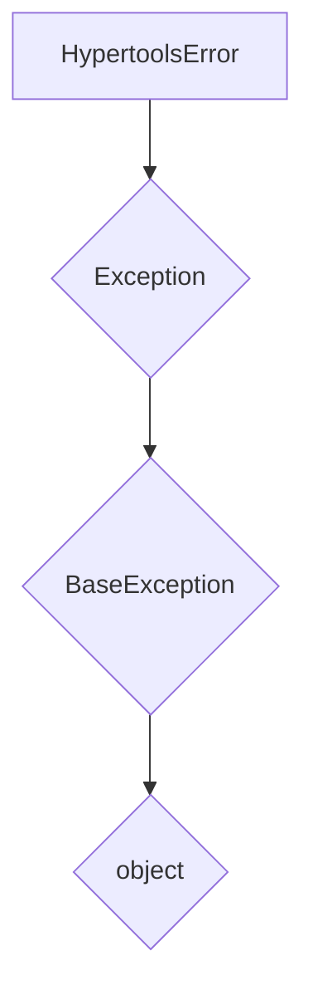
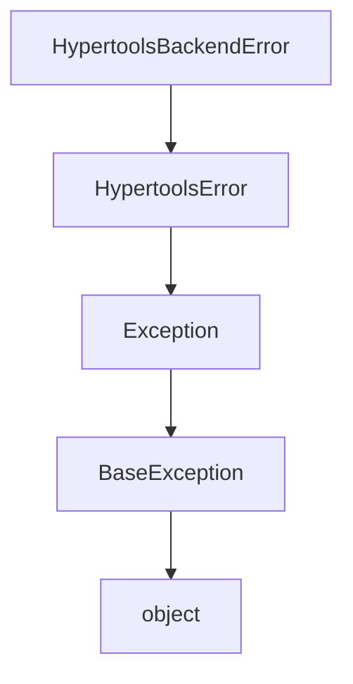

# `exceptions.py`

## `hypertools._shared.exceptions.HypertoolsError` · *class*

## Summary:
Base exception class for the hypertools library that provides a common inheritance point for custom exceptions.

## Description:
HypertoolsError serves as the root exception class for all custom exceptions within the hypertools library. It extends Python's built-in Exception class and provides a consistent base for error handling throughout the library. This class is intended to be inherited by more specific exception types rather than being instantiated directly.

The motivation for having this distinct abstraction is to allow library users to catch all hypertools-related exceptions using a single except clause, while still maintaining the ability to handle specific exception types when needed. It also provides a clear boundary for library-specific errors separate from standard Python exceptions.

## State:
- No instance attributes are defined beyond those inherited from Exception
- The class inherits all standard Exception properties and behaviors
- No constructor parameters are defined (uses default Exception.__init__)

## Lifecycle:
- Creation: Instantiated by calling `HypertoolsError()` or `HypertoolsError(message)` with optional message argument
- Usage: Typically raised using `raise HypertoolsError("error message")` or inherited subclasses
- Destruction: Handled automatically by Python's garbage collection when exception objects go out of scope

## Method Map:


## Raises:
- No exceptions are raised by the constructor
- The class itself doesn't raise exceptions, but instances can be raised during program execution

## Example:
```python
try:
    # Some operation that might fail
    raise HypertoolsError("Something went wrong in hypertools")
except HypertoolsError as e:
    print(f"Caught hypertools error: {e}")
```

## `hypertools._shared.exceptions.HypertoolsBackendError` · *class*

## Summary:
Custom exception class for backend-related errors in the hypertools library, inheriting from HypertoolsError.

## Description:
HypertoolsBackendError is a specialized exception class that extends HypertoolsError to represent errors originating from backend operations within the hypertools library. As a subclass of HypertoolsError, it contributes to the library's unified exception hierarchy while providing specific categorization for backend-related failures.

This exception should be instantiated when backend services, such as database connections, API calls, or computational backends, encounter failures that need to be communicated to the calling code. Common scenarios include connection timeouts, authentication failures, or backend service unavailability.

The motivation for this distinct abstraction is to enable more granular error handling by allowing developers to catch backend-specific errors separately from other types of hypertools errors, while still maintaining compatibility with the broader hypertools error hierarchy established by HypertoolsError.

## State:
- message (str): The error message describing the backend failure. This is stored as an instance attribute and must be a string.
- The class inherits all standard Exception properties and behaviors from its parent class HypertoolsError
- No additional class invariants are enforced beyond those of the parent class

## Lifecycle:
- Creation: Instantiate using `HypertoolsBackendError(message)` where message is a descriptive string explaining the backend error
- Usage: Raise using `raise HypertoolsBackendError("error details")` when backend operations fail
- Destruction: Handled automatically by Python's garbage collection when exception objects go out of scope

## Method Map:


## Raises:
- No exceptions are raised by the constructor itself
- The class constructor accepts a message parameter and passes it to the parent class constructor
- The only potential issue during instantiation would be passing a non-string message, though this would be handled by the parent class

## Example:
```python
try:
    # Simulate a backend operation that fails
    raise HypertoolsBackendError("Database connection timed out")
except HypertoolsBackendError as e:
    print(f"Backend error occurred: {e}")
    # Handle backend-specific error appropriately
```

### `hypertools._shared.exceptions.HypertoolsBackendError.__init__` · *method*

## Summary:
Initializes a HypertoolsBackendError instance with a descriptive error message.

## Description:
The `__init__` method sets up a HypertoolsBackendError exception object by storing the provided error message and initializing the parent Exception class. This method ensures that backend-related errors can be properly constructed and propagated with meaningful diagnostic information.

The method is part of the HypertoolsBackendError class hierarchy, which extends HypertoolsError to provide specialized error handling for backend operations. This separation allows developers to catch backend-specific errors independently from other hypertools exceptions.

## Args:
    message (str): A descriptive error message explaining the backend failure. Must be a string value.

## Returns:
    None: This method initializes the exception object and does not return a value.

## Raises:
    None: This method does not explicitly raise exceptions, though invalid message types may cause parent class behavior.

## State Changes:
    Attributes READ: None
    Attributes WRITTEN: 
    - self.message: Stores the provided error message as an instance attribute

## Constraints:
    Preconditions:
    - The message argument must be a string type
    - The method should only be called during exception object construction
    
    Postconditions:
    - The exception object is properly initialized with the provided message
    - The parent Exception class is correctly initialized with the message
    - The self.message attribute contains the provided error message

## Side Effects:
    None: This method performs no I/O operations, external service calls, or mutations to objects outside the exception instance.

## `hypertools._shared.exceptions.HypertoolsIOError` · *class*

## Summary:
Custom exception class for input/output related errors in the hypertools library, inheriting from HypertoolsError and OSError.

## Description:
HypertoolsIOError is a specialized exception class designed to represent input/output related failures within the hypertools library. It inherits from HypertoolsError (the library's base exception) and OSError (Python's built-in OS error class), providing a clear hierarchy for error categorization and handling.

This exception should be instantiated when I/O operations fail within hypertools components, such as file reading/writing issues, network connectivity problems, or other OS-level I/O related errors. As a subclass of HypertoolsError, it fits into the library's unified exception handling framework, allowing library users to catch all hypertools-related exceptions using a single except clause while still maintaining the ability to handle specific exception types when needed.

## State:
- message (str): The error message describing the I/O failure. Valid values are any string describing the specific I/O error. This field is initialized from the constructor parameter and stored as an instance attribute.

## Lifecycle:
- Creation: Instantiate using `HypertoolsIOError(message)` where message is a descriptive string explaining the I/O error
- Usage: Raise using `raise HypertoolsIOError("error message")` when I/O operations fail within hypertools
- Destruction: Handled automatically by Python's garbage collection when exception objects go out of scope

## Method Map:
```mermaid
graph TD
    A[HypertoolsIOError.__init__] --> B[super().__init__(message)]
    B --> C[self.message = message]
    A --> D[HypertoolsError.__init__]
    D --> E[OSError.__init__]
```

## Raises:
- No exceptions are raised by the constructor itself
- The class inherits the ability to raise OSError-related exceptions through its inheritance chain

## Example:
```python
try:
    # Attempt to read a file that doesn't exist
    with open('nonexistent_file.txt', 'r') as f:
        data = f.read()
except HypertoolsIOError as e:
    print(f"I/O error occurred: {e}")
```

### `hypertools._shared.exceptions.HypertoolsIOError.__init__` · *method*

## Summary:
Initializes a HypertoolsIOError instance with a descriptive error message.

## Description:
The `__init__` method sets up a HypertoolsIOError exception object by calling its parent class constructors and storing the provided error message as an instance attribute. This method ensures proper initialization of the exception hierarchy and makes the error message accessible to consumers of the exception.

## Args:
    message (str): A descriptive error message explaining the I/O failure. Must be a valid string describing the specific input/output error that occurred.

## Returns:
    None: This method does not return a value.

## Raises:
    No exceptions are raised by this method directly.

## State Changes:
    Attributes READ: None
    Attributes WRITTEN: 
        - self.message: Stores the provided error message as an instance attribute for later retrieval

## Constraints:
    Preconditions:
        - The message argument must be a string
        - The HypertoolsIOError class must be properly defined and inherit from HypertoolsError and OSError
    
    Postconditions:
        - The exception object is properly initialized with the provided message
        - The message is stored as self.message for future access
        - The exception inherits all behaviors from its parent classes (HypertoolsError and OSError)

## Side Effects:
    None: This method performs no I/O operations, external service calls, or mutations to objects outside the instance being initialized.

