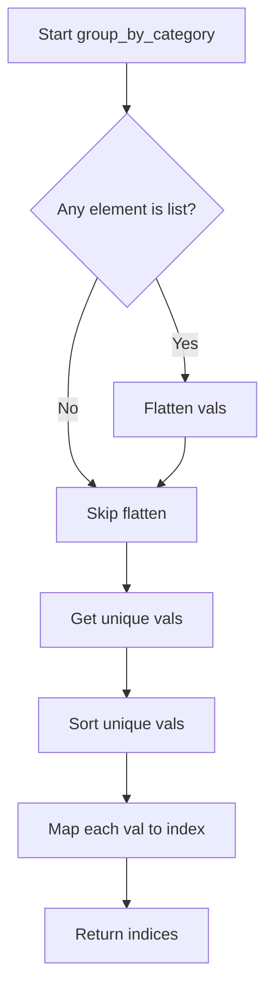
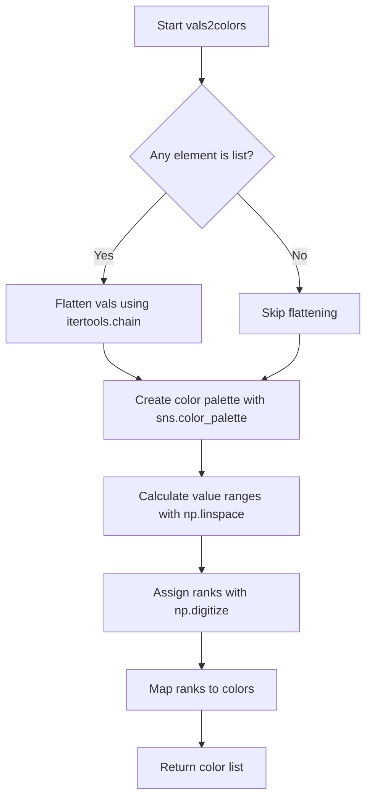
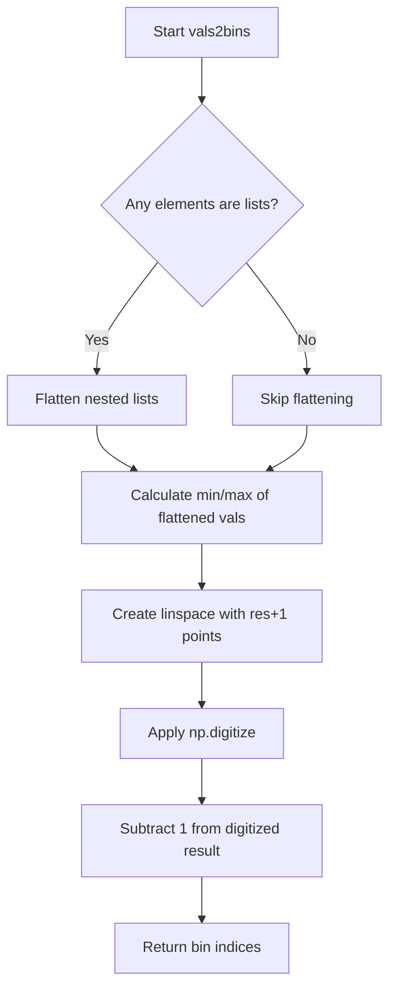
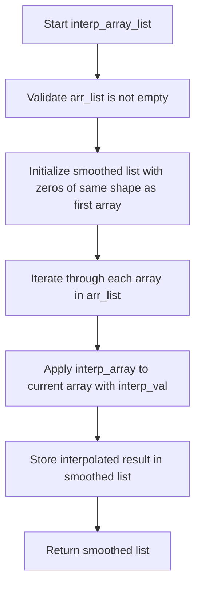
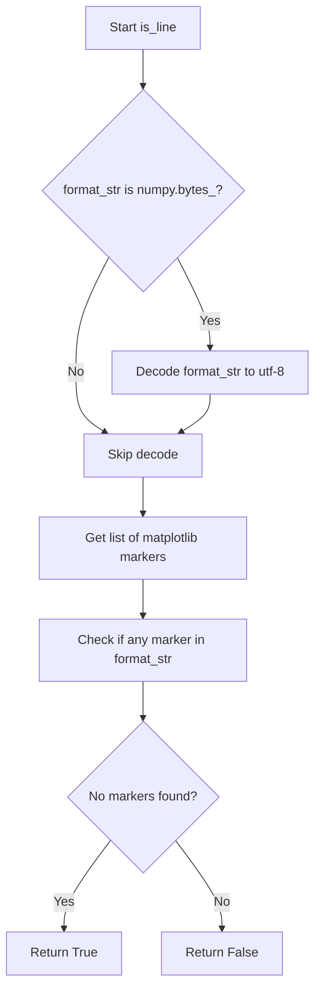
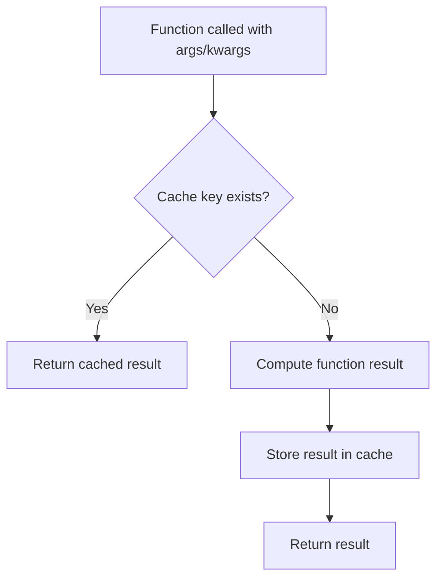

# `helpers.py`

## `hypertools._shared.helpers.center` · *function*

## Summary:
Centers a list of arrays by subtracting the mean of all arrays from each individual array.

## Description:
This function takes a list of arrays (typically NumPy arrays) and centers them by subtracting the mean of all arrays stacked together from each individual array. It is commonly used in data preprocessing for machine learning and statistical analysis to remove global mean shifts while preserving relative relationships within the data.

## Args:
    x (list): A list of arrays to be centered. All arrays must be compatible for vertical stacking.

## Returns:
    list: A new list of arrays where each array has been centered by subtracting the mean of all arrays stacked together.

## Raises:
    AssertionError: If the input x is not a list.

## Constraints:
    Preconditions:
        - Input x must be a list
        - All elements in x must be arrays that can be vertically stacked using np.vstack
    
    Postconditions:
        - The returned list contains the same number of elements as the input list
        - Each array in the returned list has the same shape as the corresponding input array
        - The mean of all centered arrays will be approximately zero

## Side Effects:
    None

## Control Flow:
```mermaid
flowchart TD
    A[Start center(x)] --> B{Is x a list?}
    B -- No --> C[AssertionError]
    B -- Yes --> D[Stack arrays with np.vstack]
    D --> E[Calculate mean of stacked arrays]
    E --> F[Subtract mean from each array]
    F --> G[Return centered arrays]
```

## Examples:
```python
import numpy as np

# Basic usage
data = [np.array([[1, 2], [3, 4]]), np.array([[5, 6], [7, 8]])]
centered_data = center(data)
# Result: [array([[-2., -2.], [-2., -2.]]), array([[2., 2.], [2., 2.]])]

# With different shaped arrays
data = [np.array([[1, 2, 3]]), np.array([[4, 5, 6]])]
centered_data = center(data)
# Result: [array([[-1.5, -1.5, -1.5]]), array([[1.5, 1.5, 1.5]])]
```

## `hypertools._shared.helpers.scale` · *function*

## Summary:
Scales a list of numerical arrays to a fixed [-1, 1] range using min-max normalization.

## Description:
This function takes a list of numerical arrays and applies min-max scaling to normalize all values to the range [-1, 1]. It computes global minimum and maximum values across all input arrays, then transforms each array using the formula: 2 * ((x - min) / (max - min)) - 1. This ensures consistent scaling across multiple datasets while preserving relative relationships within each dataset.

## Args:
    x (list): A list of numerical arrays (lists or numpy arrays) to be scaled. All arrays must have compatible shapes for vertical stacking (same number of rows, variable number of columns).

## Returns:
    list: A list of scaled arrays, where each array has been transformed to the range [-1, 1]. The returned list contains the same number of elements as the input list, with each element being the scaled version of the corresponding input element.

## Raises:
    AssertionError: If the input x is not a list type.

## Constraints:
    Preconditions:
        - Input x must be a list of numerical arrays
        - All arrays in the list must be compatible for vertical stacking (same number of rows, variable number of columns)
    Postconditions:
        - Output list contains the same number of elements as input list
        - All values in output arrays are in the range [-1, 1]
        - Relative relationships within each array are preserved

## Side Effects:
    None

## Control Flow:
```mermaid
flowchart TD
    A[Start scale(x)] --> B{Input is list?}
    B -- No --> C[Assertion Error]
    B -- Yes --> D[Stack arrays vertically using np.vstack]
    D --> E[Calculate global min: m1 = np.min(x_stacked)]
    E --> F[Calculate global range: m2 = np.max(x_stacked - m1)]
    F --> G[Define scaling function: f(x) = 2 * ((x - m1) / m2) - 1]
    G --> H[Apply function to each array in list]
    H --> I[Return scaled arrays]
```

## Examples:
    >>> scale([[1, 2, 3], [4, 5, 6]])
    [[-1., -0.5, 0.], [0.5, 1., 1.]]
    
    >>> scale([[10, 20], [30, 40]])
    [[-1., -0.5], [0.5, 1.]]

## `hypertools._shared.helpers.group_by_category` · *function*

## Summary:
Maps categorical values to integer indices based on their sorted order.

## Description:
Converts a collection of categorical values into a list of integer indices representing their position in the sorted unique set of values. This function is commonly used to transform categorical data into numerical form for processing or visualization.

## Args:
    vals (list): A list of categorical values that may contain nested lists. Values can be of any hashable type.

## Returns:
    list[int]: A list of integers where each integer represents the zero-based index of the corresponding input value in the sorted unique set of values.

## Raises:
    None explicitly raised.

## Constraints:
    Preconditions:
        - Input vals must be iterable.
        - All elements in vals must be hashable (since they are converted to a set).
    Postconditions:
        - Output list has the same length as the flattened input.
        - Each returned integer is a valid index in the sorted unique set of values.

## Side Effects:
    None.

## Control Flow:


## Examples:
    >>> group_by_category(['a', 'b', 'c'])
    [0, 1, 2]
    
    >>> group_by_category([['a', 'b'], ['c', 'd']])
    [0, 1, 2, 3]
    
    >>> group_by_category(['c', 'a', 'b', 'a'])
    [2, 0, 1, 0]
```

## `hypertools._shared.helpers.vals2colors` · *function*

## Summary:
Maps numeric values to colors using a specified colormap by creating a color palette and assigning colors based on value rankings.

## Description:
Converts a list of numeric values into a list of RGB color tuples by mapping each value to a color in a continuous colormap. This function handles both flat lists and nested lists of numeric values by flattening them before processing. It generates a color palette from a specified seaborn colormap and assigns colors based on the rank of each value within the range of input values.

## Args:
    vals (list): A list of numeric values or nested lists of numeric values to be converted to colors. 
    cmap (str, optional): The name of the seaborn colormap to use. Defaults to 'GnBu'.
    res (int, optional): The resolution of the color palette (number of discrete colors). Defaults to 100.

## Returns:
    list[tuple[float, float, float]]: A list of RGB color tuples, one for each input value, where each tuple contains three floats between 0 and 1 representing red, green, and blue components respectively.

## Raises:
    None explicitly raised in the function body.

## Constraints:
    Preconditions:
        - vals must be iterable containing numeric values or nested lists of numeric values
        - cmap must be a valid seaborn colormap name
        - res must be a positive integer
    Postconditions:
        - The returned list will have the same length as the flattened input vals
        - Each returned color tuple will represent a color from the specified colormap
        - All returned RGB values will be in the range [0.0, 1.0]

## Side Effects:
    None.

## Control Flow:


## Examples:
    >>> vals2colors([1, 2, 3, 4, 5])
    [(0.0, 0.0, 0.0), (0.25, 0.5, 0.75), (0.5, 0.75, 1.0), (0.75, 0.875, 1.0), (1.0, 1.0, 1.0)]
    
    >>> vals2colors([[1, 2], [3, 4]], cmap='viridis')
    [(0.23, 0.3, 0.79), (0.43, 0.5, 0.9), (0.6, 0.7, 0.95), (0.8, 0.9, 1.0)]

## `hypertools._shared.helpers.vals2bins` · *function*

## Summary:
Converts numeric values into discrete bin indices using quantile-based binning.

## Description:
This function maps a collection of numeric values into discrete bins by creating evenly spaced bin edges between the minimum and maximum values. It handles nested lists by flattening them before processing. The function distributes values across a fixed number of bins (default 100) based on their relative position within the data range.

## Args:
    vals: A list of numeric values or nested lists containing numeric values. The function will flatten nested lists automatically.
    res: An integer representing the number of bins to create. Defaults to 100.

## Returns:
    A list of integers where each integer represents the bin index (0 to res-1) for the corresponding input value. The mapping follows these rules:
    - Values less than the minimum are assigned to bin 0
    - Values greater than or equal to the maximum are assigned to bin res-1
    - Values between min and max are distributed among bins 0 to res-1 based on their relative position

## Raises:
    None explicitly raised, but may raise exceptions from underlying numpy operations if input contains non-numeric values or is empty.

## Constraints:
    Precondition: vals must contain at least one numeric value.
    Precondition: res must be a positive integer.
    Postcondition: All returned bin indices will be in the range [0, res-1].
    Postcondition: The length of the returned list matches the flattened input length.

## Side Effects:
    None

## Control Flow:


## Examples:
    >>> vals2bins([1, 2, 3, 4, 5], res=3)
    [0, 0, 1, 1, 2]
    
    >>> vals2bins([[1, 2], [3, 4]], res=2)
    [0, 0, 1, 1]
    
    >>> vals2bins([10, 20, 30], res=5)
    [0, 2, 4]
    
    >>> vals2bins([1, 1, 1], res=3)
    [0, 0, 0]
    
    >>> vals2bins([5, 10, 15], res=4)
    [0, 1, 3]
```

## `hypertools._shared.helpers.interp_array` · *function*

## Summary:
Performs piecewise cubic Hermite interpolation on an array to increase its resolution.

## Description:
This function takes an input array and applies piecewise cubic Hermite interpolation to generate a higher-resolution version of the data. It is commonly used to smooth data or increase the number of data points for better visualization or analysis. The interpolation uses the PCHIP (Piecewise Cubic Hermite Interpolating Polynomial) method which preserves the shape of the data and monotonicity.

## Args:
    arr (array-like): Input array to be interpolated. Must be a 1-dimensional array or list of numeric values.
    interp_val (int, optional): Interpolation factor determining the density of interpolated points. Defaults to 10. Higher values produce more interpolated points.

## Returns:
    numpy.ndarray: Array containing the interpolated values with increased resolution. The length of the returned array is approximately len(arr) * interp_val.

## Raises:
    None explicitly raised in the function body.

## Constraints:
    Preconditions:
        - Input arr must be iterable and convertible to a numpy array
        - interp_val must be a positive integer
    Postconditions:
        - Output array will have increased resolution compared to input
        - Shape of output array will depend on interp_val parameter

## Side Effects:
    None

## Control Flow:
```mermaid
flowchart TD
    A[Start interp_array] --> B[Convert arr to numpy array]
    B --> C[Create x = np.arange(0, len(arr), 1)]
    C --> D[Create xx = np.arange(0, len(arr)-1, 1/interp_val)]
    D --> E[Create PCHIP interpolator q = pchip(x, arr)]
    E --> F[Evaluate q(xx)]
    F --> G[Return interpolated array]
```

## Examples:
    >>> import numpy as np
    >>> data = [1, 2, 3, 4, 5]
    >>> result = interp_array(data, interp_val=5)
    >>> print(len(result))
    20
    >>> result = interp_array([0, 1, 4, 9], interp_val=2)
    >>> print(result[:3])
    [0.   0.25 1.  ]
```

## `hypertools._shared.helpers.interp_array_list` · *function*

## Summary:
Interpolates a list of arrays to increase their resolution using piecewise cubic Hermite interpolation.

## Description:
This function applies interpolation to each array in a list to generate higher-resolution versions. It is designed to smooth data or increase the number of data points across multiple arrays simultaneously. The interpolation uses the PCHIP (Piecewise Cubic Hermite Interpolating Polynomial) method which preserves the shape of the data and monotonicity.

## Args:
    arr_list (list): List of arrays to be interpolated. All arrays must have the same shape.
    interp_val (int, optional): Interpolation factor determining the density of interpolated points. Defaults to 10. Higher values produce more interpolated points.

## Returns:
    list[numpy.ndarray]: List of interpolated arrays with increased resolution. Each array in the returned list corresponds to the interpolated version of the respective input array.

## Raises:
    None explicitly raised in the function body.

## Constraints:
    Preconditions:
        - Input arr_list must be a non-empty list
        - All arrays in arr_list must have the same shape
        - First array in arr_list must be iterable and convertible to a numpy array
        - interp_val must be a positive integer
    Postconditions:
        - Output list will contain the same number of arrays as input
        - Each output array will have increased resolution compared to its input counterpart
        - Shape of each output array will depend on interp_val parameter

## Side Effects:
    None

## Control Flow:


## Examples:
    >>> import numpy as np
    >>> data1 = [1, 2, 3, 4]
    >>> data2 = [5, 6, 7, 8]
    >>> result = interp_array_list([data1, data2], interp_val=3)
    >>> print(len(result))
    2
    >>> print(len(result[0]))
    12
    >>> print(len(result[1]))
    12
```

## `hypertools._shared.helpers.parse_args` · *function*

## Summary:
Parses input arguments to create a list of argument tuples, where each tuple corresponds to a specific item in the input sequence.

## Description:
This function processes a sequence of items (`x`) and a set of argument specifications (`args`) to generate a list of argument tuples. It handles both scalar arguments (which are repeated for each item) and list/tuple arguments (where each element corresponds to a specific item in the sequence). This extraction allows for flexible argument specification patterns in functions that operate over multiple items.

## Args:
    x (iterable): A sequence of items that determines the number of argument tuples to generate.
    args (list): A list of argument specifications, where each element can be either:
        - A scalar value (int, float, str, etc.) that will be used for all items in x
        - A list or tuple of the same length as x, where each element corresponds to a specific item in x

## Returns:
    list[tuple]: A list of tuples, where each tuple contains the arguments for the corresponding item in x.

## Raises:
    SystemExit: When a list or tuple argument in args has a length different from the length of x.

## Constraints:
    - Preconditions: 
        - The `x` parameter must be iterable
        - All elements in `args` must be either scalars or sequences of the same length as `x`
    - Postconditions:
        - The returned list will have the same length as `x`
        - Each tuple in the returned list will have the same length as `args`

## Side Effects:
    - Prints an error message to stdout and exits the program if argument validation fails

## Control Flow:
```mermaid
flowchart TD
    A[Start parse_args] --> B{Is args[ii] a list/tuple?}
    B -- Yes --> C{len(args[ii]) == len(x)?}
    C -- No --> D[Print error & Exit]
    C -- Yes --> E[Append args[ii][i] to tmp]
    B -- No --> F[Append args[ii] to tmp]
    E --> G[Append tmp to args_list]
    F --> G
    G --> H{More items in x?}
    H -- Yes --> I[Next i]
    H -- No --> J[Return args_list]
```

## Examples:
    >>> parse_args([1, 2, 3], [10, [20, 30, 40]])
    [(10, 20), (10, 30), (10, 40)]
    
    >>> parse_args(['a', 'b'], ['x', 'y'])
    [('x', 'y'), ('x', 'y')]
    
    >>> parse_args([1, 2], [[10, 20], [30, 40]])
    [(10, 30), (20, 40)]

## `hypertools._shared.helpers.parse_kwargs` · *function*

## Summary:
Creates a list of keyword argument dictionaries, where each dictionary corresponds to an item in the input sequence and contains appropriately indexed keyword arguments.

## Description:
This function processes a sequence of items and a dictionary of keyword arguments, generating a list of dictionaries where each dictionary contains the keyword arguments properly mapped to each item. It handles both scalar and iterable keyword argument values, distributing iterable values across items while preserving scalar values for all items. This utility is commonly used in plotting functions to allow per-item customization of visual properties.

## Args:
    x (iterable): A sequence of items that will be used to create individual keyword argument dictionaries.
    kwargs (dict): A dictionary mapping keyword argument names to their values, which can be either scalar values or sequences of the same length as x.

## Returns:
    list[dict]: A list of dictionaries, where each dictionary contains keyword arguments mapped to the corresponding item in x. Each dictionary will have the same keys as the input kwargs dict.

## Raises:
    None explicitly raised.

## Constraints:
    Preconditions:
        - The input x must be iterable.
        - If any keyword argument in kwargs is a tuple or list, its length must match the length of x.
    Postconditions:
        - The returned list will have the same length as x.
        - Each dictionary in the returned list will contain all keys from kwargs.

## Side Effects:
    None.

## Control Flow:
```mermaid
flowchart TD
    A[Start parse_kwargs] --> B{Is kwargs[kwarg] iterable?}
    B -- Yes --> C{len(kwargs[kwarg]) == len(x)?}
    C -- Yes --> D[tmp[kwarg] = kwargs[kwarg][i]]
    C -- No --> E[tmp[kwarg] = None]
    B -- No --> F[tmp[kwarg] = kwargs[kwarg]]
    D --> G[Append tmp to kwargs_list]
    E --> G
    F --> G
    G --> H{More items in x?}
    H -- Yes --> I[Next iteration]
    H -- No --> J[Return kwargs_list]
```

## Examples:
    >>> parse_kwargs([1, 2, 3], {'color': ['red', 'green', 'blue']})
    [{'color': 'red'}, {'color': 'green'}, {'color': 'blue'}]
    
    >>> parse_kwargs(['a', 'b'], {'size': 10, 'alpha': [0.5, 0.8]})
    [{'size': 10, 'alpha': 0.5}, {'size': 10, 'alpha': 0.8}]
    
    >>> parse_kwargs([1], {'x': [1, 2, 3]})
    [{'x': None}]

## `hypertools._shared.helpers.reshape_data` · *function*

## Summary:
Reshapes input data by grouping observations according to categorical labels and stacking data points within each category.

## Description:
This function takes a collection of data points, categorical labels, and optional corresponding labels, and groups the data points by their categorical labels. It stacks the data points vertically and organizes them into separate arrays for each unique category. The function also preserves corresponding labels for each data point within the categories.

## Args:
    x (array-like): Collection of data points to be reshaped. Each element represents a data point that will be grouped by category. Expected to be a sequence of arrays or matrices.
    hue (array-like): Categorical labels indicating which group each data point in x belongs to. Must have the same length as x. Elements must be hashable.
    labels (array-like or None): Optional labels corresponding to each data point in x. If None, defaults to a list of None values with the same length as x.

## Returns:
    tuple: A tuple containing two elements:
        - List of numpy arrays: Each array contains the stacked data points belonging to a specific category. The order corresponds to the sorted unique categories from hue.
        - List of lists: Each inner list contains the corresponding labels for data points in the respective category. The order corresponds to the sorted unique categories from hue.

## Raises:
    None explicitly raised in the function body.

## Constraints:
    Preconditions:
        - x and hue must have the same length.
        - hue must contain hashable elements suitable for set operations.
        - x elements should be compatible for vertical stacking with numpy.vstack.
    Postconditions:
        - The returned list of arrays will have the same number of elements as there are unique categories in hue.
        - Each array in the returned list will contain data points grouped by their respective category.
        - The order of categories in the output matches the order of unique categories in hue (sorted by first appearance).

## Side Effects:
    None.

## Control Flow:
```mermaid
flowchart TD
    A[Start reshape_data] --> B{labels is None?}
    B -- Yes --> C[Set labels to [None]*len(hue)]
    B -- No --> C
    C --> D[Get unique categories from hue (maintaining order)]
    D --> E[Stack x using np.vstack]
    E --> F[Initialize x_reshaped and labels_reshaped lists]
    F --> G[Iterate over zip(hue, labels)]
    G --> H{Get category index from categories list}
    H --> I[Append x_stacked[idx] to x_reshaped at category index]
    I --> J[Append labels[idx] to labels_reshaped at category index]
    J --> K[Return [np.vstack(i) for i in x_reshaped], labels_reshaped]
```

## Examples:
    # Basic usage with data and labels
    x = [[1, 2], [3, 4], [5, 6]]
    hue = ['A', 'B', 'A']
    labels = ['label1', 'label2', 'label3']
    result_x, result_labels = reshape_data(x, hue, labels)
    # Result: ([array([[1, 2], [5, 6]]), array([[3, 4]])], [['label1', 'label3'], ['label2']])

    # Usage with None labels
    x = [[1, 2], [3, 4], [5, 6]]
    hue = ['A', 'B', 'A']
    result_x, result_labels = reshape_data(x, hue, None)
    # Result: ([array([[1, 2], [5, 6]]), array([[3, 4]])], [[None, None], [None]])

    # Usage with more categories
    x = [[1, 2], [3, 4], [5, 6], [7, 8]]
    hue = ['C', 'A', 'B', 'A']
    labels = ['label1', 'label2', 'label3', 'label4']
    result_x, result_labels = reshape_data(x, hue, labels)
    # Result: ([array([[3, 4], [7, 8]]), array([[5, 6]]), array([[1, 2]])], [['label2', 'label4'], ['label3'], ['label1']])
```

## `hypertools._shared.helpers.patch_lines` · *function*

## Summary:
Modifies a sequence of line arrays by appending the first row of each subsequent array to the corresponding previous array.

## Description:
This function takes a list of numpy arrays representing line data and modifies each array (except the last) by vertically stacking it with the first row of the next array in the sequence. This effectively connects consecutive line segments by sharing their common endpoint. The modification occurs in-place on the input list.

## Args:
    x (list): A list of numpy arrays where each array represents line coordinates. Each array should have at least one row.

## Returns:
    list: The same input list with modifications made in-place. Each array (except the last) is extended by one additional row containing the first row of the next array.

## Raises:
    IndexError: When the input list has fewer than 2 elements, causing index out of bounds access in the loop.

## Constraints:
    - Preconditions: Input must be a list containing at least 2 numpy arrays with compatible shapes for vertical stacking.
    - Postconditions: The input list is modified in-place, with each array (except the last) having its number of rows increased by 1.

## Side Effects:
    - Modifies the input list in-place by changing the contents of the arrays within it.
    - No external I/O operations or state mutations beyond modifying the input list elements.

## Control Flow:
```mermaid
flowchart TD
    A[Start patch_lines] --> B{len(x) >= 2?}
    B -- No --> C[Return x]
    B -- Yes --> D[For idx in range(len(x)-1)]
    D --> E[x[idx] = vstack(x[idx], x[idx+1][0,:])]
    E --> F[idx++]
    F --> G{idx < len(x)-1?}
    G -- Yes --> D
    G -- No --> H[Return x]
```

## Examples:
    # Basic usage with two line arrays
    line1 = np.array([[0, 0], [1, 1]])
    line2 = np.array([[1, 1], [2, 2]])
    result = patch_lines([line1, line2])
    # Result: [array([[0, 0], [1, 1], [1, 1]]), array([[1, 1], [2, 2]])]
    
    # Usage with three line arrays
    line1 = np.array([[0, 0], [1, 1]])
    line2 = np.array([[1, 1], [2, 2]])
    line3 = np.array([[2, 2], [3, 3]])
    result = patch_lines([line1, line2, line3])
    # Result: [array([[0, 0], [1, 1], [1, 1]]), array([[1, 1], [2, 2], [2, 2]]), array([[2, 2], [3, 3]])]
```

## `hypertools._shared.helpers.is_line` · *function*

## Summary:
Determines whether a given format string represents a line style rather than a marker style in matplotlib plotting.

## Description:
This function evaluates a matplotlib format string to determine if it specifies a line style (as opposed to a marker style). It handles byte string decoding and checks against matplotlib's supported marker symbols to make this determination. The function is designed to be reusable across different plotting contexts where format string validation is needed.

## Args:
    format_str (str or bytes or None): A matplotlib format string that may contain line or marker specifications. Can be a string, bytes object, or None.

## Returns:
    bool: True if the format string represents a line style (i.e., contains no marker symbols), False otherwise. Returns True for None input.

## Raises:
    None explicitly raised.

## Constraints:
    Preconditions:
        - format_str should be a string, bytes, or None type
        - When format_str is bytes, it must be UTF-8 decodable
    
    Postconditions:
        - Always returns a boolean value
        - Returns True for None input
        - Returns True when no marker symbols are found in the format string

## Side Effects:
    None.

## Control Flow:


## Examples:
    >>> is_line(None)
    True
    >>> is_line("b-")
    True
    >>> is_line("ro")
    False
    >>> is_line("g--")
    True
    >>> is_line(b"r:")
    True
    >>> is_line("o")
    False
    >>> is_line("-")
    True
```

## `hypertools._shared.helpers.memoize` · *function*

## Summary:
Decorator that caches function results based on input arguments to avoid redundant computations.

## Description:
The memoize decorator implements a caching mechanism that stores previously computed results of a function call. When the same arguments are passed again, it returns the cached result instead of recomputing. This is particularly useful for expensive function calls with deterministic outputs.

This decorator is implemented as a higher-order function that takes a callable object and returns a memoized version of it. It creates a cache dictionary on the decorated function and uses string representations of arguments as cache keys.

## Args:
    obj (callable): The function to be memoized. This is the decorated function that will have caching behavior applied.

## Returns:
    callable: A wrapper function that implements the memoization logic. When called, it either returns a cached result or computes and caches a new result.

## Raises:
    None explicitly raised by this decorator. However, any exceptions raised by the wrapped function will propagate through unchanged.

## Constraints:
    - Preconditions: The function being decorated must be deterministic (same inputs always produce same outputs)
    - Preconditions: Arguments must be hashable and convertible to string for cache key generation
    - Postconditions: The decorated function maintains the same interface as the original function
    - The cache is stored as an attribute on the original function object (`obj.cache`)

## Side Effects:
    - Creates a cache attribute on the decorated function object
    - Stores function results in memory for future reuse
    - No external I/O operations or state mutations beyond the function's cache

## Control Flow:


## Examples:
```python
@memoize
def expensive_calculation(n):
    # Simulate expensive computation
    return sum(i**2 for i in range(n))

# First call - computes and caches result
result1 = expensive_calculation(1000)  # Slow

# Second call with same argument - returns cached result
result2 = expensive_calculation(1000)  # Fast

# Different argument - computes new result
result3 = expensive_calculation(2000)  # Slow
```

## `hypertools._shared.helpers.get_type` · *function*

## Summary:
Determines and returns the specific data type identifier for input data structures.

## Description:
This function analyzes the type of input data and categorizes it into predefined type identifiers. It serves as a utility for type checking and dispatching operations based on data structure types. The function is designed to handle various data types including lists, NumPy arrays, Pandas DataFrames, strings, and custom DataGeometry objects.

## Args:
    data (any): The input data structure to be categorized. Can be a list, NumPy array, Pandas DataFrame, string, bytes, or DataGeometry object.

## Returns:
    str: A string identifier representing the data type. Possible return values include:
        - 'list_str': List containing strings or bytes
        - 'list_num': List containing numbers (int or float)
        - 'list_arr': List containing NumPy arrays
        - 'arr_str': NumPy array containing strings or bytes
        - 'arr_num': NumPy array containing numbers
        - 'df': Pandas DataFrame
        - 'str': String or bytes
        - 'geo': DataGeometry object

## Raises:
    TypeError: When the input data type is not supported. The error message specifies the supported data types: Numpy Array, Pandas DataFrame, String, List of strings, List of numbers.

## Constraints:
    Preconditions:
        - Input data must be one of the supported types
        - For lists, the first element must be of a supported type to determine the list's category
        - For NumPy arrays, the first element must be of a supported type to determine the array's category
    
    Postconditions:
        - Function always returns one of the predefined string identifiers
        - Function raises TypeError for unsupported data types

## Side Effects:
    None

## Control Flow:
```mermaid
flowchart TD
    A[get_type(data)] --> B{isinstance(data, list)?}
    B -- Yes --> C{isinstance(data[0], (str, bytes))?}
    C -- Yes --> D[return 'list_str']
    C -- No --> E{isinstance(data[0], (int, float))?}
    E -- Yes --> F[return 'list_num']
    E -- No --> G{isinstance(data[0], np.ndarray)?}
    G -- Yes --> H[return 'list_arr']
    G -- No --> I[raise TypeError]
    B -- No --> J{isinstance(data, np.ndarray)?}
    J -- Yes --> K{isinstance(data[0][0], (str, bytes))?}
    K -- Yes --> L[return 'arr_str']
    K -- No --> M[return 'arr_num']
    J -- No --> N{isinstance(data, pd.DataFrame)?}
    N -- Yes --> O[return 'df']
    N -- No --> P{isinstance(data, (str, bytes))?}
    P -- Yes --> Q[return 'str']
    P -- No --> R{isinstance(data, DataGeometry)?}
    R -- Yes --> S[return 'geo']
    R -- No --> T[raise TypeError]
```

## Examples:
    >>> get_type(['a', 'b', 'c'])
    'list_str'
    
    >>> get_type([1, 2, 3])
    'list_num'
    
    >>> get_type(np.array([[1, 2], [3, 4]]))
    'arr_num'
    
    >>> get_type(pd.DataFrame({'A': [1, 2], 'B': [3, 4]}))
    'df'
    
    >>> get_type("hello")
    'str'
    
    >>> get_type(DataGeometry())
    'geo'

## `hypertools._shared.helpers.convert_text` · *function*

## Summary:
Converts text-based data (strings or lists of strings) into a standardized NumPy array format with a single column.

## Description:
This function processes input data that is either a string or list of strings, converting it into a NumPy array with shape (n, 1) where n is the number of elements. It leverages the `get_type` helper function to identify text-based data types ('list_str' or 'str') and applies the appropriate conversion. This ensures consistent data representation for text data within the hypertools framework, particularly for downstream processing that expects array format.

## Args:
    data (any): Input data that may be a string, list of strings, or other data types. The function specifically handles data identified as 'list_str' or 'str' by the get_type function.

## Returns:
    numpy.ndarray or original data: Returns a NumPy array with shape (n, 1) for string or list-string inputs, otherwise returns the data unchanged. For string inputs, returns a 2D array with one row. For list-string inputs, returns a 2D array with one column.

## Raises:
    None explicitly raised by this function, though underlying operations may raise exceptions from numpy.array() or reshape() operations.

## Constraints:
    Preconditions:
        - Input data must be compatible with numpy.array() conversion
        - For list inputs, all elements should be of compatible types for array creation
        - The function relies on get_type returning 'list_str' or 'str' for text data
        
    Postconditions:
        - String or list-string inputs are converted to NumPy arrays with shape (n, 1)
        - Non-string inputs are returned unchanged
        - The conversion preserves the original data values

## Side Effects:
    None

## Control Flow:
```mermaid
flowchart TD
    A[convert_text(data)] --> B[get_type(data)]
    B --> C{dtype in ['list_str', 'str']?}
    C -- Yes --> D[np.array(data).reshape(-1, 1)]
    C -- No --> E[return data]
    D --> F[return converted array]
    E --> F
```

## Examples:
    >>> convert_text("hello")
    array([['hello']])
    
    >>> convert_text(["a", "b", "c"])
    array([['a'], ['b'], ['c']])
    
    >>> convert_text([1, 2, 3])
    [1, 2, 3]
    
    >>> convert_text(["apple", "banana"])
    array([['apple'], ['banana']])
```

## `hypertools._shared.helpers.check_geo` · *function*

## Summary:
Processes and sanitizes DataGeometry object attributes to ensure proper string encoding and data structure handling.

## Description:
This function takes a DataGeometry object and performs encoding normalization on its attributes, particularly converting bytes objects to strings and ensuring list/array elements are properly decoded. It creates a shallow copy of the input object to avoid modifying the original, then processes the `reduce` attribute and `kwargs` dictionary to handle byte-encoded data appropriately. This extraction ensures consistent data handling across the system when dealing with potentially encoded data.

## Args:
    geo (DataGeometry): A DataGeometry object containing various attributes including reduce and kwargs that may contain bytes objects

## Returns:
    DataGeometry: A modified copy of the input DataGeometry object with normalized encoding for bytes objects

## Raises:
    None explicitly raised

## Constraints:
    Preconditions:
    - Input geo must be a DataGeometry object instance
    - geo.reduce may be bytes or other types
    - geo.kwargs may contain bytes, lists, or arrays with bytes elements
    
    Postconditions:
    - Returned object is a copy of input with modified attributes
    - All bytes objects in reduce and kwargs are converted to strings via decode()
    - Lists and arrays in kwargs are recursively processed for bytes elements
    - The isinstance check for (list, np.ndarray) handles both Python lists and NumPy arrays

## Side Effects:
    None

## Control Flow:
```mermaid
flowchart TD
    A[Start check_geo] --> B[Create shallow copy of geo]
    B --> C[Check if geo.reduce is bytes]
    C -->|Yes| D[Decode geo.reduce]
    C -->|No| E[Skip decode]
    E --> F[Iterate over geo.kwargs keys]
    F --> G[Check if kwargs[key] is not None]
    G -->|Yes| H[Check if kwargs[key] is list/array]
    H -->|Yes| I[Process list with fix_list]
    H -->|No| J[Check if kwargs[key] is bytes]
    J -->|Yes| K[Decode kwargs[key]]
    J -->|No| L[Skip processing]
    I --> M[Update kwargs[key] with processed list]
    K --> N[Update kwargs[key] with decoded string]
    L --> O[Continue to next key]
    M --> O
    N --> O
    O --> P[Return modified geo]
```

## Examples:
    # Basic usage with bytes in reduce attribute
    geo_obj = DataGeometry(reduce=b'some_bytes_string')
    cleaned_geo = check_geo(geo_obj)
    
    # Usage with bytes in kwargs
    geo_obj = DataGeometry(kwargs={'param': b'bytes_value'})
    cleaned_geo = check_geo(geo_obj)
    
    # Usage with list containing bytes
    geo_obj = DataGeometry(kwargs={'param': [b'item1', b'item2']})
    cleaned_geo = check_geo(geo_obj)
    
    # Usage with NumPy array containing bytes
    import numpy as np
    geo_obj = DataGeometry(kwargs={'param': np.array([b'item1', b'item2'])})
    cleaned_geo = check_geo(geo_obj)

## `hypertools._shared.helpers.get_dtype` · *function*

## Summary:
Determines and returns the data type identifier for a given input data structure.

## Description:
This function serves as a type dispatcher that identifies the underlying data structure of the input and returns a standardized string identifier. It is designed to handle various common data types used in scientific computing and data analysis workflows. The function is extracted from the main processing pipeline to provide a clean abstraction layer for type checking and dispatching logic.

## Args:
    data (Any): The input data structure whose type needs to be identified. Can be any Python object.

## Returns:
    str: A string identifier representing the data type, including 'list', 'arr' (numpy array), 'df' (pandas DataFrame), 'str' (string or bytes), or 'geo' (DataGeometry).

## Raises:
    TypeError: When the input data type is not supported by the function. The error message specifies the list of supported types.

## Constraints:
    Preconditions:
        - Input data must be a valid Python object
        - The function assumes standard Python type checking mechanisms work correctly
    
    Postconditions:
        - Function always returns one of the predefined string identifiers
        - Function raises TypeError for unsupported types

## Side Effects:
    None

## Control Flow:
```mermaid
flowchart TD
    A[get_dtype(data)] --> B{isinstance(data, list)?}
    B -- Yes --> C[return 'list']
    B -- No --> D{isinstance(data, numpy.ndarray)?}
    D -- Yes --> E[return 'arr']
    D -- No --> F{isinstance(data, pandas.DataFrame)?}
    F -- Yes --> G[return 'df']
    F -- No --> H{isinstance(data, (str, bytes))?}
    H -- Yes --> I[return 'str']
    H -- No --> J{isinstance(data, DataGeometry)?}
    J -- Yes --> K[return 'geo']
    J -- No --> L[raise TypeError]
```

## Examples:
```python
# Valid usage
get_dtype([1, 2, 3])  # Returns 'list'
get_dtype(numpy.array([1, 2, 3]))  # Returns 'arr'
get_dtype(pandas.DataFrame({'a': [1, 2]}))  # Returns 'df'
get_dtype("hello")  # Returns 'str'
get_dtype(DataGeometry(...))  # Returns 'geo'

# Error case
get_dtype(123)  # Raises TypeError
```

