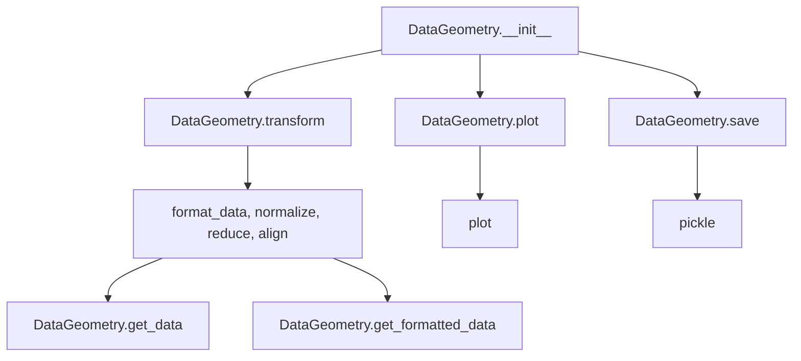

# `datageometry.py`

## `hypertools.datageometry.DataGeometry` · *class*

## Summary:
DataGeometry is a container class that stores data, transformation parameters, and visualization metadata for hypertools analysis and plotting operations.

## Description:
The DataGeometry class serves as a central data structure in the hypertools library that encapsulates both raw data and processed transformation state. It provides methods for data manipulation, transformation, visualization, and persistence. The class is designed to maintain the complete state of a data analysis workflow, including the original data, transformed data, and all configuration parameters needed to reproduce or extend the analysis. It acts as a bridge between data preprocessing, transformation, and visualization components in the hypertools ecosystem.

## State:
- fig: matplotlib figure object (or None) - stores the visualization figure
- ax: matplotlib axes object (or None) - stores the visualization axes  
- line_ani: animation object (or None) - stores animation data for animated plots
- data: raw data (list, array, DataFrame, or None) - original input data
- dtype: data type identifier (str) - determined by get_dtype function
- xform_data: transformed data (list of arrays or None) - processed data ready for visualization
- reduce: reduction method configuration (dict or None) - parameters for dimensionality reduction
- align: alignment method configuration (dict or None) - parameters for data alignment
- normalize: normalization method configuration (dict or None) - parameters for data normalization
- semantic: semantic analysis configuration (dict or None) - parameters for text semantic analysis
- vectorizer: text vectorization configuration (dict or None) - parameters for text vectorization
- corpus: text corpus configuration (dict or None) - parameters for text corpus selection
- kwargs: plotting keyword arguments (dict or None) - additional plotting parameters
- version: version string - hypertools version used for serialization

## Lifecycle:
- Creation: Instantiate with data and optional transformation parameters
- Usage: Call methods like transform(), plot(), get_data() to process and visualize data
- Destruction: Objects are typically destroyed when out of scope, but can be saved using save()

## Method Map:


## Raises:
- None explicitly raised by __init__ method
- All other methods operate on existing state or raise exceptions from underlying functions

## Example:
```python
# Create DataGeometry object
dg = DataGeometry(data=['text1', 'text2', 'text3'])

# Transform data
transformed = dg.transform()

# Plot data
plot_result = dg.plot()

# Save object
dg.save('my_data.geo')
```

### `hypertools.datageometry.DataGeometry.__init__` · *method*

## Summary:
Initializes a DataGeometry object with visualization and data processing parameters, setting up the object's internal state for subsequent operations.

## Description:
The `__init__` method serves as the constructor for the DataGeometry class, responsible for initializing all instance attributes based on the provided arguments. It handles special preprocessing for list inputs containing text data by applying the `convert_text` function to standardize their format, and determines the data type using `get_dtype`. This method establishes the foundational configuration for the DataGeometry object, preparing it for visualization and data transformation operations within the hypertools framework. The method is designed to be the entry point for creating DataGeometry instances with proper initialization of all required attributes.

## Args:
    fig (matplotlib.figure.Figure, optional): Matplotlib figure object for plotting. Defaults to None.
    ax (matplotlib.axes.Axes, optional): Matplotlib axes object for plotting. Defaults to None.
    line_ani (object, optional): Line animation object for dynamic visualizations. Defaults to None.
    data (any, optional): Input data for visualization. Can be a list of strings, string, or other data types. Defaults to None.
    xform_data (any, optional): Transformed data. Defaults to None.
    reduce (callable, optional): Reduction function for dimensionality reduction. Defaults to None.
    align (callable, optional): Alignment function for data alignment. Defaults to None.
    normalize (callable, optional): Normalization function for data normalization. Defaults to None.
    semantic (any, optional): Semantic data for advanced visualizations. Defaults to None.
    vectorizer (callable, optional): Vectorization function for text data processing. Defaults to None.
    corpus (any, optional): Text corpus for semantic analysis. Defaults to None.
    kwargs (dict, optional): Additional keyword arguments for flexible configuration. Defaults to None.
    version (str, optional): Version identifier for the object. Defaults to __version__.
    dtype (str, optional): Explicit data type specification. Defaults to None.

## Returns:
    None: This method initializes the object's state and does not return a value.

## Raises:
    TypeError: When `get_dtype` encounters unsupported data types during type determination.
    ValueError: When underlying operations in `convert_text` or `get_dtype` encounter invalid data.

## State Changes:
    Attributes READ: None
    Attributes WRITTEN: 
        - self.fig
        - self.ax
        - self.line_ani
        - self.data
        - self.dtype
        - self.xform_data
        - self.reduce
        - self.align
        - self.normalize
        - self.semantic
        - self.vectorizer
        - self.corpus
        - self.kwargs
        - self.version

## Constraints:
    Preconditions:
        - Input data must be compatible with numpy.array() conversion when processing lists of strings
        - All input parameters must be compatible with the object's intended usage patterns
        
    Postconditions:
        - All provided parameters are assigned to corresponding instance attributes
        - List inputs are processed through convert_text function for text standardization when data is a list
        - Data type is determined and stored in self.dtype

## Side Effects:
    - Performs text conversion on list inputs via convert_text function when data is a list of strings
    - Calls get_dtype function to determine and store data type in self.dtype
    - May raise exceptions from underlying conversion functions (convert_text, get_dtype)
    - Assigns all provided parameters to corresponding instance attributes

### `hypertools.datageometry.DataGeometry.get_data` · *method*

## Summary:
Returns a shallow copy of the internal data storage to prevent external modification of the object's data.

## Description:
This method provides controlled access to the internal `data` attribute of the DataGeometry object. It returns a copy of the data to ensure that modifications made to the returned data do not affect the original data stored within the object. This is particularly important for maintaining data integrity and preventing unintended side effects in the object's state.

The method is typically called when users need to retrieve the underlying data for analysis, visualization, or further processing while preserving the original data within the DataGeometry instance. It is commonly used in data pipelines where the original data needs to be preserved while working with copies for transformations or plotting.

## Args:
    None

## Returns:
    The return type depends on the type of data stored in `self.data`. Common types include:
    - list: A shallow copy of the original list
    - pandas.DataFrame: A shallow copy of the DataFrame
    - Other types: A shallow copy of whatever data type is stored

## Raises:
    None

## State Changes:
    Attributes READ: self.data
    Attributes WRITTEN: None

## Constraints:
    Preconditions:
    - The object must be properly initialized with a valid `data` attribute
    - The `data` attribute should be of a type that supports shallow copying via `copy.copy()`
    
    Postconditions:
    - The returned object is a separate copy from `self.data`
    - The original `self.data` remains unchanged

## Side Effects:
    None

### `hypertools.datageometry.DataGeometry.get_formatted_data` · *method*

## Summary:
Returns the formatted version of the internal data by applying the format_data transformation.

## Description:
This method provides access to the formatted data representation of the object's internal data. It serves as a wrapper around the standalone `format_data` function, applying the formatting logic to the data stored in `self.data`. The formatted data is typically used for downstream processing such as visualization, alignment, or dimensionality reduction.

The method is called during data transformation pipelines when the formatted data is needed for operations like plotting or analysis. It ensures that the data is consistently formatted according to the standard processing pipeline before being consumed by other components.

## Args:
    None

## Returns:
    list: A list of numpy arrays containing the formatted data. Each array represents a data sample in a standardized numerical format suitable for machine learning or visualization tasks. The exact shape and content depend on the input data type and formatting rules applied by the underlying `format_data` function.

## Raises:
    None

## State Changes:
    Attributes READ: self.data
    Attributes WRITTEN: None

## Constraints:
    Preconditions:
    - The object must be properly initialized with a valid `data` attribute
    - The `data` attribute should be compatible with the `format_data` function
    
    Postconditions:
    - The returned formatted data maintains the same number of samples as the original data
    - The original `self.data` remains unchanged

## Side Effects:
    None

### `hypertools.datageometry.DataGeometry.transform` · *method*

## Summary:
Transforms input data through a complete preprocessing pipeline or returns cached transformed data.

## Description:
This method applies a complete data transformation pipeline to input data, or returns cached transformed data if no new data is provided. It serves as the main entry point for applying the full set of data processing operations defined by the DataGeometry instance's configuration. The method orchestrates several specialized functions to handle different aspects of data preparation and transformation, including formatting, normalization, dimensionality reduction, and alignment.

When called with no arguments, it returns the previously transformed data stored in self.xform_data. When called with data, it processes the data through a sequence of operations: format_data, normalize, reduce, and align. The transformation pipeline uses the instance's configuration parameters (semantic, vectorizer, corpus, normalize, reduce, align) to process the data.

## Args:
    data (array-like, optional): Input data to transform. If None, returns cached transformed data stored in self.xform_data.

## Returns:
    array-like: Transformed data after applying formatting, normalization, dimensionality reduction, and alignment. When data is None, returns self.xform_data.

## Raises:
    None explicitly raised by this method, though underlying functions may raise exceptions.

## State Changes:
    Attributes READ: self.semantic, self.vectorizer, self.corpus, self.normalize, self.reduce, self.align, self.xform_data
    Attributes WRITTEN: None

## Constraints:
    Preconditions: 
    - self.semantic, self.vectorizer, self.corpus, self.normalize, self.reduce, self.align must be properly initialized
    - When data is provided, it must be compatible with the format_data function
    - self.reduce must be a dictionary containing 'params' with 'n_components' key
    Postconditions:
    - When data is None, returns self.xform_data unchanged
    - When data is provided, returns transformed data through the full pipeline

## Side Effects:
    None directly observable from this method, though the underlying functions may perform I/O operations or modify global state through their implementations.

### `hypertools.datageometry.DataGeometry.plot` · *method*

## Summary:
Creates a visualization of the stored data or provided data using configured transformation parameters.

## Description:
This method provides a convenient interface for plotting data stored within the DataGeometry object. When no data is provided, it uses the internal data and transformation state to create a visualization. When new data is provided, it plots that data directly. The method intelligently manages transformation parameters, copying them from the object's state unless specific transformation parameters are overridden via keyword arguments.

## Args:
    data (list, optional): New data to plot instead of the stored data. Defaults to None.
    **kwargs: Additional keyword arguments passed to the underlying plotting function. These can override transformation parameters like 'reduce', 'align', 'normalize', 'semantic', 'vectorizer', and 'corpus'.

## Returns:
    DataGeometry: A new DataGeometry object containing the figure, axes, and transformed data from the plot operation.

## Raises:
    None explicitly raised by this method.

## State Changes:
    Attributes READ: self.data, self.xform_data, self.kwargs, self.reduce, self.align, self.normalize, self.semantic, self.vectorizer, self.corpus
    Attributes WRITTEN: None (this method is read-only)

## Constraints:
    Preconditions: The DataGeometry object must have been properly initialized with valid data and transformation parameters.
    Postconditions: The returned DataGeometry object contains the visualization metadata and transformed data.

## Side Effects:
    I/O: May save the plot to a file if save_path is specified in kwargs.
    External service calls: May call external APIs for text processing if semantic analysis is enabled.

### `hypertools.datageometry.DataGeometry.save` · *method*

## Summary:
Saves the DataGeometry object to a file using pickle serialization, temporarily clearing visualization and animation attributes during the process.

## Description:
This method serializes the entire DataGeometry object to disk using Python's pickle module. It preserves all object state including data transformations, plotting configurations, and processing parameters while temporarily clearing visualization-related attributes (fig, ax, line_ani) to avoid serialization issues with matplotlib objects. The method handles DataFrame data conversion to dictionary format for compatibility with pickle serialization. When a deprecated compression argument is provided, it issues a FutureWarning about the change from deepdish to pickle serialization.

## Args:
    fname (str): The filename to save the object to. If the filename doesn't end with '.geo', it will be automatically appended.
    compression (None): Deprecated parameter. Has no effect on the save operation and will be removed in future versions. Issues a FutureWarning if provided.

## Returns:
    None: This method does not return any value.

## Raises:
    FutureWarning: Issued when the deprecated compression parameter is provided.
    PicklingError: May be raised by pickle.dump() if serialization fails.

## State Changes:
    Attributes READ: self.fig, self.ax, self.line_ani, self.data
    Attributes WRITTEN: self.fig, self.ax, self.line_ani, self.data (temporarily modified during save operation)

## Constraints:
    Preconditions: The object must have valid data and configuration attributes. The file path must be writable.
    Postconditions: The object's state is preserved in the file, with temporary modifications to visualization attributes during serialization.

## Side Effects:
    I/O: Writes binary data to the specified file path using pickle serialization.
    Temporary state modification: Visualization attributes (fig, ax, line_ani) and data attribute are temporarily cleared and restored.

