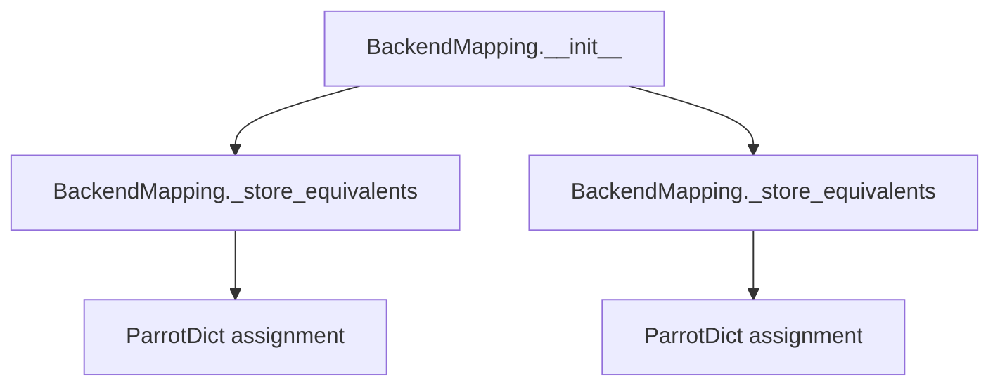
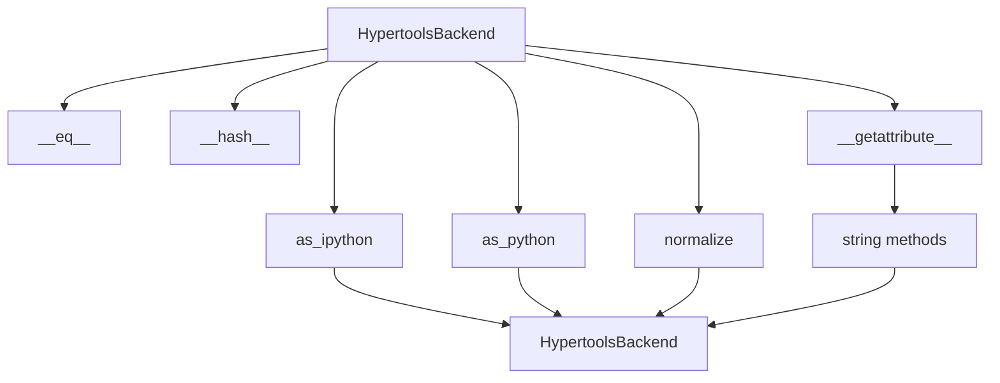
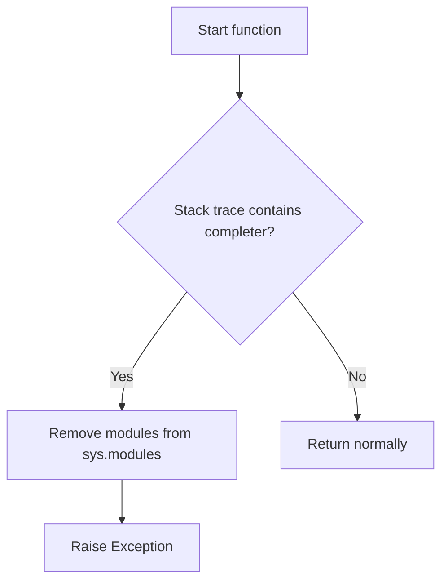
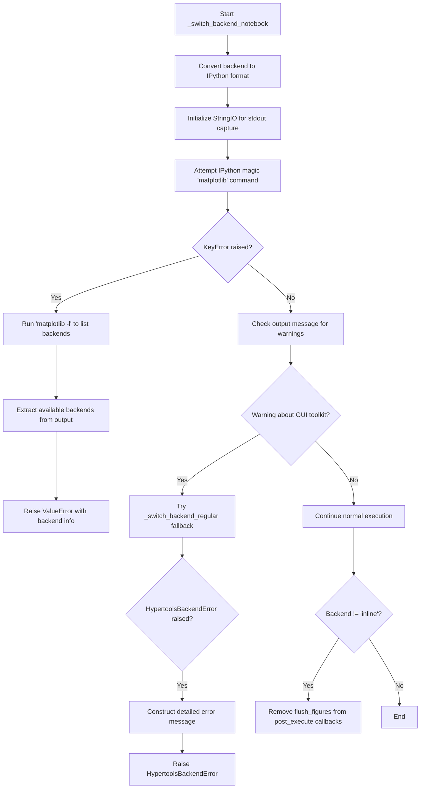
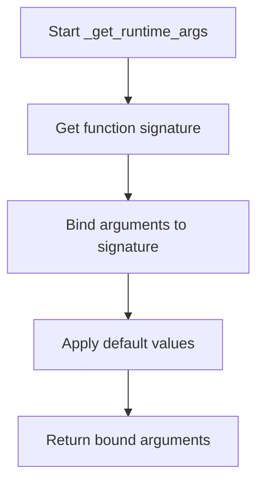
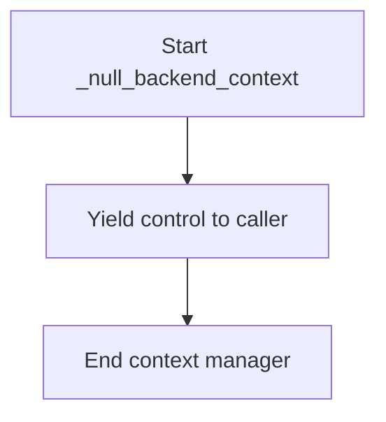
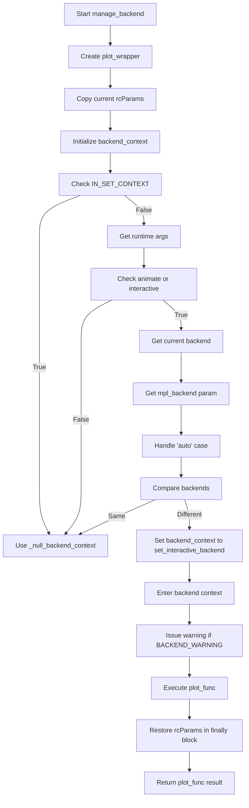

# `backend.py`

## `hypertools.plot.backend.ParrotDict` · *class*

## Summary:
A dictionary subclass that automatically converts all keys and values to HypertoolsBackend instances for consistent backend management.

## Description:
The ParrotDict class extends Python's built-in dict to provide automatic type conversion for all dictionary operations involving backend identifiers. It ensures that all keys and values are normalized to HypertoolsBackend instances, enabling consistent handling of plotting backends regardless of their original representation.

This class serves as a specialized container for managing plotting backend configurations and mappings. It's particularly useful in scientific computing environments where the same plotting code needs to work across different execution contexts (Jupyter notebooks vs regular Python scripts) while maintaining type consistency.

The class implements the full dictionary protocol with custom behavior for key containment, retrieval, setting, and missing key handling, all while ensuring that backend identifiers are consistently represented as HypertoolsBackend objects. The underlying storage still uses the standard dict mechanism, but with automatic conversion of keys and values to HypertoolsBackend instances.

## State:
- Inherits all state from the built-in dict class
- Keys and values are automatically converted to HypertoolsBackend instances during dictionary operations
- The underlying dictionary stores the converted HypertoolsBackend objects as both keys and values
- All state management is delegated to the parent dict class, with conversion applied at the interface level
- No additional instance attributes beyond those inherited from dict

## Lifecycle:
- Creation: Instantiate with any arguments accepted by dict constructor
- Usage: Access and modify dictionary entries using standard dict operations
- Destruction: Standard Python garbage collection handles cleanup

## Method Map:
```mermaid
graph TD
    A[ParrotDict] --> B[__contains__]
    A --> C[__getitem__]
    A --> D[__missing__]
    A --> E[__setitem__]
    B --> F[dict.keys()]
    C --> G[dict.__getitem__]
    D --> H[HypertoolsBackend(key)]
    E --> I[dict.__setitem__]
```

## Raises:
- KeyError: When accessing non-existent keys via __getitem__
- Any exceptions raised by HypertoolsBackend constructor during key/value conversion
- Any exceptions raised by parent dict.__setitem__ during storage operations

## Example:
```python
# Create a ParrotDict instance
parrot_dict = ParrotDict()

# Set items with automatic conversion to HypertoolsBackend
parrot_dict["Agg"] = "TkAgg"

# Access items with automatic key conversion
backend = parrot_dict["Agg"]  # Returns the value associated with the HypertoolsBackend("Agg") key

# Check membership with automatic key conversion
exists = "Agg" in parrot_dict  # Returns True if the key exists

# Missing keys are automatically created as HypertoolsBackend instances
missing_backend = parrot_dict["NonExistent"]  # Returns a new HypertoolsBackend instance
```

### `hypertools.plot.backend.ParrotDict.__init__` · *method*

## Summary:
Initializes a ParrotDict instance by delegating to its parent dict class constructor with provided arguments.

## Description:
The `__init__` method serves as the constructor for the ParrotDict class, which inherits from Python's built-in dict. It delegates initialization to the parent class using `super().__init__()`, allowing the ParrotDict to accept all the same arguments that a standard dict would accept. This enables the creation of ParrotDict instances with initial data through various means such as keyword arguments, iterable key-value pairs, or another dictionary.

This method is part of the standard Python object initialization protocol and ensures proper setup of the underlying dictionary structure before any custom behavior is applied. The ParrotDict class relies on its parent's initialization to establish the basic dictionary infrastructure, while its custom behavior is implemented through overridden dictionary methods like `__getitem__`, `__setitem__`, etc.

The reason this logic is encapsulated in its own method rather than being inlined is to maintain proper inheritance chain handling and ensure that all initialization logic from the parent class is properly executed. This approach allows the ParrotDict to seamlessly integrate with Python's object model while providing its specialized dictionary behavior.

## Args:
    *args: Variable length argument list passed to the parent dict constructor
    **kwargs: Arbitrary keyword arguments passed to the parent dict constructor

## Returns:
    None: This method initializes the object in-place and does not return a value

## Raises:
    Any exceptions raised by the parent dict.__init__ method when processing the provided arguments

## State Changes:
    Attributes READ: None
    Attributes WRITTEN: None (initialization is handled by parent class)

## Constraints:
    Preconditions: The arguments must be compatible with the parent dict.__init__ method signature
    Postconditions: The ParrotDict instance is properly initialized with the provided data

## Side Effects:
    None: This method performs no I/O operations or external service calls

### `hypertools.plot.backend.ParrotDict.__contains__` · *method*

## Summary:
Checks if a given key exists in the dictionary by converting it to a HypertoolsBackend instance and testing membership in the dictionary's keys.

## Description:
This method implements the `__contains__` magic method for the ParrotDict class, enabling the use of the `in` operator with HypertoolsBackend keys. It converts the provided key to a HypertoolsBackend instance and checks if this converted key exists among the dictionary's keys. This allows for flexible key lookup that automatically handles type conversion between regular strings and HypertoolsBackend instances.

The method is called during membership testing operations such as `key in parrot_dict` and ensures that keys can be looked up using either plain strings or HypertoolsBackend instances interchangeably.

## Args:
    key (Any): The key to check for existence in the dictionary. Can be any object that can be converted to a string.

## Returns:
    bool: True if the HypertoolsBackend-converted key exists in the dictionary's keys, False otherwise.

## Raises:
    None explicitly raised.

## State Changes:
    Attributes READ: None - this method only reads the implicit self argument and calls self.keys()
    Attributes WRITTEN: None - this method does not modify any instance attributes

## Constraints:
    Preconditions: The key parameter must be convertible to a string via str() or HypertoolsBackend constructor
    Postconditions: Returns a boolean value indicating membership status of the converted key

## Side Effects:
    None - this method performs no I/O operations or external service calls

### `hypertools.plot.backend.ParrotDict.__getitem__` · *method*

## Summary:
Retrieves a value from the dictionary using a backend identifier key, converting the key to a HypertoolsBackend type before lookup.

## Description:
This method implements dictionary key access for the ParrotDict class, providing automatic conversion of string keys to HypertoolsBackend objects for consistent backend identification. The method is called during dictionary access operations (e.g., `dict[key]`) when retrieving values associated with plotting backends.

The method ensures that all keys used for accessing the dictionary are normalized to HypertoolsBackend instances, maintaining consistency in backend handling throughout the plotting system. This approach allows the dictionary to work seamlessly with various backend string representations.

## Args:
    key (str or HypertoolsBackend): A backend identifier that can be converted to a HypertoolsBackend instance

## Returns:
    Any: The value associated with the converted key in the dictionary

## Raises:
    KeyError: When the converted key is not found in the dictionary

## State Changes:
    Attributes READ: None
    Attributes WRITTEN: None

## Constraints:
    Preconditions: The key parameter must be convertible to a string and subsequently to a HypertoolsBackend instance
    Postconditions: The returned value maintains its original type and content

## Side Effects:
    None

### `hypertools.plot.backend.ParrotDict.__missing__` · *method*

## Summary:
Returns a new HypertoolsBackend instance when a key is accessed that doesn't exist in the dictionary.

## Description:
This method is invoked by Python's dict class when a key lookup fails, allowing the ParrotDict to automatically create and return a new HypertoolsBackend instance for any requested key. This enables the dictionary to behave as a lazy factory for backend identifiers, creating them on-demand rather than requiring pre-definition.

The method is called during dictionary access operations such as `dict[key]` when the key is not present in the dictionary. It's part of the standard dict protocol and allows for dynamic key creation.

## Args:
    key (Any): The key being accessed that was not found in the dictionary

## Returns:
    HypertoolsBackend: A new HypertoolsBackend instance constructed from the missing key

## Raises:
    None explicitly raised by this method

## State Changes:
    Attributes READ: None
    Attributes WRITTEN: None

## Constraints:
    Preconditions: The key parameter is passed by Python's dict mechanism when a lookup fails
    Postconditions: A new HypertoolsBackend instance is returned, which may be stored in the dictionary on subsequent operations

## Side Effects:
    None - This method only creates and returns a new object without performing I/O or external service calls

### `hypertools.plot.backend.ParrotDict.__setitem__` · *method*

## Summary:
Sets a key-value pair in the dictionary after converting both to HypertoolsBackend instances.

## Description:
This method overrides the standard dictionary `__setitem__` behavior to ensure that both the key and value are converted to `HypertoolsBackend` instances before being stored in the parent dictionary. This maintains consistency in how backend identifiers are handled throughout the plotting system.

The method is called during assignment operations like `dict[key] = value` when the dictionary is a `ParrotDict` instance. It ensures that all keys and values are normalized to the `HypertoolsBackend` type, which provides environment-aware backend management capabilities.

This method exists as a dedicated override to maintain type consistency in the `ParrotDict` class, preventing mixed-type keys and values that could cause issues in backend resolution and management.

## Args:
    key (Any): The key to be set, which will be converted to a `HypertoolsBackend` instance through `HypertoolsBackend(key)`
    value (Any): The value to be set, which will be converted to a `HypertoolsBackend` instance through `HypertoolsBackend(value)`

## Returns:
    None: This method doesn't return anything meaningful, as it delegates to the parent dict's `__setitem__` method

## Raises:
    Any exceptions that may be raised by the parent `dict.__setitem__` method or `HypertoolsBackend` constructor, including:
    - ValueError: If the key or value cannot be converted to a string
    - KeyError: When backend conversion fails due to missing keys in global mapping dictionaries (BACKEND_MAPPING)
    - HypertoolsBackendError: When backend mapping is incomplete or IS_NOTEBOOK flag is improperly initialized

## State Changes:
    Attributes READ: None
    Attributes WRITTEN: None

## Constraints:
    Preconditions:
    - The `key` and `value` arguments must be convertible to strings
    - The parent dictionary must support the `__setitem__` operation
    
    Postconditions:
    - Both `key` and `value` are converted to `HypertoolsBackend` instances
    - The key-value pair is stored in the parent dictionary with the converted types

## Side Effects:
    None: This method performs no I/O operations or external service calls. It only modifies the internal state of the dictionary through normal dictionary operations.

## `hypertools.plot.backend.BackendMapping` · *class*

## Summary:
A mapping class that manages bidirectional relationships between Python and Jupyter plotting backends, with support for equivalent backend identifiers.

## Description:
The BackendMapping class provides a mechanism for creating and maintaining mappings between Python plotting backends (like 'Agg', 'TkAgg') and their Jupyter notebook equivalents (like 'nbAgg', 'inline'). It supports both simple string mappings and collections of equivalent backend identifiers, automatically establishing bidirectional relationships and equivalence mappings.

This class is designed to handle the complexity of backend switching in interactive environments where the same plotting code might run in different contexts (regular Python scripts vs Jupyter notebooks). It enables seamless transition between backend representations while maintaining consistency in the underlying plotting infrastructure.

## State:
- py_to_ipy (ParrotDict): Maps Python backend identifiers to their Jupyter equivalents
- ipy_to_py (ParrotDict): Maps Jupyter backend identifiers back to their Python equivalents  
- equivalents (ParrotDict): Maintains a registry of equivalent backend identifiers across different representations

## Lifecycle:
- Creation: Instantiate with a dictionary mapping Python backends to Jupyter backends
- Usage: Access the mapping attributes to retrieve backend equivalencies
- Destruction: Standard Python garbage collection handles cleanup

## Method Map:


## Raises:
- Any exceptions that could be raised by ParrotDict operations or the underlying dictionary iteration

## Example:
```python
# Create a backend mapping
mapping = BackendMapping({
    'Agg': 'nbAgg',
    'TkAgg': ['TkAgg', 'Qt5Agg'],
    'QtAgg': 'nbAgg'
})

# Access the mappings
python_to_jupyter = mapping.py_to_ipy  # Maps Python backends to Jupyter equivalents
jupyter_to_python = mapping.ipy_to_py  # Maps Jupyter backends to Python equivalents
equivalents = mapping.equivalents   # Maps equivalent backend identifiers
```

### `hypertools.plot.backend.BackendMapping.__init__` · *method*

## Summary:
Initializes a BackendMapping object by establishing bidirectional mappings between Python and IPython backend identifiers and registering equivalent backend names.

## Description:
The `__init__` method configures the internal data structures for managing backend mappings between Python and IPython environments. It creates three ParrotDict instances to store forward mappings (Python to IPython), reverse mappings (IPython to Python), and equivalent backend names. The method processes a provided dictionary mapping to establish these relationships and normalize backend identifiers.

This logic is encapsulated in its own method to separate the initialization concerns from the class's other responsibilities and to ensure proper setup of the mapping infrastructure before the object is used. The method handles both single backend names and lists of equivalent backend names, normalizing them appropriately.

## Args:
    _dict (dict): A dictionary mapping Python backend names to IPython backend names or lists of equivalent backend names

## Returns:
    None: This method initializes the object's state and returns nothing

## Raises:
    Any exceptions raised by ParrotDict instantiation or _store_equivalents method

## State Changes:
    Attributes READ: None
    Attributes WRITTEN: self.py_to_ipy, self.ipy_to_py, self.equivalents

## Constraints:
    Preconditions: The `_dict` parameter must be a dictionary-like object with iterable values
    Postconditions: Three ParrotDict instances are properly initialized with bidirectional mappings and equivalent backend relationships established

## Side Effects:
    None: This method performs no I/O operations or external service calls

### `hypertools.plot.backend.BackendMapping._store_equivalents` · *method*

## Summary:
Maps equivalent keys to a default key for backend configuration.

## Description:
This method establishes key equivalency relationships by storing mappings from equivalent keys to a default key. When provided with a list of equivalent keys, it creates entries in the self.equivalents dictionary where each key (except the first) maps to the first key. This enables the backend system to normalize alternative representations of the same concept to a canonical form.

The method is typically invoked during backend setup or configuration when defining equivalent key mappings for plotting backends or visualization components.

This method is separated from inline logic to provide a clean abstraction for key equivalence management, improving code organization and testability.

## Args:
    keylist: A string key or iterable of keys that are considered equivalent

## Returns:
    The default key (first element of keylist) that other keys are mapped to

## Raises:
    None explicitly raised

## State Changes:
    Attributes READ: self.equivalents
    Attributes WRITTEN: self.equivalents

## Constraints:
    Preconditions: 
    - keylist must be either a string or an iterable of keys
    - if keylist is iterable, it must contain at least one element
    
    Postconditions:
    - If keylist is iterable with multiple elements, self.equivalents contains mappings for all elements except the first one
    - The returned value is always the first element of keylist

## Side Effects:
    None

## `hypertools.plot.backend.HypertoolsBackend` · *class*

## Summary:
A string subclass that provides environment-aware backend identification and conversion for plotting libraries.

## Description:
The HypertoolsBackend class extends Python's built-in string type to provide specialized behavior for managing plotting backend identifiers. It automatically converts string-returning methods to return HypertoolsBackend instances, ensuring consistent type handling throughout string operations. The class is designed to handle the conversion between Python plotting backends and IPython/Jupyter plotting backends, making it easier to write environment-agnostic plotting code.

This class serves as a specialized wrapper around backend identifiers that automatically adapts to the execution environment (notebook vs regular Python) through its normalize() method. It's particularly useful in scientific computing environments where the same plotting code needs to work in both Jupyter notebooks and standalone scripts.

## State:
- Inherits all string attributes and behaviors from the built-in str class
- Maintains case-insensitive equality semantics through __eq__ override
- Implements custom hashing based on case-folded string representation
- All state is derived from the underlying string value passed during construction
- Relies on global constants BACKEND_MAPPING and IS_NOTEBOOK for backend conversion operations

## Lifecycle:
- Creation: Instantiate with any value convertible to string using `HypertoolsBackend(value)`
- Usage: Call methods like `as_ipython()`, `as_python()`, or `normalize()` to convert between backend formats
- Destruction: Standard Python garbage collection handles cleanup

## Method Map:


## Raises:
- KeyError: When backend conversion fails due to missing keys in global mapping dictionaries (BACKEND_MAPPING)
- HypertoolsBackendError: When backend mapping is incomplete or IS_NOTEBOOK flag is improperly initialized

## Example:
```python
# Create a backend instance
backend = HypertoolsBackend("Agg")

# Convert to IPython format
ipython_backend = backend.as_ipython()

# Normalize for current environment
normalized = backend.normalize()  # Returns IPython format if in notebook

# Use string methods that return new instances
upper_backend = backend.upper()  # Returns HypertoolsBackend instance
```

### `hypertools.plot.backend.HypertoolsBackend.__new__` · *method*

## Summary:
Creates a new HypertoolsBackend instance by initializing it as a string with the provided value.

## Description:
This method implements the `__new__` magic method to control the creation of new HypertoolsBackend instances. Since HypertoolsBackend inherits from Python's built-in `str` class, this method properly delegates to `str.__new__` to create a string object with the given value. This ensures that all HypertoolsBackend instances behave like strings while maintaining the custom behavior defined in the class.

The `__new__` method is crucial for proper string subclassing in Python, as it ensures that the instance is created with the correct string value before any initialization occurs.

## Args:
    cls (type): The HypertoolsBackend class being instantiated
    x (Any): The value to initialize the string with, convertible to string representation

## Returns:
    HypertoolsBackend: A new instance of HypertoolsBackend initialized with the string representation of x

## Raises:
    TypeError: If the value x cannot be converted to a string representation

## State Changes:
    Attributes READ: None
    Attributes WRITTEN: None

## Constraints:
    Preconditions:
    - cls must be the HypertoolsBackend class
    - x must be convertible to string representation
    Postconditions:
    - Returns a new HypertoolsBackend instance that is also a string
    - The instance maintains all string properties and behaviors

## Side Effects:
    None

### `hypertools.plot.backend.HypertoolsBackend.__eq__` · *method*

## Summary:
Compares two HypertoolsBackend instances for equality in a case-insensitive manner.

## Description:
This method overrides the default equality comparison operator (`==`) to provide case-insensitive string comparison between HypertoolsBackend instances. It converts both operands to strings and applies case folding before comparing them. This method is part of the HypertoolsBackend class which extends the built-in `str` type.

## Args:
    other (Any): Another object to compare with this HypertoolsBackend instance.

## Returns:
    bool: True if both string representations (after case folding) are equal, False otherwise.

## Raises:
    None explicitly raised.

## State Changes:
    Attributes READ: None - this method only reads the implicit self argument
    Attributes WRITTEN: None - this method does not modify any instance attributes

## Constraints:
    Preconditions: The `other` parameter can be any object that can be converted to a string via `str()`
    Postconditions: Returns a boolean value indicating case-insensitive string equality

## Side Effects:
    None - this method performs no I/O operations or external service calls

### `hypertools.plot.backend.HypertoolsBackend.__getattribute__` · *method*

## Summary:
Automatically wraps string-returning methods from parent class with HypertoolsBackend instances.

## Description:
This method overrides the standard `__getattribute__` behavior to intercept access to string methods inherited from `str`. When accessing a method that exists on the built-in `str` class, it returns a wrapper function that applies `HypertoolsBackend` conversion to the result. This enables fluent interface patterns where string operations return `HypertoolsBackend` instances instead of plain strings.

## Args:
    name (str): The name of the attribute being accessed.

## Returns:
    Various: Either a wrapped method that converts string results to `HypertoolsBackend` instances, or the result from the parent class's `__getattribute__` method.

## Raises:
    AttributeError: If the requested attribute doesn't exist and isn't handled by the special logic.

## State Changes:
    Attributes READ: None
    Attributes WRITTEN: None

## Constraints:
    Preconditions: The `name` argument must be a string representing an attribute name.
    Postconditions: If the attribute name corresponds to a `str` method, the returned callable will convert:
    - String results to `HypertoolsBackend` instances
    - Collections (list, tuple, set) containing strings to collections of `HypertoolsBackend` instances
    - Other return types unchanged

## Side Effects:
    None

### `hypertools.plot.backend.HypertoolsBackend.__hash__` · *method*

## Summary:
Computes a hash value for the backend instance using its lowercase string representation.

## Description:
This method overrides the default `__hash__` implementation to provide a consistent hash based on the case-folded string representation of the backend instance. It ensures that two backend instances with the same content (ignoring case) will have identical hash values, enabling proper use in hash-based collections like sets and dictionaries.

## Args:
    None

## Returns:
    int: An integer hash value computed from the lowercase string representation of the instance.

## Raises:
    None

## State Changes:
    Attributes READ: None
    Attributes WRITTEN: None

## Constraints:
    Preconditions: The instance must be a valid string-like object that can be converted to string and case-folded.
    Postconditions: The returned hash value is deterministic for equivalent backend instances (case-insensitive equality).

## Side Effects:
    None

### `hypertools.plot.backend.HypertoolsBackend.as_ipython` · *method*

## Summary:
Converts a HypertoolsBackend instance from Python plotting backend to IPython/Jupyter plotting backend.

## Description:
This method transforms the current backend representation from a standard Python plotting backend identifier to its corresponding IPython/Jupyter compatible backend identifier. It serves as part of the backend switching mechanism that allows the library to adapt to different execution environments (standalone Python vs Jupyter notebooks).

The method is designed to be called on HypertoolsBackend instances and leverages a global mapping structure to perform the conversion. This separation of concerns allows the library to maintain environment-aware backend handling without cluttering the main backend management logic.

This method works in conjunction with `as_python()` to provide bidirectional backend conversion capabilities.

## Args:
    None - This is a method that operates on the instance itself

## Returns:
    HypertoolsBackend: A new HypertoolsBackend instance representing the equivalent IPython backend

## Raises:
    KeyError: When the current backend identifier is not found in the BACKEND_MAPPING.equivalents dictionary
    KeyError: When the converted IPython backend identifier is not found in the BACKEND_MAPPING.py_to_ipy dictionary

## State Changes:
    Attributes READ: 
        - self: The current HypertoolsBackend instance being converted
    Attributes WRITTEN: 
        - None: This method creates a new instance rather than modifying existing state

## Constraints:
    Preconditions:
        - The instance must be a valid HypertoolsBackend object
        - The BACKEND_MAPPING global constant must be properly initialized with the required mappings
        - The current backend identifier must exist in BACKEND_MAPPING.equivalents
        
    Postconditions:
        - The returned instance represents the same logical backend but in IPython-compatible form
        - The returned instance is of the same HypertoolsBackend type

## Side Effects:
    None - This method performs no I/O operations or external service calls

### `hypertools.plot.backend.HypertoolsBackend.as_python` · *method*

## Summary:
Converts the current backend identifier from IPython-compatible format to Python-compatible format.

## Description:
This method transforms the backend representation stored in the HypertoolsBackend instance from an IPython-specific backend key to its corresponding Python-compatible backend key. It is part of the backend switching mechanism that enables seamless transition between different plotting backends based on the execution environment. This method is typically called when transitioning from an interactive notebook environment to a standard Python script environment.

## Args:
    None

## Returns:
    HypertoolsBackend: A new HypertoolsBackend instance containing the Python-compatible backend identifier.

## Raises:
    KeyError: If the current backend identifier is not found in the BACKEND_MAPPING.ipy_to_py dictionary.

## State Changes:
    Attributes READ: self (the current HypertoolsBackend instance)
    Attributes WRITTEN: None

## Constraints:
    Preconditions: The current instance must represent a valid IPython backend identifier that exists in BACKEND_MAPPING.equivalents.
    Postconditions: The returned instance will contain a valid Python backend identifier that corresponds to the same plotting backend as the original instance.

## Side Effects:
    None

### `hypertools.plot.backend.HypertoolsBackend.normalize` · *method*

## Summary:
Normalizes the backend identifier to match the current execution environment by converting between IPython and Python plotting backends.

## Description:
This method determines the appropriate plotting backend format based on whether the code is running in a Jupyter notebook environment or a standard Python script. It conditionally calls either `as_ipython()` or `as_python()` to ensure the backend identifier is compatible with the current execution context.

The method uses the global `IS_NOTEBOOK` flag to make this determination. When running in a notebook environment, it converts the backend to IPython-compatible format; when running in a standard Python environment, it converts to Python-compatible format. This ensures that plotting backends work correctly regardless of the execution environment.

This method serves as a central coordination point for environment-aware backend handling, abstracting away the complexity of environment detection from the rest of the system.

## Args:
    None - This is a method that operates on the instance itself

## Returns:
    HypertoolsBackend: A new HypertoolsBackend instance with the backend identifier formatted appropriately for the current execution environment

## Raises:
    KeyError: When the current backend identifier is not found in the backend mapping dictionaries during conversion
    HypertoolsBackendError: When the backend mapping is incomplete or the IS_NOTEBOOK flag is not properly initialized

## State Changes:
    Attributes READ: 
        - self: The current HypertoolsBackend instance being normalized
        - IS_NOTEBOOK: Global flag indicating whether code is running in a Jupyter notebook
    Attributes WRITTEN: 
        - None: This method creates a new instance rather than modifying existing state

## Constraints:
    Preconditions:
        - The instance must be a valid HypertoolsBackend object
        - The `IS_NOTEBOOK` global variable must be properly initialized to True or False
        - The BACKEND_MAPPING global constant must be properly initialized with required mappings
        - The current backend identifier must exist in BACKEND_MAPPING.equivalents
        
    Postconditions:
        - The returned instance represents the same logical backend but in the appropriate format for the current execution environment
        - The returned instance is of the same HypertoolsBackend type

## Side Effects:
    None - This method performs no I/O operations or external service calls

## `hypertools.plot.backend._init_backend` · *function*

## Summary:
Initializes and configures the matplotlib plotting backend for the hypertools library, detecting the execution environment and selecting appropriate backends with fallback mechanisms.

## Description:
The `_init_backend` function is responsible for setting up the matplotlib plotting backend based on the execution environment. It determines whether the code is running in a Jupyter notebook or regular Python environment, selects appropriate backends with priority ordering, and handles various error conditions through fallback mechanisms. This function is called during module initialization to establish the plotting backend state.

The function extracts this logic into its own component to encapsulate the complexity of environment detection, backend selection, and error handling. This separation allows the rest of the plotting system to rely on a stable, pre-configured backend setup without needing to manage these details directly.

Known callers within the codebase:
- Called during module initialization to set up plotting backend state
- Triggered when the plotting module is first imported and needs to configure the backend appropriately

Why this logic is extracted:
- Environment detection and backend selection is complex and varies significantly between notebook and regular Python environments
- Centralizes error handling and fallback mechanisms for backend switching
- Provides a clean interface for backend switching functions (`switch_backend`, `reset_backend`) without exposing internal implementation details

## Args:
    None

## Returns:
    None

## Raises:
    None explicitly raised by this function. However, it may propagate exceptions from internal function calls such as `mpl.use()` or backend conversion methods.

## Constraints:
    Preconditions:
        - The matplotlib library must be importable and available (with `mpl` alias)
        - Global variables `BACKEND_MAPPING`, `BACKEND_WARNING`, `HYPERTOOLS_BACKEND`, `IPYTHON_INSTANCE`, `IS_NOTEBOOK`, `reset_backend`, and `switch_backend` must be defined in the module scope
        - The `get_ipython()` function must be available in the execution environment
        - The `mpl` alias for matplotlib must be available (likely imported as `import matplotlib as mpl`)
    Postconditions:
        - Global variables are properly initialized with backend configuration
        - The matplotlib backend is set to an appropriate working backend
        - Appropriate backend switching functions are assigned to `switch_backend` and `reset_backend`
        - A `BACKEND_MAPPING` object is created and assigned
        - The original matplotlib backend is restored after configuration

## Side Effects:
    - Modifies global variables including `BACKEND_MAPPING`, `BACKEND_WARNING`, `HYPERTOOLS_BACKEND`, `IPYTHON_INSTANCE`, `IS_NOTEBOOK`, `reset_backend`, and `switch_backend`
    - Calls `mpl.use()` to change matplotlib backend settings
    - May issue warnings via the `warnings` module
    - Calls `_block_greedy_completer_execution()` which modifies `sys.modules`
    - Temporarily changes matplotlib backend during execution

## Control Flow:
```mermaid
flowchart TD
    A[Start _init_backend] --> B[Get current matplotlib backend]
    B --> C{Tries to get IPython instance}
    C -->|Exception| D[Set IS_NOTEBOOK = False]
    D --> E[Define backend priority list]
    E --> F{Check for HYPERTOOLS_BACKEND env var}
    F -->|Exists| G[Reorder backends with env var first]
    G --> H[Iterate through backends]
    H --> I{Try mpl.use(b)}
    I -->|Success| J[Set working_backend = b]
    I -->|Failure| K[Continue to next backend]
    K --> L{All backends failed?}
    L -->|Yes| M[Set fallback to 'Agg']
    M --> N[Issue warning about fallback]
    N --> O[Assign switch/reset backend functions]
    C -->|Success| P[Set IS_NOTEBOOK = True]
    P --> Q[Try mpl.use('nbAgg')]
    Q -->|Success| R[Set working_backend = 'nbAgg']
    Q -->|Failure| S[Set fallback to 'inline']
    S --> T[Issue warning about fallback]
    T --> U[Assign notebook-specific backend functions]
    U --> V[Restore original backend]
    V --> W[Create BACKEND_MAPPING]
    W --> X[Normalize and assign HYPERTOOLS_BACKEND]
```

## Examples:
```python
# Typical usage - called during module initialization
_init_backend()

# In a notebook environment, this would:
# 1. Detect Jupyter environment via get_ipython()
# 2. Try to set 'nbAgg' backend
# 3. Fall back to 'inline' if 'nbAgg' is unavailable
# 4. Set appropriate switch/reset backend functions

# In a regular Python environment, this would:
# 1. Detect non-notebook environment
# 2. Try various GUI backends in priority order (TkAgg, QtAgg, etc.)
# 3. Fall back to 'Agg' if none work
# 4. Set appropriate switch/reset backend functions
```

## `hypertools.plot.backend._block_greedy_completer_execution` · *function*

## Summary:
Blocks execution of greedy IPython completer by removing cached modules and raising an exception when detected.

## Description:
This function detects when IPython's greedy completer is attempting to execute code and prevents it by clearing cached modules from sys.modules and raising an exception. It's designed to prevent interference from IPython's autocompletion system during plotting operations, which can cause unexpected behavior or crashes when the completer tries to evaluate code during visualization.

## Args:
    None

## Returns:
    None

## Raises:
    Exception: When IPython greedy completer is detected in the call stack, this function raises a generic Exception to interrupt the completion process.

## Constraints:
    Precondition: Must be called within an IPython environment where the greedy completer could interfere with plotting operations.
    Postcondition: If triggered, the function removes cached modules and raises an exception to stop further execution.

## Side Effects:
    - Modifies sys.modules by removing entries for 'hypertools.plot', 'hypertools.plot.backend', and 'numpy'
    - Raises an Exception to interrupt execution flow

## Control Flow:


## Examples:
This function is typically called internally by plotting functions and doesn't have direct public usage examples. It's designed to handle edge cases where IPython's autocompletion system interferes with plotting operations, particularly in interactive environments like Jupyter notebooks.

## `hypertools.plot.backend._switch_backend_regular` · *function*

## Summary:
Switches the matplotlib plotting backend to the specified backend and handles associated errors with custom exception wrapping.

## Description:
This function serves as a wrapper around matplotlib's `switch_backend` function to provide enhanced error handling and user-friendly error messages. It converts the backend parameter to Python format using the `as_python()` method, attempts to switch the matplotlib backend, and catches specific exceptions to raise a more informative `HypertoolsBackendError`.

The function is designed to encapsulate the complexity of backend switching and error management, making it easier for higher-level components to handle backend transitions without dealing with low-level matplotlib exceptions directly. By centralizing error handling, this function ensures consistent error reporting throughout the hypertools library.

## Args:
    backend: The plotting backend to switch to. Must be an object with an `as_python()` method that returns a string representation of the backend suitable for matplotlib (e.g., 'Agg', 'TkAgg', 'Qt5Agg').

## Returns:
    None. This function performs an in-place operation to change the matplotlib backend and raises exceptions on failure.

## Raises:
    HypertoolsBackendError: Raised when backend switching fails due to either missing dependencies (ImportError/ModuleNotFoundError) or other unexpected errors during the backend switch process.

## Constraints:
    Preconditions:
        - The backend parameter must have an `as_python()` method that returns a valid matplotlib backend string
        - The matplotlib library must be properly installed and importable
    Postconditions:
        - If successful, the matplotlib backend will be switched to the requested backend
        - If failed, a HypertoolsBackendError will be raised with a descriptive message

## Side Effects:
    - Modifies the global matplotlib backend state
    - May trigger matplotlib's backend initialization which could involve loading external libraries or creating display windows

## Control Flow:
```mermaid
flowchart TD
    A[Start _switch_backend_regular] --> B[Convert backend to Python format using as_python()]
    B --> C{Try plt.switch_backend(backend)}
    C -->|Success| D[Return successfully]
    C -->|Exception| E{Is exception ImportError or ModuleNotFoundError?}
    E -->|Yes| F[Create dependency error message]
    E -->|No| G[Create generic error message]
    F --> H[Raise HypertoolsBackendError with dependency message]
    G --> H
```

## Examples:
```python
# Successful backend switch
_switch_backend_regular("Agg")

# Error handling for missing backend
try:
    _switch_backend_regular("NonExistentBackend")
except HypertoolsBackendError as e:
    print(f"Backend switching failed: {e}")
    # Handle the error appropriately
```

## `hypertools.plot.backend._switch_backend_notebook` · *function*

## Summary:
Switches the matplotlib plotting backend in a Jupyter notebook environment, handling various error conditions and fallback mechanisms.

## Description:
This function manages the switching of matplotlib plotting backends specifically within Jupyter notebook environments. It takes a backend specification, converts it to IPython-compatible format, and attempts to set it using IPython magic commands. The function implements robust error handling including fallback mechanisms to regular backend switching when GUI toolkit conflicts occur.

The function is extracted into its own component to encapsulate the complexity of notebook-specific backend switching, IPython integration, and error recovery strategies. This separation allows higher-level plotting functions to rely on a stable interface without needing to manage the intricacies of IPython magic commands and backend conflict resolution.

## Args:
    backend: The plotting backend to switch to. Must be an object with an `as_ipython()` method that returns a string representation compatible with IPython's matplotlib magic command. Expected to be available in the module scope.

## Returns:
    None. This function performs in-place operations to modify the plotting backend state and does not return any value.

## Raises:
    ValueError: Raised when the specified backend is not available in the current IPython environment, with a detailed message listing available backends.
    HypertoolsBackendError: Raised when backend switching fails via IPython and the fallback mechanism also fails, providing a comprehensive error message.

## Constraints:
    Preconditions:
        - The backend parameter must have an `as_ipython()` method that returns a valid IPython matplotlib backend string
        - IPYTHON_INSTANCE must be available in the module scope (typically set by Jupyter environment)
        - The matplotlib library must be available and importable
    Postconditions:
        - The matplotlib backend will be switched to the requested backend if successful
        - If successful, the IPython post_execute event handlers will be adjusted for non-inline backends

## Side Effects:
    - Modifies the global matplotlib backend state through IPython magic commands
    - Adjusts IPython event callbacks for post_execute events when using non-inline backends
    - Captures and processes stdout from IPython magic commands for error analysis

## Control Flow:


## Examples:
```python
# Switch to TkAgg backend in notebook
backend_obj = SomeBackendClass("TkAgg")
_switch_backend_notebook(backend_obj)

# Handle invalid backend gracefully
try:
    _switch_backend_notebook(invalid_backend)
except ValueError as e:
    print(f"Invalid backend: {e}")
```

## `hypertools.plot.backend._reset_backend_notebook` · *function*

## Summary:
Registers a callback to reset the matplotlib backend before each notebook cell execution.

## Description:
This function sets up an IPython event callback that will switch the matplotlib backend to the specified target backend before each notebook cell runs. It prevents duplicate callback registration by checking existing event handlers first. The callback function itself executes the backend switching and then unregisters itself to avoid repeated execution.

This function is extracted to encapsulate the complexity of IPython event management and ensure proper cleanup of event handlers. It provides a clean interface for maintaining consistent plotting backends across notebook cells.

## Args:
    backend: The target plotting backend to switch to. Must be an object with an `as_ipython()` method that returns a string representation compatible with IPython's matplotlib magic command.

## Returns:
    None. This function performs in-place operations to register event callbacks and does not return any value.

## Raises:
    None explicitly raised by this function. However, the underlying `_switch_backend_notebook` function may raise exceptions.

## Constraints:
    Preconditions:
        - The backend parameter must have an `as_ipython()` method that returns a valid IPython matplotlib backend string
        - IPYTHON_INSTANCE must be available in the module scope (typically set by Jupyter environment)
    Postconditions:
        - A callback function is registered with IPython's 'pre_run_cell' event
        - The callback will execute `_switch_backend_notebook` with the specified backend before each cell run
        - The callback automatically unregisters itself after execution

## Side Effects:
    - Registers a callback function with IPython's event system for 'pre_run_cell' events
    - Calls `_switch_backend_notebook` function during cell execution
    - Unregisters the callback after it executes once

## Control Flow:
```mermaid
flowchart TD
    A[Start _reset_backend_notebook] --> B[Convert backend to IPython format using backend.as_ipython()]
    B --> C[Check if _deferred_reset_cb callback already registered]
    C --> D{Is callback registered?}
    D -->|Yes| E[Return without changes]
    D -->|No| F[Register _deferred_reset_cb callback with pre_run_cell event]
    F --> G[End]
    
    subgraph _deferred_reset_cb
    H[Execute _switch_backend_notebook with backend]
    H --> I[Unregister _deferred_reset_cb from pre_run_cell event]
    end
```

## Examples:
```python
# Reset backend to 'Agg' for notebook execution
backend_obj = SomeBackendClass("Agg")
_reset_backend_notebook(backend_obj)

# This ensures that before each cell execution, the backend will be switched to Agg
# The callback automatically removes itself after first execution
```

## `hypertools.plot.backend._get_runtime_args` · *function*

## Summary:
Returns a dictionary of all arguments with their values for a given function call, including default values for unspecified parameters.

## Description:
This utility function extracts and binds all runtime arguments for a specified function, applying default values where necessary. It is primarily used internally to standardize argument handling across different plotting backends and functions within the hypertools library.

## Args:
    func (callable): The function whose arguments are being processed.
    *func_args (tuple): Positional arguments passed to the function.
    **func_kwargs (dict): Keyword arguments passed to the function.

## Returns:
    dict: A dictionary mapping parameter names to their resolved values, including defaults for unspecified parameters.

## Raises:
    TypeError: If the provided arguments are incompatible with the function signature.

## Constraints:
    Preconditions:
        - The `func` argument must be a callable object (function, method, etc.).
        - All positional and keyword arguments must be compatible with the function signature.
    Postconditions:
        - The returned dictionary contains all parameters defined in the function signature.
        - Default values are applied for any parameters not provided in the arguments.

## Side Effects:
    None.

## Control Flow:


## Examples:
```python
def sample_func(a, b=10, c=20):
    return a + b + c

# Example usage:
args = _get_runtime_args(sample_func, 5, c=30)
# Returns: {'a': 5, 'b': 10, 'c': 30}

args = _get_runtime_args(sample_func, 5, 15)
# Returns: {'a': 5, 'b': 15, 'c': 20}
```

## `hypertools.plot.backend.set_interactive_backend` · *class*

## Summary:
A context manager class that temporarily switches the matplotlib backend to an interactive mode for plotting.

## Description:
The `set_interactive_backend` class provides a context manager interface for temporarily configuring matplotlib to use an interactive backend. It ensures that plotting operations within the managed context use an appropriate backend for interactive display while preserving the original backend configuration upon exit. This is particularly useful in Jupyter notebooks or other interactive environments where different backends are required for proper visualization.

The class implements the Python context manager protocol (`__enter__` and `__exit__` methods) and manages global state variables to track backend configurations and context usage. It compares the requested backend with the current configuration and only performs backend switching when necessary to minimize side effects.

## State:
- `old_interactive_backend`: Stores the previously configured interactive backend identifier (type: str, inherited from HypertoolsBackend)
- `old_backend_warning`: Stores the previous backend warning state (type: Any)
- `new_interactive_backend`: The target interactive backend identifier to configure (type: str, inherited from HypertoolsBackend)
- `new_is_different`: Boolean flag indicating whether the new backend differs from the old one (type: bool)
- `backend_switched`: Boolean flag indicating whether a backend switch was actually performed (type: bool)
- `curr_backend`: Records the current matplotlib backend identifier when entering the context (type: str, inherited from HypertoolsBackend)

All backend identifiers are stored as strings since HypertoolsBackend is a string subclass that maintains string compatibility.

## Lifecycle:
- Creation: Instantiate with a backend identifier string that will be converted to a HypertoolsBackend instance
- Usage: Use as a context manager with the `with` statement to temporarily switch backends
- Destruction: Automatically handled by the context manager's `__exit__` method which restores original settings and global state

## Method Map:
```mermaid
graph TD
    A[set_interactive_backend] --> B[__init__]
    A --> C[__enter__]
    A --> D[__exit__]
    B --> E[HypertoolsBackend constructor]
    C --> F[mpl.get_backend()]
    C --> G[switch_backend]
    D --> H[reset_backend]
    E --> I[HypertoolsBackend.normalize()]
    F --> I
    G --> I
    H --> I
```

## Raises:
- HypertoolsBackendError: Raised during backend normalization or switching if backend conversion fails
- KeyError: May be raised during backend mapping operations if required mappings are missing
- Any exceptions raised by matplotlib's backend switching functions

## Example:
```python
# Temporarily switch to an interactive backend for plotting
with set_interactive_backend('TkAgg'):
    # All plotting operations here use TkAgg backend
    plt.plot([1, 2, 3], [1, 4, 9])
    plt.show()

# Backend automatically restored to original setting
```

### `hypertools.plot.backend.set_interactive_backend.__init__` · *method*

## Summary:
Initializes a backend switching context that prepares to change the interactive plotting backend while preserving the previous state.

## Description:
This method initializes the `set_interactive_backend` context manager by capturing the current backend configuration and preparing the new backend specification. It determines whether a backend switch is necessary and sets up the appropriate state for the context manager's lifecycle.

The initialization process stores the old backend state and new backend specification as instance attributes, enabling subsequent methods to determine whether a backend switch is needed and to restore the original state when appropriate. This approach prevents unnecessary backend switching operations and maintains proper state management.

## Args:
    backend (str): The target backend identifier to switch to. This should be a valid matplotlib backend name that can be processed by the HypertoolsBackend constructor.

## Returns:
    None: This method does not return any value.

## Raises:
    None explicitly raised by this method.

## State Changes:
    Attributes READ:
        - HYPERTOOLS_BACKEND: Global variable representing the current backend (accessed via .normalize())
        - BACKEND_WARNING: Global variable storing backend warning state
    
    Attributes WRITTEN:
        - self.old_interactive_backend: Stores normalized version of current backend
        - self.old_backend_warning: Stores current backend warning state
        - self.new_interactive_backend: Stores normalized version of target backend
        - self.new_is_different: Boolean flag indicating if new backend differs from current
        - self.backend_switched: Boolean flag tracking if backend switch was performed

## Constraints:
    Preconditions:
        - The backend parameter must be a valid string that can be processed by HypertoolsBackend constructor
        - Global variables HYPERTOOLS_BACKEND and BACKEND_WARNING must be defined in the module scope
        - The HypertoolsBackend class must be properly imported and available
    
    Postconditions:
        - Instance attributes are properly initialized with current and target backend states
        - The backend switch will only occur if new backend differs from current backend
        - Global state variables are preserved for potential restoration

## Side Effects:
    - Modifies global variables HYPERTOOLS_BACKEND and BACKEND_WARNING when backend switch occurs (in __enter__ method)
    - May trigger matplotlib backend switching operations (though not directly in this method)

### `hypertools.plot.backend.set_interactive_backend.__enter__` · *method*

## Summary:
Enters a context manager that temporarily configures the matplotlib backend for interactive plotting.

## Description:
This method implements the `__enter__` protocol for a context manager that ensures the matplotlib backend is set to an interactive mode. It is automatically called when entering a `with` statement block containing a `set_interactive_backend` context manager. The method records the current backend state and performs a backend switch if the requested interactive backend differs from the current one.

This method is essential for maintaining proper backend state management in plotting contexts. It enables the context manager pattern to guarantee that:
1. The backend is switched to the desired interactive mode when needed
2. The original backend state is preserved for restoration upon exit
3. Global state tracking is maintained through the `IN_SET_CONTEXT` flag

## Args:
    None

## Returns:
    self: The context manager instance, enabling proper context manager protocol compliance.

## Raises:
    None explicitly raised, though underlying matplotlib operations may raise exceptions during backend switching.

## State Changes:
    Attributes READ: 
    - self.new_interactive_backend
    - self.backend_switched
    
    Attributes WRITTEN:
    - IN_SET_CONTEXT (global variable, set to True)
    - self.curr_backend (records current backend before potential switch)
    - self.backend_switched (flag indicating if backend switch occurred)

## Constraints:
    Preconditions:
    - The context manager instance must be properly initialized with a valid backend specification
    - The matplotlib library must be available and properly configured
    - The `new_interactive_backend` attribute must be properly normalized
    
    Postconditions:
    - The global `IN_SET_CONTEXT` flag is set to True
    - The current backend is recorded in `self.curr_backend`
    - If a backend switch was required, `self.backend_switched` is set to True
    - The matplotlib backend is configured for interactive display if a switch occurred

## Side Effects:
    - Modifies global state via the `IN_SET_CONTEXT` variable
    - Calls matplotlib's `mpl.get_backend()` to retrieve current backend
    - May invoke matplotlib's backend switching mechanism if a change is required
    - Triggers potential reloading of matplotlib backend, affecting subsequent plotting operations

### `hypertools.plot.backend.set_interactive_backend.__exit__` · *method*

## Summary:
Restores the previous interactive backend configuration when exiting a context manager block.

## Description:
This method is part of the context manager protocol and is automatically called when exiting a `with` statement block. It restores the original matplotlib backend settings and cleans up any temporary backend changes made during the context execution. This method ensures proper cleanup of backend state when using the set_interactive_backend context manager.

## Args:
    exc_type: Exception type if an exception occurred within the context, None otherwise
    exc_value: Exception value if an exception occurred within the context, None otherwise  
    traceback: Traceback object if an exception occurred within the context, None otherwise

## Returns:
    None

## Raises:
    None explicitly raised

## State Changes:
    Attributes READ: self.new_is_different, self.old_interactive_backend, self.old_backend_warning, self.backend_switched, self.curr_backend
    Attributes WRITTEN: IN_SET_CONTEXT, HYPERTOOLS_BACKEND, BACKEND_WARNING

## Constraints:
    Preconditions: The method assumes that the context manager was properly entered and that self contains the necessary attributes (new_is_different, old_interactive_backend, etc.)
    Postconditions: The global backend state is restored to its original configuration if changes were made

## Side Effects:
    Modifies global variables: IN_SET_CONTEXT, HYPERTOOLS_BACKEND, BACKEND_WARNING
    Calls reset_backend function which likely resets the matplotlib backend to its previous state

## `hypertools.plot.backend._null_backend_context` · *function*

## Summary:
A context manager that provides a null backend context for plotting operations, allowing execution to proceed without actual backend rendering.

## Description:
This function serves as a placeholder context manager for plotting backends. It is designed to be used when a plotting backend is not available or needs to be bypassed temporarily. The function yields control to the caller's code block, enabling execution to continue normally while maintaining a consistent interface for backend management.

## Args:
    dummy_backend (any): A parameter that accepts any type of value. This parameter is not used within the function body and serves only as a placeholder to maintain consistent function signatures across different backend implementations.

## Returns:
    None: This function does not return any meaningful value. It is a generator-based context manager that yields control to the code block it wraps.

## Raises:
    None: This function does not raise any exceptions under normal operation.

## Constraints:
    Preconditions: None required.
    Postconditions: The function always yields control to the wrapped code block, ensuring that the execution continues normally.

## Side Effects:
    None: This function does not perform any I/O operations, modify global state, or make external service calls.

## Control Flow:


## Examples:
```python
# Basic usage as a context manager
with _null_backend_context(None):
    # All plotting operations here are effectively ignored
    print("Executing code within null backend context")
```

## `hypertools.plot.backend.manage_backend` · *function*

## Summary:
Manages matplotlib backend configuration for plotting functions, ensuring appropriate backend selection for interactive and animated plots while preserving original settings.

## Description:
The `manage_backend` decorator function provides centralized backend management for plotting operations. It automatically selects and configures the appropriate matplotlib backend based on plot requirements (interactive, animated) and current environment settings. The decorator preserves original matplotlib configuration by restoring `rcParams` after execution, preventing side effects from backend switching.

This function is extracted into its own component to encapsulate backend management logic, separating concerns between plotting business logic and environment-specific backend configuration. This promotes reusability across different plotting functions and maintains clean separation of responsibilities.

## Args:
    plot_func (callable): The plotting function to be decorated, which will have its backend management handled automatically.

## Returns:
    callable: A wrapper function that manages backend configuration before and after executing the original plotting function.

## Raises:
    HypertoolsBackendError: When backend conversion or switching fails during interactive backend setup.
    KeyError: When required backend mappings are missing during backend normalization.
    Any exceptions raised by matplotlib's backend switching functions.

## Constraints:
    Preconditions:
        - The `plot_func` argument must be a callable object (function, method, etc.).
        - The matplotlib library must be available and properly configured.
        - Global constants `IN_SET_CONTEXT`, `HYPERTOOLS_BACKEND`, and `BACKEND_WARNING` must be accessible.
        - The `_get_runtime_args` function must be available and working correctly.
        - The `_null_backend_context` and `set_interactive_backend` context managers must be defined.
        - The `HypertoolsBackend` class must be available and properly implemented.
    Postconditions:
        - Original matplotlib `rcParams` are always restored after function execution.
        - The matplotlib backend is switched only when necessary for interactive/animated plots.
        - The function returns the exact result of the original plotting function.

## Side Effects:
    - Temporarily modifies matplotlib backend configuration during execution.
    - Modifies matplotlib `rcParams` during execution, which are restored afterward.
    - May issue warnings via Python's warnings module if `BACKEND_WARNING` is set.
    - Calls matplotlib's backend switching functions which may have side effects.

## Control Flow:


## Examples:
```python
@manage_backend
def my_plot_function(data, animate=False, interactive=False):
    # Plotting logic here
    plt.plot(data)
    return plt.gcf()

# When called with interactive=True, the backend will be switched appropriately
fig = my_plot_function([1, 2, 3], interactive=True)
```

