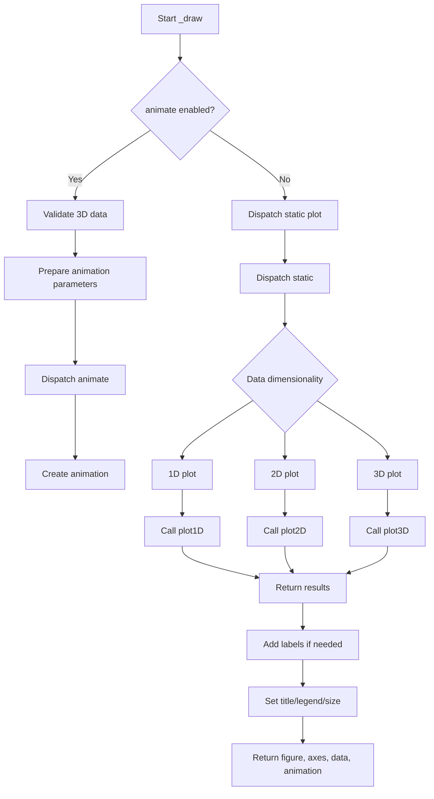

# `draw.py`

## `hypertools.plot.draw._draw` · *function*

## Summary:
Internal drawing function that renders 1D, 2D, and 3D plots with optional animations and interactive features.

## Description:
This is an internal helper function responsible for rendering various types of plots (1D, 2D, 3D) with support for animations, labels, legends, and interactive exploration features. It serves as the core plotting engine that handles different visualization modes including static plots, animated sequences, and exploratory visualizations with mouse interactions. The function determines plot type based on data dimensions and applies appropriate rendering strategies.

## Args:
    x (list of arrays): List of data arrays to plot, where each array represents a dataset with shape (n_points, dimensions).
    legend (list or None): Legend labels for each dataset. Defaults to None.
    title (str or None): Plot title. Defaults to None.
    labels (bool or list): Whether to add labels to data points or list of label strings. Defaults to False.
    show (bool): Whether to display the plot. Defaults to True.
    kwargs_list (list or None): List of keyword arguments for each dataset. Defaults to None.
    fmt (list or None): Format strings for each dataset. Defaults to None.
    animate (bool or str): Animation mode ('parallel', 'spin') or False for static plots. Defaults to False.
    tail_duration (int): Duration of the trail in seconds for animated plots. Defaults to 2.
    rotations (int): Number of rotations for animated views. Defaults to 2.
    zoom (int): Zoom level for 3D plots. Defaults to 1.
    chemtrails (bool): Whether to show chemtrail effects in animations. Defaults to False.
    precog (bool): Whether to show future trajectory in animations. Defaults to False.
    bullettime (bool): Whether to slow down animation speed. Defaults to False.
    frame_rate (int): Frame rate for animations. Defaults to 50.
    elev (int): Elevation angle for 3D plots. Defaults to 10.
    azim (int): Azimuth angle for 3D plots. Defaults to -60.
    duration (int): Duration of animation in seconds. Defaults to 30.
    explore (bool): Enable interactive exploration mode. Defaults to False.
    size (tuple or None): Figure size as (width, height). Defaults to None.
    ax (matplotlib.axes.Axes or None): Axes object to plot on. Defaults to None.

## Returns:
    tuple: (figure, axes, data, animation) where:
        - figure (matplotlib.figure.Figure): The created figure object
        - axes (matplotlib.axes.Axes): The axes object used for plotting
        - data (list): Original data arrays passed in
        - animation (matplotlib.animation.Animation or None): Animation object if animate=True, otherwise None

## Raises:
    AssertionError: When animate=True and data dimensionality is not 3D.

## Constraints:
    Preconditions:
        - Data arrays in x must be numpy arrays
        - When animate=True, all data arrays must have 3 dimensions
        - If labels are provided, they must match the number of data arrays
        - If kwargs_list is provided, it must match the number of data arrays
        - Single-point data with line formats ('-', ':', '--') gets converted to marker format ('.')

    Postconditions:
        - Returns a matplotlib figure and axes objects
        - If animate=True, returns an animation object
        - Labels are properly positioned and displayed
        - Plot is configured according to specified parameters
        - Interactive features are properly connected when enabled

## Side Effects:
    - Creates matplotlib figures and axes
    - May modify global variable labels_and_points
    - Connects matplotlib canvas events for interactive features
    - Sets figure size if size parameter is provided
    - Turns off interactive mode if show=False

## Control Flow:


## Examples:
    # Basic 2D plot
    fig, ax, data, ani = _draw([np.array([[1,2], [3,4]])], title="My Plot")

    # Animated 3D plot
    fig, ax, data, ani = _draw([np.array([[1,2,3], [4,5,6]])], animate='parallel', tail_duration=3)

    # Interactive exploration
    fig, ax, data, ani = _draw([np.array([[1,2,3], [4,5,6]])], labels=['Point A', 'Point B'], explore=True)
```

