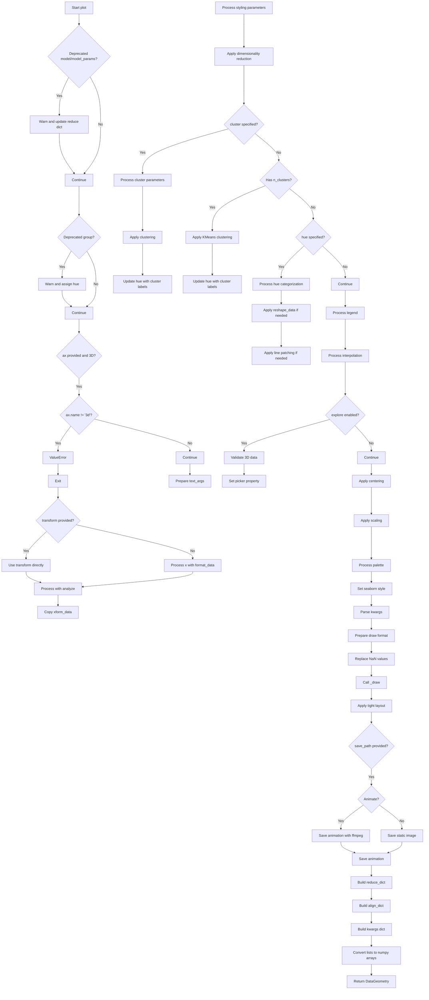

# `plot.py`

## `hypertools.plot.plot.plot` · *function*

## Summary:
Plots high-dimensional data in 1D, 2D, or 3D visualizations with support for clustering, animation, and interactive exploration.

## Description:
The `plot` function serves as the primary interface for visualizing high-dimensional data using dimensionality reduction techniques. It accepts diverse data types including numerical arrays, text data, and mixed data formats, then applies preprocessing, dimensionality reduction, and clustering as specified by user parameters. The function supports multiple visualization modes including static plots, animated sequences, and interactive exploration with mouse-based navigation.

This function is extracted into its own component to encapsulate the complete data visualization pipeline, separating concerns between data preparation, transformation, and rendering. This modular approach allows for reuse across different visualization contexts while maintaining a clean API for users.

## Args:
    x: Input data to visualize. Can be a list of arrays, strings, or other data types that will be processed by `format_data`.
    fmt (str, optional): Matplotlib format string for line/marker styles. Defaults to '-'.
    marker (str, optional): Marker style for data points. Ignored if markers is specified.
    markers (list, optional): List of marker styles for each dataset.
    linestyle (str, optional): Line style for data points. Ignored if linestyles is specified.
    linestyles (list, optional): List of line styles for each dataset.
    color (str, optional): Color for all data points. Ignored if colors is specified.
    colors (list, optional): List of colors for each dataset.
    palette (str, optional): Seaborn color palette name. Defaults to 'hls'.
    group (str, optional): Deprecated alias for hue parameter.
    hue (list, optional): Categorical labels for grouping data points. Enables color-coding by category.
    labels (list, optional): Custom labels for data points.
    legend (bool or list, optional): Whether to show legend or custom legend entries.
    title (str, optional): Plot title.
    size (tuple, optional): Figure size as (width, height).
    elev (int, optional): Elevation angle for 3D plots. Defaults to 10.
    azim (int, optional): Azimuth angle for 3D plots. Defaults to -60.
    ndims (int, optional): Target number of dimensions for visualization. Defaults to 3.
    model (str, optional): Deprecated model specification. Use reduce parameter instead.
    model_params (dict, optional): Deprecated model parameters. Use reduce parameter instead.
    reduce (str or dict, optional): Dimensionality reduction technique. Defaults to 'IncrementalPCA'.
    cluster (str or dict, optional): Clustering algorithm to apply. Overrides hue parameter.
    align (str or dict, optional): Alignment method for mixed data types.
    normalize (bool, optional): Whether to normalize data before processing.
    n_clusters (int, optional): Number of clusters for automatic KMeans clustering.
    save_path (str, optional): Path to save the plot or animation.
    animate (bool, optional): Whether to create animated visualization. Defaults to False.
    duration (int, optional): Duration of animation in seconds. Defaults to 30.
    tail_duration (int, optional): Duration of trail in animated plots. Defaults to 2.
    rotations (int, optional): Number of rotations for animated views. Defaults to 2.
    zoom (int, optional): Zoom level for 3D plots. Defaults to 1.
    chemtrails (bool, optional): Show chemtrail effects in animations. Defaults to False.
    precog (bool, optional): Show future trajectory in animations. Defaults to False.
    bullettime (bool, optional): Slow down animation speed. Defaults to False.
    frame_rate (int, optional): Frame rate for animations. Defaults to 50.
    interactive (bool, optional): Enable interactive plotting features. Defaults to False.
    explore (bool, optional): Enable interactive exploration mode. Defaults to False.
    mpl_backend (str, optional): Matplotlib backend to use. Defaults to 'auto'.
    show (bool, optional): Whether to display the plot. Defaults to True.
    transform (callable, optional): Pre-transformed data to use instead of processing x.
    vectorizer (str, optional): Text vectorization method. Defaults to 'CountVectorizer'.
    semantic (str, optional): Semantic text modeling method. Defaults to 'LatentDirichletAllocation'.
    corpus (str, optional): Text corpus for semantic analysis. Defaults to 'wiki'.
    ax (matplotlib.axes.Axes, optional): Axes object to plot on.

## Returns:
    DataGeometry: Object containing the plot figure, axes, processed data, and metadata about the visualization.

## Raises:
    ValueError: When invalid parameters are provided (e.g., incompatible axis types for 3D plots, invalid cluster models).
    AssertionError: When explore mode is used with non-3D data.

## Constraints:
    Preconditions:
        - Input data x must be compatible with the format_data function.
        - If ax is provided and ndims > 2, ax must be a 3D axes object.
        - When explore=True, data must be 3D (shape[1] == 3).
        - If cluster parameter is provided, it must be a valid string or dictionary.
        - If n_clusters is specified with HDBSCAN, a warning is issued but execution continues.
    Postconditions:
        - Returns a DataGeometry object with all relevant plot information.
        - The returned figure and axes are properly configured for the specified visualization mode.
        - All data transformations and preprocessing steps are completed successfully.

## Side Effects:
    - Creates matplotlib figures and axes.
    - May save files to disk if save_path is specified.
    - Issues deprecation warnings for legacy parameters (model, model_params, group).
    - Modifies matplotlib backend configuration when interactive or animated plots are requested.
    - Sets seaborn color palettes and styles.

## Control Flow:

## Examples:
    # Basic 3D scatter plot
    plot([[1, 2, 3], [4, 5, 6]])

    # 2D line plot with custom colors
    plot([[1, 2], [3, 4], [5, 6]], fmt='-', color='red', size=(8, 6))

    # Animated 3D plot with clustering
    plot([[1, 2, 3], [4, 5, 6], [7, 8, 9]], animate=True, cluster='KMeans', n_clusters=2)

    # Interactive exploration mode
    plot([[1, 2, 3], [4, 5, 6]], explore=True, interactive=True)

