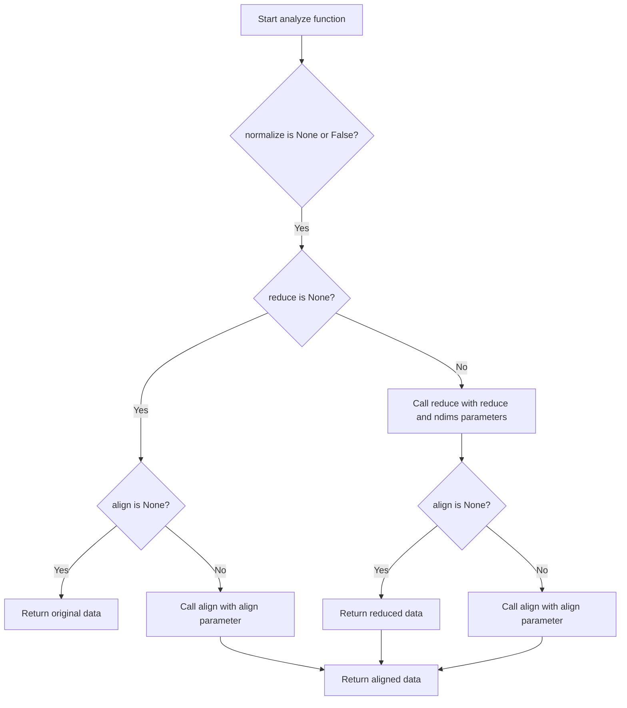

# `analyze.py`

## `hypertools.tools.analyze.analyze` · *function*

## Summary:
Applies a sequence of data processing transformations (normalization, dimensionality reduction, and alignment) to neuroimaging data for analysis.

## Description:
The analyze function serves as a high-level interface that orchestrates a pipeline of data preprocessing steps including normalization, dimensionality reduction, and alignment. It provides a convenient way to apply multiple transformations to neuroimaging data in a standardized order. This function extracts the core data processing logic into a reusable component, enabling consistent preprocessing across different analysis workflows while maintaining flexibility in transformation parameters.

The function internally calls three processing functions in sequence: first normalization, then dimensionality reduction, and finally alignment. These functions are imported from the respective modules but are called with specific parameter patterns that differ from their standalone usage.

## Args:
    data: Input neuroimaging data represented as a list of numpy arrays, each with shape (samples, features)
    normalize: Normalization strategy ('across', 'within', 'row') or None to skip normalization. Defaults to None
    reduce: Dimensionality reduction method or None to skip reduction. Defaults to None
    ndims: Target number of dimensions for reduction. Defaults to None
    align: Alignment method ('hyper', 'SRM') or None to skip alignment. Defaults to None
    internal: Boolean flag controlling internal processing behavior. Defaults to False

## Returns:
    list: Processed neuroimaging data after applying all requested transformations. All arrays will have consistent shapes.

## Raises:
    ValueError: When invalid normalization, reduction, or alignment parameters are provided
    KeyError: When unsupported reduction model names are specified
    AttributeError: When custom reduction models lack required methods

## Constraints:
    Precondition: Input data must be a list of numpy arrays with compatible dimensions
    Precondition: All data arrays should have the same number of features (columns)
    Postcondition: Output data arrays will have consistent shapes after processing

## Side Effects:
    Issues deprecation warnings when using deprecated parameters (normalize, align, reduce)
    May modify data through preprocessing steps during normalization, reduction, and alignment
    Calls external functions (normalize, reduce, align) that may issue their own warnings

## Control Flow:


## Examples:
```python
import numpy as np
from hypertools.tools.analyze import analyze

# Basic usage with all transformations
data = [np.random.rand(100, 50), np.random.rand(120, 50)]
processed_data = analyze(data, normalize='across', reduce='IncrementalPCA', ndims=10, align='hyper')

# Simple normalization only
normalized_data = analyze(data, normalize='within')

# Dimensionality reduction only
reduced_data = analyze(data, reduce='IncrementalPCA', ndims=20)

# Alignment only
aligned_data = analyze(data, align='SRM')
```

