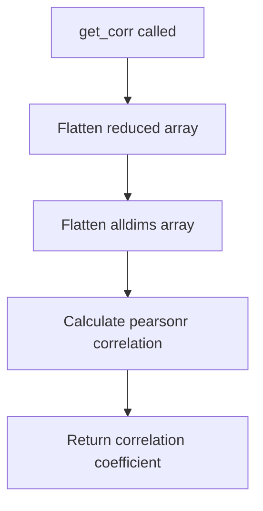

# `describe.py`

## `hypertools.tools.describe.describe` · *function*

## Summary:
Analyzes the relationship between high-dimensional data and its dimensionality-reduced representations by computing correlations across varying numbers of components.

## Description:
The describe function evaluates how well different dimensionality reduction techniques preserve the original data structure by calculating correlations between the full-dimensional data and its reduced representations. It computes these correlations for increasing numbers of components and can optionally display the results visually. This analysis helps determine optimal dimensionality for data representation while maintaining structural integrity.

## Args:
    x (array-like): Input data to analyze, which can be a single dataset or a list of datasets.
    reduce (str, optional): Dimensionality reduction technique to use. Defaults to 'IncrementalPCA'.
    max_dims (int, optional): Maximum number of dimensions to test. If None, automatically determined based on data shape.
    show (bool, optional): Whether to display the correlation results as a plot. Defaults to True.
    format_data (bool, optional): Whether to preprocess input data using format_data function. Defaults to True.

## Returns:
    dict: A dictionary containing:
        - 'average': List of correlation coefficients for the entire dataset across different component counts
        - 'individual': List of correlation coefficients for each individual dataset in x (when x is a list)

## Raises:
    None explicitly raised by this function.

## Constraints:
    Preconditions:
        - Input data x must be convertible to numpy arrays
        - When x is a list, all elements should be compatible for processing
        - If max_dims is specified, it must be a positive integer greater than 1
        
    Postconditions:
        - Returns a dictionary with keys 'average' and 'individual'
        - All returned correlation values are between -1 and 1
        - When show=True, generates and displays a matplotlib plot

## Side Effects:
    - Issues a deprecation warning about computational time for large datasets
    - May display matplotlib plots when show=True
    - Calls external functions like format_data, reducer, and scipy functions

## Control Flow:
```mermaid
flowchart TD
    A[describe called] --> B[Check format_data flag]
    B --> C{format_data?}
    C -->|Yes| D[Call format_data(x, ppca=True)]
    C -->|No| E[Skip formatting]
    D --> F[Initialize result dict]
    E --> F
    F --> G[Call summary(x, max_dims)]
    G --> H[Store average correlations]
    H --> I[Process individual datasets]
    I --> J[Call summary for each x_i]
    J --> K[Store individual correlations]
    K --> L{show?}
    L -->|Yes| M[Create plot with sns.tsplot]
    L -->|No| N[Skip plotting]
    M --> O[Return result dict]
    N --> O
```

## Examples:
```python
# Basic usage with single dataset
import numpy as np
data = np.random.rand(100, 10)
result = describe(data)

# With custom reduction method and visualization disabled
result = describe(data, reduce='PCA', show=False)

# With multiple datasets
datasets = [np.random.rand(50, 5), np.random.rand(75, 5)]
result = describe(datasets)
```

## `hypertools.tools.describe.get_corr` · *function*

## Summary:
Computes the Pearson correlation coefficient between flattened reduced and all-dimensions data arrays.

## Description:
Calculates the linear correlation between two flattened numpy arrays using Pearson's correlation coefficient. This function serves as a utility for measuring the relationship between dimensionality-reduced data and the original high-dimensional data. It extracts only the correlation coefficient from the scipy.stats.pearsonr result, ignoring the p-value.

## Args:
    reduced (array-like): The dimensionality-reduced data array that has been processed through a reduction technique.
    alldims (array-like): The original high-dimensional data array before any reduction.

## Returns:
    float: The Pearson correlation coefficient between the flattened arrays, ranging from -1 to 1. A value of 1 indicates perfect positive linear correlation, -1 indicates perfect negative linear correlation, and 0 indicates no linear correlation.

## Raises:
    ValueError: If the input arrays contain invalid data or have insufficient observations for correlation calculation. This can occur when arrays are empty, contain non-numeric values, or have fewer than two elements.

## Constraints:
    Preconditions:
        - Both input arrays must be convertible to numpy arrays
        - Arrays must have compatible shapes for flattening operations
        - Input arrays should contain numeric data
    
    Postconditions:
        - Returns a float value in the range [-1, 1]
        - Function execution is deterministic for identical inputs

## Side Effects:
    None

## Control Flow:


## Examples:
```python
# Basic usage
import numpy as np
from hypertools.tools.describe import get_corr

# Create sample data
reduced_data = np.array([[1, 2], [3, 4]])
all_dims_data = np.array([[2, 4], [6, 8]])

# Calculate correlation
correlation = get_corr(reduced_data, all_dims_data)
print(correlation)  # Should output 1.0 (perfect positive correlation)

# With negative correlation
reduced_data = np.array([[1, 2], [3, 4]])
all_dims_data = np.array([[10, 8], [6, 4]])

correlation = get_corr(reduced_data, all_dims_data)
print(correlation)  # Should output -1.0 (perfect negative correlation)
```

## `hypertools.tools.describe.get_cdist` · *function*

## Summary:
Computes the pairwise Euclidean distances between all rows in the input array.

## Description:
This function calculates the condensed distance matrix representing pairwise Euclidean distances between all samples in the input data. It serves as a utility wrapper around scipy's cdist function, specifically configured for pairwise distance computation between identical datasets.

## Args:
    x (array-like): Input data array of shape (n_samples, n_features) where distances are computed between all pairs of samples.

## Returns:
    ndarray: A symmetric distance matrix of shape (n_samples, n_samples) where element (i,j) represents the Euclidean distance between sample i and sample j.

## Raises:
    None explicitly raised by this function.

## Constraints:
    Preconditions:
        - Input x must be convertible to a numpy array
        - Input x should have at least one sample (n_samples >= 1)
        - Input x should have at least one feature (n_features >= 1)
    
    Postconditions:
        - Output matrix is symmetric (distance(i,j) = distance(j,i))
        - Diagonal elements are zero (distance(i,i) = 0)
        - Output shape is (n_samples, n_samples)

## Side Effects:
    None.

## Control Flow:
```mermaid
flowchart TD
    A[Input x] --> B[cdist(x, x)]
    B --> C[Return distance matrix]
```

## Examples:
```python
# Basic usage with 3 samples
x = [[1, 2], [3, 4], [5, 6]]
distances = get_cdist(x)
# Returns a 3x3 symmetric matrix with Euclidean distances

# Usage with numpy array
import numpy as np
x = np.array([[0, 0], [1, 1], [2, 2]])
distances = get_cdist(x)
# Computes pairwise distances between the three points
```

