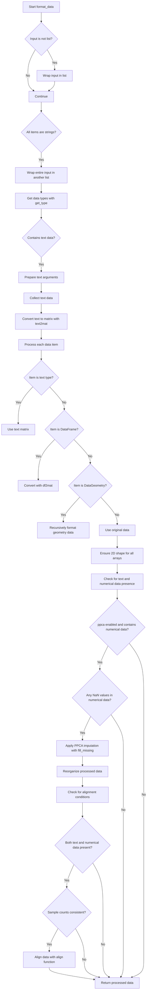

# `format_data.py`

## `hypertools.tools.format_data.format_data` · *function*

## Summary:
Formats mixed-type data (text, numerical, and geometric) into a standardized numerical representation suitable for downstream analysis and visualization.

## Description:
The `format_data` function serves as a data preprocessing pipeline that standardizes heterogeneous input data into uniform numerical matrices. It handles various data types including text (strings/lists of strings), numerical data (lists, arrays, DataFrames), and geometric data (DataGeometry objects). The function orchestrates the conversion of these diverse data types into a consistent format that can be processed by subsequent analysis tools. It also manages special cases such as missing data imputation using PPCA, and alignment of numerical and text data when both are present.

## Args:
    x (any): Input data that can be a single item or list of items. Supports strings, lists of strings, numerical data (lists, arrays, DataFrames), and DataGeometry objects.
    vectorizer (str, optional): Text vectorization method to use. Defaults to 'CountVectorizer'.
    semantic (str, optional): Semantic modeling method to use. Defaults to 'LatentDirichletAllocation'.
    corpus (str, optional): Pre-defined corpus name for training models. Defaults to 'wiki'.
    ppca (bool, optional): Whether to apply PPCA for missing data imputation. Defaults to True.
    text_align (str, optional): Alignment method for text data. Defaults to 'hyper'.

## Returns:
    list: List of numerical numpy arrays representing the formatted data. Each element corresponds to a processed input item, with consistent numerical representation.

## Raises:
    None explicitly raised in the function body.

## Constraints:
    Precondition: Input data must be compatible with the `get_type` function for proper categorization.
    Precondition: When using alignment, all input data must have consistent sample counts.
    Postcondition: All returned arrays will be 2D numerical matrices suitable for analysis.

## Side Effects:
    Issues warnings for missing data imputation via PPCA and data alignment operations.
    May perform I/O operations when loading pre-trained models from example datasets.
    Modifies the state of vectorization and semantic models in-place during fitting operations.

## Control Flow:


## Examples:
    # Format single text string
    result = format_data("Hello world")
    # Returns: [array([[...]])] - numerical representation of text
    
    # Format mixed data types
    text_data = ["Hello world", "Foo bar"]
    numeric_data = [[1, 2, 3], [4, 5, 6]]
    result = format_data([text_data, numeric_data])
    # Returns: [text_matrix, numeric_matrix] - both in numerical form
    
    # Format DataGeometry object
    geo_obj = DataGeometry(["text1", "text2"])
    result = format_data(geo_obj)
    # Returns: [formatted_text_matrix] - processed from geometry object

## `hypertools.tools.format_data.fill_missing` · *function*

## Summary:
Fills missing data points in a dataset using probabilistic principal component analysis (PPCA) and returns the transformed data with missing rows properly handled.

## Description:
This function applies probabilistic principal component analysis to handle datasets containing missing values (represented as NaN). It fits a PPCA model to the stacked input data, transforms it into a lower-dimensional space, and then identifies and preserves rows that were entirely missing in the original data. The function is designed to work with lists of arrays or matrices, splitting the results appropriately when multiple input arrays are provided.

## Args:
    x (list): A list of arrays/matrices that may contain NaN values representing missing data points.

## Returns:
    list: A list of transformed arrays with the same structure as the input, where missing rows have been preserved as NaN rows in the transformed space.

## Raises:
    RuntimeError: When the underlying PPCA transform method is called before fitting the model.

## Constraints:
    - Preconditions: Input x must be a list of arrays/matrices that can be vertically stacked using np.vstack
    - Postconditions: Output will be a list of arrays with the same number of elements as input x, each containing the PPCA-transformed version of the corresponding input array

## Side Effects:
    - Uses the PPCA class from _externals.ppca for dimensionality reduction
    - May produce warnings from underlying PPCA implementation regarding convergence or numerical stability

## Control Flow:
```mermaid
flowchart TD
    A[Start fill_missing] --> B[Stack input data with np.vstack(x)]
    B --> C[Initialize PPCA model]
    C --> D[Fit PPCA model to stacked data]
    D --> E[Transform data with PPCA]
    E --> F[Find indices of all-NaN rows in stacked data]
    F --> G{Any all-NaN rows?}
    G -->|Yes| H[Set corresponding transformed rows to NaN]
    G -->|No| I[Skip NaN handling]
    I --> J{Number of input arrays > 1?}
    J -->|Yes| K[Calculate split points using np.cumsum]
    K --> L[Split transformed data with np.split]
    J -->|No| M[Return transformed data as single-element list]
    L --> N[Return split list]
    H --> N
```

## Examples:
```python
# Basic usage with single array containing missing values
import numpy as np
data = [np.array([[1, 2], [np.nan, np.nan], [4, 5]])]
result = fill_missing(data)
# Returns list with one array, where the second row is NaN

# Usage with multiple arrays
data = [
    np.array([[1, 2], [3, 4]]),
    np.array([[np.nan, np.nan], [5, 6]])
]
result = fill_missing(data)
# Returns list with two arrays, preserving the all-NaN row in the second array

# Usage with all rows missing in one array
data = [
    np.array([[1, 2], [3, 4]]),
    np.array([[np.nan, np.nan], [np.nan, np.nan]])
]
result = fill_missing(data)
# Returns list with two arrays, where the second array has two NaN rows
```

