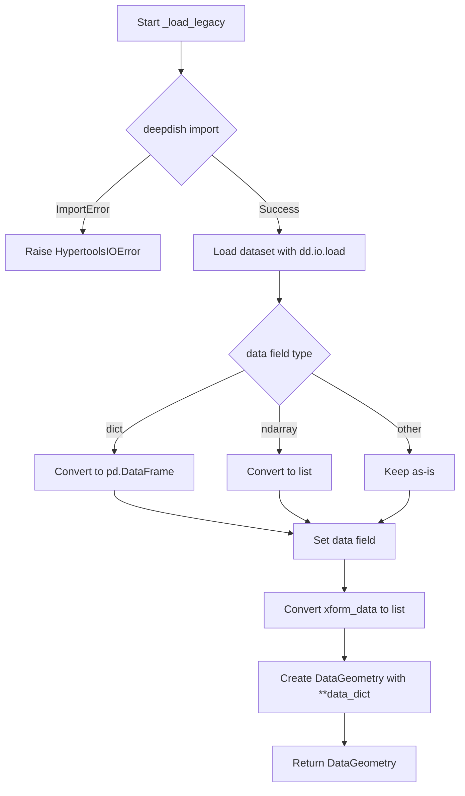

# `load.py`

## `hypertools.tools.load.load` · *function*

## Summary:
Loads and optionally processes dataset files or example datasets for analysis and visualization in hypertools.

## Description:
The `load` function provides a unified interface for loading datasets from local files or built-in example datasets. It supports both legacy and current file formats, handles automatic data type conversion, and can apply dimensionality reduction, alignment, and normalization transformations before returning results. This function abstracts away the complexities of file I/O, format detection, and data processing, providing a clean entry point for users to access datasets for analysis.

The function is designed to handle two distinct loading paths: example datasets that are pre-packaged with the library, and user-provided dataset files. It also supports backward compatibility with older hypertools versions through the `legacy` parameter.

## Args:
    dataset (str): Path to a dataset file or name of an example dataset. For example files, this should be a path that gets expanded using `expanduser` and `expandvars`. For example datasets, this should match a key in the global `EXAMPLE_DATA` dictionary.
    reduce (str or None, optional): Dimensionality reduction method to apply to the data. Defaults to None.
    ndims (int or None, optional): Target number of dimensions for reduction. Required when `reduce` is specified. Defaults to None.
    align (str or None, optional): Alignment method to apply to the data. Defaults to None.
    normalize (str or None, optional): Normalization method to apply to the data. Defaults to None.
    legacy (bool, optional): Flag indicating whether to load legacy-format files. Defaults to False.

## Returns:
    DataGeometry or list: If transformation parameters (`reduce`, `ndims`, `align`, `normalize`) are specified, returns a DataGeometry object containing the processed data and visualization metadata. Otherwise, returns a DataGeometry object containing the raw loaded data.

## Raises:
    HypertoolsIOError: When a dataset file cannot be found at the specified path, or when there are issues loading the dataset (e.g., corrupted pickle files, missing dependencies for legacy formats).

## Constraints:
    Preconditions:
        - The `dataset` argument must be a valid string representing either a file path or example dataset name.
        - If `legacy=True`, the file must be in the legacy deepdish format.
        - If transformation parameters are provided, they must be valid options supported by the underlying analysis functions.
        - The file path must resolve to an existing file when `dataset` refers to a file path.
    
    Postconditions:
        - If the dataset is an example dataset, it will be loaded from cache or downloaded if not available.
        - If the dataset is a file, it will be loaded using pickle or legacy format handling.
        - If transformation parameters are provided, the returned DataGeometry object will contain processed data ready for visualization.

## Side Effects:
    - May read files from the local filesystem.
    - May download example datasets from a remote server if not cached locally.
    - May create directories in the filesystem for caching example datasets.
    - May raise HypertoolsIOError if file operations fail or if the dataset cannot be loaded.

## Control Flow:
```mermaid
flowchart TD
    A[Start load function] --> B{dataset in EXAMPLE_DATA?}
    B -- Yes --> C[Call _load_example_data(dataset)]
    B -- No --> D[Resolve dataset_path using expanduser/expandvars]
    D --> E{dataset_path.is_file()?}
    E -- No --> F[Raise HypertoolsIOError]
    E -- Yes --> G{legacy=True?}
    G -- Yes --> H[Call _load_legacy(dataset_path)]
    G -- No --> I[Try pickle.loads(dataset_path.read_bytes())]
    I --> J{pickle.UnpicklingError?}
    J -- Yes --> K[Raise HypertoolsIOError]
    J -- No --> L{geo_data.data is dict?}
    L -- Yes --> M[Convert geo_data.data to pd.DataFrame]
    M --> N[Set geo_data.data]
    N --> O[Check if any transformation parameters provided]
    O -- Yes --> P[Import plot function]
    P --> Q[Set reduce = reduce or 'IncrementalPCA']
    Q --> R[Call analyze with geo_data.get_data()]
    R --> S[Call plot with analyzed data]
    S --> T[Return plot result]
    O -- No --> U[Return geo_data]
```

## Examples:
```python
# Load an example dataset
data = load('spiral')

# Load a user dataset file
data = load('/path/to/my_dataset.geo')

# Load with transformations applied
processed_data = load('spiral', reduce='IncrementalPCA', ndims=2)

# Load legacy dataset
legacy_data = load('/path/to/legacy_dataset.h5', legacy=True)
```

## `hypertools.tools.load._load_legacy` · *function*

## Summary:
Loads legacy-format dataset files saved with deepdish and converts them into DataGeometry objects for analysis and visualization.

## Description:
This internal utility function handles loading of legacy dataset files that were previously saved using the deepdish library format. It performs the necessary data type conversions to ensure compatibility with the current DataGeometry class structure. The function is automatically invoked by the hypertools loading system when encountering legacy dataset files, providing seamless backward compatibility for older datasets.

## Args:
    dataset_path (str): Absolute or relative path to the legacy-format dataset file to be loaded.

## Returns:
    DataGeometry: A DataGeometry object containing the loaded data and transformation information from the legacy dataset. The object will have properly formatted 'data' and 'xform_data' fields compatible with hypertools analysis workflows.

## Raises:
    HypertoolsIOError: Raised when the 'deepdish' module is not installed, preventing loading of legacy-format datasets.

## Constraints:
    Preconditions:
        - The dataset_path must point to a valid file that was saved in legacy deepdish format
        - The file must contain a dictionary with 'data' and 'xform_data' keys
        - The 'data' field must be either a dictionary, numpy array, or list-like structure
        - The 'xform_data' field must be a list-like structure
    
    Postconditions:
        - The returned DataGeometry object will have properly formatted data and xform_data fields
        - The data field will be converted to either a pandas DataFrame (for dict input) or list (for array input)
        - The xform_data field will be converted to a list

## Side Effects:
    - Reads data from the filesystem at the specified dataset_path
    - Dynamically imports the deepdish module when called

## Control Flow:


## Examples:
```python
# Load a legacy dataset file for analysis
loaded_data = _load_legacy('/path/to/legacy_dataset.h5')

# The returned DataGeometry object can be used for further analysis
transformed_data = loaded_data.transform()  # Apply transformations
plot_result = loaded_data.plot()           # Create visualizations
```

## `hypertools.tools.load._load_example_data` · *function*

## Summary:
Loads example datasets from local cache or downloads them from a remote server if not available.

## Description:
This function provides a mechanism to load example datasets used within the hypertools library. It first checks if the requested dataset exists locally in the DATA_DIR directory. If not found, it creates the directory (if needed) and downloads the dataset from a remote server using the internal `_download_example_data` function. The function then deserializes the dataset using pickle and performs any necessary post-processing for specific datasets like 'mushrooms'. This function abstracts away the complexity of local caching and remote downloading, providing a clean interface for accessing example datasets.

## Args:
    dataset (str): Name of the dataset to load. This corresponds to a filename in the DATA_DIR directory and must match a key in the global EXAMPLE_DATA dictionary.

## Returns:
    DataGeometry: A DataGeometry object containing the loaded dataset. For the 'mushrooms' dataset specifically, the raw data is converted to a pandas DataFrame.

## Raises:
    HypertoolsIOError: When the dataset cannot be loaded due to file corruption, I/O errors, or network issues during download. The error message provides guidance on clearing the cache.

## Constraints:
    Preconditions:
        - The dataset parameter must be a valid string representing a known dataset name.
        - The global DATA_DIR constant must be properly defined and accessible.
        - The global EXAMPLE_DATA dictionary must contain the dataset name as a key.
        - The global BASE_URL constant must be defined for remote downloads.
    
    Postconditions:
        - If successful, returns a DataGeometry object with the requested dataset.
        - If the dataset is not found locally, it will be downloaded and cached for future use.

## Side Effects:
    - May create directories in the filesystem if they don't exist.
    - May download files from a remote server via HTTP requests.
    - May write files to the local filesystem in the DATA_DIR directory.
    - May raise HypertoolsIOError if download or file operations fail.

## Control Flow:
```mermaid
flowchart TD
    A[Start _load_example_data] --> B[Construct dataset_path from DATA_DIR and dataset]
    B --> C{Is dataset_path a file?}
    C -- No --> D{Is DATA_DIR a directory?}
    D -- No --> E[Create DATA_DIR directory]
    E --> F[Call _download_example_data(dataset_path)]
    C -- Yes --> G[Load data from dataset_path using pickle]
    G --> H{Exception during pickle load?}
    H -- Yes --> I[Raise HypertoolsIOError]
    H -- No --> J{Is dataset 'mushrooms'?}
    J -- Yes --> K[Convert geo_data.data to pandas DataFrame]
    J -- No --> L[Return geo_data]
    K --> L
```

## Examples:
```python
# Load the mushrooms dataset
from hypertools.tools.load import _load_example_data
data_geometry = _load_example_data('mushrooms')

# Load another example dataset
data_geometry = _load_example_data('iris')
```

## `hypertools.tools.load._download_example_data` · *function*

## Summary:
Downloads example datasets from a remote server to a local file path.

## Description:
This function retrieves example datasets from a remote server using HTTP requests and saves them locally. It handles Google Drive-style download warnings by parsing cookies and making additional requests when needed. The function is part of the hypertools library's data loading utilities and is typically used internally to fetch example datasets for demonstration or testing purposes.

## Args:
    dataset_path (Path): The local file path where the downloaded dataset should be saved. The filename must correspond to a key in the global EXAMPLE_DATA dictionary.

## Returns:
    None: This function does not return any value.

## Raises:
    HypertoolsIOError: Raised when the download fails due to network issues, server errors, or invalid responses. The original exception is chained to provide additional context.

## Constraints:
    Preconditions:
        - The dataset_path must be a valid Path object pointing to a writable location.
        - The dataset_path.name must exist as a key in the global EXAMPLE_DATA dictionary.
        - The global BASE_URL constant must be defined and point to a valid download server.
    
    Postconditions:
        - If successful, the file at dataset_path will contain the downloaded dataset.
        - If unsuccessful, the file at dataset_path will be deleted (if it existed).

## Side Effects:
    - Makes an HTTP GET request to a remote server using the requests library.
    - Writes data to a local file on disk.
    - May delete a local file if the download fails.

## Control Flow:
```mermaid
flowchart TD
    A[Start _download_example_data] --> B[Get file_id from EXAMPLE_DATA using dataset_path.name]
    B --> C[Create requests.Session()]
    C --> D[Set params with file_id]
    D --> E[Make GET request to BASE_URL]
    E --> F{Contains download_warning cookie?}
    F -- Yes --> G[Update params with confirmation value]
    G --> H[Make second GET request]
    F -- No --> H
    H --> I[Open dataset_path for writing in binary mode]
    I --> J[Iterate over response chunks]
    J --> K{Chunk is not empty?}
    K -- Yes --> L[Write chunk to file]
    K -- No --> M[Skip empty chunk]
    J --> N[Loop until all chunks processed]
    N --> O[Close file]
    O --> P[Return]
    E --> Q[Exception caught]
    Q --> R[Delete dataset_path if exists]
    R --> S[Raise HypertoolsIOError]
```

## Examples:
```python
from pathlib import Path
from hypertools.tools.load import _download_example_data

# Download a sample dataset
dataset_path = Path("sample_data.h5")
_download_example_data(dataset_path)
```

