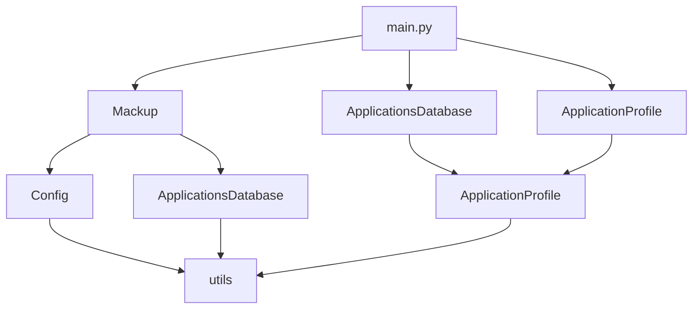

# `mackup`

## Repository-Level Documentation: Mackup

### Tree Structure
```
mackup/
├── application.py     # Manages individual application configuration file operations
├── appsdb.py          # Handles application metadata and configuration file mappings
├── config.py          # Parses and validates Mackup configuration files
├── mackup.py          # Orchestrates overall backup/restore workflow
├── main.py            # Command-line interface entry point
└── utils.py           # Utility functions for file operations and system checks
```

### Purpose
Mackup is a configuration management tool that synchronizes application settings between a user's home directory and backup storage. It enables users to back up, restore, and uninstall application configurations seamlessly across different platforms and storage providers.

Target users include developers and power users who want to maintain consistent application settings across machines or preserve their configuration preferences during system migrations. The tool is particularly valuable for those using cloud storage services like Dropbox, Google Drive, or local filesystems for configuration backup.

In the broader ecosystem, Mackup serves as a standalone configuration management utility that integrates with existing development workflows and system administration practices. It operates as a command-line tool that can be incorporated into automated deployment scripts or manual system maintenance routines.

### Architecture


The system follows a modular architecture pattern with clear separation of concerns:
- **Configuration Layer**: Handles user preferences and storage engine settings
- **Database Layer**: Manages application metadata and file mappings
- **Core Logic Layer**: Coordinates backup/restore operations
- **Application Layer**: Handles individual application file synchronization
- **Utility Layer**: Provides supporting functions for file operations and validation

### Entry Points
1. **CLI Command**: `mackup [command]`
   - Exposes backup, restore, uninstall, list, and show operations
   - Accepts flags like --force, --root, --dry-run, --verbose
   - Target audience: End users managing configuration files

2. **Importable API**: Direct module imports
   - `from mackup import Mackup, ApplicationsDatabase, ApplicationProfile`
   - Target audience: Developers building tools that integrate with Mackup

### Core Features
1. **Backup Operations** - Copies application configuration files to backup storage and creates symbolic links
2. **Restore Operations** - Links backup files back to the user's home directory
3. **Uninstall Operations** - Reverts all configuration files to their original state
4. **Application Discovery** - Automatically detects supported applications from configuration files
5. **Cross-Platform Support** - Works on Linux and macOS systems
6. **Multiple Storage Engines** - Supports Dropbox, Google Drive, Copy, iCloud, and local filesystem backups

### Dependencies
- **Internal Dependencies**: 
  - `config` - Configuration file parsing and validation
  - `appsdb` - Application metadata management
  - `application` - Individual application file operations
  - `utils` - Supporting utility functions

- **External Dependencies**:
  - `argparse` - Command-line argument parsing
  - `configparser` - INI-style configuration file parsing
  - `docopt` - Command-line interface specification
  - `os`, `platform`, `shutil`, `sqlite3`, `subprocess`, `sys`, `tempfile` - Standard library modules for system operations

### Configuration
Mackup uses configuration files stored in `$HOME/.mackup.cfg` to define storage engines, backup paths, and application preferences. Users can specify which applications to sync or ignore through dedicated configuration sections.

### Extension Points
1. **Plugin Architecture**: New applications can be added by creating `.cfg` files in the applications directory
2. **Storage Engines**: Custom storage backends can be implemented by extending the core storage logic
3. **Application Profiles**: New application support can be added by defining configuration files
4. **Custom Commands**: Additional CLI commands can be integrated through the main module extension points

---

## Modules

- [`mackup`](mackup.md)

