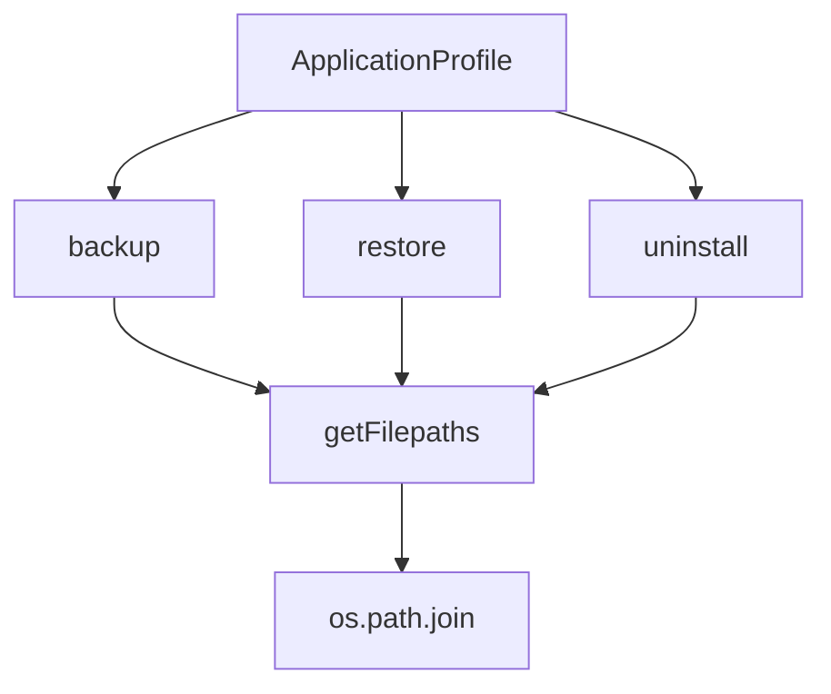

# `application.py`

## `mackup.application.ApplicationProfile` · *class*

## Summary:
Manages application configuration files by synchronizing them between the user's home directory and the Mackup backup storage through backup, restore, and uninstall operations.

## Description:
The ApplicationProfile class orchestrates the synchronization of application configuration files between the user's home directory and the Mackup backup storage. It implements three primary operations: backup (copies files to backup storage and creates symbolic links), restore (links backup files to the home directory), and uninstall (reverts files to their original state). This class serves as a distinct abstraction for handling application-specific file management operations, ensuring proper file handling through symbolic links and maintaining consistency between local and backup configurations.

## State:
- mackup (Mackup): Reference to the main Mackup instance containing configuration and storage paths
- files (list): List of file paths (relative to home directory) that belong to this application profile
- dry_run (bool): Flag indicating whether operations should be simulated without making changes
- verbose (bool): Flag indicating whether detailed operation information should be printed

## Lifecycle:
- Creation: Instantiate with a Mackup object, set of file paths, and boolean flags for dry-run and verbose modes
- Usage: Call backup(), restore(), or uninstall() methods to synchronize application files between home and backup directories
- Destruction: No explicit cleanup required; relies on garbage collection

## Method Map:


## Raises:
- AssertionError: When mackup parameter is not an instance of Mackup class
- AssertionError: When files parameter is not a set
- ValueError: When encountering unsupported file types during backup operations

## Example:
```python
# Create an application profile
mackup_instance = Mackup()
files = {"config/app.conf", "data/settings.json"}
profile = ApplicationProfile(mackup_instance, files, dry_run=False, verbose=True)

# Back up application files to Mackup storage
profile.backup()

# Restore application files from Mackup storage
profile.restore()

# Uninstall application files (revert to original state)
profile.uninstall()
```

### `mackup.application.ApplicationProfile.__init__` · *method*

## Summary:
Initializes an ApplicationProfile instance with configuration and file tracking parameters.

## Description:
This method sets up the application profile by storing references to the Mackup instance, converting the set of files to a list, and storing boolean flags for dry-run and verbose modes. It serves as the constructor for the ApplicationProfile class, establishing the initial state required for application management operations.

## Args:
    mackup (Mackup): An instance of the Mackup class containing configuration and state for the application.
    files (set): A set of file paths to be managed by this application profile.
    dry_run (bool): Flag indicating whether operations should be performed in simulation mode without actual changes.
    verbose (bool): Flag indicating whether detailed logging output should be enabled.

## Returns:
    None: This method does not return a value.

## Raises:
    AssertionError: If mackup is not an instance of Mackup class.
    AssertionError: If files is not a set.

## State Changes:
    Attributes READ: None
    Attributes WRITTEN: self.mackup, self.files, self.dry_run, self.verbose

## Constraints:
    Preconditions:
        - mackup must be an instance of the Mackup class
        - files must be a set type
    Postconditions:
        - self.mackup is assigned the provided Mackup instance
        - self.files is assigned as a list conversion of the provided files set
        - self.dry_run is assigned the provided boolean flag
        - self.verbose is assigned the provided boolean flag

## Side Effects:
    None: This method performs no I/O operations or external service calls.

### `mackup.application.ApplicationProfile.getFilepaths` · *method*

*No documentation generated.*

### `mackup.application.ApplicationProfile.backup` · *method*

## Summary:
Backs up application configuration files from the user's home directory to the Mackup backup storage, creating symbolic links in their place.

## Description:
This method iterates through all tracked files for an application profile and performs backup operations. It handles various file states including regular files, directories, and symbolic links, ensuring proper backup and restoration workflow. The method is designed to be called during the backup process of a specific application profile.

Known callers:
- Called during the main backup process when processing individual application profiles
- Invoked by the Mackup.backup() method as part of the overall backup pipeline

This logic is separated into its own method to encapsulate the complex file handling and backup decision-making process for individual application profiles, making the backup process modular and easier to test.

## Args:
    None

## Returns:
    None

## Raises:
    ValueError: When encountering an unsupported file type in the backup destination

## State Changes:
    Attributes READ: self.files, self.verbose, self.dry_run, self.mackup
    Attributes WRITTEN: None

## Constraints:
    Preconditions: 
    - The ApplicationProfile instance must have a valid mackup attribute pointing to a Mackup instance
    - The self.files list must contain valid file paths
    - The Mackup instance must have a properly initialized mackup_folder
    Postconditions:
    - Files in the home directory are either backed up to the Mackup storage or left unchanged
    - Symbolic links are created in the home directory pointing to the backed-up files
    - The backup operation respects dry-run mode when enabled

## Side Effects:
    - I/O operations including file copying, deletion, and symbolic link creation
    - User interaction via console prompts when confirming overwrites
    - Potential modification of the filesystem in the user's home directory
    - Temporary file operations during backup process

