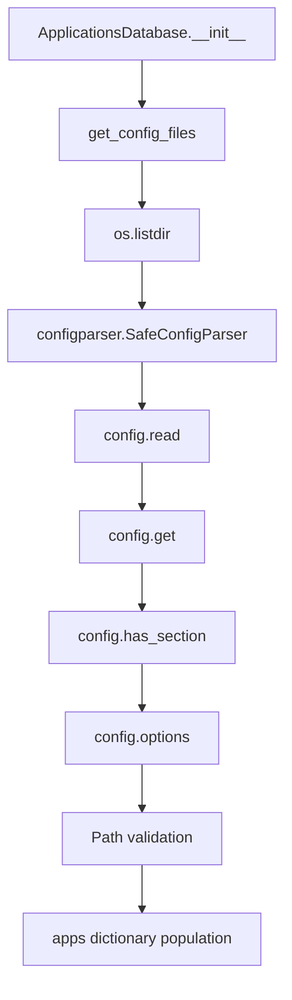

# `appsdb.py`

## `mackup.appsdb.ApplicationsDatabase` · *class*

## Summary:
Manages a database of application configurations by parsing configuration files from predefined directories.

## Description:
The ApplicationsDatabase class serves as a centralized registry for application metadata and their associated configuration file paths. It loads configuration data from .cfg files located in both the standard applications directory and a user-customizable directory. This abstraction allows other parts of the system to query application names and their configuration file requirements without directly handling file I/O or parsing logic.

The class is designed to be instantiated once during application startup and provides read-only access to application metadata throughout the program's lifecycle.

## State:
- apps (dict): A dictionary mapping application names (str) to dictionaries containing:
  - name (str): The human-readable name of the application
  - configuration_files (set): A set of relative file paths to configuration files
- The constructor reads configuration files and populates this dictionary during initialization

## Lifecycle:
- Creation: Instantiate without arguments; the constructor automatically discovers and parses configuration files from APPS_DIR and CUSTOM_APPS_DIR
- Usage: Call getter methods like get_name(), get_files(), get_app_names(), and get_pretty_app_names() to retrieve application data
- Destruction: No explicit cleanup required; relies on Python's garbage collection

## Method Map:


## Raises:
- ValueError: When encountering absolute paths in configuration files or invalid $XDG_CONFIG_HOME environment variable values
- FileNotFoundError: When the standard applications directory does not exist

## Example:
```python
# Create database instance
db = ApplicationsDatabase()

# Get application names
app_names = db.get_app_names()

# Get configuration files for a specific app
files = db.get_files("vim")

# Get pretty application name
pretty_name = db.get_name("vim")
```

### `mackup.appsdb.ApplicationsDatabase.__init__` · *method*

## Summary:
Initializes the ApplicationsDatabase by loading and parsing application configuration files into an internal dictionary structure.

## Description:
This method builds the internal database of supported applications by scanning both built-in and custom application configuration directories. It reads .cfg files and extracts application metadata including human-readable names and associated configuration file paths. The method handles both standard configuration files and XDG-compliant configuration files, ensuring proper path normalization and validation.

This logic is encapsulated in its own method to separate the initialization concern from the class's other responsibilities, making the code more modular and testable. It's typically called during object instantiation to populate the database with available applications.

## Args:
    None

## Returns:
    None

## Raises:
    ValueError: When an absolute path is encountered in configuration_files or xdg_configuration_files sections
    ValueError: When $XDG_CONFIG_HOME is set to a location outside the user's home directory

## State Changes:
    Attributes READ: None
    Attributes WRITTEN: self.apps

## Constraints:
    Preconditions: 
    - The APPS_DIR and CUSTOM_APPS_DIR constants must be properly defined
    - Configuration files must follow the expected .cfg format with application and configuration_files sections
    - Environment variable HOME must be set
    Postconditions:
    - self.apps will contain a dictionary mapping application names to their configuration data
    - Each application entry will have 'name' and 'configuration_files' keys
    - All configuration file paths will be normalized relative to the home directory

## Side Effects:
    I/O operations: Reading configuration files from disk
    Environment interaction: Accessing $XDG_CONFIG_HOME environment variable
    Directory traversal: Scanning APPS_DIR and CUSTOM_APPS_DIR directories

### `mackup.appsdb.ApplicationsDatabase.get_config_files` · *method*

*No documentation generated.*

### `mackup.appsdb.ApplicationsDatabase.get_name` · *method*

*No documentation generated.*

### `mackup.appsdb.ApplicationsDatabase.get_files` · *method*

## Summary:
Retrieves the list of configuration file paths for a specified application from the database.

## Description:
This method accesses the internal applications database to retrieve the list of configuration files associated with a given application name. It acts as a getter method for application-specific configuration file metadata stored in the database.

## Args:
    name (str): The unique identifier or name of the application whose configuration files are to be retrieved.

## Returns:
    list[str]: A list of file paths representing the configuration files associated with the specified application.

## Raises:
    KeyError: If the specified application name does not exist as a key in the internal applications database.

## State Changes:
    Attributes READ: self.apps
    Attributes WRITTEN: None

## Constraints:
    Preconditions: The application name must exist as a key in the self.apps dictionary, and the corresponding value must be a dictionary containing a "configuration_files" key.
    Postconditions: The returned list is a direct reference to the internal storage of configuration files for the application.

## Side Effects:
    None

### `mackup.appsdb.ApplicationsDatabase.get_app_names` · *method*

## Summary:
Returns a set of all application names stored in the database.

## Description:
This method extracts and returns the names of all applications currently loaded in the ApplicationsDatabase instance. It provides a clean interface for accessing the collection of application identifiers without exposing the internal dictionary structure.

The method is called by other methods in the class such as `get_pretty_app_names()` which uses the returned app names to fetch their pretty names. This separation allows for better code organization and reuse of the app name extraction logic.

## Args:
    None

## Returns:
    set[str]: A set containing the names of all applications currently registered in the database.

## Raises:
    None

## State Changes:
    Attributes READ: self.apps
    Attributes WRITTEN: None

## Constraints:
    Preconditions: The `self.apps` attribute must be initialized as a dictionary (which occurs in `__init__`).
    Postconditions: The returned set contains all keys from `self.apps` and is independent of the internal data structure.

## Side Effects:
    None

### `mackup.appsdb.ApplicationsDatabase.get_pretty_app_names` · *method*

## Summary:
Returns a set of human-readable application names derived from the stored application configurations.

## Description:
This method retrieves all application names from the database and transforms them into their human-readable (pretty) form using the internal `get_name()` method. It serves as a convenience function to provide users with formatted application names rather than raw technical identifiers.

The method is called by higher-level components that need to display user-friendly application names in UI elements or reports. It encapsulates the logic for converting technical app names into their readable equivalents, making the code more maintainable and reusable.

## Args:
    None

## Returns:
    set[str]: A set containing the human-readable names of all applications currently registered in the database.

## Raises:
    KeyError: If an application name returned by `get_app_names()` does not exist in `self.apps` dictionary.
    AttributeError: If `self.apps` is not properly initialized or does not contain the expected structure.

## State Changes:
    Attributes READ: self.apps, self.get_app_names(), self.get_name()
    Attributes WRITTEN: None

## Constraints:
    Preconditions: The `self.apps` attribute must be properly initialized as a dictionary with application entries containing a "name" key.
    Postconditions: The returned set contains the pretty names of all applications and is independent of the internal data structure.

## Side Effects:
    None

