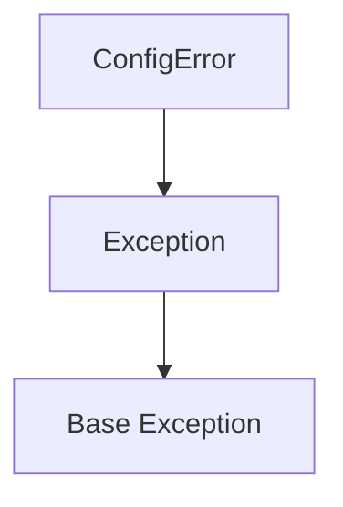

# `config.py`

## `mackup.config.Config` · *class*

*No documentation generated.*

### `mackup.config.Config.__init__` · *method*

## Summary:
Initializes a configuration object by parsing and validating the Mackup configuration file, setting up all internal state variables for storage engine, path, directory, and application filtering.

## Description:
This method serves as the primary constructor for the Config class, orchestrating the complete configuration parsing process. It initializes the configuration parser, validates for deprecated configurations, and extracts all relevant configuration parameters including storage engine, backup path, directory, and application filtering lists. This method is called during object instantiation to establish the complete configuration state.

## Args:
    filename (str, optional): Path to the configuration file to parse. If None, uses the default MACKUP_CONFIG_FILE constant. Defaults to None.

## Returns:
    None

## Raises:
    AssertionError: When filename argument is not a string or None.

## State Changes:
    Attributes READ: None
    Attributes WRITTEN: 
    - self._parser: Initialized with parsed configuration data
    - self._engine: Set to validated storage engine name
    - self._path: Set to resolved storage directory path
    - self._directory: Set to configured backup directory path
    - self._apps_to_ignore: Set to parsed list of applications to ignore
    - self._apps_to_sync: Set to parsed list of applications to sync

## Constraints:
    Preconditions: 
    - filename must be either a string or None
    - Configuration file must be readable if specified
    - All internal parsing methods must be properly implemented
    
    Postconditions:
    - All configuration parameters are parsed and validated
    - self._parser contains a valid configuration parser instance
    - All configuration state variables are properly initialized

## Side Effects:
    - Reads configuration file from disk
    - May call error utility function to terminate execution if deprecated config sections are detected
    - Calls various utility functions to resolve storage paths for different engine types

### `mackup.config.Config.engine` · *method*

## Summary:
Returns the string representation of the configuration's storage engine identifier.

## Description:
This method provides access to the internal `_engine` attribute, which represents the chosen backup storage engine (e.g., Dropbox, Google Drive, local filesystem). It ensures the engine identifier is returned as a string, making it easier to work with in downstream processes that require string-based engine specifications.

## Args:
    None

## Returns:
    str: The string representation of the storage engine identifier stored in `self._engine`.

## Raises:
    None

## State Changes:
    Attributes READ: self._engine
    Attributes WRITTEN: None

## Constraints:
    Preconditions: The `self._engine` attribute must be initialized before calling this method.
    Postconditions: The returned value is always a string representation of the engine identifier.

## Side Effects:
    None

### `mackup.config.Config.path` · *method*

## Summary:
Returns the string representation of the configured storage path for Mackup backups.

## Description:
This property method provides access to the parsed storage path configuration, which is determined during object initialization based on the selected storage engine. It serves as a convenient accessor for the internal `_path` attribute that was computed in the `_parse_path()` method.

## Args:
    None

## Returns:
    str: The absolute path to the storage location where Mackup backups are stored.

## Raises:
    None

## State Changes:
    Attributes READ: self._path
    Attributes WRITTEN: None

## Constraints:
    Preconditions: The Config object must have been initialized successfully, ensuring that `_path` has been set during the `_parse_path()` phase.
    Postconditions: The returned value is always a string representation of the path, ensuring consistency for downstream operations.

## Side Effects:
    None

### `mackup.config.Config.directory` · *method*

## Summary:
Returns the storage directory path as a string, ensuring consistent access to the configured backup directory location.

## Description:
This property provides read-only access to the storage directory configuration parsed during object initialization. It serves as a clean interface for retrieving the directory path where Mackup backups are stored, abstracting away the internal `_directory` attribute. The method ensures that the directory path is always returned as a string, providing a consistent interface regardless of how the underlying value was stored.

## Args:
    None

## Returns:
    str: The absolute path to the storage directory where Mackup backups are stored.

## Raises:
    None

## State Changes:
    Attributes READ: self._directory
    Attributes WRITTEN: None

## Constraints:
    Preconditions: The Config object must have been properly initialized with a valid `_directory` attribute.
    Postconditions: The returned value is always a string representation of the directory path.

## Side Effects:
    None

### `mackup.config.Config.fullpath` · *method*

## Summary:
Returns the absolute filesystem path by joining the configuration's base path with its directory name.

## Description:
This method constructs and returns the full filesystem path by combining the instance's path attribute with its directory attribute using os.path.join(). It serves as a utility for obtaining the complete location where backup files should be stored or retrieved from.

## Args:
    None

## Returns:
    str: The absolute filesystem path constructed by joining self.path and self.directory.

## Raises:
    None

## State Changes:
    Attributes READ: self.path, self.directory
    Attributes WRITTEN: None

## Constraints:
    Preconditions: Both self.path and self.directory must be valid string values.
    Postconditions: The returned value is always a string representing a valid filesystem path.

## Side Effects:
    None

### `mackup.config.Config.apps_to_ignore` · *method*

## Summary:
Returns a set of application names that should be ignored during backup operations.

## Description:
This method provides access to the internal list of applications configured to be excluded from the backup process. It returns a copy of the internal `_apps_to_ignore` attribute as a set to prevent direct modification of the internal state.

## Args:
    None

## Returns:
    set[str]: A set containing the names of applications that should be ignored during backup operations.

## Raises:
    None

## State Changes:
    Attributes READ: self._apps_to_ignore
    Attributes WRITTEN: None

## Constraints:
    Preconditions: The `_apps_to_ignore` attribute must be initialized as a list or similar iterable before this method is called.
    Postconditions: The returned set is independent of the internal `_apps_to_ignore` attribute, ensuring encapsulation.

## Side Effects:
    None

### `mackup.config.Config.apps_to_sync` · *method*

## Summary:
Returns a set of application names that are configured to be synchronized by the configuration.

## Description:
This method provides access to the collection of applications designated for synchronization. It serves as a controlled interface to the internal `_apps_to_sync` attribute, ensuring that modifications to the application list are properly encapsulated.

## Args:
    None

## Returns:
    set[str]: A set containing the names of applications configured for synchronization. The returned set is a copy of the internal storage, preventing direct modification of the configuration's application list.

## Raises:
    None

## State Changes:
    Attributes READ: self._apps_to_sync
    Attributes WRITTEN: None

## Constraints:
    Preconditions: The `self._apps_to_sync` attribute must be initialized as a list or similar iterable before this method is called.
    Postconditions: The returned set is independent of the internal `_apps_to_sync` list, ensuring that modifications to the returned set do not affect the configuration.

## Side Effects:
    None

### `mackup.config.Config._setup_parser` · *method*

## Summary:
Initializes and configures a configuration parser object for reading Mackup configuration files.

## Description:
This method sets up a SafeConfigParser instance with specific options for handling configuration files, including support for inline comments and values without explicit assignment. It reads the configuration file from the user's home directory and returns the configured parser object. This method is typically called during the initialization of the Config class to prepare the configuration parsing infrastructure.

## Args:
    filename (str, optional): The name of the configuration file to parse. If None, uses the default MACKUP_CONFIG_FILE constant.

## Returns:
    configparser.SafeConfigParser: A configured parser object ready to read the specified configuration file.

## Raises:
    None explicitly raised, though underlying file operations may raise IOError or OSError when accessing the configuration file.

## State Changes:
    Attributes READ: None
    Attributes WRITTEN: None

## Constraints:
    Preconditions: The filename parameter must be either a string or None.
    Postconditions: Returns a valid SafeConfigParser object with the specified file loaded.

## Side Effects:
    Reads from the filesystem by accessing the configuration file in the user's home directory.

### `mackup.config.Config._warn_on_old_config` · *method*

## Summary:
Checks for deprecated configuration sections and aborts execution if detected, preventing operation with outdated config files.

## Description:
This method validates the configuration file by scanning for deprecated sections that were used in older versions of Mackup. When deprecated sections like "Allowed Applications" or "Ignored Applications" are found, it calls the error utility function to display a detailed message and terminate execution. This validation occurs during the initialization of the Config class to ensure compatibility with current configuration formats.

## Args:
    None

## Returns:
    None

## Raises:
    None

## State Changes:
    Attributes READ: self._parser
    Attributes WRITTEN: None

## Constraints:
    Preconditions: The Config instance must have a valid _parser attribute containing parsed configuration data
    Postconditions: If deprecated sections are found, the program terminates via the error utility function; otherwise, no state changes occur

## Side Effects:
    I/O: Calls the error utility function which prints to stderr and exits the program

### `mackup.config.Config._parse_engine` · *method*

## Summary:
Parses and validates the storage engine configuration option, returning a standardized string representation of the selected engine.

## Description:
This method reads the storage engine setting from the configuration parser, defaults to Dropbox if not specified, validates that the engine is one of the supported options, and returns the validated engine name as a string. It serves as a centralized validation point for storage engine configuration.

## Args:
    None

## Returns:
    str: The validated storage engine name, one of: 'dropbox', 'google_drive', 'copy', 'icloud', or 'filesystem'

## Raises:
    ConfigError: When the configured engine is not one of the supported storage engines

## State Changes:
    Attributes READ: self._parser
    Attributes WRITTEN: None

## Constraints:
    Preconditions: 
    - self._parser must be initialized and contain a valid ConfigParser instance
    - The configuration must have a 'storage' section if the engine option is specified
    
    Postconditions:
    - Returns a string that is one of the predefined ENGINE_* constants
    - The returned string is guaranteed to be a valid storage engine identifier

## Side Effects:
    None

### `mackup.config.Config._parse_path` · *method*

## Summary:
Determines and returns the absolute path to the storage directory based on the configured synchronization engine.

## Description:
This method resolves the appropriate storage path for the currently configured engine type. It handles multiple cloud storage providers (Dropbox, Google Drive, Copy, iCloud) and the local filesystem engine. The method is responsible for translating engine-specific configuration into usable filesystem paths for backup operations.

## Args:
    self (Config): The Config instance containing engine configuration and parser state.

## Returns:
    str: The absolute path to the storage directory as a string.

## Raises:
    ConfigError: When the 'file_system' engine is used but the required 'path' option is missing from the configuration.

## State Changes:
    Attributes READ: self.engine, self._parser
    Attributes WRITTEN: None

## Constraints:
    Preconditions:
        - self.engine must be one of the defined engine constants (ENGINE_DROPBOX, ENGINE_GDRIVE, ENGINE_COPY, ENGINE_ICLOUD, ENGINE_FS)
        - For ENGINE_FS, self._parser must be initialized and contain a 'storage' section
    Postconditions:
        - Returns a valid absolute path string for the configured engine
        - For ENGINE_FS, raises ConfigError if 'path' option is missing

## Side Effects:
    - Calls external utility functions that may perform I/O operations to locate storage directories
    - May raise ConfigError which terminates execution if configuration is invalid

### `mackup.config.Config._parse_directory` · *method*

## Summary:
Parses and validates the storage directory configuration option, returning the appropriate directory path.

## Description:
This method retrieves the storage directory setting from the configuration parser, validates that it's not set to the custom apps directory, and returns the directory path as a string. It serves as a dedicated validation layer for directory configuration, separating concerns from the main configuration parsing logic.

## Args:
    None

## Returns:
    str: The storage directory path, either from the configuration or the default backup path.

## Raises:
    ConfigError: When the configured directory equals CUSTOM_APPS_DIR.

## State Changes:
    Attributes READ: self._parser
    Attributes WRITTEN: None

## Constraints:
    Preconditions: The object must have a valid _parser attribute containing configuration data.
    Postconditions: The returned directory path is guaranteed to be a string and not equal to CUSTOM_APPS_DIR.

## Side Effects:
    None

### `mackup.config.Config._parse_apps_to_ignore` · *method*

## Summary:
Parses and returns the set of application names configured to be ignored during backup operations.

## Description:
This method retrieves the list of applications specified in the configuration file under the "applications_to_ignore" section. It is designed to be a dedicated parsing method to isolate configuration handling logic and make the code more modular and testable. The method reads from the internal configuration parser and returns a set of application names that should be excluded from backup processes.

## Args:
    None

## Returns:
    set[str]: A set containing the names of applications to ignore during backup operations. Returns an empty set if the "applications_to_ignore" section is not present in the configuration.

## Raises:
    None

## State Changes:
    Attributes READ: self._parser
    Attributes WRITTEN: None

## Constraints:
    Preconditions: The instance must have a valid `_parser` attribute initialized with configuration data.
    Postconditions: The returned set contains only string values representing application names.

## Side Effects:
    None

### `mackup.config.Config._parse_apps_to_sync` · *method*

## Summary:
Parses and returns the set of application names configured to be synchronized in the applications_to_sync section of the configuration file.

## Description:
This method extracts application names from the "applications_to_sync" section of the configuration parser. It is designed to be a dedicated parsing utility that isolates the logic for reading application synchronization settings, making the configuration handling more modular and testable. This method is typically called during the initialization or loading phase of the configuration object to populate the list of applications that should be backed up.

## Args:
    None

## Returns:
    set[str]: A set of application names to synchronize, or an empty set if the section does not exist or contains no options.

## Raises:
    None

## State Changes:
    Attributes READ: self._parser
    Attributes WRITTEN: None

## Constraints:
    Preconditions: The instance must have a valid _parser attribute initialized with a configuration file containing the "applications_to_sync" section.
    Postconditions: The returned set contains only unique application names from the configuration section.

## Side Effects:
    None

## `mackup.config.ConfigError` · *class*

## Summary:
Represents an exception that occurs when there are configuration-related errors in the Mackup application.

## Description:
The ConfigError class is a custom exception that extends Python's built-in Exception class. It is specifically designed to handle errors that occur during configuration processing within the Mackup application. This exception is raised when the application encounters issues such as invalid configuration values, missing configuration sections, or problems with configuration file parsing. The class serves as a distinct abstraction to differentiate configuration-related failures from other types of exceptions in the system.

## State:
This class has no instance attributes or state variables. It inherits all behavior from the base Exception class.

## Lifecycle:
Creation: Instances of ConfigError are created by raising the exception directly with a descriptive message. No special instantiation methods are required.
Usage: The exception is typically raised during configuration validation or processing operations and propagated up the call stack to be handled by appropriate error handlers.
Destruction: As a standard Python exception, no explicit cleanup is required. The exception object is automatically destroyed when it goes out of scope.

## Method Map:


## Raises:
This class itself does not raise any exceptions. It is raised by other components in the system when configuration errors are encountered.

## Example:
```python
try:
    # Some configuration processing code
    if config_value is None:
        raise ConfigError("Configuration value cannot be None")
except ConfigError as e:
    print(f"Configuration error occurred: {e}")
```

