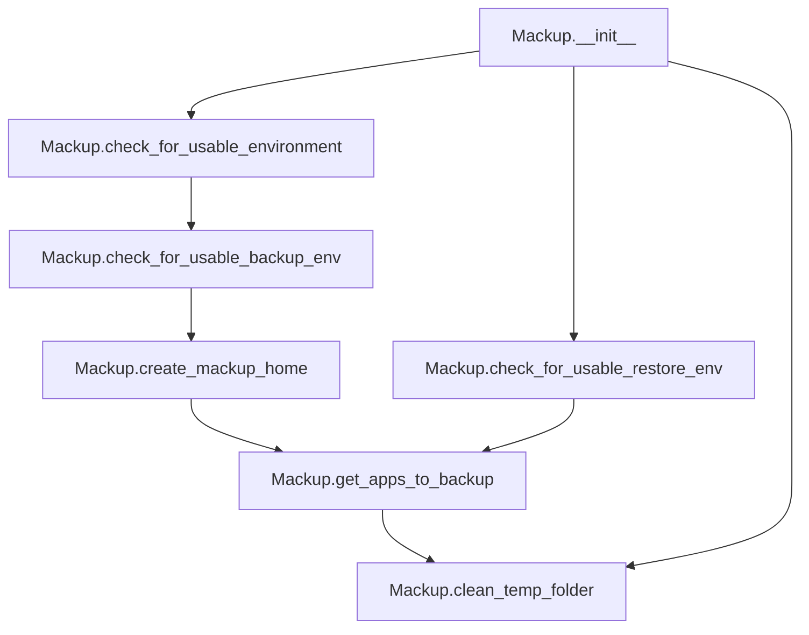

# `mackup.py`

## `mackup.mackup.Mackup` · *class*

## Summary:
Mackup is the core class that orchestrates backup and restore operations for application configurations, managing environment validation, temporary file handling, and application selection logic.

## Description:
The Mackup class serves as the central coordinator for all backup and restore activities in the Mackup system. It manages the lifecycle of backup operations by handling environment validation, temporary file management, and determining which applications should be included in backup operations. The class encapsulates the main workflow logic and provides methods for preparing the environment for backup or restore operations, creating necessary directories, and selecting applications to process.

This class acts as the primary interface for the backup/restore system, coordinating between various subsystems like configuration management, application databases, and user interaction utilities. It's designed to be instantiated once at the beginning of a Mackup session and used throughout the operation lifecycle.

## State:
- _config (config.Config): Configuration object holding storage engine, path, directory, and application preferences
- mackup_folder (str): Full path to the directory where Mackup stores configuration files
- temp_folder (str): Path to a temporary directory created for intermediate processing during operations

## Lifecycle:
- Creation: Instantiate without arguments; initializes configuration and creates a temporary directory
- Usage: Environment validation methods (`check_for_usable_environment`, `check_for_usable_backup_env`, `check_for_usable_restore_env`) can be called independently or in sequence, followed by application selection (`get_apps_to_backup`) and finally cleanup (`clean_temp_folder`)
- Destruction: Temporary directory is cleaned up via `clean_temp_folder()` method

## Method Map:


## Raises:
- SystemExit: Raised by various validation methods when environment conditions are not met or user interactions result in termination
- FileNotFoundError: Potentially raised by `clean_temp_folder()` if temporary directory doesn't exist
- PermissionError: Potentially raised by `clean_temp_folder()` if insufficient permissions to remove directory

## Example:
```python
# Initialize Mackup
mackup = Mackup()

# Validate environment for backup
mackup.check_for_usable_backup_env()

# Determine applications to backup
apps = mackup.get_apps_to_backup()

# Perform backup operations...

# Clean up temporary files
mackup.clean_temp_folder()
```

### `mackup.mackup.Mackup.__init__` · *method*

## Summary:
Initializes a Mackup instance by setting up configuration and temporary directories.

## Description:
This method initializes the Mackup class by creating a configuration object and establishing necessary directory paths. It sets up the main backup folder location from configuration and creates a temporary directory for intermediate operations. This method serves as the constructor logic for the Mackup class, preparing the object for subsequent backup operations.

## Args:
    None

## Returns:
    None

## Raises:
    None explicitly raised

## State Changes:
    Attributes READ: None
    Attributes WRITTEN: 
    - self._config: Assigned a new config.Config() instance
    - self.mackup_folder: Set to self._config.fullpath (the full path to the backup directory)
    - self.temp_folder: Set to the path returned by tempfile.mkdtemp() (a temporary directory for operations)

## Constraints:
    Preconditions:
    - The config module must be importable and contain a Config class
    - The tempfile module must be available for mkdtemp function
    - Environment variables like HOME should be properly set
    
    Postconditions:
    - self._config is initialized as a config.Config instance
    - self.mackup_folder contains the full path to the backup directory
    - self.temp_folder contains a valid temporary directory path

## Side Effects:
    - Creates a temporary directory using tempfile.mkdtemp()
    - May modify the filesystem by creating a new temporary directory

### `mackup.mackup.Mackup.check_for_usable_environment` · *method*

*No documentation generated.*

### `mackup.mackup.Mackup.check_for_usable_backup_env` · *method*

## Summary:
Validates the backup environment and ensures the Mackup home directory is created for storing configuration files.

## Description:
This method prepares the environment for backup operations by performing two key validations: first, it checks that the system environment is suitable for running Mackup (verifying proper permissions and storage directory existence), and second, it ensures the Mackup home directory exists for storing configuration files. This method is typically called before initiating backup processes to guarantee all prerequisites are met.

## Args:
    None

## Returns:
    None

## Raises:
    SystemExit: When environment validation fails due to improper permissions or missing storage directories, or when user declines to create the Mackup home directory.

## State Changes:
    Attributes READ: self._config.path, self.mackup_folder
    Attributes WRITTEN: None

## Constraints:
    Preconditions: The Mackup instance must be initialized with a valid _config attribute containing a path property, and the _config.fullpath property must be set.
    Postconditions: Either the environment is validated and the Mackup home directory exists, or the program exits with an error.

## Side Effects:
    I/O: Reads system environment variables (os.geteuid())
    I/O: Checks directory existence via os.path.isdir()
    I/O: May prompt user for confirmation via input() if directory creation is needed
    I/O: Creates directories via os.makedirs() if user confirms
    External service calls: None

### `mackup.mackup.Mackup.check_for_usable_restore_env` · *method*

## Summary:
Checks that the restore environment is usable by verifying the existence of the Mackup folder and the usability of the overall environment.

## Description:
This method ensures that the restore operation can proceed by validating two key conditions: first, that the overall environment is usable (via a call to `check_for_usable_environment`), and second, that the Mackup folder exists. It is designed to be called during the restore process to prevent operations on an incomplete or invalid setup. This method is part of the environment validation suite for restore operations.

## Args:
    None

## Returns:
    None

## Raises:
    SystemExit: When either the environment is not usable or the Mackup folder does not exist, via the `utils.error` function.

## State Changes:
    Attributes READ: 
        - self.mackup_folder
        - self._config.path
    Attributes WRITTEN: 
        - None

## Constraints:
    Preconditions:
        - The Mackup instance must have been initialized with a valid `mackup_folder` attribute.
        - The `_config` attribute must be properly set up with a valid `path` attribute.
    Postconditions:
        - If the method completes without raising an exception, the restore environment is considered usable.

## Side Effects:
    - I/O: Checks for directory existence using `os.path.isdir`
    - External service calls: None
    - Mutations to objects outside self: None

### `mackup.mackup.Mackup.clean_temp_folder` · *method*

## Summary:
Removes the temporary directory created by Mackup for storing intermediate files during backup or restore operations.

## Description:
This method is responsible for cleaning up the temporary folder that Mackup creates at initialization using `tempfile.mkdtemp`. It is called during the cleanup phase of Mackup's operations to ensure that temporary files don't persist on the filesystem after the process completes. The method is typically invoked after backup or restore operations are finished to maintain a clean environment.

## Args:
    None

## Returns:
    None

## Raises:
    FileNotFoundError: If the temporary folder specified by `self.temp_folder` does not exist.
    PermissionError: If the process lacks the necessary permissions to remove the temporary folder and its contents.
    OSError: If there is an OS-level error during the removal process, such as the directory being in use.

## State Changes:
    Attributes READ: self.temp_folder
    Attributes WRITTEN: None

## Constraints:
    Preconditions: The `self.temp_folder` attribute must contain a valid path to an existing directory.
    Postconditions: The directory referenced by `self.temp_folder` is completely removed from the filesystem.

## Side Effects:
    I/O: Performs a recursive deletion of files and directories within the temporary folder using `shutil.rmtree`.

### `mackup.mackup.Mackup.create_mackup_home` · *method*

## Summary:
Creates the Mackup configuration directory if it doesn't exist, prompting user confirmation before creation.

## Description:
This method ensures that the Mackup tool has a dedicated directory to store configuration files. It checks if the designated mackup_folder exists, and if not, prompts the user for confirmation before creating it. This separation of concerns allows the main application logic to focus on configuration management rather than directory creation and user interaction.

The method is designed as a standalone utility to handle the initialization of the Mackup home directory, separating the concern of user interaction from the core backup logic.

## Args:
    None

## Returns:
    None

## Raises:
    SystemExit: When user declines to create the directory, causing the application to terminate with an error message.

## State Changes:
    Attributes READ: self.mackup_folder
    Attributes WRITTEN: None

## Constraints:
    Preconditions: The Mackup instance must have a valid mackup_folder attribute set.
    Postconditions: Either the directory exists and can be used for configuration storage, or the application exits with an error.

## Side Effects:
    I/O: Reads user input from stdin when prompting for confirmation.
    I/O: Creates a new directory on the filesystem if user confirms.
    External service calls: None
    Mutations to objects outside self: None

### `mackup.mackup.Mackup.get_apps_to_backup` · *method*

## Summary:
Determines the set of applications that should be backed up by combining user-specified sync preferences with the full application database, then filtering out ignored applications.

## Description:
This method serves as the core decision-making logic for identifying which applications to include in a backup operation. It first consults the user's configuration to see if they've specified a custom list of applications to sync, falling back to the complete database of available applications if no custom list is provided. It then removes any applications that have been explicitly marked for exclusion in the configuration.

The method is separated from the main backup logic to provide a clean abstraction for application selection, making the backup process more modular and testable. It's called during backup operations to determine the working set of applications.

## Args:
    None

## Returns:
    set[str]: A set of application names that should be included in the backup operation. This set represents the intersection of available applications and user preferences, excluding any ignored applications.

## Raises:
    None

## State Changes:
    Attributes READ: 
    - self._config.apps_to_sync: User-specified applications to sync (or None)
    - self._config.apps_to_ignore: User-specified applications to ignore
    Attributes WRITTEN: None

## Constraints:
    Preconditions:
    - self._config must be properly initialized with a valid Config instance
    - self._config.apps_to_sync must be either None or a set-like object
    - self._config.apps_to_ignore must be iterable
    
    Postconditions:
    - The returned set contains only valid application names from the database
    - No application in the returned set appears in self._config.apps_to_ignore

## Side Effects:
    - Instantiates a new ApplicationsDatabase object (creates a temporary database instance)
    - Calls appsdb.ApplicationsDatabase.get_app_names() method

