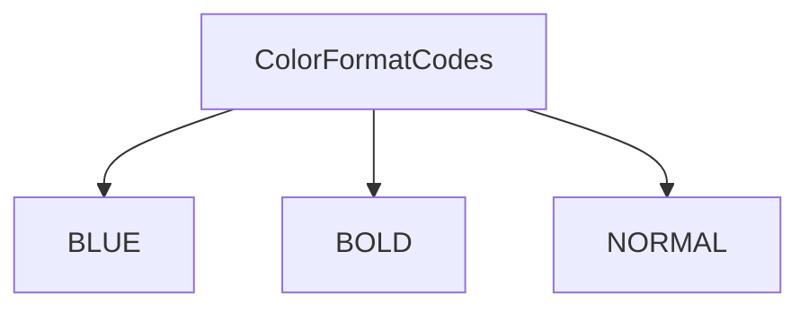
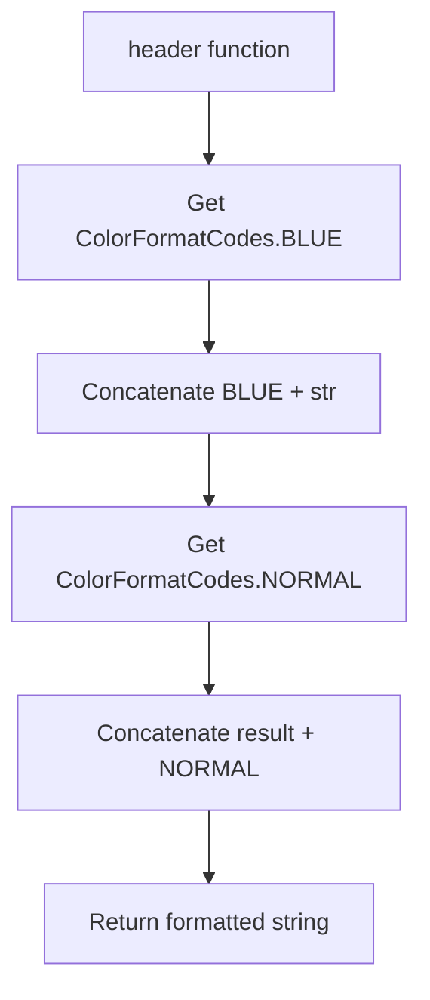
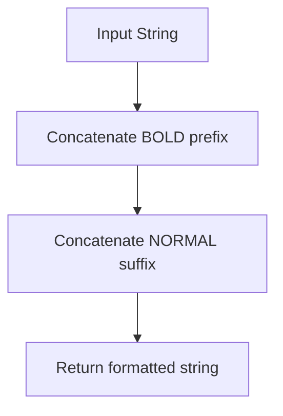

# `main.py`

## `mackup.main.ColorFormatCodes` · *class*

## Summary:
A utility class that provides ANSI color formatting codes for terminal output.

## Description:
This class serves as a centralized repository for ANSI escape codes used to format text in terminal environments. It provides constants for common text formatting styles such as color and bold text. The class is designed to be used as a static utility without instantiation, providing consistent access to terminal formatting codes throughout the application.

## State:
- BLUE: str - ANSI escape code for blue text color ("\033[34m")
- BOLD: str - ANSI escape code for bold text ("\033[1m")  
- NORMAL: str - ANSI escape code to reset text formatting ("\033[0m")

All attributes are class-level constants with no instance state.

## Lifecycle:
- Creation: The class is designed to be used statically - no instantiation is required or intended
- Usage: Access constants directly from the class (e.g., ColorFormatCodes.BLUE)
- Destruction: No cleanup required as this is purely a constants container

## Method Map:


## Raises:
None - This class does not raise exceptions during initialization or usage.

## Example:
```python
# Using the color codes in terminal output
print(f"{ColorFormatCodes.BLUE}This text is blue{ColorFormatCodes.NORMAL}")
print(f"{ColorFormatCodes.BOLD}This text is bold{ColorFormatCodes.NORMAL}")
```

## `mackup.main.header` · *function*

## Summary:
Formats a string with blue color coding for terminal output.

## Description:
Wraps the input string with ANSI escape codes to render it in blue color when displayed in a terminal. This function serves as a convenience wrapper for applying consistent color formatting to header text throughout the application.

## Args:
    str (str): The input string to be formatted with blue color coding.

## Returns:
    str: The input string wrapped with ANSI escape codes for blue text color and reset formatting.

## Raises:
    None: This function does not explicitly raise any exceptions.

## Constraints:
    Preconditions:
        - Input parameter 'str' must be a string type
        - ColorFormatCodes.BLUE and ColorFormatCodes.NORMAL must be defined as valid ANSI escape code strings
    
    Postconditions:
        - Output string will contain the input string wrapped with blue color codes
        - The returned string will properly reset formatting after the colored text

## Side Effects:
    None: This function has no side effects beyond returning a formatted string.

## Control Flow:


## Examples:
```python
# Basic usage
formatted_header = header("Application Header")
print(formatted_header)  # Outputs: "\033[34mApplication Header\033[0m"

# In context of terminal output
print(header("Welcome to Mackup"))  # Displays "Welcome to Mackup" in blue
```

## `mackup.main.bold` · *function*

## Summary:
Formats a string with bold text styling using ANSI escape codes.

## Description:
Wraps the input string with ANSI escape codes to produce bold text in terminal output. This function serves as a convenience wrapper around the BOLD and NORMAL color format constants to apply bold styling consistently throughout the application.

## Args:
    str (str): The input string to be formatted with bold styling.

## Returns:
    str: The input string wrapped with ANSI escape codes for bold text formatting.

## Raises:
    None - This function does not explicitly raise exceptions.

## Constraints:
    Preconditions:
        - Input must be a string type
        - ColorFormatCodes.BOLD and ColorFormatCodes.NORMAL must be defined as valid ANSI escape code strings
    
    Postconditions:
        - Output string will have bold formatting applied when displayed in a compatible terminal
        - Original string content is preserved with formatting wrappers

## Side Effects:
    None - This function has no side effects beyond returning a formatted string.

## Control Flow:


## Examples:
```python
# Basic usage
bold_text = bold("Hello World")
print(bold_text)  # Outputs: "\033[1mHello World\033[0m"

# In context of terminal output
print(f"Warning: {bold('important message')} detected")
```

## `mackup.main.main` · *function*

## Summary:
Main entry point for the Mackup command-line interface that processes user commands and orchestrates backup, restore, and uninstall operations.

## Description:
The main function serves as the central command dispatcher for the Mackup application, parsing command-line arguments using docopt and routing execution to appropriate operational workflows. It handles five primary commands: backup, restore, uninstall, list, and show. The function manages global configuration flags like --force, --root, --dry-run, and --verbose, and coordinates between the Mackup core class, application database, and application profile handlers to execute the requested operations.

This function extracts the core CLI logic into a single cohesive unit to maintain clean separation between argument parsing and business logic, while also handling environment validation, temporary file cleanup, and user interaction flows.

## Args:
    None - This function does not accept any parameters directly.

## Returns:
    None - This function does not return any value.

## Raises:
    SystemExit: When an unsupported application is specified in the show command or when environment validation fails.
    FileNotFoundError: Potentially raised by underlying operations when temporary directories don't exist.
    PermissionError: Potentially raised by underlying operations when insufficient permissions to access files or directories.

## Constraints:
    Preconditions:
        - The docopt module must be properly configured with a docstring containing valid command-line options
        - The VERSION constant must be defined in the constants module
        - The MACKUP_APP_NAME constant must be defined in the constants module
        - Required modules (application, appsdb, constants, docopt, mackup) must be importable
        - The system must have appropriate file system permissions for the operations being performed

    Postconditions:
        - All temporary folders created during execution will be cleaned up
        - The application will exit with appropriate status codes based on success/failure conditions
        - User interaction prompts will be displayed according to verbosity settings

## Side Effects:
    - Reads command-line arguments using docopt
    - Modifies global state variables (utils.FORCE_YES, utils.CAN_RUN_AS_ROOT) when --force or --root flags are used
    - Prints formatted output to stdout for verbose operations and command results
    - Creates and modifies files in the user's home directory during backup/restore/uninstall operations
    - May prompt user for confirmation during uninstall operations
    - Writes to temporary directories during processing
    - May modify system-wide configuration when running with root privileges

## Control Flow:
```mermaid
flowchart TD
    A[main function entry] --> B[args = docopt(__doc__, version=VERSION)]
    B --> C[mckp = Mackup()]
    C --> D[app_db = ApplicationsDatabase()]
    D --> E[Process --force flag]
    E --> F[Process --root flag]
    F --> G[Set dry_run flag]
    G --> H[Set verbose flag]
    H --> I{Command type?}
    I -->|backup| J[check_for_usable_backup_env]
    J --> K[get_apps_to_backup]
    K --> L[Loop through apps]
    L --> M[Create ApplicationProfile]
    M --> N[printAppHeader]
    N --> O[app.backup()]
    O --> P[End backup loop]
    I -->|restore| Q[check_for_usable_restore_env]
    Q --> R[Restore Mackup app first]
    R --> S[Create Mackup ApplicationProfile]
    S --> T[printAppHeader]
    T --> U[mackup_app.restore()]
    U --> V[Recreate mckp and app_db]
    V --> W[get_apps_to_backup]
    W --> X[Discard Mackup app]
    X --> Y[Loop through remaining apps]
    Y --> Z[Create ApplicationProfile]
    Z --> AA[printAppHeader]
    AA --> AB[app.restore()]
    AB --> AC[End restore loop]
    I -->|uninstall| AD[check_for_usable_restore_env]
    AD --> AE[Confirm uninstall or dry run]
    AE --> AF[get_apps_to_backup]
    AF --> AG[Discard Mackup app]
    AG --> AH[Loop through apps]
    AH --> AI[Create ApplicationProfile]
    AI --> AJ[printAppHeader]
    AJ --> AK[app.uninstall()]
    AK --> AL[Uninstall Mackup app]
    AL --> AM[print completion message]
    I -->|list| AN[check_for_usable_environment]
    AN --> AO[get_app_names]
    AO --> AP[Print app list]
    I -->|show| AQ[check_for_usable_environment]
    AQ --> AR[Get app_name from args]
    AR --> AS[Validate app_name]
    AS --> AT[Print app info]
    AT --> AU[End show]
    AU --> AV[Clean temp folder]
    AV --> AW[Exit]
```

## Examples:
```python
# Backup all supported applications
$ mackup backup

# Restore configuration files from backup
$ mackup restore

# Uninstall Mackup and restore all files to original locations
$ mackup uninstall

# List all supported applications
$ mackup list

# Show configuration files for a specific application
$ mackup show vim
```

