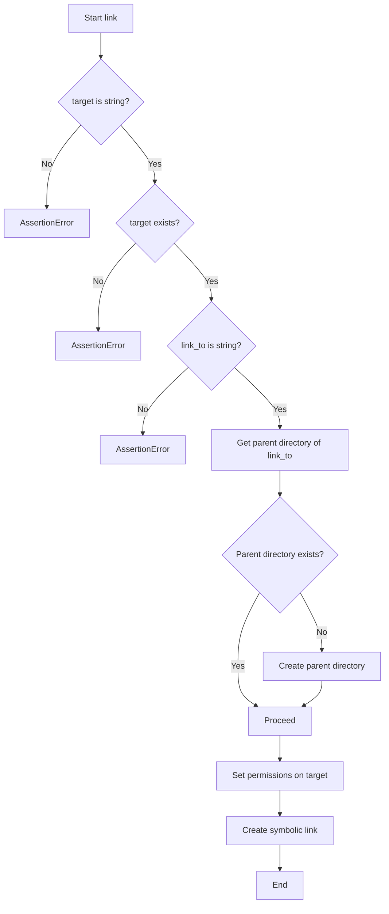
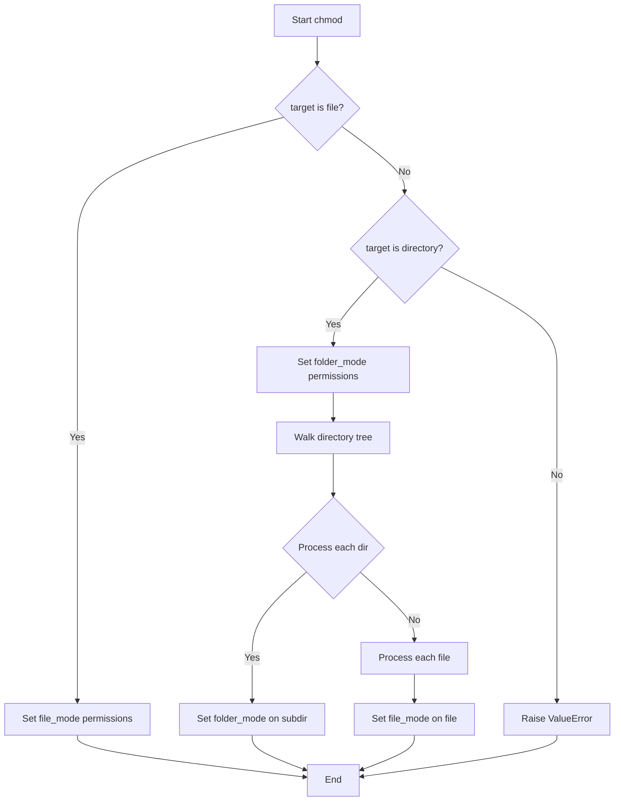

# `utils.py`

## `mackup.utils.confirm` · *function*

*No documentation generated.*

## `mackup.utils.delete` · *function*

## Summary:
Deletes a file, symbolic link, or directory by removing special attributes and then performing the appropriate deletion operation.

## Description:
This function serves as a cross-platform utility for safely removing files, symbolic links, or directories. It first removes special attributes like ACLs and immutable flags that might prevent deletion, then performs the actual removal using OS-specific methods. The function handles different file types appropriately, ensuring compatibility across Unix-like systems (macOS and Linux).

## Args:
    filepath (str): The absolute or relative path to the file, symbolic link, or directory to be deleted.

## Returns:
    None: This function does not return any value.

## Raises:
    OSError: May raise an OSError if the file cannot be removed due to permission issues or if the path doesn't exist.

## Constraints:
    Preconditions:
        - The filepath argument must be a valid string representing a path.
        - The target file, link, or directory must exist at the time of execution.
    Postconditions:
        - The specified path will be completely removed from the filesystem.
        - Special attributes such as ACLs and immutable flags are cleared before deletion.

## Side Effects:
    - Executes system commands via subprocess to manipulate file attributes (chmod, setfacl, chflags, chattr).
    - Modifies filesystem state by deleting files, directories, or symbolic links.
    - May produce output to stderr/stdout if subprocess commands fail.

## Control Flow:
```mermaid
flowchart TD
    A[delete(filepath)] --> B[remove_acl(filepath)]
    B --> C[remove_immutable_attribute(filepath)]
    C --> D{Is file or symlink?}
    D -- Yes --> E[os.remove(filepath)]
    D -- No --> F{Is directory?}
    F -- Yes --> G[shutil.rmtree(filepath)]
    F -- No --> H[Return (no-op)]
```

## Examples:
    # Delete a regular file
    delete('/path/to/file.txt')
    
    # Delete a symbolic link
    delete('/path/to/symlink')
    
    # Delete a directory
    delete('/path/to/directory')
```

## `mackup.utils.copy` · *function*

## Summary:
Copies a file or directory from a source location to a destination, creating parent directories as needed and setting appropriate permissions on the copied item.

## Description:
This function provides a robust mechanism for copying files or directories while ensuring the destination path structure exists. It handles both regular files and directories recursively, making it suitable for backup and configuration management operations. The function ensures proper file permissions are set on the copied item through a subsequent call to chmod.

## Args:
    src (str): Source file or directory path. Must be a string and must exist in the filesystem.
    dst (str): Destination file or directory path. Must be a string representing the full target path.

## Returns:
    None: This function does not return any value.

## Raises:
    AssertionError: If src is not a string, does not exist, or dst is not a string.
    ValueError: If the source path is neither a file nor a directory (unsupported file type).

## Constraints:
    Preconditions:
        - src must be a string and must exist in the filesystem
        - dst must be a string
    Postconditions:
        - The destination path structure will be created if it doesn't exist
        - The copied item will have appropriate permissions set via chmod

## Side Effects:
    - Creates parent directories in the destination path if they don't exist
    - Performs file or directory copy operations using shutil.copy() or shutil.copytree()
    - Modifies filesystem permissions via chmod() call
    - May modify filesystem metadata during copy operations

## Control Flow:
```mermaid
flowchart TD
    A[Start copy] --> B{src is string?}
    B -- Yes --> C{src exists?}
    C -- Yes --> D{dst is string?}
    D -- Yes --> E{abs_path exists?}
    E -- No --> F[Create abs_path directories]
    F --> G{src is file?}
    G -- Yes --> H[shutil.copy(src, dst)]
    G -- No --> I{src is directory?}
    I -- Yes --> J[shutil.copytree(src, dst)]
    I -- No --> K[Raise ValueError]
    H --> L[chmod(dst)]
    J --> L
    K --> L
    E -- Yes --> G
    B -- No --> M[Raise AssertionError]
    C -- No --> M
    D -- No --> M
    M --> N[End]
    L --> N
```

## Examples:
    # Copy a single file
    copy("/home/user/.bashrc", "/backup/.bashrc")
    
    # Copy a directory
    copy("/home/user/.config", "/backup/.config")
```

## `mackup.utils.link` · *function*

## Summary:
Creates a symbolic link from a target file or directory to a specified location, ensuring the target exists and creating parent directories as needed.

## Description:
This function establishes a symbolic link between a source target and a destination link path. It validates that the target exists and is a string, creates any necessary parent directories for the link destination, sets appropriate file permissions on the target, and finally creates the symbolic link itself. The function is designed to be used in backup and configuration management workflows where maintaining file structure integrity is important.

## Args:
    target (str): The absolute or relative path to the source file or directory that will be linked. Must be a string and must exist in the filesystem.
    link_to (str): The absolute or relative path where the symbolic link will be created. Must be a string.

## Returns:
    None: This function does not return any value.

## Raises:
    AssertionError: If target is not a string, does not exist, or link_to is not a string.

## Constraints:
    Preconditions:
        - target must be a string
        - target must exist in the filesystem
        - link_to must be a string
    Postconditions:
        - Parent directories of link_to will be created if they don't exist
        - Target file/directory will have appropriate permissions set
        - A symbolic link will be created at link_to pointing to target

## Side Effects:
    - Creates parent directories for link_to if they don't exist
    - Modifies file permissions on the target using chmod function
    - Creates a symbolic link in the filesystem

## Control Flow:


## Examples:
    # Create a symbolic link from a config file to backup location
    link("/home/user/.bashrc", "/backup/.bashrc")
    
    # Create a symbolic link from a directory to backup location
    link("/home/user/Documents", "/backup/Documents")
```

## `mackup.utils.chmod` · *function*

## Summary:
Sets appropriate file permissions for a target file or directory, handling both regular files and directories recursively while removing immutable attributes on Unix-like systems.

## Description:
This function configures file permissions for a given target path, applying different permission modes based on whether the target is a file or directory. It also removes immutable attributes on macOS and Linux systems before setting permissions. The function is designed to ensure proper access control for backup and configuration management operations.

## Args:
    target (str): Path to the file or directory whose permissions need to be set. Must be a string and must exist.

## Returns:
    None: This function does not return any value.

## Raises:
    AssertionError: If target is not a string or does not exist.
    ValueError: If the target is neither a file nor a directory (unsupported file type).

## Constraints:
    Preconditions:
        - target must be a string
        - target must exist in the filesystem
    Postconditions:
        - The target file/directory will have appropriate permissions set
        - Immutable attributes will be removed on supported platforms

## Side Effects:
    - Modifies file permissions using os.chmod()
    - Calls external commands via subprocess for removing immutable attributes on macOS (/usr/bin/chflags) and Linux (/usr/bin/chattr)
    - May modify filesystem metadata on Unix-like systems

## Control Flow:


## Examples:
    # Set permissions for a single file
    chmod("/path/to/config/file.txt")
    
    # Set permissions for a directory and all its contents
    chmod("/path/to/config/directory")
```

## `mackup.utils.error` · *function*

## Summary:
Exits the program with a colored error message displayed to stderr.

## Description:
This function provides a standardized way to report fatal errors by printing a formatted error message to stderr and terminating execution. It uses ANSI color codes to highlight the error message in red, making it visually distinct in terminal environments.

## Args:
    message (str): The error message to display before exiting. This should be a descriptive string explaining the nature of the error.

## Returns:
    This function does not return as it calls sys.exit() to terminate the program.

## Raises:
    This function does not raise exceptions directly, but terminates the program with exit code 1.

## Constraints:
    Preconditions:
        - The message parameter must be a string.
        - The program environment must support ANSI color codes for proper formatting.
    
    Postconditions:
        - The program terminates with exit code 1.
        - Error message is printed to stderr with red coloring.

## Side Effects:
    - Writes to stderr (standard error stream) with colored formatting.
    - Terminates the current process via sys.exit().
    - No external state mutations or I/O operations beyond stderr output.

## Control Flow:
```mermaid
flowchart TD
    A[Start error()] --> B[Define ANSI color codes]
    B --> C[Format error message]
    C --> D[Print error message to stderr]
    D --> E[Exit program with code 1]
```

## Examples:
    >>> error("Configuration file not found")
    Error: Configuration file not found
    [Program exits with code 1]

    >>> error("Invalid user input provided")
    Error: Invalid user input provided
    [Program exits with code 1]
```

## `mackup.utils.get_dropbox_folder_location` · *function*

## Summary:
Retrieves the local Dropbox folder path by parsing the Dropbox host database file.

## Description:
This function reads the Dropbox host database file to extract the local Dropbox folder location. It is designed to work with Dropbox installations on Unix-like systems where the host database contains encoded path information. The function parses the base64-encoded path stored in the database and decodes it to return the actual filesystem path.

## Args:
    None

## Returns:
    str: The absolute path to the local Dropbox folder as stored in the Dropbox host database.

## Raises:
    SystemExit: When the Dropbox host database file cannot be found or accessed, causing the program to exit with an error message.

## Constraints:
    Preconditions:
        - The HOME environment variable must be set and point to a valid user home directory.
        - The Dropbox installation must be present with a valid host.db file in the standard location.
        - The host.db file must contain properly formatted data with at least two space-separated values.
        - The second value in the host.db file must be valid base64-encoded data.
    
    Postconditions:
        - The function will either return a valid Dropbox folder path or terminate the program with an error.
        - No modifications are made to the system state.

## Side Effects:
    - Reads from the filesystem: accesses ~/.dropbox/host.db file.
    - Writes to stderr: displays error message when file access fails.
    - Terminates program: exits with code 1 when unable to find Dropbox storage.

## Control Flow:
```mermaid
flowchart TD
    A[Start get_dropbox_folder_location()] --> B[Construct host.db file path]
    B --> C[Attempt to open host.db file]
    C -->|Success| D[Read and split file content]
    D --> E[Decode base64 data from second field]
    E --> F[Return decoded path]
    C -->|IOError| G[Call error() with storage error message]
    G --> H[Exit program with error code]
```

## Examples:
    >>> get_dropbox_folder_location()
    '/home/user/Dropbox'
    
    # When Dropbox is not installed or host.db is missing:
    # Program exits with error message: "Unable to find Dropbox storage"

## `mackup.utils.get_google_drive_folder_location` · *function*

## Summary:
Retrieves the local sync root path for Google Drive by querying the local configuration database.

## Description:
This function locates and reads the Google Drive synchronization configuration database to extract the local folder path where Google Drive files are synced. It handles different versions of Google Drive installation paths and queries the SQLite database for the 'local_sync_root_path' entry. The function is designed to be a centralized utility for accessing Google Drive storage location, abstracting away the complexity of database access and path resolution.

## Args:
    This function takes no arguments.

## Returns:
    str: The absolute path to the local Google Drive sync root directory as stored in the configuration database.

## Raises:
    SystemExit: When unable to locate the Google Drive configuration database or when the required 'local_sync_root_path' entry is not found in the database. This results in program termination with an error message.

## Constraints:
    Preconditions:
        - The user's home directory must be accessible via os.environ['HOME']
        - Google Drive must be installed on the system
        - The Google Drive configuration database must exist at either the standard or Yosemite path
    
    Postconditions:
        - Either returns a valid absolute path to the Google Drive sync directory or terminates the program with an error

## Side Effects:
    - Reads from the local filesystem to check for database existence
    - Opens and reads from SQLite database file
    - May terminate program execution if database cannot be accessed or queried

## Control Flow:
```mermaid
flowchart TD
    A[Start get_google_drive_folder_location()] --> B{Check Yosemite DB Path}
    B -->|Exists| C[Use Yosemite DB Path]
    B -->|Not Exists| D[Use Standard DB Path]
    C --> E[Construct Full DB Path]
    D --> E
    E --> F{DB File Exists?}
    F -->|Yes| G[Connect to SQLite DB]
    G --> H[Execute Query for local_sync_root_path]
    H --> I[Extract Data Value]
    I --> J[Close Database Connection]
    J --> K{Got Data?}
    K -->|Yes| L[Return Data Value]
    K -->|No| M[Call error() with ERROR_UNABLE_TO_FIND_STORAGE]
    F -->|No| M
    L --> N[End]
    M --> O[Exit Program]
```

## Examples:
    >>> get_google_drive_folder_location()
    '/Users/john/Library/CloudStorage/GoogleDrive-john@gmail.com'

    >>> # If Google Drive is not installed or database inaccessible
    >>> get_google_drive_folder_location()
    Error: Unable to find storage for Google Drive install
    [Program exits with code 1]
```

## `mackup.utils.get_copy_folder_location` · *function*

*No documentation generated.*

## `mackup.utils.get_icloud_folder_location` · *function*

## Summary:
Retrieves the filesystem path to the iCloud Drive folder on macOS systems.

## Description:
This function determines the location of the iCloud Drive storage directory by constructing the path using the standard macOS Yosemite+ convention and expanding the user's home directory. It serves as a utility for locating cloud storage locations within the Mackup application.

The logic is extracted into its own function to centralize path resolution for iCloud Drive, ensuring consistent access to the storage location throughout the application while maintaining clean separation of concerns. This approach prevents code duplication and makes the path resolution logic reusable.

## Args:
    None

## Returns:
    str: The absolute filesystem path to the iCloud Drive folder as a string.

## Raises:
    SystemExit: When the iCloud Drive folder cannot be located, causing the program to exit with an error message.

## Constraints:
    Preconditions:
        - Must be running on a macOS system (as the path is specific to macOS)
        - The iCloud Drive folder must be properly configured and accessible
    
    Postconditions:
        - Returns a valid absolute path string to the iCloud Drive folder
        - Program exits if the folder is not found

## Side Effects:
    - May trigger program termination via sys.exit() if iCloud Drive is not found
    - No file I/O or external state mutations beyond the program exit

## Control Flow:
```mermaid
flowchart TD
    A[Start get_icloud_folder_location()] --> B[Define iCloud path constant]
    B --> C[Expand user home directory]
    C --> D{Is expanded path a directory?}
    D -->|No| E[Call error() with formatted message]
    D -->|Yes| F[Return expanded path]
```

## Examples:
    >>> get_icloud_folder_location()
    '/Users/john/Library/Mobile Documents/com~apple~CloudDocs'

## `mackup.utils.is_process_running` · *function*

## Summary:
Determines if a process with the specified name is currently running on the system.

## Description:
This function checks whether a process with the given name is actively running by invoking the pgrep command-line utility. It is designed for Unix-like systems (Linux, macOS) where pgrep is available. The function is commonly used in system management scripts to prevent conflicts when starting services or applications that might interfere with existing processes.

## Args:
    process_name (str): The name of the process to check for. This is passed directly to pgrep for pattern matching.

## Returns:
    bool: True if the process is running, False otherwise.

## Raises:
    None explicitly raised.

## Constraints:
    Preconditions:
        - The system must be Unix-like (Linux, macOS, etc.) where the pgrep command is available at "/usr/bin/pgrep".
        - The process_name argument must be a valid string representing a process name.
    
    Postconditions:
        - The function returns a boolean value indicating the process status.
        - No side effects occur beyond the system call to pgrep.

## Side Effects:
    - Invokes the pgrep command-line utility via subprocess.
    - Opens /dev/null for writing to suppress output from the pgrep command.

## Control Flow:
```mermaid
flowchart TD
    A[Start is_process_running] --> B{pgrep exists at /usr/bin/pgrep?}
    B -- Yes --> C[Open /dev/null for writing]
    C --> D[Execute pgrep with process_name]
    D --> E{pgrep returns 0 (success)?}
    E -- Yes --> F[is_running = True]
    E -- No --> G[is_running = False]
    F --> H[Return is_running]
    G --> H
    B -- No --> I[is_running = False]
    I --> H
```

## Examples:
    # Check if a process named 'nginx' is running
    if is_process_running('nginx'):
        print("Nginx is running")
    else:
        print("Nginx is not running")
        
    # Check if a process named 'python' is running
    if is_process_running('python'):
        print("Python processes are running")
    else:
        print("No Python processes found")

## `mackup.utils.remove_acl` · *function*

*No documentation generated.*

## `mackup.utils.remove_immutable_attribute` · *function*

*No documentation generated.*

## `mackup.utils.can_file_be_synced_on_current_platform` · *function*

*No documentation generated.*

