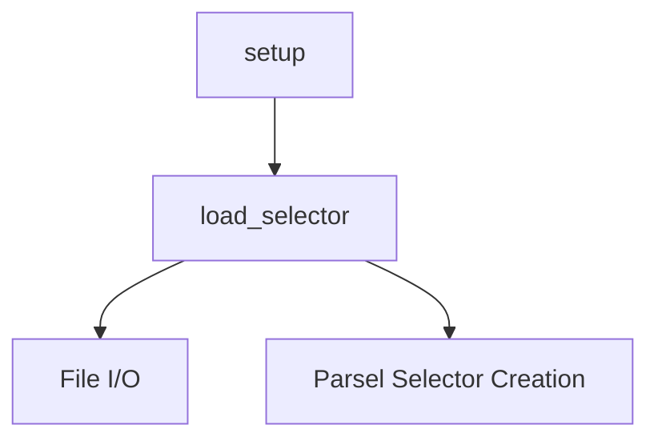

# `docs`

## Tree:
```
docs/
└── conftest.py
```

## Role:
Provides utilities for configuring documentation testing environments and loading static content for testing.

## Description:
This module serves as a configuration and utility layer for documentation testing workflows. It contains two core functions that facilitate the setup of test environments and the loading of static content for testing purposes.

The module is primarily consumed by the documentation testing infrastructure, particularly when using tools like Sybil for doctest-style testing of documentation examples. It centralizes common patterns for setting up test namespaces and accessing static test fixtures, promoting consistency and reducing boilerplate in documentation test configurations.

## Components:
- `load_selector(filename, **kwargs)` - Loads static HTML/XML content from a file and parses it into a Parsel Selector object
- `setup(namespace)` - Registers the load_selector function in a test namespace for documentation testing



## Public API:
- `load_selector(filename: str, **kwargs) -> parsel.Selector` - Load and parse static content into a Parsel Selector
- `setup(namespace: dict) -> None` - Register load_selector in a test namespace

## Dependencies:
- Internal: None
- External: `parsel` (for Selector creation), `os` (for path handling)

## Constraints:
- The `load_selector` function expects static files to reside in a `_static` subdirectory relative to this module
- The `setup` function modifies the input namespace dictionary in-place to enable documentation testing
- Both functions assume UTF-8 encoding for file content

---

## Files

- [`conftest.py`](docs/conftest.md)

