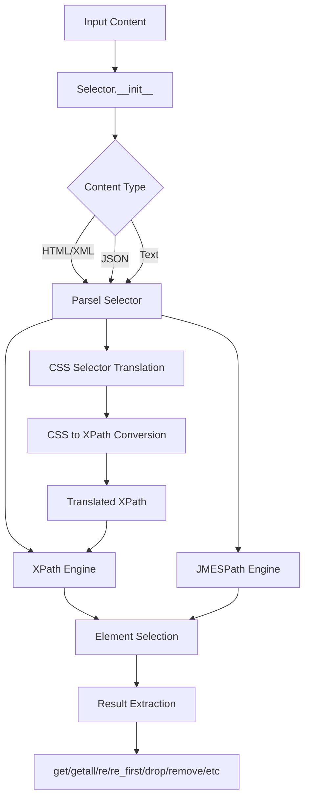

# `parsel`

## Tree:
```
parsel/
├── docs/
│   └── conftest.py
└── parsel/
    ├── csstranslator.py
    ├── selector.py
    ├── utils.py
    └── xpathfuncs.py
```

### Directory Responsibilities:
- **docs/**: Documentation testing utilities for configuring test environments and loading static content for doctest-style testing
- **parsel/**: Core web scraping and document parsing library providing CSS/XPath/JMESPath selection capabilities for HTML/XML/text content

## Purpose:
Parsel is a Python library designed for extracting data from HTML, XML, and text content using XPath, CSS, and JMESPath expressions. It provides a user-friendly interface that abstracts away the complexity of different content formats while leveraging lxml's efficient parsing and querying capabilities.

The library addresses the need for robust, flexible web scraping and document parsing tools in Python applications. It enables developers to write intuitive selectors for extracting structured data from unstructured content, making it ideal for web scraping, data extraction, and document analysis tasks.

Target users include web scrapers, data analysts, and developers building content processing pipelines who require reliable tools for parsing and extracting information from various document formats.

Parsel operates as a standalone library that can be integrated into larger data processing workflows or used independently for focused scraping tasks.

## Architecture:


Key architectural patterns:
- **Selector Pattern**: Central `Selector` class provides unified interface for different content types
- **Pipeline Architecture**: Content flows through parsing → translation → selection → extraction stages
- **Plugin System**: Custom XPath functions and namespace handling extend core functionality
- **Caching Strategy**: CSS-to-XPath translation uses LRU caching for performance optimization

## Entry Points:
- **CLI**: None (library-only)
- **Importable API**: `from parsel import Selector`
- **Service Endpoints**: None (library-only)

### Importable API:
- `Selector`: Main class for parsing and extracting data from HTML/XML/text content
- `css2xpath`: Convenience function for converting CSS selectors to XPath expressions  
- `has_class`: Custom XPath function for checking CSS class membership
- Various utility functions for data processing

## Core Features:
1. **Multi-format Support** - Parse HTML, XML, JSON, and text content with unified interface
2. **Multiple Query Languages** - Support for CSS selectors, XPath expressions, and JMESPath queries
3. **Namespace Handling** - Manage XML namespaces in XPath/CSS queries
4. **Data Extraction** - Extract text, attributes, and structured data with flexible methods
5. **Regular Expression Matching** - Extract structured data from text using regex patterns
6. **Document Manipulation** - Remove elements from parsed documents
7. **Performance Optimization** - Cached CSS-to-XPath translation for repeated queries

## Dependencies:
- **lxml**: Core XML/HTML parsing and XPath evaluation library (required)
- **cssselect**: CSS selector to XPath translation library (required)
- **w3lib**: HTML processing utilities for entity handling and whitespace normalization (required)
- **typing**: Type hints for better code documentation and IDE support (required)

## Configuration:
None significant for core functionality. Runtime parameters are passed through Selector constructor arguments.

## Extension Points:
- **Custom XPath Functions**: Define new XPath functions in xpathfuncs.py
- **Namespace Management**: Register additional namespaces via Selector.register_namespace()
- **CSS Extensions**: Extend CSS selector translation through csstranslator.py modifications
- **Utility Functions**: Add new helper functions in utils.py

---

## Modules

- [`docs`](docs.md)
- [`parsel`](parsel.md)

