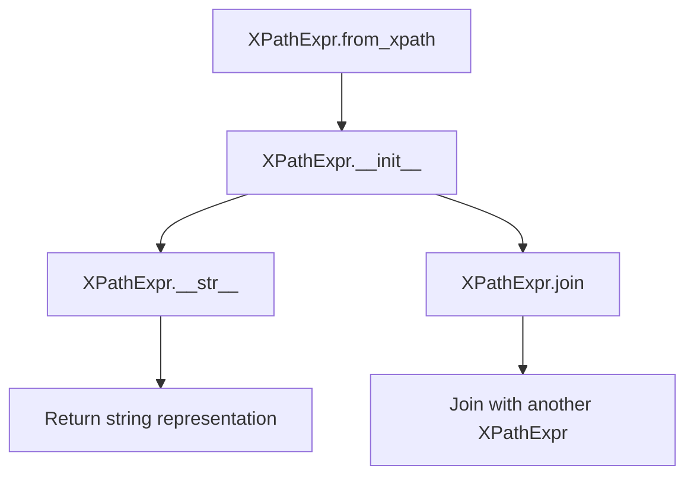
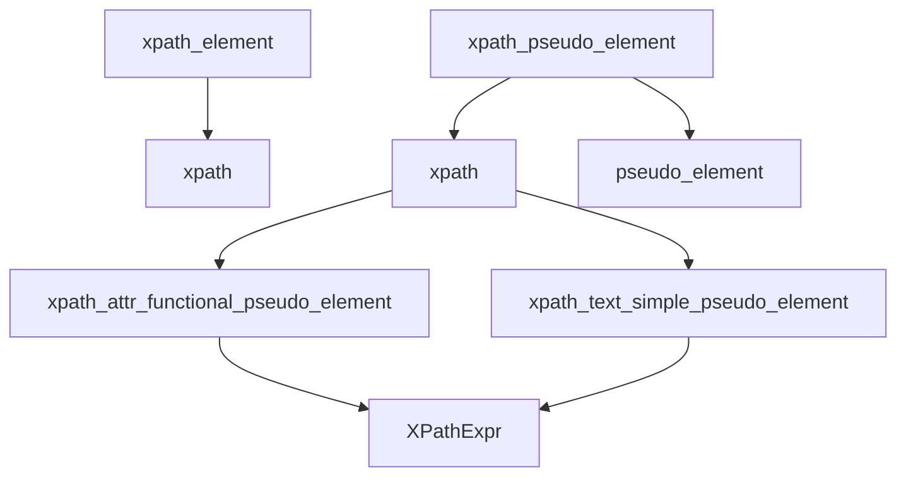
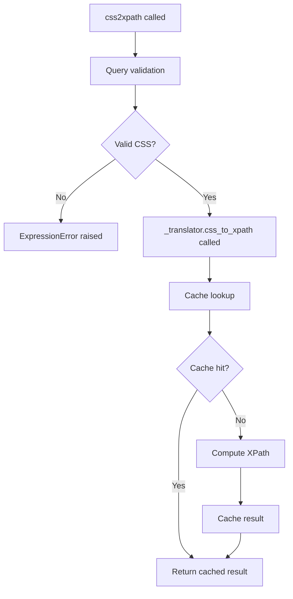

# `csstranslator.py`

## `parsel.csstranslator.XPathExpr` · *class*

## Summary:
A specialized XPath expression class that extends CSSSelect's XPathExpr to support text node and attribute-specific path representations.

## Description:
This class extends the base XPathExpr functionality to handle CSS selectors that target text content or specific attributes. It maintains compatibility with the parent class while adding specialized behavior for text node selection and attribute access.

The class is primarily used in parsel's CSS-to-XPath translation process where selectors need to target text nodes or specific element attributes rather than the elements themselves.

## State:
- `textnode: bool = False`: Flag indicating whether the expression targets a text node. When True, the string representation will append "/text()" to the path.
- `attribute: Optional[str] = None`: Name of the attribute being targeted, or None if not targeting an attribute. When set, the string representation will append "/@{attribute}" to the path.

## Lifecycle:
- Creation: Instances are created through the `from_xpath` class method, which takes an existing XPathExpr and copies its path, element, and condition properties while setting textnode and attribute flags.
- Usage: The instance is used in CSS selector translation where text node and attribute targeting is required. The `__str__` method generates the proper XPath string representation, and the `join` method handles combining expressions.
- Destruction: No special cleanup is required; standard Python garbage collection applies.

## Method Map:


## Raises:
- `ValueError` in the `join` method when attempting to join with a non-XPathExpr object, with message indicating type mismatch.

## Example:
```python
# Creating from an existing XPath expression
from cssselect.xpath import XPathExpr as BaseXPathExpr
base_expr = BaseExpr("//div", Element("div"), None)
xpath_expr = XPathExpr.from_xpath(base_expr, textnode=True, attribute="class")

# String representation will be "//div/text()/@class"
print(str(xpath_expr))
```

### `parsel.csstranslator.XPathExpr.from_xpath` · *method*

## Summary:
Creates a new XPathExpr instance by copying properties from an existing XPath expression while allowing customization of textnode and attribute flags.

## Description:
This classmethod serves as a factory method for creating XPathExpr instances from existing XPath expressions. It copies the core path, element, and condition attributes from the source expression while optionally setting textnode and attribute flags. This approach enables the creation of modified XPath expressions while preserving the structural foundation of the original.

## Args:
    cls: The class type (used for classmethod)
    xpath: Object with path, element, and condition attributes - The source XPath expression to copy from
    textnode: bool - Flag indicating if the expression targets text nodes. Defaults to False
    attribute: Optional[str] - Name of attribute to target, or None. Defaults to None

## Returns:
    Self: A new XPathExpr instance with copied properties and customized flags

## Raises:
    None explicitly raised

## State Changes:
    Attributes READ: xpath.path, xpath.element, xpath.condition
    Attributes WRITTEN: x.textnode, x.attribute

## Constraints:
    Preconditions: The xpath parameter must be an object with path, element, and condition attributes
    Postconditions: The returned instance will have identical path, element, and condition attributes as the source, plus the specified textnode and attribute flags

## Side Effects:
    None

### `parsel.csstranslator.XPathExpr.__str__` · *method*

## Summary:
Converts an XPathExpr object into its string representation, applying special formatting for text nodes and attribute access.

## Description:
This method overrides the standard `__str__` method to provide a customized string representation of XPath expressions. It builds upon the parent class's string representation and applies special formatting rules for text node selections and attribute access. The method handles three key cases:
1. When `textnode` is True, it converts the path to represent text content
2. When `attribute` is specified, it appends attribute access syntax to the path
3. Special handling for paths ending with "::*/*" to ensure proper XPath syntax

This method is typically called during XPath expression serialization or debugging to display the expression in human-readable form.

## Args:
    None

## Returns:
    str: A string representation of the XPath expression that accounts for textnode and attribute properties.

## Raises:
    None explicitly raised

## State Changes:
    Attributes READ: self.textnode, self.attribute
    Attributes WRITTEN: None

## Constraints:
    Preconditions: The object must be properly initialized with textnode and attribute attributes.
    Postconditions: The returned string accurately represents the XPath expression considering textnode and attribute states.

## Side Effects:
    None

### `parsel.csstranslator.XPathExpr.join` · *method*

## Summary:
Joins two XPath expressions with a combiner string, preserving textnode and attribute metadata from the right-hand expression.

## Description:
This method extends the base XPath expression joining functionality by ensuring that textnode and attribute properties are properly transferred from the other expression during joining operations. It serves as a specialized implementation for the parsel csstranslator's XPathExpr class that maintains additional semantic information beyond standard XPath path composition.

The method validates that the other expression is of the correct type (XPathExpr or its descendants) before performing the join operation, and then copies the textnode and attribute properties from the other expression to this one.

## Args:
    self (Self): The XPathExpr instance being modified
    combiner (str): String used to combine the two XPath expressions (e.g., '/', '//', etc.)
    other (OriginalXPathExpr): Another XPath expression to join with this one
    *args (Any): Additional positional arguments passed to the parent join method
    **kwargs (Any): Additional keyword arguments passed to the parent join method

## Returns:
    Self: Returns self to enable method chaining

## Raises:
    ValueError: When the other argument is not an instance of XPathExpr or its descendant types

## State Changes:
    Attributes READ: self.textnode, self.attribute, other.textnode, other.attribute
    Attributes WRITTEN: self.textnode, self.attribute

## Constraints:
    Preconditions: The other parameter must be an instance of XPathExpr or its descendant types
    Postconditions: After execution, self.textnode and self.attribute will match those of the other expression

## Side Effects:
    None

## `parsel.csstranslator.TranslatorProtocol` · *class*

## Summary:
A protocol defining the interface for CSS selector to XPath translation implementations.

## Description:
The TranslatorProtocol defines the contract that CSS selector translators must implement to convert CSS selectors into XPath expressions. This protocol serves as an abstraction layer that allows different translator implementations to be used interchangeably while maintaining consistent behavior.

The protocol specifies two core methods: xpath_element for translating individual CSS elements and css_to_xpath for converting full CSS selector strings to XPath expressions. Implementations of this protocol are typically used in web scraping and DOM traversal applications where CSS selectors need to be converted to XPath expressions for efficient document navigation.

## State:
- No instance attributes are defined in the protocol itself
- The protocol defines method signatures but does not specify internal state management
- Implementation classes are responsible for their own state handling

## Lifecycle:
- Creation: Instances are created by implementing classes (GenericTranslator, HTMLTranslator)
- Usage: Typically called via css_to_xpath() method with CSS selector strings
- Destruction: Managed by Python's garbage collection

## Method Map:
```mermaid
graph TD
    A[css_to_xpath] --> B[Implementation]
    A --> C[TranslatorProtocol]
    B --> D[GenericTranslator|HTMLTranslator]
    C --> E[xpath_element]
    C --> F[css_to_xpath]
```

## Raises:
- ExpressionError: May be raised by implementations when encountering invalid CSS selectors or unsupported pseudo-elements

## Example:
```python
from parsel.csstranslator import TranslatorProtocol

# Define a custom translator that implements the protocol
class MyTranslator(TranslatorProtocol):
    def xpath_element(self, selector: Element) -> OriginalXPathExpr:
        # Implementation here
        pass
    
    def css_to_xpath(self, css: str, prefix: str = ...) -> str:
        # Implementation here
        pass

# Usage with any protocol-compliant translator
translator: TranslatorProtocol = MyTranslator()
xpath_result = translator.css_to_xpath("div.class")
```

### `parsel.csstranslator.TranslatorProtocol.xpath_element` · *method*

## Summary:
Converts a CSS selector element node into its corresponding XPath expression.

## Description:
This method translates a parsed CSS selector element (represented as an Element object) into an XPath expression. It is part of the TranslatorProtocol interface and serves as a key component in the CSS-to-XPath translation pipeline. The method is typically invoked during the broader CSS-to-XPath translation process when the parser encounters an element node in a CSS selector.

The implementation delegates to the parent class's xpath_element method to perform the actual translation, ensuring compatibility with the underlying cssselect library's translation mechanisms. This method is part of the TranslatorMixin class hierarchy that extends cssselect's basic translator functionality with enhanced pseudo-element support and proper type handling.

## Args:
    selector (Element): A parsed CSS selector element node containing information about the element type, attributes, and pseudo-elements to be translated. This is typically an instance of cssselect.parser.Element.

## Returns:
    XPathExpr: An XPath expression object representing the CSS element selector, typically an instance of cssselect.xpath.XPathExpr or compatible type.

## Raises:
    ExpressionError: Raised when the CSS selector element contains invalid syntax or unsupported pseudo-elements that cannot be translated to XPath.

## State Changes:
    Attributes READ: None
    Attributes WRITTEN: None

## Constraints:
    Preconditions: The selector parameter must be a valid Element object from cssselect's parser.
    Postconditions: The returned XPath expression accurately represents the semantic meaning of the input CSS element selector.

## Side Effects:
    None

### `parsel.csstranslator.TranslatorProtocol.css_to_xpath` · *method*

## Summary:
Defines the interface for converting CSS selectors to XPath expressions within the TranslatorProtocol.

## Description:
This method specifies the contract for CSS selector to XPath conversion within the TranslatorProtocol. As a protocol method, it establishes the expected interface for implementing classes to translate CSS selectors into XPath expressions with optional prefixing. The method signature ensures consistency across different translator implementations while allowing flexibility in the underlying implementation details.

This protocol method is typically invoked during CSS selector processing workflows in web scraping or DOM traversal applications where CSS selectors need to be converted to XPath for efficient querying. It serves as a standardized interface that enables polymorphic behavior across different translator implementations.

## Args:
    css (str): A CSS selector string to be converted to XPath.
    prefix (str): An optional prefix to prepend to the XPath expression. Defaults to "descendant-or-self::".

## Returns:
    str: The resulting XPath expression corresponding to the provided CSS selector.

## Raises:
    ExpressionError: If the CSS selector contains unsupported pseudo-elements or functional pseudo-elements.

## State Changes:
    Attributes READ: None
    Attributes WRITTEN: None

## Constraints:
    Preconditions: The `css` argument must be a valid CSS selector string.
    Postconditions: The returned string is a valid XPath expression that represents the CSS selector.

## Side Effects:
    I/O: None
    External service calls: None
    Mutations to objects outside self: None

## `parsel.csstranslator.TranslatorMixin` · *class*

## Summary:
A mixin class that extends CSS selector to XPath translation with enhanced pseudo-element support and type safety.

## Description:
The TranslatorMixin class provides extension capabilities for CSS selector to XPath translation, specifically enhancing support for CSS pseudo-elements and ensuring proper type handling. It is designed to be mixed into cssselect translator classes (such as GenericTranslator and HTMLTranslator) to extend their functionality with custom pseudo-element processing while maintaining compatibility with the base cssselect library's translation mechanisms.

This mixin adds support for extended pseudo-elements like `::attr()` and `::text()` that are not part of the standard CSS specification but are commonly used in web scraping and DOM traversal contexts. The mixin works by overriding key translation methods to provide enhanced behavior while delegating to parent class implementations for core functionality.

## State:
- No instance attributes are defined in this class
- All methods operate on parameters and return values without maintaining persistent state
- The class relies on inheritance from cssselect translators for core functionality
- The `self` parameter in `xpath_element` is typed as `TranslatorProtocol`, indicating it expects to be used in a context where this protocol is implemented

## Lifecycle:
- Creation: Instances are created automatically when the mixin is used in inheritance chains with cssselect translators (GenericTranslator or HTMLTranslator)
- Usage: Methods are invoked internally by the cssselect library during CSS-to-XPath translation processes, particularly when encountering elements or pseudo-elements in CSS selectors
- Destruction: No special cleanup is required as the class is stateless

## Method Map:


## Raises:
- ExpressionError: Raised by xpath_pseudo_element when encountering unknown functional pseudo-elements
- ExpressionError: Raised by xpath_pseudo_element when encountering unknown simple pseudo-elements  
- ExpressionError: Raised by xpath_attr_functional_pseudo_element when the ::attr() pseudo-element doesn't have exactly one STRING or IDENT argument

## Example:
```python
# Usage would typically be automatic when using GenericTranslator or HTMLTranslator
# This demonstrates the conceptual flow of how the mixin enhances translation:

from parsel.csstranslator import GenericTranslator

# Create a translator instance (mixin is automatically applied)
translator = GenericTranslator()

# The mixin enables handling of extended pseudo-elements like ::attr() and ::text()
# These would be processed through the mixin's xpath_pseudo_element method
# which dispatches to xpath_attr_functional_pseudo_element or xpath_text_simple_pseudo_element

# Example CSS selectors that would utilize this mixin:
# "div::text()" - would be handled by xpath_text_simple_pseudo_element
# "span::attr(class)" - would be handled by xpath_attr_functional_pseudo_element
```

### `parsel.csstranslator.TranslatorMixin.xpath_element` · *method*

## Summary:
Converts a CSS selector element into an XPath expression with proper type handling.

## Description:
This method serves as a wrapper around the parent class's xpath_element method, ensuring that the returned XPath expression is properly typed as XPathExpr. It is part of the TranslatorMixin class hierarchy and is used during CSS-to-XPath translation processes.

## Args:
    selector (Element): A CSS selector element parsed by cssselect parser

## Returns:
    XPathExpr: An XPath expression object representing the translated CSS selector

## Raises:
    ExpressionError: If the CSS selector cannot be converted to XPath

## State Changes:
    Attributes READ: None
    Attributes WRITTEN: None

## Constraints:
    Preconditions: The selector must be a valid Element object from cssselect parser
    Postconditions: The returned XPathExpr is properly initialized with the converted XPath string

## Side Effects:
    None

### `parsel.csstranslator.TranslatorMixin.xpath_pseudo_element` · *method*

## Summary:
Dispatches CSS pseudo-element handling to specialized methods based on pseudo-element type.

## Description:
This method serves as a central dispatcher for CSS pseudo-element processing during XPath translation. It identifies whether a pseudo-element is functional (with parentheses like ::first-line()) or simple (like ::before), then dynamically invokes the corresponding handler method on the class instance. This design promotes extensibility by allowing subclasses to add new pseudo-element support without modifying the core dispatch mechanism.

The method is typically invoked during CSS selector to XPath conversion when pseudo-elements are encountered in CSS selectors, particularly within the broader context of the TranslatorMixin class hierarchy.

## Args:
    xpath (XPathExpr): The XPath expression being processed
    pseudo_element (PseudoElement): The CSS pseudo-element to process

## Returns:
    XPathExpr: The modified XPath expression after pseudo-element processing

## Raises:
    ExpressionError: When a functional pseudo-element lacks a corresponding handler method
    ExpressionError: When a simple pseudo-element lacks a corresponding handler method

## State Changes:
    Attributes READ: None
    Attributes WRITTEN: None

## Constraints:
    Preconditions: 
    - The pseudo_element argument must be an instance of cssselect.parser.PseudoElement or its subclass
    - The class instance must have appropriately named handler methods for the pseudo-element types encountered
    
    Postconditions:
    - Returns a modified XPath expression that incorporates the pseudo-element semantics
    - Raises ExpressionError for unsupported pseudo-elements

## Side Effects:
    None

### `parsel.csstranslator.TranslatorMixin.xpath_attr_functional_pseudo_element` · *method*

## Summary:
Transforms a CSS functional pseudo-element for attribute selection into an XPath expression.

## Description:
This method processes CSS functional pseudo-elements that specify attribute selection (like `::attr(attribute-name)`), converting them into equivalent XPath expressions. It validates that the pseudo-element contains exactly one argument that is either a string or identifier, then constructs a new XPath expression that selects the specified attribute from the current node.

## Args:
    xpath (OriginalXPathExpr): The existing XPath expression to extend with attribute selection.
    function (FunctionalPseudoElement): The CSS functional pseudo-element representing the attribute selection.

## Returns:
    XPathExpr: A new XPath expression that selects the specified attribute from the current node.

## Raises:
    ExpressionError: When the functional pseudo-element does not contain exactly one argument of type STRING or IDENT.

## State Changes:
    Attributes READ: None
    Attributes WRITTEN: None

## Constraints:
    Preconditions: 
    - The `function` argument must be a FunctionalPseudoElement instance
    - The `function.arguments` list must contain exactly one element
    - The single argument must be of type STRING or IDENT according to `function.argument_types()`
    Postconditions:
    - Returns a valid XPathExpr instance
    - The returned XPath expression selects the attribute specified by `function.arguments[0].value`

## Side Effects:
    None

### `parsel.csstranslator.TranslatorMixin.xpath_text_simple_pseudo_element` · *method*

## Summary:
Creates a new XPath expression that targets text nodes from the input XPath expression.

## Description:
This method transforms an existing XPath expression to specifically select text nodes by setting the `textnode` parameter to `True`. It serves as a utility for CSS selector translation to XPath conversion when dealing with pseudo-elements that require text node selection.

## Args:
    xpath (OriginalXPathExpr): The original XPath expression to be converted to target text nodes.

## Returns:
    XPathExpr: A new XPath expression configured to select text nodes from the input expression.

## Raises:
    None explicitly raised.

## State Changes:
    Attributes READ: None
    Attributes WRITTEN: None

## Constraints:
    Preconditions: The input `xpath` must be a valid XPath expression object compatible with `XPathExpr.from_xpath()`.
    Postconditions: The returned XPath expression will have its textnode flag set to True.

## Side Effects:
    None

## `parsel.csstranslator.GenericTranslator` · *class*

## Summary:
A cached CSS selector to XPath translator that extends cssselect's GenericTranslator with LRU caching for performance optimization.

## Description:
The GenericTranslator class extends cssselect's GenericTranslator to add LRU (Least Recently Used) caching to the css_to_xpath method. This optimization is particularly beneficial when the same CSS selectors are converted to XPath expressions repeatedly, as it avoids redundant computations. The class also inherits from TranslatorMixin, which provides enhanced pseudo-element support for extended CSS pseudo-elements like `::attr()` and `::text()`.

This class serves as a drop-in replacement for cssselect.GenericTranslator with improved performance characteristics for repeated operations, making it suitable for applications that process many identical CSS selectors.

## State:
- No instance attributes are maintained by this class
- The caching mechanism is managed internally by the @lru_cache decorator with maxsize=256
- The cache maintains up to 256 most recently used CSS selector to XPath conversions
- The class maintains no persistent state beyond the caching mechanism

## Lifecycle:
- Creation: Instantiated automatically when imported and used; requires no explicit construction
- Usage: The css_to_xpath method is called with CSS selector strings to obtain XPath expressions
- Destruction: No special cleanup required; relies on Python's garbage collection

## Method Map:
```mermaid
graph TD
    A[css_to_xpath] --> B[super().css_to_xpath]
    B --> C[cssselect.GenericTranslator.css_to_xpath]
    A --> D[lru_cache]
    D --> A
```

## Raises:
- ExpressionError: Raised by the parent class's css_to_xpath method when encountering invalid CSS selectors or unsupported pseudo-elements

## Example:
```python
from parsel.csstranslator import GenericTranslator

# Create translator instance (inherited from cssselect.GenericTranslator)
translator = GenericTranslator()

# Convert CSS selectors to XPath with caching
xpath1 = translator.css_to_xpath("div.class")
xpath2 = translator.css_to_xpath("div.class")  # Cached result

# The second call returns immediately from cache
print(xpath1 == xpath2)  # True

# Works with extended pseudo-elements supported by TranslatorMixin
xpath3 = translator.css_to_xpath("span::text()")
xpath4 = translator.css_to_xpath("div::attr(id)")
```

### `parsel.csstranslator.GenericTranslator.css_to_xpath` · *method*

## Summary:
Converts a CSS selector string into an XPath expression using the parent class implementation with caching.

## Description:
This method provides a cached interface to convert CSS selectors into XPath expressions. It inherits from `cssselect.GenericTranslator` and adds LRU caching to optimize repeated conversions. The method delegates the actual conversion to the parent class's `css_to_xpath` method, applying an optional prefix to the result.

## Args:
    css (str): A CSS selector string to be converted to XPath.
    prefix (str): An optional prefix to prepend to the XPath expression. Defaults to "descendant-or-self::".

## Returns:
    str: The resulting XPath expression corresponding to the provided CSS selector.

## Raises:
    ExpressionError: If the CSS selector contains unsupported pseudo-elements or functional pseudo-elements.

## State Changes:
    Attributes READ: None
    Attributes WRITTEN: None

## Constraints:
    Preconditions: The `css` argument must be a valid CSS selector string.
    Postconditions: The returned string is a valid XPath expression that represents the CSS selector.

## Side Effects:
    I/O: None
    External service calls: None
    Mutations to objects outside self: None

## `parsel.csstranslator.HTMLTranslator` · *class*

## Summary:
A cached HTML-specific CSS selector to XPath translator that extends cssselect's HTMLTranslator with LRU caching and enhanced pseudo-element support.

## Description:
The HTMLTranslator class is a specialized CSS selector to XPath converter designed specifically for HTML documents. It extends the cssselect library's HTMLTranslator class by adding LRU (Least Recently Used) caching to optimize repeated CSS-to-XPath conversions and integrates with TranslatorMixin to support extended pseudo-elements like `::attr()` and `::text()`.

This class is primarily used in web scraping and DOM traversal applications where the same CSS selectors need to be applied to multiple HTML documents. The caching mechanism significantly improves performance when identical selectors are processed repeatedly.

## State:
- No instance attributes are maintained by this class
- The caching mechanism is managed internally by the @lru_cache decorator with maxsize=256
- The cache maintains up to 256 most recently used CSS selector to XPath conversions
- The class maintains no persistent state beyond the caching mechanism

## Lifecycle:
- Creation: Instantiated automatically when imported and used; requires no explicit construction
- Usage: The css_to_xpath method is called with CSS selector strings to obtain XPath expressions
- Destruction: No special cleanup required; relies on Python's garbage collection

## Method Map:
```mermaid
graph TD
    A[css_to_xpath] --> B[super().css_to_xpath]
    B --> C[cssselect.HTMLTranslator.css_to_xpath]
    A --> D[lru_cache]
    D --> A
```

## Raises:
- ExpressionError: Raised by the parent class's css_to_xpath method when encountering invalid CSS selectors or unsupported pseudo-elements

## Example:
```python
from parsel.csstranslator import HTMLTranslator

# Create translator instance (inherited from cssselect.HTMLTranslator)
translator = HTMLTranslator()

# Convert HTML CSS selectors to XPath with caching
xpath1 = translator.css_to_xpath("div.class")
xpath2 = translator.css_to_xpath("div.class")  # Cached result

# Works with extended pseudo-elements supported by TranslatorMixin
xpath3 = translator.css_to_xpath("span::text()")
xpath4 = translator.css_to_xpath("div::attr(id)")

# Custom prefix can be specified
xpath5 = translator.css_to_xpath("p", prefix="child::")
```

### `parsel.csstranslator.HTMLTranslator.css_to_xpath` · *method*

## Summary:
Converts a CSS selector string into an XPath expression using the parent HTMLTranslator implementation with LRU caching.

## Description:
This method provides a cached interface to convert CSS selectors into XPath expressions. It is part of the parsel library's HTML-specific CSS to XPath translation system. The method inherits from cssselect's HTMLTranslator class (via the TranslatorMixin) and adds LRU caching to optimize repeated conversions.

The method delegates the actual conversion to the parent class's css_to_xpath method, applying an optional prefix to the result. This caching optimization is particularly beneficial when the same CSS selectors are converted to XPath expressions repeatedly, such as in web scraping applications where the same selectors may be applied to multiple documents.

## Args:
    css (str): A CSS selector string to be converted to XPath.
    prefix (str): An optional prefix to prepend to the XPath expression. Defaults to "descendant-or-self::".

## Returns:
    str: The resulting XPath expression corresponding to the provided CSS selector.

## Raises:
    ExpressionError: If the CSS selector contains unsupported pseudo-elements or functional pseudo-elements.

## State Changes:
    Attributes READ: None
    Attributes WRITTEN: None

## Constraints:
    Preconditions: The `css` argument must be a valid CSS selector string.
    Postconditions: The returned string is a valid XPath expression that represents the CSS selector.

## Side Effects:
    I/O: None
    External service calls: None
    Mutations to objects outside self: None

## `parsel.csstranslator.css2xpath` · *function*

## Summary:
Converts a CSS selector string into its equivalent XPath expression using a cached translator instance.

## Description:
This function serves as a convenience wrapper around the internal `_translator` object's `css_to_xpath` method. It provides a simple interface for converting CSS selectors to XPath expressions while leveraging caching for improved performance when processing repeated selectors. The underlying translator is a cached version of cssselect's GenericTranslator, which adds LRU (Least Recently Used) caching to avoid redundant computations.

The function is typically called during web scraping or DOM traversal operations where CSS selectors need to be translated into XPath expressions for use with XPath-based tools or libraries. It's part of the parsel library's CSS selection utilities.

## Args:
    query (str): A valid CSS selector string to be converted to XPath format.

## Returns:
    str: The equivalent XPath expression for the provided CSS selector. The result is a valid XPath string that can be used with XPath processors.

## Raises:
    ExpressionError: Raised when the CSS selector is malformed or contains unsupported pseudo-elements that cannot be converted to XPath.

## Constraints:
    Preconditions:
        - The input query must be a valid CSS selector string
        - The query should not contain syntax errors that would cause the underlying cssselect library to fail
    
    Postconditions:
        - The returned XPath expression is a valid XPath string that can be used with XPath processors
        - The conversion is deterministic for valid inputs

## Side Effects:
    None

## Control Flow:


## Examples:
```python
# Basic usage
xpath = css2xpath("div.class")
print(xpath)  # Output: "//div[@class='class']"

# Complex selector
xpath = css2xpath("ul li:nth-child(2n+1)")
print(xpath)  # Output: "//ul/li[position() mod 2 = 1]"

# With extended pseudo-elements (supported by TranslatorMixin)
xpath = css2xpath("span::text()")
print(xpath)  # Output: "//span/text()"
```

