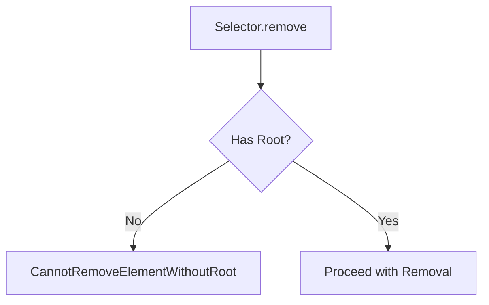
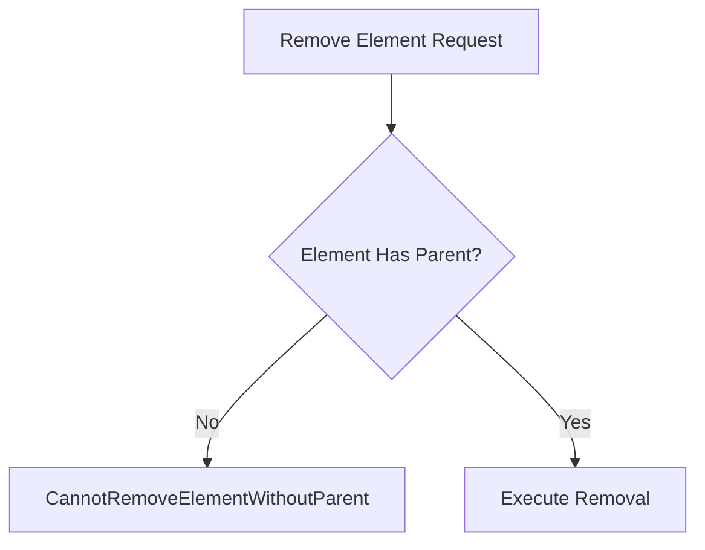
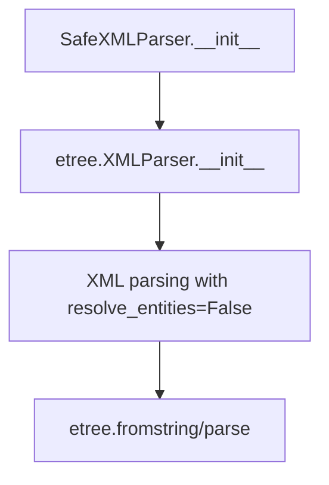
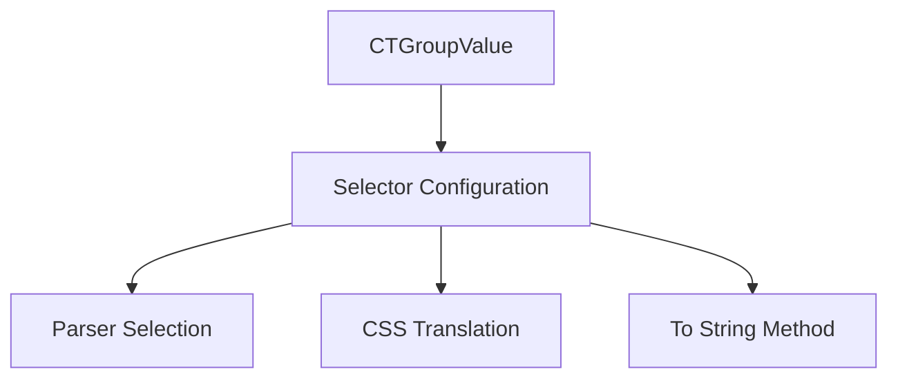
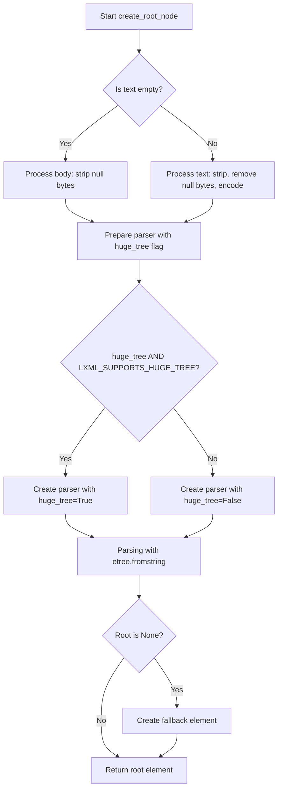
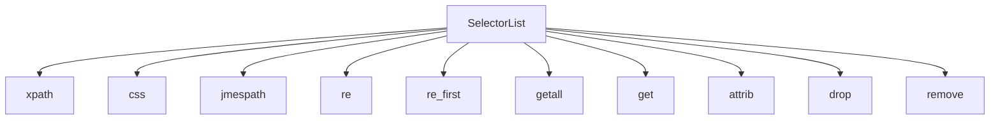
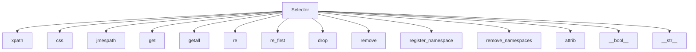

# `selector.py`

## `parsel.selector.CannotRemoveElementWithoutRoot` · *class*

## Summary:
Represents an exception raised when attempting to remove an element without a root element being defined in the selector context.

## Description:
This exception is specifically designed to enforce a constraint in the parsel library's selector functionality. It is raised when a user attempts to remove an element from a selector that does not have a root element set, which would lead to undefined behavior. The exception serves as a guardrail to prevent invalid operations on selectors that lack proper structural context.

## State:
- This class inherits from Exception and has no additional attributes or state.
- It is a simple exception class with no constructor parameters.

## Lifecycle:
- Creation: Instantiated automatically by the parsel library when a removal operation is attempted on a selector without a root element.
- Usage: The exception propagates up through the call stack to indicate an invalid operation.
- Destruction: Automatically cleaned up by Python's garbage collector after being handled.

## Method Map:


## Raises:
- CannotRemoveElementWithoutRoot: Raised when attempting to remove an element from a selector that lacks a root element.

## Example:
```python
# This would raise CannotRemoveElementWithoutRoot
selector = Selector(text='<div>Hello World</div>')
# selector.root is None
selector.remove('p')  # Raises CannotRemoveElementWithoutRoot
```

## `parsel.selector.CannotRemoveElementWithoutParent` · *class*

## Summary:
Exception raised when attempting to remove an HTML/XML element that lacks a parent node in parsel library operations.

## Description:
This exception is specifically raised by the parsel library's selector implementation when an element removal operation is attempted on an element that does not have a parent node in the document tree. It serves as a safeguard to prevent invalid element manipulation operations that would result in structural inconsistencies within the parsed document.

The exception ensures that element removal operations maintain document integrity by requiring elements to be properly connected to their parent nodes before removal.

## State:
- No instance attributes or state variables
- Inherits from Exception base class
- No constructor parameters required

## Lifecycle:
- Creation: Raised internally by parsel library when element removal is attempted on orphaned elements
- Usage: Should be caught by calling code to handle invalid element removal attempts gracefully
- Destruction: Handled through standard Python exception handling mechanisms

## Method Map:


## Raises:
- CannotRemoveElementWithoutParent: Raised when element removal is attempted on an element that lacks a parent node in the document tree

## Example:
```python
# This exception would typically be raised internally by parsel
# when trying to remove an element that has been detached from its parent
from parsel import Selector
import lxml.etree as etree

# Create a selector and get an element
selector = Selector(text='<div><p>Hello</p></div>')
element = selector.xpath('//p')[0]

# If element somehow becomes orphaned (detached from parent)
# and removal is attempted, this exception would be raised
try:
    # This operation would raise CannotRemoveElementWithoutParent
    # if the element has no parent reference
    element.getparent()  # Check if element has parent
    if element.getparent() is None:
        raise CannotRemoveElementWithoutParent()
except CannotRemoveElementWithoutParent:
    print("Cannot remove element without parent node")
```

## `parsel.selector.CannotDropElementWithoutParent` · *class*

## Summary:
Exception raised when attempting to drop an HTML/XML element that lacks a parent node in parsel library operations.

## Description:
This exception is specifically raised by the parsel library's selector implementation when a drop operation is attempted on an element that does not have a parent node in the document tree. It serves as a safeguard to prevent invalid element manipulation operations that would result in structural inconsistencies within the parsed document.

The exception ensures that element drop operations maintain document integrity by requiring elements to be properly connected to their parent nodes before removal. This class inherits from CannotRemoveElementWithoutParent, extending its functionality for drop-specific scenarios.

## State:
- No instance attributes or state variables
- Inherits from CannotRemoveElementWithoutParent exception class
- No constructor parameters required
- Maintains all behaviors of the parent exception class

## Lifecycle:
- Creation: Raised internally by parsel library when element drop is attempted on orphaned elements
- Usage: Should be caught by calling code to handle invalid element drop attempts gracefully
- Destruction: Handled through standard Python exception handling mechanisms

## Method Map:


## Raises:
- CannotDropElementWithoutParent: Raised when element drop is attempted on an element that lacks a parent node in the document tree

## Example:
```python
# This exception would typically be raised internally by parsel
# when trying to drop an element that has been detached from its parent
from parsel import Selector
import lxml.etree as etree

# Create a selector and get an element
selector = Selector(text='<div><p>Hello</p></div>')
element = selector.xpath('//p')[0]

# If element somehow becomes orphaned (detached from parent)
# and drop is attempted, this exception would be raised
try:
    # This operation would raise CannotDropElementWithoutParent
    # if the element has no parent reference
    element.getparent()  # Check if element has parent
    if element.getparent() is None:
        raise CannotDropElementWithoutParent()
except CannotDropElementWithoutParent:
    print("Cannot drop element without parent node")
```

## `parsel.selector.SafeXMLParser` · *class*

## Summary:
A safe XML parser that disables entity resolution to prevent XXE attacks.

## Description:
The SafeXMLParser class extends lxml's XMLParser to provide a secure parsing configuration by disabling entity resolution. This prevents XML External Entity (XXE) injection vulnerabilities that could allow attackers to access local files or perform server-side request forgery attacks. The class should be used whenever XML content needs to be parsed in a security-sensitive context.

## State:
- Inherits all attributes from lxml.etree.XMLParser
- The `resolve_entities` parameter is explicitly set to `False` in __init__, overriding any user-provided value
- No additional instance attributes beyond those inherited from the parent class

## Lifecycle:
- Creation: Instantiate with optional arguments compatible with etree.XMLParser; resolve_entities is always set to False
- Usage: Pass to lxml parsing functions like etree.fromstring() or etree.parse()
- Destruction: Managed automatically by Python's garbage collector; no explicit cleanup required

## Method Map:


## Raises:
- Any exceptions raised by etree.XMLParser.__init__ when invalid arguments are provided

## Example:
```python
from parsel.selector import SafeXMLParser
from lxml import etree

# Create a safe parser instance
parser = SafeXMLParser()

# Use it to parse XML safely
xml_content = "<root><item>value</item></root>"
tree = etree.fromstring(xml_content, parser=parser)
```

### `parsel.selector.SafeXMLParser.__init__` · *method*

## Summary:
Initializes a SafeXMLParser instance with entity resolution disabled to prevent XXE attacks.

## Description:
This method initializes a SafeXMLParser instance by configuring the underlying lxml XML parser to disable entity resolution. This security measure prevents XML External Entity (XXE) injection vulnerabilities that could allow attackers to access local files or perform server-side request forgery attacks. The method ensures that resolve_entities=False regardless of any user-provided value.

## Args:
    *args (Any): Variable length argument list passed to the parent lxml.etree.XMLParser constructor.
    **kwargs (Any): Arbitrary keyword arguments passed to the parent lxml.etree.XMLParser constructor.

## Returns:
    None: This method does not return any value.

## Raises:
    Exception: Any exceptions raised by the lxml.etree.XMLParser.__init__ constructor when invalid arguments are provided.

## State Changes:
    Attributes READ: None
    Attributes WRITTEN: None

## Constraints:
    Preconditions: The parent lxml.etree.XMLParser must accept the provided *args and **kwargs.
    Postconditions: The SafeXMLParser instance is properly initialized with resolve_entities=False.

## Side Effects:
    None: This method does not perform any I/O operations or mutate external state.

## `parsel.selector.CTGroupValue` · *class*

## Summary:
A typed dictionary class defining the structure for group value configuration in CSS selector processing.

## Description:
CTGroupValue serves as a configuration container that holds parser, CSS translator, and tostring method specifications needed for CSS selector operations. It is used internally by the selector module to maintain consistent configuration across different parsing contexts. This abstraction allows for clean separation of concerns between different parser types and their associated translation mechanisms.

## State:
- `_parser`: Union[Type[etree.XMLParser], Type[html.HTMLParser]]
  - Type of parser to use for document parsing
  - Valid values are XML parser or HTML parser types
  - No specific range or constraint beyond being a valid parser type
- `_csstranslator`: Union[GenericTranslator, HTMLTranslator]
  - CSS translator instance for converting CSS selectors to XPath expressions
  - Valid values are either generic or HTML-specific translator instances
  - No specific range or constraint beyond being a valid translator type
- `_tostring_method`: str
  - Name of the method to use for converting elements to string representation
  - Valid values are string names of methods available on lxml elements
  - No specific range or constraint beyond being a valid method name

## Lifecycle:
- Creation: Instantiated as a TypedDict with required keys
- Usage: Used as a configuration dictionary passed between selector methods
- Destruction: No explicit cleanup required as it's a simple data container

## Method Map:


## Raises:
- No exceptions raised during initialization as it's a TypedDict definition

## Example:
```python
# Creating a CTGroupValue instance
config = CTGroupValue(
    _parser=html.HTMLParser,
    _csstranslator=HTMLTranslator(),
    _tostring_method="tostring"
)
```

## `parsel.selector._xml_or_html` · *function*

## Summary:
Determines whether to use XML or HTML parsing mode based on the input type specification.

## Description:
This utility function serves as a simple dispatcher that selects between XML and HTML parsing modes. It is used internally by the selector system to determine appropriate parsing behavior when processing web content. The function extracts the parsing mode from a type specification string, defaulting to HTML mode when no explicit type is specified.

## Args:
    type (Optional[str]): The type specification string, typically indicating whether content should be parsed as XML or HTML. Can be None, "xml", or "html".

## Returns:
    str: Either "xml" or "html" depending on the input type specification.

## Raises:
    None

## Constraints:
    Preconditions:
        - The input parameter `type` must be either None, "xml", or "html"
        - No validation is performed on the input type beyond basic equality checks
    
    Postconditions:
        - Always returns either "xml" or "html" as a string
        - The returned value matches the input when input is "xml" or "html"

## Side Effects:
    None

## Control Flow:
```mermaid
flowchart TD
    A[Start _xml_or_html] --> B{type == "xml"?}
    B -- Yes --> C[Return "xml"]
    B -- No --> D[Return "html"]
```

## Examples:
    >>> _xml_or_html("xml")
    'xml'
    >>> _xml_or_html("html")
    'html'
    >>> _xml_or_html(None)
    'html'
```

## `parsel.selector.create_root_node` · *function*

## Summary:
Creates an XML/HTML root node from text or byte content using lxml parsing with configurable options.

## Description:
This function serves as a centralized utility for parsing text or binary content into lxml element trees. It handles various input formats and provides fallback mechanisms for malformed content. The function is designed to be called internally by selector classes when constructing parse trees from raw input data.

## Args:
    text (str): Text content to parse. If empty, the function falls back to using the body parameter.
    parser_cls (Type): The lxml parser class to use for parsing (e.g., etree.HTMLParser or etree.XMLParser).
    base_url (Optional[str]): Base URL to use for resolving relative URLs in the parsed content.
    huge_tree (bool): Whether to enable huge tree parsing support. Defaults to LXML_SUPPORTS_HUGE_TREE constant.
    body (bytes): Binary content to parse when text is empty. Defaults to empty bytes.
    encoding (str): Character encoding to use when encoding text. Defaults to 'utf8'.

## Returns:
    etree._Element: The root element of the parsed XML/HTML tree. Always returns a valid element, even if parsing fails or input is empty.

## Raises:
    None explicitly raised, but lxml parsing may raise etree.ParserError or similar exceptions indirectly.

## Constraints:
    Preconditions:
        - parser_cls must be a valid lxml parser class (HTMLParser or XMLParser)
        - text should be a string or empty
        - body should be bytes or empty
        - encoding should be a valid character encoding string
    Postconditions:
        - Returns a valid etree._Element instance
        - Never returns None (falls back to creating <html/> element if needed)

## Side Effects:
    - May emit warnings via Python's warnings module when huge_tree is enabled but not supported
    - Uses lxml's etree.fromstring() which may perform I/O operations during parsing
    - May modify global warning state through warnings.warn()

## Control Flow:


## Examples:
    # Basic usage with HTML text
    root = create_root_node("<div>Hello World</div>", etree.HTMLParser)
    
    # Usage with empty text and body content
    root = create_root_node("", etree.HTMLParser, body=b"<p>Content</p>")
    
    # Usage with custom encoding
    root = create_root_node("Hello", etree.HTMLParser, encoding="latin1")
    
    # Usage with base URL
    root = create_root_node("<a href='/link'>Link</a>", etree.HTMLParser, base_url="https://example.com")
```

## `parsel.selector.SelectorList` · *class*

## Summary:
A container class that holds multiple Selector objects and provides batch operations for extracting data from parsed HTML/XML documents.

## Description:
SelectorList extends Python's built-in List type to manage collections of Selector objects. It enables batch processing of selectors, allowing developers to apply XPath, CSS, JMESPath queries, and extraction methods to multiple elements simultaneously. This abstraction simplifies working with multiple matching elements in a parsed document while maintaining the familiar list interface.

## State:
- Inherits all state from List[_SelectorType], storing zero or more Selector objects
- _SelectorType: A type variable representing the specific Selector subclass (Selector, HtmlSelector, etc.)
- No additional instance attributes beyond those inherited from the parent List class

## Lifecycle:
- Creation: Instantiated implicitly when selector methods like xpath(), css(), or jmespath() are called on a Selector object, or directly with a list of Selector objects
- Usage: Apply filtering and extraction methods to process all contained selectors at once
- Destruction: Managed automatically by Python's garbage collector; no explicit cleanup required

## Method Map:


## Raises:
- TypeError from __getstate__: "can't pickle SelectorList objects" when attempting to serialize the object
- All other methods inherit behavior from underlying Selector objects they operate on

## Example:
```python
from parsel import Selector

html_content = '''
<div class="item">
    <span class="price">$10</span>
    <span class="name">Item 1</span>
</div>
<div class="item">
    <span class="price">$20</span>
    <span class="name">Item 2</span>
</div>
'''

# Create a selector and find all item divs
selector = Selector(html_content)
items = selector.css('.item')

# Extract prices from all items
prices = items.xpath('.//span[@class="price"]/text()')
print(prices.getall())  # ['$10', '$20']

# Extract names from all items
names = items.css('span.name::text')
print(names.getall())  # ['Item 1', 'Item 2']
```

### `parsel.selector.SelectorList.__getitem__` · *method*

## Summary:
Returns a selector or selector list at the specified position or slice, maintaining proper type inheritance.

## Description:
This method implements indexing and slicing operations for SelectorList objects, enabling access to individual selectors or sublists using standard Python bracket notation. When slicing, it returns a new SelectorList instance of the same type containing the selected elements. When indexing with a single position, it returns the selector at that position.

## Args:
    pos (Union[SupportsIndex, slice]): The index or slice position(s) to retrieve from the selector list.

## Returns:
    Union[_SelectorType, SelectorList[_SelectorType]]: A single selector if indexing with an integer, or a selector list if slicing.

## Raises:
    IndexError: When accessing an index that is out of bounds for the selector list.

## State Changes:
    - Attributes READ: None
    - Attributes WRITTEN: None

## Constraints:
    - Preconditions: The pos argument must be a valid index or slice for the underlying list structure.
    - Postconditions: The returned object maintains the same type as the original SelectorList instance.

## Side Effects:
    - None

### `parsel.selector.SelectorList.__getstate__` · *method*

## Summary:
Prevents serialization of SelectorList objects by raising a TypeError during pickling operations.

## Description:
This method is implemented to make SelectorList objects unpickleable. It is called internally by Python's pickle protocol when attempting to serialize a SelectorList instance. The method serves as a safeguard to prevent accidental serialization of complex selector objects that may contain lxml elements or other non-picklable components.

## Args:
    self: The SelectorList instance being pickled.

## Returns:
    None: This method does not return a value as it always raises an exception.

## Raises:
    TypeError: Always raised with the message "can't pickle SelectorList objects" when pickle attempts to serialize the object.

## State Changes:
    Attributes READ: None
    Attributes WRITTEN: None

## Constraints:
    Preconditions: The method is designed to be called only by Python's pickle protocol during serialization attempts.
    Postconditions: The method always raises a TypeError, preventing successful pickling of SelectorList instances.

## Side Effects:
    None: The method does not perform any I/O operations or mutate external state. It solely raises an exception to prevent pickling.

### `parsel.selector.SelectorList.jmespath` · *method*

## Summary:
Applies a JMESPath query to each selector in the list and returns a new selector list containing the results.

## Description:
This method executes a JMESPath query on each Selector object within the SelectorList, aggregating the results into a new SelectorList instance. It enables batch processing of JMESPath queries across multiple selectors simultaneously. Each selector in the list must be of type "json" to properly process the JMESPath query, otherwise it will attempt to extract JSON data from the selector's text content.

## Args:
    query (str): The JMESPath query string to apply to each selector.
    **kwargs (Any): Additional keyword arguments to pass to the underlying jmespath.search function.

## Returns:
    SelectorList[_SelectorType]: A new SelectorList containing the results of applying the JMESPath query to each selector in the original list.

## Raises:
    None explicitly raised by this method.

## State Changes:
    Attributes READ: None
    Attributes WRITTEN: None

## Constraints:
    Preconditions: The SelectorList must contain Selector objects that support the jmespath method. Selectors should be of type "json" or contain JSON data in their text content.
    Postconditions: The returned SelectorList contains the results of applying the query to each selector in the original list.

## Side Effects:
    None

### `parsel.selector.SelectorList.xpath` · *method*

## Summary:
Applies an XPath expression to each selector in the list and returns a flattened list of all matching elements.

## Description:
The `xpath` method applies the given XPath expression to each selector in the current `SelectorList` instance and aggregates all results into a new `SelectorList`. This enables batch XPath operations across multiple selectors simultaneously. The method delegates to each individual selector's xpath method, collects all results, and flattens nested structures to return a single flat list of matching elements.

## Args:
- xpath (str): The XPath expression to apply to each selector in the list
- namespaces (Optional[Mapping[str, str]]): Namespace definitions to use during XPath evaluation, defaults to None
- **kwargs (Any): Additional keyword arguments passed to the underlying XPath engine

## Returns:
- SelectorList[_SelectorType]: A new selector list containing all elements matching the XPath expression across all selectors in the current list

## Raises:
- None explicitly raised by this method, though underlying XPath operations may raise exceptions

## State Changes:
- Attributes READ: self (the SelectorList instance itself)
- Attributes WRITTEN: None (creates new instance rather than modifying existing)

## Constraints:
- Preconditions: All elements in `self` must be valid selector objects that support the xpath method
- Postconditions: Returns a new SelectorList instance with results from applying xpath to each element in the original list

## Side Effects:
- Calls the xpath method on each selector in the list
- May involve parsing and evaluating XPath expressions
- Creates new Selector objects internally through the flatten operation

### `parsel.selector.SelectorList.css` · *method*

## Summary:
Applies a CSS selector query to all selectors in this list and returns a new list containing results from all selections.

## Description:
This method enables batch processing of CSS queries across multiple selector elements. It iterates through each selector in the current list, applies the provided CSS query to each one using the underlying CSS-to-XPath translation mechanism, and flattens the resulting selector lists into a single flat list. This allows for efficient querying of multiple elements simultaneously while maintaining the hierarchical structure of the results.

## Args:
    query (str): A CSS selector string to apply to each element in the selector list

## Returns:
    SelectorList[_SelectorType]: A new SelectorList instance containing all matching elements from applying the CSS query to each element in this list

## Raises:
    ValueError: When applied to a Selector with an invalid type (not 'html', 'xml', or 'text'), as the underlying Selector.css method raises this exception

## State Changes:
    Attributes READ: None
    Attributes WRITTEN: None

## Constraints:
    Preconditions: The SelectorList must contain Selector objects that support CSS queries (i.e., have a valid type attribute of 'html', 'xml', or 'text')
    Postconditions: The returned SelectorList contains all elements matching the CSS query across all elements in this list

## Side Effects:
    None

### `parsel.selector.SelectorList.re` · *method*

## Summary:
Extracts all strings matching a regular expression from the text content of all selectors in the list, returning a flattened list of all matches.

## Description:
The `re` method applies regular expression pattern matching to the text content of each selector in the SelectorList. For each selector, it calls the individual `Selector.re` method to extract matching strings, then flattens all results into a single list. This enables batch processing of regex extraction across multiple selectors simultaneously.

## Args:
    regex (Union[str, Pattern[str]]): The regular expression pattern to match. Can be either a string or compiled regex pattern.
    replace_entities (bool): Whether to replace HTML entities in the matched strings. Defaults to True.

## Returns:
    List[str]: A flattened list of all strings that match the regex pattern across all selectors in the list. Empty list if no matches found.

## Raises:
    None explicitly raised by this method. Exceptions from individual `Selector.re` calls are propagated.

## State Changes:
    Attributes READ: None
    Attributes WRITTEN: None

## Constraints:
    Preconditions: The SelectorList must contain elements that support the `re` method (i.e., instances of Selector or compatible classes).
    Postconditions: The returned list contains all matches from all selectors, with duplicates preserved if they exist in the original content. The order follows the sequential iteration of selectors in the list.

## Side Effects:
    None

### `parsel.selector.SelectorList.re_first` · *method*

## Summary:
Returns the first string matching a regular expression from the text content of all selectors in the list, or a default value if no matches are found.

## Description:
The `re_first` method processes all selectors in the list sequentially, applying a regular expression pattern to each selector's text content. It uses the `iflatten` utility to flatten nested results from individual regex extractions and returns the first match found. This method is particularly useful when you want to extract a single value from potentially multiple matching selectors, making it ideal for extracting specific data like titles, prices, or IDs from web pages.

This logic is encapsulated in its own method because it provides a convenient way to extract a single value from a list of selectors without having to manually iterate through the list or handle the flattening logic. It also maintains consistency with similar methods like `get()` and `getall()` in the SelectorList class.

## Args:
    regex (Union[str, Pattern[str]]): The regular expression pattern to match. Can be either a string or compiled regex pattern.
    default (Optional[str]): The default value to return if no matches are found. Defaults to None.
    replace_entities (bool): Whether to replace HTML entities in the matched strings. Defaults to True.

## Returns:
    Optional[str]: The first string that matches the regex pattern, or the default value if no matches are found.

## Raises:
    None explicitly raised by this method. Exceptions from individual `Selector.re` calls are propagated.

## State Changes:
    Attributes READ: None
    Attributes WRITTEN: None

## Constraints:
    Preconditions: The SelectorList must contain elements that support the `re` method (i.e., instances of Selector or compatible classes).
    Postconditions: The method returns the first match found or the default value, with no side effects on the SelectorList itself.

## Side Effects:
    None

### `parsel.selector.SelectorList.getall` · *method*

## Summary:
Returns a list of string values by calling the `get()` method on each selector in the selector list.

## Description:
This method provides a convenient way to extract all string values from a SelectorList instance. It iterates through each selector in the list and calls its `get()` method to retrieve the underlying string representation. This approach allows for consistent extraction of text content from multiple selectors in a single operation.

The method is particularly useful when working with CSS or XPath selectors that return multiple matches, and you want to extract all the resulting text content as a flat list of strings.

## Args:
    None

## Returns:
    List[str]: A list containing the string representation of each selector in the list, obtained by calling `get()` on each element. If the selector list is empty, returns an empty list.

## Raises:
    AttributeError: If any element in the selector list does not have a `get()` method.

## State Changes:
    Attributes READ: None
    Attributes WRITTEN: None

## Constraints:
    Preconditions: 
    - The object must be an instance of SelectorList
    - Each element in the list must have a callable `get()` method that returns a string
    Postconditions:
    - Returns a list of strings with the same length as the selector list
    - Each returned string corresponds to the result of calling `get()` on the respective selector

## Side Effects:
    None

### `parsel.selector.SelectorList.get` · *method*

## Summary:
Returns the first element's value from the selector list or a default value if empty.

## Description:
This method iterates through the selector list and returns the result of calling `get()` on the first element. If the list is empty, it returns the provided default value. This method provides a convenient way to extract a single value from a potentially empty selector list, commonly used when expecting at most one matching element.

## Args:
    default (Any): The default value to return if the selector list is empty. Defaults to None.

## Returns:
    Any: The result of calling `get()` on the first element, or the default value if the list is empty.

## Raises:
    None explicitly raised.

## State Changes:
    Attributes READ: None
    Attributes WRITTEN: None

## Constraints:
    Preconditions: The object must be iterable and support the `get()` method on its elements.
    Postconditions: The method returns either the first element's value or the default value.

## Side Effects:
    None

### `parsel.selector.SelectorList.attrib` · *method*

## Summary:
Returns the attributes of the first element in the selector list, or an empty mapping if the list is empty.

## Description:
This method provides access to the HTML/XML attributes of the first element in the selector list. It is designed to be a convenience method for extracting attribute data from the first matching element. The method iterates through the selector list and returns the `attrib` property of the first element encountered, or an empty dictionary if no elements exist.

The SelectorList class represents a list of selector objects (typically lxml elements) that are the result of CSS or XPath queries. This method allows developers to quickly access the attributes of the first matching element without having to manually index into the list.

This method follows the same pattern as other convenience methods in the SelectorList class like `get()` which returns the text content of the first element. The `attrib` property is particularly useful for extracting metadata such as IDs, classes, hrefs, or custom data attributes from HTML/XML elements.

## Args:
    None

## Returns:
    Mapping[str, str]: A mapping of attribute names to their values for the first element, or an empty mapping if the selector list is empty.

## Raises:
    None

## State Changes:
    Attributes READ: self (the selector list itself)
    Attributes WRITTEN: None

## Constraints:
    Preconditions: The selector list must be iterable and contain elements that support the `attrib` property (such as lxml element objects).
    Postconditions: The returned mapping will contain string keys and values representing the attributes of the first element, or be empty if no elements exist.

## Side Effects:
    None

### `parsel.selector.SelectorList.remove` · *method*

## Summary:
Removes elements from all selectors in the list by calling the remove method on each selector, while issuing a deprecation warning.

## Description:
This method provides a deprecated interface for removing elements from all selectors contained within the SelectorList. It issues a DeprecationWarning directing users to use the drop method instead. The method iterates through each selector in the list and calls its remove method, effectively removing elements from each selector in the list.

This method exists as a separate entity to provide backward compatibility for users who were previously calling remove() on SelectorList instances. It serves as a deprecated wrapper around the individual remove operations on each selector within the list.

## Args:
    None

## Returns:
    None

## Raises:
    None

## State Changes:
    Attributes READ: None
    Attributes WRITTEN: None

## Constraints:
    Preconditions: The object must be a SelectorList instance containing selectors that support the remove method.
    Postconditions: All selectors in the list will have their remove method called, potentially modifying their internal state.

## Side Effects:
    Issues a DeprecationWarning via the warnings module.
    Calls the remove method on each selector in the list, which may cause side effects in those selectors.

### `parsel.selector.SelectorList.drop` · *method*

## Summary:
Removes all elements from the selector list by calling drop() on each contained selector.

## Description:
This method is part of the SelectorList class and provides a bulk operation to remove all selectors from the list. It iterates through each selector in the list and calls its drop() method, which typically removes the selector from internal tracking structures or releases associated resources. This method is the preferred replacement for the deprecated remove() method.

## Args:
    None

## Returns:
    None

## Raises:
    AttributeError: If any element in the selector list does not have a drop() method.

## State Changes:
    Attributes READ: None
    Attributes WRITTEN: None

## Constraints:
    Preconditions: All elements in the selector list must be objects that support the drop() method.
    Postconditions: After execution, all elements in the list will have had their drop() method called, effectively removing them from whatever tracking or memory management system they belong to.

## Side Effects:
    None

## `parsel.selector._get_root_from_text` · *function*

## Summary:
Parses text content into an lxml root element using a parser retrieved from an internal configuration group.

## Description:
This function serves as an intermediary that retrieves a parser class from an internal configuration mapping (`_ctgroup`) based on the provided type identifier, then delegates the actual parsing work to `create_root_node`. It provides a standardized way to parse text content using different parser configurations that are pre-defined in the module.

The function is designed to be called internally by selector classes when constructing parse trees from raw input data, ensuring consistent parsing behavior across different content types.

## Args:
    text (str): The text content to parse into an lxml element tree.
    type (str): A key used to look up the parser configuration in the internal `_ctgroup` mapping.
    **lxml_kwargs (Any): Additional keyword arguments passed through to `create_root_node` for fine-grained control over parsing behavior.

## Returns:
    etree._Element: The root element of the parsed XML/HTML tree created by `create_root_node`.

## Raises:
    KeyError: If the specified `type` is not found in the internal `_ctgroup` mapping.
    TypeError: If the parser retrieved from `_ctgroup` is not a valid lxml parser class.
    etree.ParserError: If the lxml parser encounters malformed content during parsing.

## Constraints:
    Preconditions:
        - The `_ctgroup` dictionary must contain a mapping for the specified `type`
        - The parser retrieved from `_ctgroup[type]["_parser"]` must be a valid lxml parser class
        - The `text` parameter must be a string
    Postconditions:
        - Returns a valid lxml etree._Element instance
        - The returned element is the root of a parsed tree constructed using the specified parser

## Side Effects:
    - May emit warnings via Python's warnings module if `create_root_node` enables huge tree parsing
    - Uses lxml's etree.fromstring() which may perform I/O operations during parsing
    - May modify global warning state through warnings.warn() if called by `create_root_node`

## Control Flow:
```mermaid
flowchart TD
    A[Start _get_root_from_text] --> B{Get parser from _ctgroup[type]["_parser"]}
    B --> C[Call create_root_node with text and parser]
    C --> D[Return result from create_root_node]
```

## Examples:
    # Parse HTML content
    root = _get_root_from_text("<div>Hello</div>", type="html")
    
    # Parse XML content with custom options
    root = _get_root_from_text("<root><item>value</item></root>", type="xml", huge_tree=True)
```

## `parsel.selector._get_root_and_type_from_bytes` · *function*

## Summary:
Parses byte content into a root element and determines its type based on content format and input specifications.

## Description:
This function serves as a content-type dispatcher that processes raw byte data and returns an appropriate root element along with its determined type. It handles multiple input formats including plain text, JSON data, and XML/HTML content. The function is designed to be called internally by selector classes when preparing content for parsing operations.

## Args:
    body (bytes): Raw byte content to process, typically representing HTML, XML, or JSON data.
    encoding (str): Character encoding to use when decoding text content or parsing JSON.
    input_type (Optional[str]): Explicit type hint indicating whether content should be treated as "text", "json", "html", or "xml". Defaults to None.
    **lxml_kwargs (Any): Additional keyword arguments passed to lxml parsing functions for fine-grained control over parsing behavior.

## Returns:
    Tuple[Any, str]: A tuple containing the parsed root element (or decoded text/data) and the determined type string ("text", "json", "html", or "xml").

## Raises:
    AssertionError: When input_type is not one of the allowed values ("html", "xml", None) after validation.

## Constraints:
    Preconditions:
        - body must be a bytes object
        - encoding must be a valid character encoding string
        - input_type must be None, "text", "json", "html", or "xml"
    
    Postconditions:
        - Always returns a tuple with two elements: parsed content and type string
        - When input_type is "text", returns decoded text and "text" type
        - When encoding is "utf8" and body contains valid JSON, returns parsed JSON data and "json" type
        - When input_type is "json", returns None and "json" type
        - For other cases, returns a root element and either "html" or "xml" type

## Side Effects:
    None

## Control Flow:
```mermaid
flowchart TD
    A[Start _get_root_and_type_from_bytes] --> B{input_type == "text"?}
    B -- Yes --> C[Decode body with encoding, return (decoded_text, "text")]
    B -- No --> D{encoding == "utf8"?}
    D -- Yes --> E[Try to load JSON from body using json.load()]
    E --> F{JSON loading successful?}
    F -- Yes --> G[Return (parsed_json, "json")]
    F -- No --> H{input_type == "json"?}
    H -- Yes --> I[Return (None, "json")]
    H -- No --> J[Validate input_type using assert]
    J --> K[Call _xml_or_html(input_type)]
    K --> L[Call create_root_node with appropriate parser from _ctgroup]
    L --> M[Return (root_element, type)]
    D -- No --> N[Validate input_type using assert]
    N --> O[Call _xml_or_html(input_type)]
    O --> P[Call create_root_node with appropriate parser from _ctgroup]
    P --> Q[Return (root_element, type)]
```

## Examples:
    # Parse HTML content
    root, type = _get_root_and_type_from_bytes(b"<html><body>Hello</body></html>", "utf-8", input_type="html")
    
    # Parse JSON content
    data, type = _get_root_and_type_from_bytes(b'{"key": "value"}', "utf-8", input_type="json")
    
    # Parse text content
    text, type = _get_root_and_type_from_bytes(b"Plain text content", "utf-8", input_type="text")
    
    # Auto-detect content type
    root, type = _get_root_and_type_from_bytes(b"<div>Content</div>", "utf-8")
```

## `parsel.selector._get_root_and_type_from_text` · *function*

## Summary:
Parses input text to determine its type and returns the appropriate root element or data structure along with the detected type.

## Description:
This function serves as a content-type dispatcher that analyzes input text to determine whether it represents plain text, JSON data, or structured markup (HTML/XML). It handles multiple input formats by attempting different parsing strategies in order of precedence. The function is designed to be called internally by selector classes when processing raw input data, providing a unified interface for content detection and parsing.

The function is extracted from inline logic to provide a clean separation between content type detection and actual parsing, making the selector system more modular and testable. It encapsulates the decision-making process for determining how to interpret and parse input text.

## Args:
    text (str): The input text to analyze and parse. Must be a string containing either plain text, JSON data, or HTML/XML markup.
    input_type (Optional[str]): Explicit type hint for the input content. Can be "text", "json", "html", "xml", or None. When provided, it overrides automatic type detection.
    **lxml_kwargs (Any): Additional keyword arguments passed through to lxml parsing functions for fine-grained control over parsing behavior.

## Returns:
    Tuple[Any, str]: A tuple containing two elements:
        - The parsed content: either the original text (for "text"), parsed JSON data (for "json"), or an lxml root element (for "html"/"xml")
        - The detected/assigned type: "text", "json", "html", or "xml"

## Raises:
    AssertionError: When input_type is not one of the allowed values ("html", "xml", None) after initial checks.

## Constraints:
    Preconditions:
        - The `text` parameter must be a string
        - The `input_type` parameter must be one of: "text", "json", "html", "xml", or None
        - The `_xml_or_html` function must be available and properly handle the type parameter
        - The `_get_root_from_text` function must be available and properly handle the type parameter
        - The `_NOT_SET` sentinel value must be defined in the module scope
    
    Postconditions:
        - Always returns a tuple with exactly two elements
        - The second element is always one of the recognized type strings
        - For "text" input_type, the first element equals the input text
        - For "json" input, the first element is either parsed JSON data or None
        - For "html"/"xml" input, the first element is an lxml root element

## Side Effects:
    - May emit warnings via Python's warnings module if underlying parsing functions enable huge tree parsing
    - Uses lxml's etree.fromstring() which may perform I/O operations during parsing
    - May modify global warning state through warnings.warn() if called by underlying functions

## Control Flow:
```mermaid
flowchart TD
    A[Start _get_root_and_type_from_text] --> B{input_type == "text"?}
    B -- Yes --> C[Return (text, "text")]
    B -- No --> D{Try to parse as JSON}
    D --> E{JSON parsing successful?}
    E -- Yes --> F[Return (parsed_data, "json")]
    E -- No --> G{input_type == "json"?}
    G -- Yes --> H[Return (None, "json")]
    G -- No --> I{input_type in ("html", "xml", None)?}
    I -- No --> J[Assertion Error]
    I -- Yes --> K[Call _xml_or_html(input_type)]
    K --> L[Call _get_root_from_text(text, type=detected_type)]
    L --> M[Return (root_element, detected_type)]
```

## Examples:
    # Parse plain text
    result, type = _get_root_and_type_from_text("Hello World", input_type="text")
    # Returns: ("Hello World", "text")

    # Parse JSON data
    result, type = _get_root_and_type_from_text('{"key": "value"}', input_type=None)
    # Returns: ({"key": "value"}, "json")

    # Parse HTML content
    result, type = _get_root_and_type_from_text("<div>Hello</div>", input_type="html")
    # Returns: (<lxml.etree._Element>, "html")
```

## `parsel.selector._get_root_type` · *function*

## Summary:
Determines the appropriate root type for parsing based on the input root object and type specification.

## Description:
This function analyzes the type of the root object and the provided input type to determine the correct parsing mode. It ensures compatibility between the root object type and the specified input type, raising appropriate errors when they conflict. The function is designed to handle different root types (XML elements, JSON objects, text) and select the appropriate parsing strategy accordingly.

## Args:
    root (Any): The root object to analyze, which can be an lxml.etree._Element, dict, list, or other types.
    input_type (Optional[str]): The type specification for parsing, which can be None, "xml", "html", "json", or "text".

## Returns:
    str: The determined root type, which can be "xml", "html", or "json".

## Raises:
    ValueError: When an lxml.etree._Element is provided as root with input_type set to "json" or "text".

## Constraints:
    Preconditions:
        - The root parameter can be any type, but specific handling applies to etree._Element, dict, and list instances.
        - The input_type parameter should be one of None, "xml", "html", "json", or "text".
    
    Postconditions:
        - Always returns a string that is either "xml", "html", or "json".
        - When root is an etree._Element, input_type cannot be "json" or "text".

## Side Effects:
    None

## Control Flow:
```mermaid
flowchart TD
    A[Start _get_root_type] --> B{root is etree._Element?}
    B -- Yes --> C{input_type in {"json", "text"}?}
    C -- Yes --> D[raise ValueError]
    C -- No --> E[_xml_or_html(input_type)]
    B -- No --> F{root is dict/list or valid JSON?}
    F -- Yes --> G[return "json"]
    F -- No --> H[return input_type or "json"]
```

## Examples:
    >>> _get_root_type(etree.fromstring("<root></root>"), input_type="xml")
    'xml'
    >>> _get_root_type({"key": "value"}, input_type=None)
    'json'
    >>> _get_root_type(etree.fromstring("<root></root>"), input_type="json")
    ValueError: Selector got an lxml.etree._Element object as root, and 'json' as type.
```

## `parsel.selector._is_valid_json` · *function*

## Summary:
Validates whether a given string contains syntactically correct JSON.

## Description:
This function attempts to parse a string as JSON and returns a boolean indicating whether the parsing succeeded. It is used internally by the parsel library to validate JSON content before processing.

## Args:
    text (str): The string to validate as JSON.

## Returns:
    bool: True if the string is valid JSON, False otherwise.

## Raises:
    None

## Constraints:
    Preconditions:
        - The input must be a string.
    Postconditions:
        - The function always returns a boolean value.
        - No exceptions are raised by this function itself.

## Side Effects:
    None

## Control Flow:
```mermaid
flowchart TD
    A[Start _is_valid_json] --> B{Try json.loads(text)}
    B -->|Success| C[Return True]
    B -->|Exception| D[Return False]
```

## Examples:
    >>> _is_valid_json('{"key": "value"}')
    True
    >>> _is_valid_json('invalid json')
    False
    >>> _is_valid_json('')
    False
```

## `parsel.selector._load_json_or_none` · *function*

## Summary:
Attempts to parse JSON data from text-like inputs into a Python object, returning None if parsing fails.

## Description:
This utility function provides a safe way to deserialize JSON data from various text-like formats. It handles the common case where JSON parsing might fail due to malformed input, gracefully returning None instead of raising an exception. The function is designed to work with strings, bytes, and bytearrays, making it flexible for different input sources.

## Args:
    text (str | bytes | bytearray): The text to parse as JSON. Can be a string, bytes, or bytearray containing valid JSON data.

## Returns:
    Any: The parsed Python object if successful, or None if the input is not a valid JSON structure or is not a supported type.

## Raises:
    None: This function does not raise exceptions directly; it catches ValueError internally.

## Constraints:
    Preconditions:
        - The input should be a string, bytes, or bytearray
        - If the input is a string or bytes, it should contain valid JSON data for successful parsing
    
    Postconditions:
        - Returns a Python object representing the parsed JSON data
        - Returns None if the input is not a supported type or contains invalid JSON

## Side Effects:
    None: This function performs no I/O operations or external state mutations.

## Control Flow:
```mermaid
flowchart TD
    A[Start _load_json_or_none] --> B{isinstance(text, (str, bytes, bytearray))}
    B -- Yes --> C[try json.loads(text)]
    C --> D{json.loads succeeds?}
    D -- Yes --> E[return parsed object]
    D -- No --> F[return None]
    B -- No --> G[return None]
    E --> H[End]
    F --> H
    G --> H
```

## Examples:
    # Valid JSON string
    result = _load_json_or_none('{"key": "value"}')
    # Returns: {'key': 'value'}
    
    # Invalid JSON string
    result = _load_json_or_none('{"key":}')
    # Returns: None
    
    # Valid JSON bytes
    result = _load_json_or_none(b'{"key": "value"}')
    # Returns: {'key': 'value'}
    
    # Non-string input
    result = _load_json_or_none(123)
    # Returns: None
```

## `parsel.selector.Selector` · *class*

## Summary:
A versatile selector class for extracting data from HTML, XML, and text content using XPath, CSS, and JMESPath expressions.

## Description:
The Selector class serves as the primary interface for parsing and extracting data from structured content. It supports multiple input formats including HTML, XML, and plain text, and provides methods for applying XPath, CSS, and JMESPath queries to extract specific elements or data. The class handles content type detection automatically and offers a consistent API for working with different document types.

The Selector is designed to work with lxml's efficient parsing and querying capabilities while providing a user-friendly interface that abstracts away the complexity of different content formats. It supports namespace management and various extraction utilities.

## State:
- namespaces: dict[str, str] - Dictionary of namespace prefix-to-URI mappings for XPath/CSS queries
- type: str - Content type identifier ("html", "xml", "json", "text") 
- _expr: str - The XPath/CSS/JMESPath query expression used for this selector
- _huge_tree: bool - Flag indicating whether huge tree parsing is enabled
- root: Any - The parsed root element (etree._Element for HTML/XML, raw data for text/json)
- _text: str - Original text content used to create this selector (when applicable)
- body: bytes - Original binary content used to create this selector (when applicable)
- __weakref__: object - Weak reference support for garbage collection

## Lifecycle:
- Creation: Instantiate with text, body, or root parameters; automatically detects content type
- Usage: Apply xpath(), css(), or jmespath() methods to extract data; use get()/getall() to retrieve results
- Destruction: Managed by Python's garbage collector; no explicit cleanup required

## Method Map:


## Raises:
- ValueError: When invalid type is provided or when no text/body/root arguments are given
- TypeError: When text is not a string or body is not bytes
- ValueError: When xpath/css is used on unsupported content types
- XPathError: When xpath expressions are invalid
- CannotRemoveElementWithoutRoot: When attempting to remove element without root
- CannotRemoveElementWithoutParent: When attempting to remove element without parent
- CannotDropElementWithoutParent: When attempting to drop element without parent

## Example:
```python
from parsel import Selector

# Parse HTML content
html = '<div class="item"><span class="price">$10</span></div>'
selector = Selector(html)

# Extract price using CSS selector
price = selector.css('.price').get()
print(price)  # $10

# Extract price using XPath
price = selector.xpath('//span[@class="price"]/text()').get()
print(price)  # $10
```

### `parsel.selector.Selector.__init__` · *method*

## Summary:
Initializes a Selector instance with content from text, bytes, or a root element, automatically detecting and setting the content type.

## Description:
The `__init__` method configures a Selector object by processing input parameters to determine the content type and parse the appropriate root element. It accepts text, binary body, or pre-parsed root elements as input, validates the parameters, and sets up internal state for subsequent selection operations. The method handles automatic content type detection for text and bytes input while allowing explicit type specification.

This method is responsible for the core initialization logic that establishes the selector's content type, root element, and associated metadata. It ensures proper validation of inputs and sets up namespace management for XPath/CSS queries.

## Args:
    text (Optional[str]): Text content to parse, must be a string when provided. Defaults to None.
    type (Optional[str]): Explicit content type hint ("html", "json", "text", "xml"). Defaults to None.
    body (bytes): Binary content to parse, must be bytes when provided. Defaults to b"".
    encoding (str): Character encoding for text decoding. Defaults to "utf8".
    namespaces (Optional[Mapping[str, str]]): Namespace mappings for XPath/CSS queries. Defaults to None.
    root (Optional[Any]): Pre-parsed root element. Defaults to _NOT_SET sentinel value.
    base_url (Optional[str]): Base URL for resolving relative URLs in HTML/XML. Defaults to None.
    _expr (Optional[str]): Internal expression storage. Defaults to None.
    huge_tree (bool): Enable parsing of large documents. Defaults to LXML_SUPPORTS_HUGE_TREE.

## Returns:
    None: This method initializes the object state and returns nothing.

## Raises:
    ValueError: When invalid type is provided or when no text, body, or root arguments are given.
    TypeError: When text is not a string or body is not bytes.

## State Changes:
    Attributes READ: 
        - self._default_namespaces
    Attributes WRITTEN:
        - self.root
        - self.type
        - self.namespaces
        - self._expr
        - self._huge_tree
        - self._text

## Constraints:
    Preconditions:
        - Either text, body, or root must be provided
        - When text is provided, it must be a string
        - When body is provided, it must be bytes
        - Type must be one of "html", "json", "text", "xml", or None
        - Root cannot be _NOT_SET when text and body are both None

    Postconditions:
        - self.root is set to the parsed content
        - self.type is set to the detected/assigned content type
        - self.namespaces is initialized with default namespaces plus any provided ones
        - self._expr, self._huge_tree, and self._text are set appropriately

## Side Effects:
    - May emit warnings when both text and root are provided
    - May perform I/O operations during parsing of text or bytes content
    - May modify global warning state through warnings.warn()

### `parsel.selector.Selector.__getstate__` · *method*

## Summary:
Prevents serialization of Selector objects by raising a TypeError during pickling operations.

## Description:
This method is part of Python's pickle protocol and is called when attempting to serialize a Selector object. It explicitly raises a TypeError to prevent Selector instances from being pickled, as they contain complex lxml tree structures that cannot be reliably serialized.

## Args:
    self: The Selector instance being pickled

## Returns:
    This method never returns normally as it always raises an exception

## Raises:
    TypeError: Always raised with message "can't pickle Selector objects"

## State Changes:
    Attributes READ: None
    Attributes WRITTEN: None

## Constraints:
    Preconditions: None
    Postconditions: None

## Side Effects:
    None

### `parsel.selector.Selector._get_root` · *method*

## Summary:
Returns the root element of an XML/HTML parse tree constructed from input text or binary content.

## Description:
This method serves as a wrapper around the internal `create_root_node` function, providing a standardized way to construct lxml element trees from various input sources. It selects the appropriate parser class from the `_ctgroup` mapping based on the selector's type and delegates the actual parsing work to `create_root_node`. This method is typically called during selector initialization or when processing new content.

## Args:
    text (str): Text content to parse. Defaults to empty string.
    base_url (Optional[str]): Base URL for resolving relative URLs in parsed content. Defaults to None.
    huge_tree (bool): Enable huge tree parsing support. Defaults to LXML_SUPPORTS_HUGE_TREE constant.
    type (Optional[str]): Override the selector's type for parser selection. Defaults to None.
    body (bytes): Binary content to parse when text is empty. Defaults to empty bytes.
    encoding (str): Character encoding for text processing. Defaults to 'utf8'.

## Returns:
    etree._Element: The root element of the parsed XML/HTML tree. Always returns a valid element.

## Raises:
    None explicitly raised, but may propagate exceptions from lxml parsing operations.

## State Changes:
    Attributes READ: self.type
    Attributes WRITTEN: None

## Constraints:
    Preconditions:
        - Input parameters must be of correct types
        - Parser class must be valid (HTMLParser or XMLParser)
    Postconditions:
        - Always returns a valid etree._Element instance
        - Never returns None

## Side Effects:
    - May emit warnings via Python's warnings module when huge_tree is enabled but not supported
    - Uses lxml's etree.fromstring() which may perform I/O operations during parsing
    - May modify global warning state through warnings.warn()

### `parsel.selector.Selector.jmespath` · *method*

## Summary:
Applies a JMESPath query to the current selector's data and returns a list of new selectors for each matched result.

## Description:
This method executes a JMESPath query against the data contained in the selector, which can be HTML, XML, or JSON content. It processes the query result and creates new selector instances for each matched element, returning them in a SelectorList. This allows for chaining JMESPath operations with other selector methods like xpath() and css().

The method handles different input types appropriately:
- For JSON selectors, it extracts data from either a string representation or direct JSON object
- For HTML/XML selectors, it parses the text content as JSON using _load_json_or_none()
- It normalizes results into lists for consistent handling regardless of whether the JMESPath query returns a single value or collection

Known callers:
- Direct method invocation on Selector instances
- Used in pipelines where JMESPath-based data extraction is needed alongside XPath/CSS selectors

This logic is separated into its own method to provide a clean, dedicated interface for JMESPath operations while maintaining consistency with other selector methods.

## Args:
    query (str): The JMESPath query string to execute against the selector's data
    **kwargs (Any): Additional keyword arguments passed to the underlying jmespath.search() function

## Returns:
    SelectorList[_SelectorType]: A new SelectorList containing selector instances for each matched result. Each selector is initialized with the appropriate data type (text or root) and maintains the original query expression.

## Raises:
    None: This method does not explicitly raise exceptions, though underlying jmespath.search() or selector creation may raise exceptions.

## State Changes:
    Attributes READ:
        - self.type: Determines how data is extracted from the selector
        - self.root: Contains the raw data for JSON selectors or text content for HTML/XML
        - self.selectorlist_cls: Class used to construct the returned SelectorList
    
    Attributes WRITTEN:
        - None: This method does not modify any instance attributes of self

## Constraints:
    Preconditions:
        - The selector must have been initialized with valid data (text, body, or root)
        - The selector type must be one of "html", "xml", "json", or "text"
        - The query parameter must be a valid JMESPath query string
    
    Postconditions:
        - Returns a SelectorList containing zero or more selector instances
        - Each returned selector corresponds to a matched element from the JMESPath query
        - The returned list maintains the same selector type as the original

## Side Effects:
    None: This method performs no I/O operations or external state mutations. It only processes the internal data and creates new selector objects.

### `parsel.selector.Selector.xpath` · *method*

## Summary:
Executes an XPath query on the current selector's root element and returns a list of matching elements wrapped in new selector objects.

## Description:
This method performs XPath expression evaluation against the selector's parsed document (HTML or XML). It handles different content types appropriately, supporting both direct element access and text-based parsing. The method constructs new selector instances for each matched element, preserving the original selector's configuration including namespaces and type settings.

## Args:
    query (str): The XPath expression to evaluate against the document.
    namespaces (Optional[Mapping[str, str]]): Additional namespace declarations to use during XPath evaluation. Defaults to None.
    **kwargs (Any): Additional keyword arguments passed to the underlying lxml XPath engine.

## Returns:
    SelectorList[_SelectorType]: A list-like container of new selector objects, each wrapping a matched element from the XPath query result.

## Raises:
    ValueError: When the selector type is not suitable for XPath operations (not html, xml, or text) or when the XPath expression is invalid.
    AttributeError: When the underlying lxml element does not support the xpath method (handled gracefully by returning empty list).

## State Changes:
    Attributes READ: self.type, self.root, self.namespaces, self._lxml_smart_strings, self._text
    Attributes WRITTEN: None

## Constraints:
    Preconditions:
        - The selector must be initialized with valid content (text, body, or root)
        - The selector type must be one of "html", "xml", or "text"
        - The query parameter must be a valid XPath expression string
    Postconditions:
        - Returns a SelectorList containing zero or more selector objects
        - Each returned selector wraps a matched element from the XPath result
        - The returned selectors preserve the original selector's namespaces and type

## Side Effects:
    - May perform I/O operations during parsing when processing text content
    - Uses lxml's XPath engine which may involve complex parsing and evaluation
    - May emit warnings during parsing operations
    - May create new lxml element trees when processing text content

### `parsel.selector.Selector.css` · *method*

## Summary:
Applies a CSS selector query to the current selector and returns a list of matching elements.

## Description:
The `css` method translates a CSS selector expression into an equivalent XPath expression and applies it to the current selector's root element. This enables users to leverage familiar CSS selector syntax for querying HTML/XML documents while benefiting from lxml's efficient XPath engine under the hood. The method acts as a bridge between CSS and XPath, making it easier to work with web content using intuitive selector syntax.

## Args:
    query (str): A CSS selector string to be translated and applied to the document

## Returns:
    SelectorList[_SelectorType]: A list of selectors representing all elements matching the CSS query

## Raises:
    ValueError: When called on a selector with an invalid type (not "html", "xml", or "text")

## State Changes:
    Attributes READ: 
        - self.type: Used to validate that the selector supports CSS operations
        - self._css2xpath: Called to translate CSS to XPath
    
    Attributes WRITTEN: 
        - None

## Constraints:
    Preconditions:
        - The selector must have a valid type of "html", "xml", or "text"
        - The query parameter must be a valid CSS selector string
    
    Postconditions:
        - Returns a SelectorList containing all matching elements
        - The returned selectors preserve the original selector's namespace and configuration

## Side Effects:
    None

## Usage Context:
This method is typically called during web scraping workflows when developers want to extract specific elements using CSS-like syntax. It's commonly used in conjunction with other selector methods like xpath() and jmespath() to build comprehensive data extraction pipelines. The method is part of the core selector translation pipeline that allows seamless switching between different selector syntaxes.

### `parsel.selector.Selector._css2xpath` · *method*

## Summary:
Converts a CSS selector query into an equivalent XPath expression for use with lxml.

## Description:
This method serves as a bridge between CSS selector syntax and XPath expressions, enabling the Selector class to process CSS queries by translating them into the XPath format that lxml understands. It determines the appropriate parsing mode (XML or HTML) based on the selector's type and uses the corresponding CSS-to-XPath translator from the `_ctgroup` registry.

## Args:
    query (str): A CSS selector string to be converted to XPath format.

## Returns:
    str: The equivalent XPath expression for the provided CSS selector.

## Raises:
    None

## State Changes:
    Attributes READ: 
        - self.type: Used to determine parsing mode (XML/HTML)
    
    Attributes WRITTEN: 
        - None

## Constraints:
    Preconditions:
        - The `query` parameter must be a valid string containing a CSS selector
        - The selector's `type` attribute must be one of "html", "xml", "text", "json", or None
    
    Postconditions:
        - Always returns a valid XPath string representation of the CSS query
        - The returned XPath is compatible with lxml's XPath evaluation engine

## Side Effects:
    None

## Usage Context:
This method is called internally by the `css()` method when processing CSS selectors. It is part of the selector translation pipeline that allows users to write CSS-style selectors while leveraging lxml's efficient XPath engine under the hood.

### `parsel.selector.Selector.re` · *method*

## Summary:
Extracts all strings matching a regular expression pattern from the selected element's text content.

## Description:
The `re` method performs regular expression matching on the textual content of the selected element. It retrieves the element's text representation using the `get()` method and applies the provided regular expression to find all matches. This method is particularly useful for extracting structured data from unstructured text content.

The method internally uses the `extract_regex` utility function which handles both simple findall operations and more complex regex patterns with named groups.

## Args:
    regex (Union[str, Pattern[str]]): The regular expression pattern to match. Can be either a string or a compiled regex pattern.
    replace_entities (bool): Whether to replace HTML entities in the matched strings. Defaults to True.

## Returns:
    List[str]: A list of all strings that match the regular expression pattern. Returns an empty list if no matches are found.

## Raises:
    None explicitly raised by this method.

## State Changes:
    Attributes READ: The method calls `self.get()` which accesses self.root and potentially self.type to retrieve the element's text content.
    Attributes WRITTEN: No attributes are modified directly by this method.

## Constraints:
    Preconditions: The Selector instance must have valid text content accessible via `get()` method.
    Postconditions: The returned list contains all matched strings from the element's text content, with optional HTML entity replacement applied.

## Side Effects:
    None directly caused by this method. However, the underlying `get()` method may perform XML/HTML serialization which could involve I/O operations. The `extract_regex` utility function may also perform regex compilation and string processing.

### `parsel.selector.Selector.re_first` · *method*

## Summary:
Returns the first string matching a regular expression pattern from the selected element's text content, or a default value if no matches are found.

## Description:
The `re_first` method extracts all strings matching a given regular expression pattern from the selected element's text content and returns only the first match. If no matches are found, it returns the specified default value. This method is particularly useful when you expect only one match and want to avoid dealing with lists.

This method serves as a convenience wrapper around the `re` method, providing a simpler interface for extracting a single value. It leverages the existing regex extraction logic while ensuring only the first result is returned.

## Args:
    regex (Union[str, Pattern[str]]): The regular expression pattern to match. Can be either a string or a compiled regex pattern.
    default (Optional[str]): The value to return if no matches are found. Defaults to None.
    replace_entities (bool): Whether to replace HTML entities in the matched strings. Defaults to True.

## Returns:
    Optional[str]: The first string that matches the regular expression pattern, or the default value if no matches are found.

## Raises:
    None explicitly raised by this method.

## State Changes:
    Attributes READ: This method calls `self.re()` which accesses self.root and potentially self.type to retrieve the element's text content.
    Attributes WRITTEN: No attributes are modified directly by this method.

## Constraints:
    Preconditions: The Selector instance must have valid text content accessible via `get()` method.
    Postconditions: The returned value is either the first match from the regex extraction or the default value if no matches exist.

## Side Effects:
    None directly caused by this method. However, the underlying `re()` method may perform XML/HTML serialization which could involve I/O operations. The `extract_regex` utility function may also perform regex compilation and string processing.

### `parsel.selector.Selector.get` · *method*

## Summary:
Extracts and returns the string representation of the selector's root element, handling different content types appropriately.

## Description:
This method provides a unified way to retrieve the textual representation of a selector's content. It behaves differently based on the selector's type:
- For "text" and "json" types, it returns the root element directly
- For other types, it attempts to serialize the root element using lxml's tostring method with a method specified in the internal _ctgroup mapping
- When serialization fails due to AttributeError or TypeError, it provides fallback behavior for boolean values and other types

This method encapsulates the logic for converting selector content to string form, making it easier for consumers to obtain text representations regardless of the underlying content type.

## Args:
    None

## Returns:
    Any: 
    - For "text" and "json" types: returns self.root unchanged
    - For other types: returns a string representation of the root element
    - In fallback cases: returns "1" for True, "0" for False, or str(self.root) for other values

## Raises:
    None explicitly raised

## State Changes:
    Attributes READ: self.type, self.root
    Attributes WRITTEN: None

## Constraints:
    Preconditions: 
    - self.type must be a valid key in the internal _ctgroup mapping for non-text/json types
    - self.root must be compatible with etree.tostring or str() conversion
    Postconditions: 
    - Returns either the raw root element (for text/json) or a string representation

## Side Effects:
    None

### `parsel.selector.Selector.getall` · *method*

## Summary:
Returns a list containing the string representation of the selected element.

## Description:
The `getall` method retrieves the string representation of the current selector's matched element and wraps it in a list. This method serves as a convenience wrapper around the `get()` method specifically designed to return results in list format, making it compatible with selector list operations.

## Args:
    None

## Returns:
    List[str]: A list containing a single string element representing the selected content. The string is obtained by calling `self.get()`.

## Raises:
    None explicitly raised

## State Changes:
    Attributes READ: self.get()
    Attributes WRITTEN: None

## Constraints:
    Preconditions: The Selector instance must be properly initialized with valid content (text, body, or root).
    Postconditions: The returned list will always contain exactly one element, which is the string representation of the selected content.

## Side Effects:
    None

### `parsel.selector.Selector.register_namespace` · *method*

## Summary:
Registers a namespace prefix and URI mapping for XML/HTML parsing operations.

## Description:
This method adds a namespace prefix-to-URI mapping to the Selector's internal namespaces dictionary. It enables the Selector to properly resolve namespace prefixes when evaluating XPath expressions or CSS selectors that involve XML namespaces.

## Args:
    prefix (str): The namespace prefix to register (e.g., 'ns' in xmlns:ns="http://example.com").
    uri (str): The full namespace URI that the prefix maps to (e.g., "http://example.com").

## Returns:
    None: This method does not return any value.

## Raises:
    None: This method does not explicitly raise any exceptions.

## State Changes:
    Attributes READ: self.namespaces
    Attributes WRITTEN: self.namespaces

## Constraints:
    Preconditions: The Selector instance must have a namespaces attribute initialized as a dictionary.
    Postconditions: The specified prefix-URI mapping will be available for XPath/CSS selector resolution in subsequent parsing operations.

## Side Effects:
    None: This method only modifies the internal namespaces dictionary of the Selector instance.

### `parsel.selector.Selector.remove_namespaces` · *method*

## Summary:
Removes XML namespace prefixes from all elements and attributes in the parsed document, modifying the document in-place.

## Description:
This method strips namespace declarations from XML element tags and attribute names by removing the namespace prefix portion (everything before the closing '}' in '{namespace}tagname' format). It processes the entire document tree recursively and performs cleanup of namespace declarations. This is useful when working with XML documents that contain namespaces but the namespace information is not needed for further processing or when namespace handling complicates XPath/CSS selectors.

## Args:
    None

## Returns:
    None

## Raises:
    None

## State Changes:
    Attributes READ: self.root
    Attributes WRITTEN: self.root

## Constraints:
    Preconditions: The object must have a valid root element (self.root) that is an lxml.etree._Element instance.
    Postconditions: All element tags and attribute names in the document will have namespace prefixes removed, and namespace declarations will be cleaned up.

## Side Effects:
    None

### `parsel.selector.Selector.remove` · *method*

## Summary:
Removes the current selector's root element from its parent node, raising deprecation warning.

## Description:
This method removes the root element represented by the selector from its parent node in the parsed document tree. It serves as a deprecated interface for element removal, issuing a deprecation warning that users should use the `drop` method instead. The method performs validation to ensure the element has both a root and a parent before attempting removal.

## Args:
    None

## Returns:
    None

## Raises:
    CannotRemoveElementWithoutRoot: Raised when the selector's root element has no root node (e.g., when selecting pseudo-elements like text nodes).
    CannotRemoveElementWithoutParent: Raised when the selector's root element has no parent node (e.g., when trying to remove a root element itself).

## State Changes:
    Attributes READ: self.root
    Attributes WRITTEN: None

## Constraints:
    Preconditions:
        - The selector must have a valid root element (`self.root` must exist)
        - The root element must have a parent node (i.e., it cannot be a root element itself)
    Postconditions:
        - The root element is removed from its parent in the document tree
        - The selector's reference to the removed element becomes invalid

## Side Effects:
    - Issues a DeprecationWarning via Python's warnings module
    - Mutates the underlying document tree by removing an element

### `parsel.selector.Selector.drop` · *method*

## Summary:
Removes the current selector node from its parent element in the parsed document tree.

## Description:
This method removes the selected node from its parent element, effectively deleting it from the document structure. It handles both XML and HTML documents differently, using appropriate removal methods for each type. The method is designed to prevent removal of root elements or nodes without parents, raising specific exceptions with helpful error messages when such operations would be invalid.

The drop method is the recommended replacement for the deprecated remove method, providing the same functionality with better handling of different document types.

## Args:
    None

## Returns:
    None

## Raises:
    CannotRemoveElementWithoutRoot: When the node has no root element (e.g., pseudo-elements like text nodes)
    CannotDropElementWithoutParent: When attempting to remove a node that has no parent (e.g., root elements)

## State Changes:
    Attributes READ: self.root, self.type
    Attributes WRITTEN: None

## Constraints:
    Preconditions:
        - The selector must have a valid root element (self.root must exist)
        - The selector must not represent a root element itself
        - The selector must have a parent element to remove from
    
    Postconditions:
        - The node represented by this selector is removed from the document tree
        - The selector's root reference becomes invalid (but the selector object remains)

## Side Effects:
    None

### `parsel.selector.Selector.attrib` · *method*

## Summary:
Returns a dictionary copy of the root element's attributes.

## Description:
This method provides access to the attribute dictionary of the underlying XML/HTML element represented by the selector. It creates and returns a shallow copy of the attributes mapping, ensuring that modifications to the returned dictionary do not affect the original element's attributes.

## Args:
    None

## Returns:
    Dict[str, str]: A dictionary containing all attributes of the root element, where keys are attribute names and values are their string values. Returns an empty dictionary if the root element has no attributes.

## Raises:
    None

## State Changes:
    Attributes READ: self.root.attrib
    Attributes WRITTEN: None

## Constraints:
    Preconditions: The selector must have a valid root element (self.root must not be None).
    Postconditions: The returned dictionary is independent of the original attributes mapping.

## Side Effects:
    None

### `parsel.selector.Selector.__bool__` · *method*

## Summary:
Returns the boolean truthiness of the selector's extracted content.

## Description:
This method implements Python's `__bool__` protocol to allow selectors to be evaluated in boolean contexts. It determines whether the selector contains meaningful content by delegating to the `get()` method and applying Python's built-in `bool()` conversion.

## Args:
    None

## Returns:
    bool: True if the selector's content is truthy (non-empty string, non-zero number, non-None value), False otherwise.

## Raises:
    None

## State Changes:
    Attributes READ: self._expr, self.root, self.type
    Attributes WRITTEN: None

## Constraints:
    Preconditions: The selector must have been initialized with valid content (text, body, or root).
    Postconditions: The returned boolean value accurately reflects the truthiness of the selector's content.

## Side Effects:
    None

### `parsel.selector.Selector.__str__` · *method*

## Summary:
Returns a string representation of the selector showing its query expression and data content.

## Description:
This method provides a human-readable string representation of a Selector object, primarily used for debugging and logging purposes. It displays the selector's type name, the query expression it was initialized with, and a shortened representation of the extracted data.

## Args:
    None

## Returns:
    str: A formatted string containing the selector type, query expression, and data representation in the format "<SelectorType query='expression' data='data_repr'>"

## Raises:
    None

## State Changes:
    Attributes READ: 
    - self._expr: The query expression used by the selector
    - self.get(): Method call to retrieve the selector's data
    - type(self).__name__: The class name of the selector instance

## Constraints:
    Preconditions:
    - self._expr must be a valid query expression
    - self.get() must return a string that can be processed by the shorten function
    - The shorten utility function must accept a width parameter of 40

    Postconditions:
    - Returns a string with consistent formatting pattern
    - The returned string contains the selector type, query, and data representation

## Side Effects:
    None

