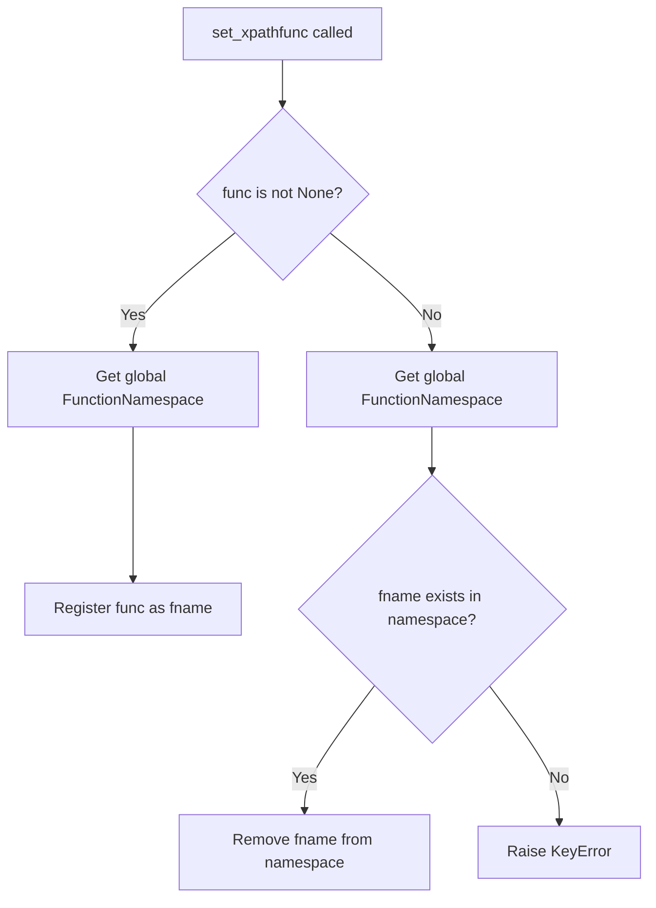
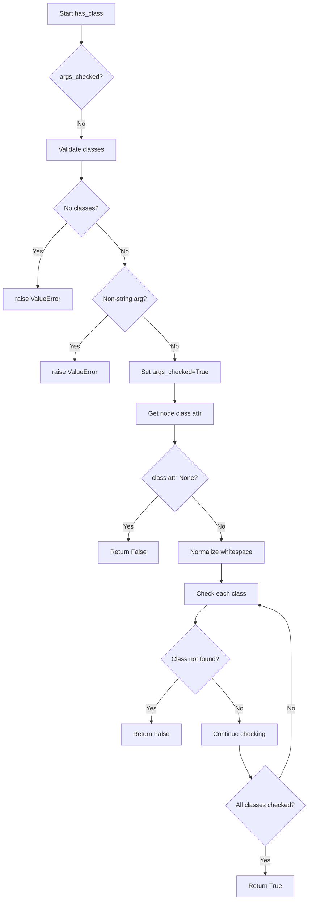

# `xpathfuncs.py`

## `parsel.xpathfuncs.set_xpathfunc` · *function*

## Summary:
Registers or unregisters a custom XPath function with the global XPath function namespace.

## Description:
This function provides a mechanism to extend XPath evaluation with custom functions by registering them in the global lxml XPath function namespace. It allows adding new XPath functions or removing existing ones, making them available for use in XPath expressions throughout the application. This is particularly useful for extending XPath capabilities beyond the standard set of functions provided by lxml.

## Args:
    fname (str): The name of the XPath function to register or unregister. This should be a valid XPath function name.
    func (Optional[Callable]): The function implementation to register, or None to unregister. When None, attempts to remove the function from the namespace.

## Returns:
    None: This function does not return any value.

## Raises:
    KeyError: When attempting to unregister a function that does not exist in the namespace (when func is None and fname is not registered).

## Constraints:
    Preconditions:
        - The fname parameter must be a valid string representing a function name.
        - The func parameter must either be a callable object or None.
    Postconditions:
        - If func is not None, the function is registered in the global XPath namespace under fname.
        - If func is None, the function is removed from the global XPath namespace if it existed, otherwise raises KeyError.

## Side Effects:
    - Mutates the global XPath function namespace in lxml.
    - This affects all subsequent XPath evaluations in the application that reference the registered function name.
    - Changes to the global namespace are visible across the entire application.

## Control Flow:


## Examples:
    # Register a custom XPath function
    def my_func(context, arg1, arg2):
        return arg1 + arg2
    
    set_xpathfunc('custom:add', my_func)
    
    # Unregister a custom XPath function
    set_xpathfunc('custom:add', None)
    
    # Usage in XPath expression:
    # result = selector.xpath('//element/custom:add(./@attr, "suffix")')

## `parsel.xpathfuncs.setup` · *function*

## Summary:
Initializes the parsel XPath function registry by registering the 'has-class' function.

## Description:
This function serves as the entry point for setting up custom XPath functions within the parsel library. It registers the 'has-class' XPath function with the global XPath function namespace, making it available for use in XPath expressions when parsing HTML documents. The function is designed to be called once during application initialization to ensure the custom XPath functions are properly available.

## Args:
    None

## Returns:
    None: This function does not return any value.

## Raises:
    None: This function does not raise any exceptions directly.

## Constraints:
    Preconditions:
        - The parsel.xpathfuncs module must be properly imported and initialized.
        - The 'has-class' function must be defined and available in the module scope.
        - The lxml library must be properly installed and functional.
    Postconditions:
        - The 'has-class' XPath function is registered in the global XPath namespace.
        - The function can now be used in XPath expressions like `//*[has-class('class1', 'class2')]`.

## Side Effects:
    - Mutates the global XPath function namespace in lxml by registering the 'has-class' function.
    - This change affects all subsequent XPath evaluations in the application that reference the 'has-class' function name.
    - The registration is permanent for the lifetime of the application process.

## Control Flow:
```mermaid
flowchart TD
    A[setup() called] --> B[Call set_xpathfunc]
    B --> C[Register "has-class" with has_class function]
    C --> D[Function completes successfully]
```

## Examples:
    # Typical usage during application startup
    from parsel.xpathfuncs import setup
    setup()
    
    # After setup, 'has-class' can be used in XPath expressions
    # selector.xpath('//div[has-class("btn", "primary")]')
```

## `parsel.xpathfuncs.has_class` · *function*

## Summary:
Checks if an HTML element has all specified CSS classes assigned to it.

## Description:
This function evaluates whether a given HTML node contains all the specified CSS classes in its 'class' attribute. It's designed to work within XPath contexts and handles various whitespace normalization scenarios according to HTML5 standards. The function performs lazy validation of arguments and normalizes whitespace in class names.

## Args:
    context (Any): The XPath evaluation context containing the node being evaluated and evaluation metadata.
    *classes (str): Variable number of CSS class names to check for existence on the node.

## Returns:
    bool: True if the node has all specified classes, False otherwise.

## Raises:
    ValueError: When no class arguments are provided or when any argument is not a string.

## Constraints:
    Preconditions:
        - The context parameter must be a valid XPath evaluation context object.
        - The context must have a context_node with a 'class' attribute.
        - All class arguments must be strings.
    Postconditions:
        - The function performs lazy validation of arguments only once per XPath evaluation.
        - Whitespace in class names is normalized according to HTML5 standards.

## Side Effects:
    - Modifies the eval_context dictionary by setting "args_checked" flag after initial validation.
    - Uses global w3lib.html.HTML5_WHITESPACE constant for whitespace normalization.

## Control Flow:


## Examples:
    >>> # Assuming context with node having class="btn primary"
    >>> has_class(context, "btn", "primary")  # Returns True
    >>> has_class(context, "btn", "secondary")  # Returns False
    >>> has_class(context, "btn")  # Returns True

