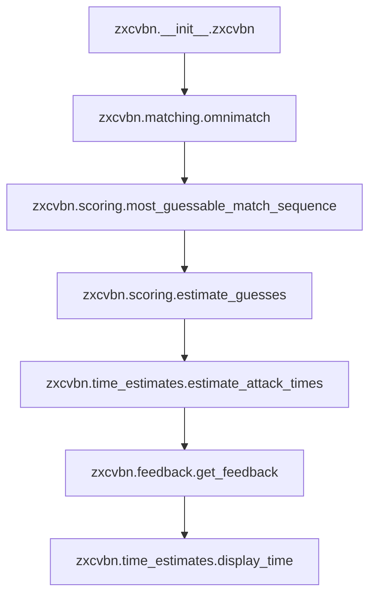

# `zxcvbn`

## Tree:
zxcvbn/
├── __init__.py
├── __main__.py
├── feedback.py
├── matching.py
├── scoring.py
└── time_estimates.py

## Role:
Provides password strength estimation and feedback by analyzing common patterns and guessability in passwords.

## Description:
The zxcvbn module implements a password strength estimator that goes beyond simple complexity checks to analyze real-world password patterns and guessability. It identifies common mistakes like dictionary words, sequences, and predictable substitutions to provide accurate strength assessments and actionable feedback.

Primary consumers:
- Command-line interface (via __main__.py)
- Web applications using the zxcvbn API
- Any application requiring robust password strength analysis

The module is organized around three core phases:
1. Pattern matching (identifying common password weaknesses)
2. Guess estimation (calculating how long it would take to crack)
3. Feedback generation (providing user guidance)

## Components:
- zxcvbn.__init__.zxcvbn: Main entry point that orchestrates the entire password strength analysis pipeline
- zxcvbn.__main__.JSONEncoder: Custom JSON encoder for serializing complex objects
- zxcvbn.feedback: Generates user feedback based on password analysis results
- zxcvbn.matching: Identifies various password patterns (dictionary words, sequences, etc.)
- zxcvbn.scoring: Calculates guess counts and entropy for identified patterns
- zxcvbn.time_estimates: Converts guess counts into time estimates for different attack scenarios

## Public API:
- zxcvbn(password, user_inputs=None): Main function that returns password strength analysis
- zxcvbn.__main__.JSONEncoder: Custom JSON encoder for serialization

## Dependencies:
Internal:
- matching: Provides pattern matching capabilities
- scoring: Handles guess estimation calculations
- time_estimates: Converts guesses to time estimates
- feedback: Generates user feedback

External:
- datetime: Used for timing analysis
- decimal: Used for precise numerical calculations

## Constraints:
- Password input must be a string
- User inputs should be strings or convertible to strings
- All internal functions assume valid data structures from previous stages
- Thread-safe: No shared mutable state between invocations

---

## Files

- [`__init__.py`](zxcvbn/__init__.md)
- [`__main__.py`](zxcvbn/__main__.md)
- [`feedback.py`](zxcvbn/feedback.md)
- [`matching.py`](zxcvbn/matching.md)
- [`scoring.py`](zxcvbn/scoring.md)
- [`time_estimates.py`](zxcvbn/time_estimates.md)

