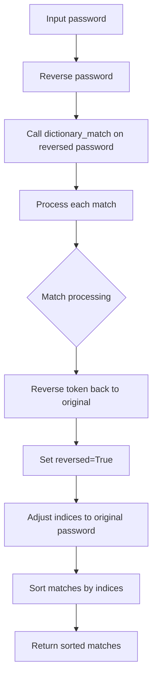
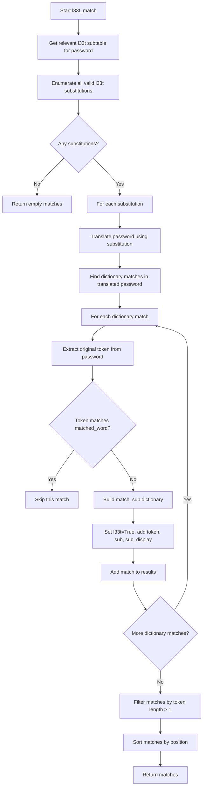
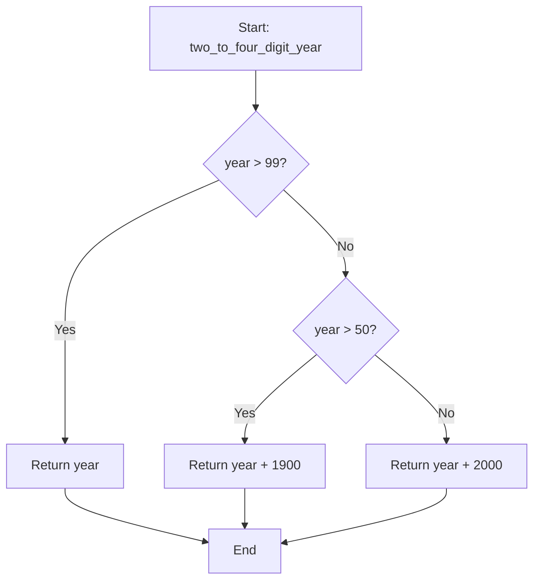

# `matching.py`

## `zxcvbn.matching.build_ranked_dict` · *function*

## Summary:
Creates a dictionary mapping words to their ranked positions in an ordered list, starting from position 1.

## Description:
This function transforms an ordered list of words into a dictionary where each word is mapped to its position in the list, with indexing starting at 1 instead of the typical 0-based indexing. It is used internally by the zxcvbn password strength estimation library to create lookup tables for frequency-based analysis.

## Args:
    ordered_list (list[str]): A list of words sorted in descending order of frequency or importance.

## Returns:
    dict[str, int]: A dictionary where keys are words from the input list and values are their 1-based indices in the list.

## Raises:
    None

## Constraints:
    Preconditions:
        - The input `ordered_list` must be iterable and contain hashable elements (strings).
    Postconditions:
        - The returned dictionary will have exactly as many entries as the input list.
        - All keys in the returned dictionary will be unique and correspond to elements in the input list.
        - Values in the returned dictionary will be integers starting from 1 and incrementing by 1 for each subsequent element.

## Side Effects:
    None

## Control Flow:
```mermaid
flowchart TD
    A[Start build_ranked_dict] --> B[Initialize empty dict]
    B --> C[Iterate over ordered_list with enumerate(start=1)]
    C --> D{Next word available?}
    D -- Yes --> E[Map word to its index]
    E --> F[Add to result dict]
    F --> G{More words?}
    G -- Yes --> C
    G -- No --> H[Return result dict]
    D -- No --> H
```

## Examples:
    >>> build_ranked_dict(['apple', 'banana', 'cherry'])
    {'apple': 1, 'banana': 2, 'cherry': 3}
    
    >>> build_ranked_dict([])
    {}

## `zxcvbn.matching.add_frequency_lists` · *function*

## Summary:
Populates the global RANKED_DICTIONARIES registry with frequency-based word rankings from provided lists.

## Description:
This function takes a dictionary of named frequency lists and converts each list into a ranked dictionary using the build_ranked_dict helper function. It then stores these ranked dictionaries in the global RANKED_DICTIONARIES registry, making them available for password strength estimation calculations. The function serves as a centralized mechanism for loading and organizing frequency data used by the zxcvbn algorithm.

## Args:
    frequency_lists_ (dict[str, list[str]]): A dictionary where keys are string names identifying frequency lists and values are lists of words sorted in descending order of frequency or importance.

## Returns:
    None: This function does not return any value. It operates by side effect on the global RANKED_DICTIONARIES registry.

## Raises:
    None: This function does not explicitly raise any exceptions.

## Constraints:
    Preconditions:
        - The input dictionary must be iterable and contain string keys.
        - Each value in the input dictionary must be iterable and contain hashable elements (strings).
    Postconditions:
        - The global RANKED_DICTIONARIES dictionary will be updated with new entries for each key in the input dictionary.
        - Each entry in RANKED_DICTIONARIES will be a dictionary mapping words to their 1-based rank positions.

## Side Effects:
    - Mutates the global RANKED_DICTIONARIES registry by adding new key-value pairs.
    - No external I/O operations or service calls occur.

## Control Flow:
```mermaid
flowchart TD
    A[Start add_frequency_lists] --> B[Iterate over frequency_lists_ items]
    B --> C{Next name-list pair available?}
    C -- Yes --> D[Extract name and list]
    D --> E[Call build_ranked_dict on list]
    E --> F[Store result in RANKED_DICTIONARIES[name]]
    F --> G{More pairs?}
    G -- Yes --> B
    G -- No --> H[End]
    C -- No --> H
```

## Examples:
    >>> from zxcvbn.matching import add_frequency_lists, RANKED_DICTIONARIES
    >>> sample_lists = {
    ...     'common_words': ['the', 'be', 'to'],
    ...     'tech_terms': ['code', 'data', 'algorithm']
    ... }
    >>> add_frequency_lists(sample_lists)
    >>> print(RANKED_DICTIONARIES['common_words'])
    {'the': 1, 'be': 2, 'to': 3}
```

## `zxcvbn.matching.omnimatch` · *function*

## Summary:
Performs comprehensive pattern matching on a password by applying all available matching strategies and returning sorted results.

## Description:
The `omnimatch` function serves as the central coordinator for all pattern matching operations in the zxcvbn password strength estimator. It sequentially applies eight distinct matching strategies to identify various types of patterns in a password, including dictionary words, reversed words, l33t substitutions, spatial patterns (keyboard layouts), repeated sequences, sequential characters, regular expressions, and date formats. This function aggregates results from all matching strategies and returns them sorted by their position in the password.

This function is called by the main password strength estimation pipeline to gather all possible pattern matches before computing guessability estimates. It's extracted into its own function to provide a clean interface for the entire matching process, ensuring consistency and maintainability of the pattern detection system.

## Args:
    password (str): The password string to analyze for various pattern types
    _ranked_dictionaries (dict, optional): Dictionary mapping dictionary names to ranked word lists. Defaults to RANKED_DICTIONARIES global constant.

## Returns:
    list[dict]: A list of match dictionaries from all matching strategies, sorted by position in the password. Each match dictionary contains:
        - pattern: Type of pattern matched ('dictionary', 'date', 'regex', 'repeat', 'sequence', 'spatial', 'l33t')
        - i, j: Start and end indices of the matched token in the password
        - Additional fields specific to each pattern type (e.g., token, matched_word, rank, separator, etc.)

## Raises:
    None explicitly raised - all matching functions handle their own exceptions internally

## Constraints:
    Preconditions:
        - Password must be a string
        - _ranked_dictionaries must be a dictionary mapping strings to dictionaries
        
    Postconditions:
        - All returned matches will be sorted by their starting index (i) and then ending index (j)
        - All matching strategies will be applied regardless of previous results
        - The returned list will contain all matches from all strategies combined

## Side Effects:
    None - operates purely on input parameters and returns computed results

## Control Flow:
```mermaid
flowchart TD
    A[Start omnimatch] --> B[Initialize empty matches list]
    B --> C[Iterate through all matching strategies]
    C --> D{Current matcher}
    D --> E[dictionary_match]
    D --> F[reverse_dictionary_match]
    D --> G[l33t_match]
    D --> H[spatial_match]
    D --> I[repeat_match]
    D --> J[sequence_match]
    D --> K[regex_match]
    D --> L[date_match]
    E --> M[Apply matcher to password]
    M --> N[Extend matches list with results]
    N --> O[Continue to next matcher]
    O --> C
    C --> P[Sort all matches by (i,j)]
    P --> Q[Return sorted matches]
```

## Examples:
    >>> omnimatch("p@ssw0rd123")
    [{'pattern': 'dictionary', 'i': 0, 'j': 5, 'token': 'p@ssw0rd', 'matched_word': 'password', 'rank': 123, 'dictionary_name': 'common', 'reversed': False, 'l33t': True, 'sub': {'@': 'a'}, 'sub_display': '@ -> a'}, {'pattern': 'repeat', 'i': 6, 'j': 8, 'token': '123', 'base_token': '123', 'base_guesses': 456, 'base_matches': [...], 'repeat_count': 1.0}]

## `zxcvbn.matching.dictionary_match` · *function*

*No documentation generated.*

## `zxcvbn.matching.reverse_dictionary_match` · *function*

## Summary:
Finds dictionary matches in a password by checking for reversed substrings against ranked dictionaries.

## Description:
This function identifies dictionary-based patterns in a password by reversing the input string and applying the standard dictionary matching algorithm. It's used to detect common words or phrases that appear in reverse order within passwords, which is a common pattern in weak password construction. The function serves as a complementary matching strategy to the standard forward dictionary matching.

## Args:
    password (str): The password string to analyze for dictionary matches
    _ranked_dictionaries (dict): A mapping of dictionary names to ranked word dictionaries. Defaults to RANKED_DICTIONARIES global constant.

## Returns:
    list[dict]: A list of match dictionaries containing pattern information including:
        - pattern: 'dictionary' indicating the match type
        - i, j: Start and end indices in the original password
        - token: The matched substring from the original password
        - matched_word: The lowercase version of the matched word
        - rank: The ranking of the matched word in its dictionary
        - dictionary_name: Name of the dictionary where the match was found
        - reversed: Boolean flag set to True for reverse matches
        - l33t: Boolean flag indicating if l33t substitution was applied

## Raises:
    None explicitly raised - relies on underlying dictionary_match function behavior

## Constraints:
    Preconditions:
        - Password must be a string
        - _ranked_dictionaries must be a dictionary mapping names to ranked dictionaries
    Postconditions:
        - All returned matches have their indices adjusted to reflect original password position
        - All returned matches have 'reversed' flag set to True
        - Matches are sorted by starting index (i) and ending index (j)

## Side Effects:
    None - operates purely on input parameters and returns computed results

## Control Flow:


## Examples:
    >>> reverse_dictionary_match("hello123")
    [{'pattern': 'dictionary', 'i': 0, 'j': 4, 'token': 'hello', 'matched_word': 'hello', 'rank': 123, 'dictionary_name': 'passwords', 'reversed': True, 'l33t': False}]

## `zxcvbn.matching.relevant_l33t_subtable` · *function*

## Summary:
Filters a l33t substitution table to include only letters that have relevant substitutions present in the given password.

## Description:
This function takes a password and a l33t substitution table (mapping letters to their possible substitutions) and returns a filtered version of the table containing only those letters whose substitutions actually appear in the password. This optimization prevents unnecessary processing of potential substitutions that don't exist in the password.

The function is used in the password strength estimation process to efficiently identify which l33t substitutions might be relevant for guessing attacks.

## Args:
    password (str): The password string to check for character presence
    table (dict): A dictionary mapping letters to lists of possible l33t substitutions

## Returns:
    dict: A filtered dictionary containing only letters from the original table that have at least one substitution present in the password

## Raises:
    None

## Constraints:
    Preconditions:
        - password must be a string
        - table must be a dictionary with string keys and list values
    Postconditions:
        - The returned dictionary will only contain keys that were present in the original table
        - All values in the returned dictionary will be non-empty lists
        - The returned dictionary will be a subset of the original table

## Side Effects:
    None

## Control Flow:
```mermaid
flowchart TD
    A[Start relevant_l33t_subtable] --> B[Create password_chars set from password]
    B --> C[Initialize empty subtable]
    C --> D[Iterate over table items (letter, subs)]
    D --> E[Filter subs to find those in password_chars]
    E --> F{Any relevant subs found?}
    F -->|Yes| G[Add letter:relevant_subs to subtable]
    G --> H[Continue to next item]
    F -->|No| H
    H --> I{More table items?}
    I -->|Yes| D
    I -->|No| J[Return subtable]
```

## Examples:
    >>> table = {'a': ['@', '4'], 'b': ['8', '6']}
    >>> relevant_l33t_subtable("hello @world", table)
    {'a': ['@']}
    >>> relevant_l33t_subtable("test", table)
    {}
    >>> relevant_l33t_subtable("hello 8world", table)
    {'b': ['8']}
```

## `zxcvbn.matching.enumerate_l33t_subs` · *function*

## Summary:
Generates all valid combinations of l33t character substitutions from a substitution table, ensuring no duplicate l33t characters appear in any combination.

## Description:
This function computes all possible valid combinations of l33t (leet) character substitutions for a given mapping table. It takes a dictionary where keys are regular characters and values are lists of possible l33t equivalents, then generates all unique combinations where each l33t character appears only once. This prevents invalid mappings such as using '3' to represent both 'e' and 'a' simultaneously.

The function is part of the zxcvbn password strength estimator's pattern matching system, specifically designed to handle l33t substitutions in password analysis.

## Args:
    table (dict): A dictionary mapping regular characters to lists of l33t equivalents. Keys are characters, values are lists of l33t characters that can substitute them.

## Returns:
    list[dict]: A list of dictionaries representing valid substitution combinations. Each dictionary maps l33t characters to their corresponding regular characters, ensuring no l33t character is duplicated across combinations.

## Raises:
    None explicitly raised.

## Constraints:
    Preconditions:
        - The input table must be a dictionary with string keys and list values
        - Each list value must contain valid l33t characters
    
    Postconditions:
        - All returned dictionaries will have unique l33t characters as keys
        - No dictionary will contain conflicting mappings (same l33t character mapped to multiple regular characters)

## Side Effects:
    None.

## Control Flow:
```mermaid
flowchart TD
    A[Start enumerate_l33t_subs] --> B[Get keys from table]
    B --> C[Initialize subs = [[]]]
    C --> D[Call recursive helper(keys, subs)]
    D --> E{keys empty?}
    E -->|Yes| F[Return subs]
    E -->|No| G[Process first_key]
    G --> H[For each l33t_chr in table[first_key]]
    H --> I[For each existing sub in subs]
    I --> J{Is l33t_chr already used?}
    J -->|No| K[Create new sub with l33t_chr added]
    J -->|Yes| L[Create two alternatives: replace or skip]
    K --> M[Add to next_subs]
    L --> N[Remove old mapping and add new]
    N --> O[Add both to next_subs]
    O --> P[Deduplicate next_subs]
    P --> Q[Recursive call with rest_keys]
    Q --> R[Convert association lists to dictionaries]
    R --> S[Return final list of substitution dictionaries]
```

## Examples:
    Example usage with a simple substitution table:
    ```python
    table = {'e': ['3', '€'], 'a': ['@', '4']}
    result = enumerate_l33t_subs(table)
    # Returns [{'3': 'e', '@': 'a'}, {'3': 'e', '4': 'a'}, {'€': 'e', '@': 'a'}, {'€': 'e', '4': 'a'}]
    ```

## `zxcvbn.matching.translate` · *function*

## Summary:
Transforms characters in a string according to a character mapping dictionary, leaving unmapped characters unchanged.

## Description:
The translate function applies a character substitution mapping to a given string. It processes each character in the input string and replaces it with its mapped value if a mapping exists, otherwise preserving the original character. This utility function is used internally by the zxcvbn password strength estimation library to normalize and preprocess character sequences before analysis.

## Args:
    string (str): The input string to be translated
    chr_map (dict): A dictionary mapping characters to their replacement values

## Returns:
    str: A new string with characters replaced according to the mapping, or the original string if no mappings apply

## Raises:
    None

## Constraints:
    Preconditions:
        - The input string must be a valid string object
        - The chr_map must be a dictionary-like object with hashable keys
    Postconditions:
        - The returned string has the same length as the input string
        - Characters not present in chr_map remain unchanged in the result

## Side Effects:
    None

## Control Flow:
```mermaid
flowchart TD
    A[Start translate] --> B{char in chr_map?}
    B -- Yes --> C[Append chr_map[char]]
    B -- No --> D[Append char]
    C --> E[Next char]
    D --> E
    E --> F{End of string?}
    F -- No --> B
    F -- Yes --> G[Return joined chars]
```

## Examples:
    >>> translate("hello", {'e': '3', 'o': '0'})
    'h3ll0'
    >>> translate("abc", {'x': 'y'})
    'abc'

## `zxcvbn.matching.l33t_match` · *function*

## Summary:
Identifies and analyzes l33t (leet) substitutions in passwords by matching dictionary words with character substitutions.

## Description:
The l33t_match function detects patterns where dictionary words in a password have been obfuscated using l33t (1337) substitutions, such as replacing 'e' with '3' or 'a' with '@'. It systematically tries all valid combinations of l33t character substitutions for characters present in the password, then checks if the resulting transformed password contains dictionary words. This enables the password strength estimator to recognize and appropriately score common leet substitutions that attackers often use.

This function is called as part of the broader pattern matching phase in zxcvbn's password strength analysis, specifically when identifying l33t patterns that could be exploited in guessing attacks.

## Args:
    password (str): The password string to analyze for l33t patterns
    _ranked_dictionaries (dict): Dictionary mapping dictionary names to ranked word lists (default: RANKED_DICTIONARIES)
    _l33t_table (dict): Mapping of regular characters to their l33t equivalents (default: L33T_TABLE)

## Returns:
    list[dict]: A list of match dictionaries describing detected l33t patterns, each containing:
        - pattern: 'dictionary' (indicating this is a dictionary match)
        - i, j: Start and end indices of the matched token in the password
        - token: The original substring from the password that matched
        - matched_word: The dictionary word that was matched (lowercase)
        - rank: Position of the matched word in the frequency ranking
        - dictionary_name: Name of the dictionary where the word was found
        - reversed: False (l33t patterns are not reversed)
        - l33t: True (indicates this is a l33t pattern)
        - sub: Dictionary mapping l33t characters to their replacements
        - sub_display: String representation of the substitutions for display purposes

## Raises:
    None explicitly raised.

## Constraints:
    Preconditions:
        - Password must be a string
        - _ranked_dictionaries must be a dictionary mapping strings to dictionaries
        - _l33t_table must be a dictionary mapping characters to lists of l33t equivalents
    
    Postconditions:
        - All returned matches will have tokens of length > 1
        - Matches will be sorted by position in the password (first by start index, then end index)
        - All matches will have the 'l33t' field set to True

## Side Effects:
    None.

## Control Flow:


## Examples:
    >>> l33t_match("p@ssw0rd")
    [{'pattern': 'dictionary', 'i': 0, 'j': 5, 'token': 'p@ssw0rd', 'matched_word': 'password', 'rank': 123, 'dictionary_name': 'common', 'reversed': False, 'l33t': True, 'sub': {'@': 'a', '0': 'o'}, 'sub_display': '@ -> a, 0 -> o'}]
    
    >>> l33t_match("h3ll0")
    [{'pattern': 'dictionary', 'i': 0, 'j': 4, 'token': 'h3ll0', 'matched_word': 'hello', 'rank': 456, 'dictionary_name': 'common', 'reversed': False, 'l33t': True, 'sub': {'3': 'e', '0': 'o'}, 'sub_display': '3 -> e, 0 -> o'}]
```

## `zxcvbn.matching.repeat_match` · *function*

## Summary:
Identifies and analyzes repeated character patterns in passwords, detecting sequences that consist of a base token repeated multiple times.

## Description:
The `repeat_match` function scans a password for repeated character patterns, where a substring is followed by one or more repetitions of itself. It identifies these patterns and provides detailed analysis including the base token, repetition count, and guessability estimates for the base token. This function is part of the pattern matching phase in zxcvbn's password strength estimation algorithm, specifically designed to detect and score repeated character sequences like "abcabcabc" or "123123".

The function is called by `omnimatch` as part of the comprehensive pattern matching process that identifies various password weaknesses. It's extracted into its own function to encapsulate the logic for detecting repeated patterns, making the overall matching system modular and maintainable.

## Args:
    password (str): The password string to analyze for repeated patterns
    _ranked_dictionaries (dict, optional): Dictionary mapping dictionary names to ranked word lists. Defaults to RANKED_DICTIONARIES global constant.

## Returns:
    list[dict]: A list of match dictionaries describing detected repeated patterns, each containing:
        - pattern: 'repeat' (indicating this is a repeat pattern)
        - i, j: Start and end indices of the matched token in the password
        - token: The full repeated substring from the password
        - base_token: The base substring that is being repeated
        - base_guesses: Guess count for the base token
        - base_matches: Match sequence for the base token
        - repeat_count: Number of times the base token is repeated (float)

## Raises:
    None explicitly raised.

## Constraints:
    Preconditions:
        - Password must be a string
        - _ranked_dictionaries must be a dictionary mapping strings to dictionaries
        
    Postconditions:
        - All returned matches will have tokens of length > 1
        - Matches will be sorted by position in the password (first by start index, then end index)
        - All matches will have the 'pattern' field set to 'repeat'

## Side Effects:
    None.

## Control Flow:
```mermaid
flowchart TD
    A[Start repeat_match] --> B[Initialize regex patterns]
    B --> C[Initialize matches list and last_index]
    C --> D[While last_index < len(password)]
    D --> E[Search for greedy repeat pattern]
    E --> F[Search for lazy repeat pattern]
    F --> G{Greedy match found?}
    G -->|No| H[Break loop]
    G -->|Yes| I{Greedy pattern longer?}
    I -->|Yes| J[Use greedy match, extract base_token]
    I -->|No| K[Use lazy match, extract base_token]
    J --> L[Analyze base_token with most_guessable_match_sequence]
    K --> L
    L --> M[Create match dict with pattern info]
    M --> N[Append match to results]
    N --> O[Update last_index]
    O --> D
    D --> P[Return matches]
```

## Examples:
    >>> repeat_match("abcabcabc")
    [{'pattern': 'repeat', 'i': 0, 'j': 8, 'token': 'abcabcabc', 'base_token': 'abc', 'base_guesses': 123, 'base_matches': [...], 'repeat_count': 3.0}]
    
    >>> repeat_match("123123")
    [{'pattern': 'repeat', 'i': 0, 'j': 5, 'token': '123123', 'base_token': '123', 'base_guesses': 456, 'base_matches': [...], 'repeat_count': 2.0}]
```

## `zxcvbn.matching.spatial_match` · *function*

*No documentation generated.*

## `zxcvbn.matching.spatial_match_helper` · *function*

*No documentation generated.*

## `zxcvbn.matching.sequence_match` · *function*

*No documentation generated.*

## `zxcvbn.matching.regex_match` · *function*

*No documentation generated.*

## `zxcvbn.matching.date_match` · *function*

*No documentation generated.*

## `zxcvbn.matching.map_ints_to_dmy` · *function*

*No documentation generated.*

## `zxcvbn.matching.map_ints_to_dm` · *function*

## Summary:
Maps a pair of integers to day and month values, determining the most likely date interpretation.

## Description:
This function takes a sequence of two integers and attempts to interpret them as a date by testing both possible orderings (first integer as day, second as month, and vice versa). It returns a dictionary mapping 'day' and 'month' keys to their respective values when the integers form valid date components.

## Args:
    ints (list or tuple of int): A sequence containing exactly two integers to be interpreted as potential day and month values.

## Returns:
    dict or None: A dictionary with keys 'day' and 'month' when valid date components are found, otherwise None.

## Raises:
    None explicitly raised.

## Constraints:
    Precondition: The input must be a sequence of exactly two integers.
    Postcondition: If valid, returns a dictionary with 'day' (1-31) and 'month' (1-12) keys; otherwise returns None.

## Side Effects:
    None.

## Control Flow:
```mermaid
flowchart TD
    A[Start map_ints_to_dm] --> B{Test first ordering (d,m)}
    B --> C{1 ≤ d ≤ 31 AND 1 ≤ m ≤ 12?}
    C -- Yes --> D[Return {'day': d, 'month': m}]
    C -- No --> E{Test reversed ordering (m,d)}
    E --> F{1 ≤ m ≤ 31 AND 1 ≤ d ≤ 12?}
    F -- Yes --> G[Return {'day': m, 'month': d}]
    F -- No --> H[Return None]
```

## Examples:
    >>> map_ints_to_dm([15, 3])
    {'day': 15, 'month': 3}
    
    >>> map_ints_to_dm([3, 15])
    {'day': 3, 'month': 15}
    
    >>> map_ints_to_dm([31, 13])
    None
```

## `zxcvbn.matching.two_to_four_digit_year` · *function*

## Summary:
Converts a 2-4 digit year representation into a full 4-digit year format.

## Description:
This function handles the conversion of abbreviated year representations (2-4 digits) into full 4-digit years. It is designed to interpret 2-digit years based on common conventions where years 50 and above are interpreted as 19xx and years below 50 as 20xx. Years with 3 or 4 digits are returned unchanged.

## Args:
    year (int): A year represented as 2-4 digits. Must be a positive integer.

## Returns:
    int: A 4-digit year representation. If the input was already 3 or 4 digits, it is returned unchanged. Otherwise, it applies the century interpretation logic.

## Raises:
    None

## Constraints:
    Precondition: The input `year` must be a positive integer.
    Postcondition: The returned value is always a 4-digit year (between 1000 and 9999).

## Side Effects:
    None

## Control Flow:


## Examples:
    >>> two_to_four_digit_year(25)
    2025
    >>> two_to_four_digit_year(75)
    1975
    >>> two_to_four_digit_year(1995)
    1995
    >>> two_to_four_digit_year(1234)
    1234
```

