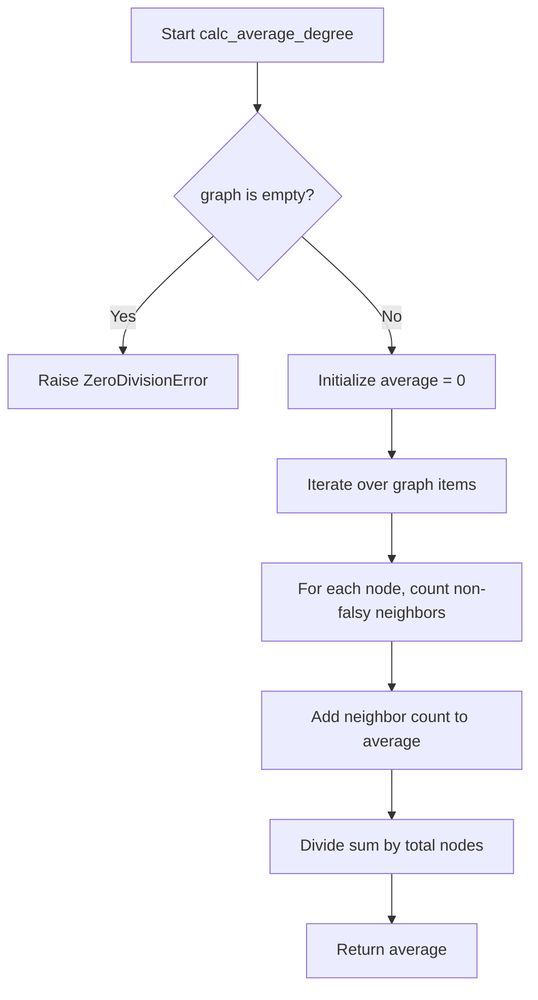
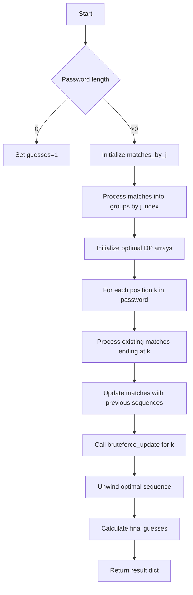

# `scoring.py`

## `zxcvbn.scoring.calc_average_degree` · *function*

## Summary:
Calculates the average degree of nodes in a graph by counting non-falsy neighbors for each node.

## Description:
Computes the average number of non-falsy neighbors per node in a graph structure. This function iterates through each node in the graph, counts its non-falsy neighbors (using truthiness evaluation), and returns the average count across all nodes.

## Args:
    graph (dict): A dictionary where keys represent nodes and values are lists of neighboring nodes.

## Returns:
    float: The average degree of all nodes in the graph, calculated as total count of non-falsy neighbors divided by total number of nodes.

## Raises:
    ZeroDivisionError: When the graph is empty (contains no nodes).

## Constraints:
    Preconditions:
        - The input graph must be a dictionary
        - Each value in the graph must be iterable (list-like structure)
    Postconditions:
        - Returns a non-negative float value
        - If graph is empty, raises ZeroDivisionError

## Side Effects:
    None

## Control Flow:


## Examples:
    >>> calc_average_degree({'a': ['b', 'c'], 'b': ['a'], 'c': ['a']})
    1.3333333333333333
    >>> calc_average_degree({})
    ZeroDivisionError: division by zero

## `zxcvbn.scoring.nCk` · *function*

## Summary:
Computes the binomial coefficient "n choose k" (nCk) efficiently using iterative multiplication and division.

## Description:
This function calculates the mathematical combination formula C(n,k) = n!/(k!(n-k)!), which represents the number of ways to choose k items from n items without regard to order. It's optimized to avoid computing large factorials directly by using an iterative approach that multiplies and divides incrementally.

## Args:
    n (int): Total number of items, must be non-negative integer
    k (int): Number of items to choose, must be non-negative integer

## Returns:
    int: The binomial coefficient C(n,k), representing the number of combinations of n items taken k at a time. Returns 0 when k > n, and 1 when k = 0.

## Raises:
    None

## Constraints:
    Preconditions:
        - Both n and k must be non-negative integers
        - k must not exceed n for meaningful results (though function handles k > n gracefully)
    Postconditions:
        - Returns an integer value representing the binomial coefficient
        - For k=0, always returns 1 regardless of n value
        - For k>n, always returns 0

## Side Effects:
    None

## Control Flow:
```mermaid
flowchart TD
    A[Start nCk(n,k)] --> B{k > n?}
    B -- Yes --> C[Return 0]
    B -- No --> D{k == 0?}
    D -- Yes --> E[Return 1]
    D -- No --> F[Initialize r=1]
    F --> G[Loop d from 1 to k]
    G --> H[r *= n]
    H --> I[r /= d]
    I --> J[n -= 1]
    J --> K{d < k?}
    K -- Yes --> G
    K -- No --> L[Return r]
```

## Examples:
    >>> nCk(5, 2)
    10
    >>> nCk(10, 0)
    1
    >>> nCk(3, 5)
    0
```

## `zxcvbn.scoring.most_guessable_match_sequence` · *function*

## Summary:
Finds the most guessable match sequence for a password by analyzing potential pattern matches and computing optimal guessing strategies.

## Description:
This function implements a dynamic programming algorithm to determine the most likely sequence of pattern matches that would be used to guess a password. It evaluates various match patterns and computes the minimum number of guesses required based on the optimal combination of these patterns.

The function is designed to be called by the main password strength estimation logic in the zxcvbn library, specifically as part of the overall password strength calculation pipeline. It processes a list of potential pattern matches and determines the sequence that would require the fewest guesses to crack.

## Args:
    password (str): The password string to analyze for matching patterns
    matches (list[dict]): List of potential pattern matches, each containing keys like 'i', 'j', 'pattern', 'token'
    _exclude_additive (bool): Internal flag to control additive guess calculation behavior, defaults to False

## Returns:
    dict: A dictionary containing:
        - 'password' (str): The input password
        - 'guesses' (Decimal): The estimated number of guesses required to crack the password
        - 'guesses_log10' (float): Logarithm base 10 of the guess count
        - 'sequence' (list[dict]): The optimal sequence of pattern matches that would be used to guess the password

## Raises:
    None explicitly raised, though TypeError may occur during iteration over matches if matches is not iterable

## Constraints:
    Preconditions:
        - Password should be a string
        - Matches should be a list of dictionaries with required keys ('i', 'j', 'pattern', 'token')
        - Each match should have valid indices (i <= j) and be within password bounds
    
    Postconditions:
        - Returns a dictionary with all required keys present
        - Sequence contains valid match objects with proper structure
        - Guesses value represents a reasonable estimate of cracking attempts

## Side Effects:
    None

## Control Flow:


## Examples:
    # Basic usage with sample matches
    password = "password123"
    matches = [
        {'pattern': 'bruteforce', 'token': 'pass', 'i': 0, 'j': 3},
        {'pattern': 'dictionary', 'token': 'word', 'i': 4, 'j': 7}
    ]
    result = most_guessable_match_sequence(password, matches)
    # Returns dictionary with password, guesses, guesses_log10, and sequence

## `zxcvbn.scoring.estimate_guesses` · *function*

*No documentation generated.*

## `zxcvbn.scoring.bruteforce_guesses` · *function*

*No documentation generated.*

## `zxcvbn.scoring.dictionary_guesses` · *function*

## Summary:
Calculates the total number of dictionary-based guesses required to crack a password token by combining base rank with capitalization, leet-speak, and reversal variations.

## Description:
This function computes the total guess count for a dictionary match by multiplying the base rank (from the word's position in the dictionary) by various transformation factors. It serves as a core component in zxcvbn's password strength estimation algorithm, aggregating the impact of common password modifications like uppercase letters, leet-speak substitutions, and reversed words. The function is extracted to centralize the calculation logic and maintain clean separation between match data processing and entropy computation.

## Args:
    match (dict): A dictionary containing match information with the following keys:
        - 'rank' (int): The position of the matched word in the dictionary (base guess count)
        - 'token' (str): The matched word being analyzed
        - 'reversed' (bool, optional): Indicates if the word was found in reverse order
        - 'l33t' (bool, optional): Indicates if leet-speak substitutions were applied
        - 'sub' (dict, optional): Mapping of substituted characters to originals

## Returns:
    int: The total number of possible guesses required to crack the matched token, accounting for:
         - Base dictionary rank
         - Uppercase letter arrangement variations
         - Leet-speak character substitution variations  
         - Reversed word variations (multiplier of 2 if reversed, 1 otherwise)

## Raises:
    None

## Constraints:
    Preconditions:
        - The match dictionary must contain a 'rank' key with an integer value
        - The match dictionary must contain a 'token' key with a string value
        - The match dictionary may optionally contain 'reversed', 'l33t', and 'sub' keys
    Postconditions:
        - Always returns a positive integer value
        - The result represents a conservative estimate of brute-force attempts needed

## Side Effects:
    None

## Control Flow:
```mermaid
flowchart TD
    A[Start dictionary_guesses(match)] --> B[Set match['base_guesses'] = match['rank']]
    B --> C[Set match['uppercase_variations'] = uppercase_variations(match)]
    C --> D[Set match['l33t_variations'] = l33t_variations(match)]
    D --> E[Calculate reversed_variations = match.get('reversed', False) and 2 or 1]
    E --> F[Return base_guesses * uppercase_variations * l33t_variations * reversed_variations]
```

## Examples:
    >>> match = {'rank': 1000, 'token': 'password', 'reversed': False, 'l33t': False}
    >>> dictionary_guesses(match)
    1000
    
    >>> match = {'rank': 1000, 'token': 'Password', 'reversed': False, 'l33t': False}
    >>> dictionary_guesses(match)
    2000  # Assuming uppercase_variations returns 2
    
    >>> match = {'rank': 1000, 'token': 'p@ssw0rd', 'reversed': False, 'l33t': True}
    >>> dictionary_guesses(match)
    2000  # Assuming l33t_variations returns 2
```

## `zxcvbn.scoring.repeat_guesses` · *function*

*No documentation generated.*

## `zxcvbn.scoring.sequence_guesses` · *function*

## Summary:
Calculates the number of possible guesses needed to crack a sequential token based on its character set and ordering.

## Description:
This function estimates the brute-force search space for a sequential pattern match by determining the base character set size from the first character, applying adjustments for ascending/descending order, and scaling by the token length. It's used in password strength estimation algorithms to compute guess counts for sequential patterns.

## Args:
    match (dict): A dictionary containing match information with keys 'token' (str) and 'ascending' (bool). The token must be a non-empty string.

## Returns:
    int: The estimated number of guesses required to brute-force the sequential token

## Raises:
    KeyError: If 'token' or 'ascending' keys are missing from the match dictionary
    IndexError: If match['token'] is an empty string (though this would be a pre-condition violation)

## Constraints:
    Preconditions:
        - The match dictionary must contain 'token' and 'ascending' keys
        - The token must be a non-empty string
    Postconditions:
        - Returns a positive integer representing the base guess count
        - The result accounts for character set size and sequence direction

## Side Effects:
    None

## Control Flow:
```mermaid
flowchart TD
    A[Start sequence_guesses] --> B[Get first character of token]
    B --> C{first_chr in ['a','A','z','Z','0','1','9']}
    C -- Yes --> D[base_guesses = 4]
    C -- No --> E{first_chr is digit}
    E -- Yes --> F[base_guesses = 10]
    E -- No --> G[base_guesses = 26]
    D --> H{match['ascending'] is False}
    F --> H
    G --> H
    H -- Yes --> I[base_guesses *= 2]
    H -- No --> J[Skip multiplication]
    I --> K[Return base_guesses * len(token)]
    J --> K
```

## Examples:
    >>> match = {'token': 'abc', 'ascending': True}
    >>> sequence_guesses(match)
    78
    
    >>> match = {'token': '123', 'ascending': False}
    >>> sequence_guesses(match)
    20
    
    >>> match = {'token': 'XYZ', 'ascending': False}
    >>> sequence_guesses(match)
    208

## `zxcvbn.scoring.regex_guesses` · *function*

*No documentation generated.*

## `zxcvbn.scoring.date_guesses` · *function*

*No documentation generated.*

## `zxcvbn.scoring.spatial_guesses` · *function*

## Summary:
Calculates the number of possible guesses for a spatial pattern match based on keyboard layouts and typing patterns.

## Description:
This function estimates the number of possible ways a user could have typed a given spatial pattern (like a QWERTY keyboard sequence) by considering keyboard topology, turn patterns, and shift key usage. It's used in password strength estimation to compute the guess count for spatial matches identified by the zxcvbn algorithm.

The function distinguishes between keyboard layouts (QWERTY/DVORAK vs keypad) and applies different starting position and average degree constants accordingly. It computes guesses using combinatorial mathematics to account for various turn patterns and shift variations.

This logic is extracted into its own function to separate the complex calculation of spatial pattern guesses from the main matching logic, making the code more modular and testable.

## Args:
    match (dict): A dictionary containing match information with keys:
        - 'graph' (str): Keyboard layout identifier ('qwerty', 'dvorak', or other for keypad)
        - 'token' (str): The matched token string
        - 'turns' (int): Number of turns in the pattern
        - 'shifted_count' (int): Count of shifted characters in the token

## Returns:
    float: Estimated number of possible guesses for the spatial pattern match

## Raises:
    None

## Constraints:
    Preconditions:
        - match dictionary must contain 'graph', 'token', 'turns', and 'shifted_count' keys
        - 'token' must be a string
        - 'turns' must be a non-negative integer
        - 'shifted_count' must be a non-negative integer
        - Constants KEYBOARD_STARTING_POSITIONS, KEYBOARD_AVERAGE_DEGREE, KEYPAD_STARTING_POSITIONS, KEYPAD_AVERAGE_DEGREE must be defined in the module scope
    Postconditions:
        - Returns a positive numeric value representing estimated guess count
        - Function handles all valid combinations of keyboard layouts and shift patterns

## Side Effects:
    None

## Control Flow:
```mermaid
flowchart TD
    A[Start spatial_guesses] --> B{graph in ['qwerty','dvorak']?}
    B -- Yes --> C[s = KEYBOARD_STARTING_POSITIONS, d = KEYBOARD_AVERAGE_DEGREE]
    B -- No --> D[s = KEYPAD_STARTING_POSITIONS, d = KEYPAD_AVERAGE_DEGREE]
    C --> E[guesses = 0]
    D --> E
    E --> F[L = len(token)]
    F --> G[t = turns]
    G --> H[i = 2 to L+1]
    H --> I[possible_turns = min(t, i-1) + 1]
    I --> J[j = 1 to possible_turns]
    J --> K[guesses += nCk(i-1, j-1) * s * pow(d, j)]
    K --> L{shifted_count > 0?}
    L -- Yes --> M[S = shifted_count]
    L -- No --> N[Return guesses]
    M --> O[U = len(token) - S]
    O --> P{S == 0 OR U == 0?}
    P -- Yes --> Q[guesses *= 2]
    P -- No --> R[shifted_variations = 0]
    Q --> N
    R --> S[i = 1 to min(S,U)+1]
    S --> T[shifted_variations += nCk(S+U, i)]
    T --> U{End loop?}
    U -- Yes --> V[guesses *= shifted_variations]
    U -- No --> S
    V --> N
```

## Examples:
    >>> match = {'graph': 'qwerty', 'token': 'asdf', 'turns': 2, 'shifted_count': 0}
    >>> spatial_guesses(match)
    128.0
    
    >>> match = {'graph': 'keypad', 'token': '1234', 'turns': 1, 'shifted_count': 2}
    >>> spatial_guesses(match)
    16.0

## `zxcvbn.scoring.uppercase_variations` · *function*

## Summary:
Calculates the number of possible uppercase letter arrangements for a given word token in password strength analysis.

## Description:
This function determines the entropy contribution of uppercase letter variations when analyzing password strength. It categorizes words based on their capitalization patterns and computes the number of possible arrangements accordingly. This logic is extracted into a separate function to encapsulate the complexity of uppercase variation calculations and promote code reuse in the password strength estimation process.

## Args:
    match (dict): A dictionary containing at least a 'token' key with the word string to analyze

## Returns:
    int: The number of possible uppercase letter arrangements for the given word:
         - 1: If the word contains no uppercase letters (all lowercase)
         - 2: If the word matches one of these patterns: starts with uppercase, ends with uppercase, or is all uppercase
         - Higher values: For mixed case words with both uppercase and lowercase letters, calculated using binomial coefficients

## Raises:
    None

## Constraints:
    Preconditions:
        - The match dictionary must contain a 'token' key with a string value
        - The token string must be non-empty
    Postconditions:
        - Always returns a positive integer value
        - For words with no uppercase letters, returns 1
        - For words matching special patterns, returns 2
        - For mixed case words, returns a value based on combinatorial calculation

## Side Effects:
    None

## Control Flow:
```mermaid
flowchart TD
    A[Start uppercase_variations] --> B[word = match['token']]
    B --> C{ALL_LOWER.match(word) OR word.lower() == word?}
    C -- Yes --> D[Return 1]
    C -- No --> E{Any regex in [START_UPPER, END_UPPER, ALL_UPPER] matches word?}
    E -- Yes --> F[Return 2]
    E -- No --> G[U = count of uppercase chars]
    G --> H[L = count of lowercase chars]
    H --> I[variations = 0]
    I --> J{i = 1 to min(U,L)}
    J --> K[variations += nCk(U+L, i)]
    K --> L{Is i < min(U,L)?}
    L -- Yes --> J
    L -- No --> M[Return variations]
```

## Examples:
    >>> uppercase_variations({'token': 'password'})  # All lowercase
    1
    >>> uppercase_variations({'token': 'Password'})  # Starts with uppercase
    2
    >>> uppercase_variations({'token': 'PASSWORD'})  # All uppercase
    2
    >>> uppercase_variations({'token': 'PassWord'})  # Mixed case
    6  # Calculated as C(8,1) + C(8,2) = 8 + 28 = 36 (example)

## `zxcvbn.scoring.l33t_variations` · *function*

## Summary:
Calculates the number of possible leet-speak character substitution variations for a matched password token.

## Description:
This function determines how many different ways a leet-speak substitution pattern could have been applied to a matched token during password strength analysis. Leet-speak refers to character substitutions like replacing 'a' with '@' or 'o' with '0'. The function computes the combinatorial possibilities of such substitutions to accurately estimate password entropy.

## Args:
    match (dict): A dictionary containing match information with the following structure:
        - 'l33t' (bool): Flag indicating if the match involves leet-speak substitutions
        - 'sub' (dict): Dictionary mapping substituted characters to their original forms (e.g., {'@': 'a'})
        - 'token' (str): The matched token being analyzed for leet-speak patterns

## Returns:
    int: The total number of possible leet-speak variations for the token. Returns 1 when no leet-speak substitutions are detected.

## Raises:
    None

## Constraints:
    Preconditions:
        - The match dictionary must contain 'l33t', 'sub', and 'token' keys
        - The 'sub' key must be a dictionary mapping substituted characters to original characters
        - The 'token' must be a string
    Postconditions:
        - Always returns a positive integer (>= 1)
        - When 'l33t' is False, returns exactly 1 (no variations)

## Side Effects:
    None

## Control Flow:
```mermaid
flowchart TD
    A[Start l33t_variations(match)] --> B{match.get('l33t', False) == False?}
    B -- Yes --> C[Return 1]
    B -- No --> D[Initialize variations = 1]
    D --> E[For each subbed, unsubbed in match['sub'].items()]
    E --> F[Convert token to lowercase]
    F --> G[Count occurrences of subbed character]
    G --> H[Count occurrences of unsubbed character]
    H --> I{S == 0 OR U == 0?}
    I -- Yes --> J[variations *= 2]
    I -- No --> K[Calculate p = min(U, S)]
    K --> L[Initialize possibilities = 0]
    L --> M[For i from 1 to p]
    M --> N[possibilities += nCk(U + S, i)]
    N --> O[variations *= possibilities]
    O --> P{More subbed/unsubbed pairs?}
    P -- Yes --> E
    P -- No --> Q[Return variations]
```

## Examples:
    >>> match = {'l33t': True, 'sub': {'@': 'a'}, 'token': 'p@ssw0rd'}
    >>> l33t_variations(match)
    2
    
    >>> match = {'l33t': False, 'sub': {}, 'token': 'password'}
    >>> l33t_variations(match)
    1

