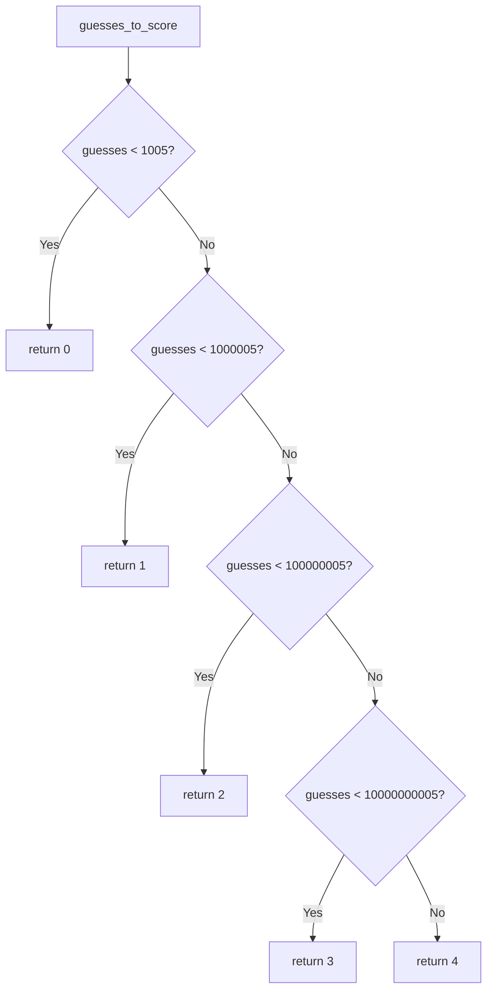

# `time_estimates.py`

## `zxcvbn.time_estimates.estimate_attack_times` · *function*

## Summary:
Calculates estimated attack times for a password based on different cracking scenarios and determines the overall security score.

## Description:
This function computes how long it would take to crack a password under various attack conditions including online attacks with and without throttling, and offline attacks with slow and fast hashing algorithms. It also calculates a security strength score based on the number of guesses required.

The function is extracted into its own component to encapsulate the time estimation logic separately from the core password strength calculation algorithms. This separation allows for cleaner code organization and makes the time estimation computations reusable across different parts of the password strength analysis system.

## Args:
    guesses (int or float): The number of guesses required to crack the password. Must be a non-negative numeric value representing the computational effort needed for a brute-force attack.

## Returns:
    dict: A dictionary containing three keys:
        - 'crack_times_seconds' (dict): Mapping of attack scenarios to time estimates in seconds as Decimal objects
        - 'crack_times_display' (dict): Mapping of attack scenarios to human-readable time strings
        - 'score' (int): Security strength score from 0-4 indicating password strength

## Raises:
    None explicitly raised, but relies on helper functions that may raise exceptions for invalid inputs.

## Constraints:
    Preconditions:
        - Input guesses must be a numeric type (int or float)
        - Input guesses must be non-negative
    Postconditions:
        - Returns a dictionary with exactly three keys
        - All time estimates are represented as Decimal objects for precision
        - Score is always an integer in range [0, 4]

## Side Effects:
    None

## Control Flow:
```mermaid
flowchart TD
    A[Start: estimate_attack_times(guesses)] --> B[Calculate crack_times_seconds]
    B --> C[Iterate through scenarios]
    C --> D{Scenario: online_throttling_100_per_hour}
    D --> E[Decimal(guesses) / float_to_decimal(100.0 / 3600.0)]
    D --> F[Next scenario]
    F --> G{Scenario: online_no_throttling_10_per_second}
    G --> H[Decimal(guesses) / float_to_decimal(10.0)]
    G --> I[Next scenario]
    I --> J{Scenario: offline_slow_hashing_1e4_per_second}
    J --> K[Decimal(guesses) / float_to_decimal(1e4)]
    J --> L[Next scenario]
    L --> M{Scenario: offline_fast_hashing_1e10_per_second}
    M --> N[Decimal(guesses) / float_to_decimal(1e10)]
    N --> O[End calculation]
    O --> P[Calculate crack_times_display]
    P --> Q[Iterate through crack_times_seconds]
    Q --> R[Call display_time(seconds)]
    R --> S[Store formatted time]
    S --> T[End iteration]
    T --> U[Call guesses_to_score(guesses)]
    U --> V[Return result dictionary]
```

## Examples:
    >>> estimate_attack_times(1000000)
    {
        'crack_times_seconds': {
            'online_throttling_100_per_hour': Decimal('360.0'),
            'online_no_throttling_10_per_second': Decimal('100000.0'),
            'offline_slow_hashing_1e4_per_second': Decimal('100.0'),
            'offline_fast_hashing_1e10_per_second': Decimal('0.0001')
        },
        'crack_times_display': {
            'online_throttling_100_per_hour': '6 minutes',
            'online_no_throttling_10_per_second': '27 hours',
            'offline_slow_hashing_1e4_per_second': '1 minute',
            'offline_fast_hashing_1e10_per_second': 'less than a second'
        },
        'score': 2
    }

## `zxcvbn.time_estimates.guesses_to_score` · *function*

## Summary:
Converts a guess count into a security strength score based on order-of-magnitude thresholds.

## Description:
Maps the number of guesses required to crack a password to a discrete security score (0-4) where higher scores indicate stronger passwords. This function is used internally by the zxcvbn password strength estimator to categorize password security levels.

## Args:
    guesses (float): The number of guesses required to crack a password. Must be a numeric value representing a non-negative count.

## Returns:
    int: A security strength score ranging from 0 to 4, where:
        - 0: Very weak (less than 1,005 guesses)
        - 1: Weak (less than 1,000,005 guesses)  
        - 2: Medium (less than 100,000,005 guesses)
        - 3: Strong (less than 10,000,000,005 guesses)
        - 4: Very strong (10,000,000,005 guesses or more)

## Raises:
    None explicitly raised. However, the function assumes numeric input and may behave unexpectedly with non-numeric types.

## Constraints:
    Preconditions:
        - Input must be a numeric type (int or float)
        - Input must be non-negative
    Postconditions:
        - Always returns an integer in the range [0, 4]
        - Behavior is deterministic for any given input

## Side Effects:
    None

## Control Flow:


## Examples:
    >>> guesses_to_score(100)
    0
    >>> guesses_to_score(500000)
    1
    >>> guesses_to_score(50000000)
    2
    >>> guesses_to_score(5000000000)
    3
    >>> guesses_to_score(50000000000)
    4

## `zxcvbn.time_estimates.display_time` · *function*

## Summary:
Converts a time duration in seconds into a human-readable string representation with appropriate units and pluralization.

## Description:
This function takes a numeric time duration in seconds and formats it into a readable string that uses the largest appropriate time unit (seconds, minutes, hours, days, months, years) with proper singular/plural form. It's designed to provide intuitive time estimates for password strength calculations in the zxcvbn library.

The function is extracted into its own component to separate the formatting logic from the core password strength calculation algorithms, making the code more modular and testable. This allows the time estimation logic to be reused in different contexts while keeping the main password strength computation clean.

## Args:
    seconds (float): The time duration in seconds to convert. Must be non-negative.

## Returns:
    str: A human-readable string representing the time duration. Possible return values include:
        - 'less than a second'
        - '<number> second(s)'
        - '<number> minute(s)'
        - '<number> hour(s)'
        - '<number> day(s)'
        - '<number> month(s)'
        - '<number> year(s)'
        - 'centuries'

## Raises:
    None explicitly raised

## Constraints:
    Preconditions:
        - Input seconds must be a non-negative number
    Postconditions:
        - Always returns a string describing the time duration
        - The returned string is properly pluralized when appropriate

## Side Effects:
    None

## Control Flow:
```mermaid
flowchart TD
    A[Start: display_time(seconds)] --> B{seconds < 1?}
    B -- Yes --> C[display_num = None, display_str = 'less than a second']
    B -- No --> D{seconds < minute?}
    D -- Yes --> E[base = round(seconds)]
    E --> F[display_num = base, display_str = '%s second' % base]
    D -- No --> G{seconds < hour?}
    G -- Yes --> H[base = round(seconds / minute)]
    H --> I[display_num = base, display_str = '%s minute' % base]
    G -- No --> J{seconds < day?}
    J -- Yes --> K[base = round(seconds / hour)]
    K --> L[display_num = base, display_str = '%s hour' % base]
    J -- No --> M{seconds < month?}
    M -- Yes --> N[base = round(seconds / day)]
    N --> O[display_num = base, display_str = '%s day' % base]
    M -- No --> P{seconds < year?}
    P -- Yes --> Q[base = round(seconds / month)]
    Q --> R[display_num = base, display_str = '%s month' % base]
    P -- No --> S{seconds < century?}
    S -- Yes --> T[base = round(seconds / year)]
    T --> U[display_num = base, display_str = '%s year' % base]
    S -- No --> V[display_num = None, display_str = 'centuries']
    W{display_num and display_num != 1?} --> X[Append 's' to display_str]
    C --> Y[Return display_str]
    F --> Y
    I --> Y
    L --> Y
    O --> Y
    R --> Y
    U --> Y
    V --> Y
    X --> Y
```

## Examples:
    >>> display_time(0.5)
    'less than a second'
    
    >>> display_time(45)
    '45 seconds'
    
    >>> display_time(120)
    '2 minutes'
    
    >>> display_time(3661)
    '1 hour'
    
    >>> display_time(7776000)
    '3 months'
    
    >>> display_time(31536000)
    '1 year'
    
    >>> display_time(3153600000)
    '100 years'
```

## `zxcvbn.time_estimates.float_to_decimal` · *function*

*No documentation generated.*

