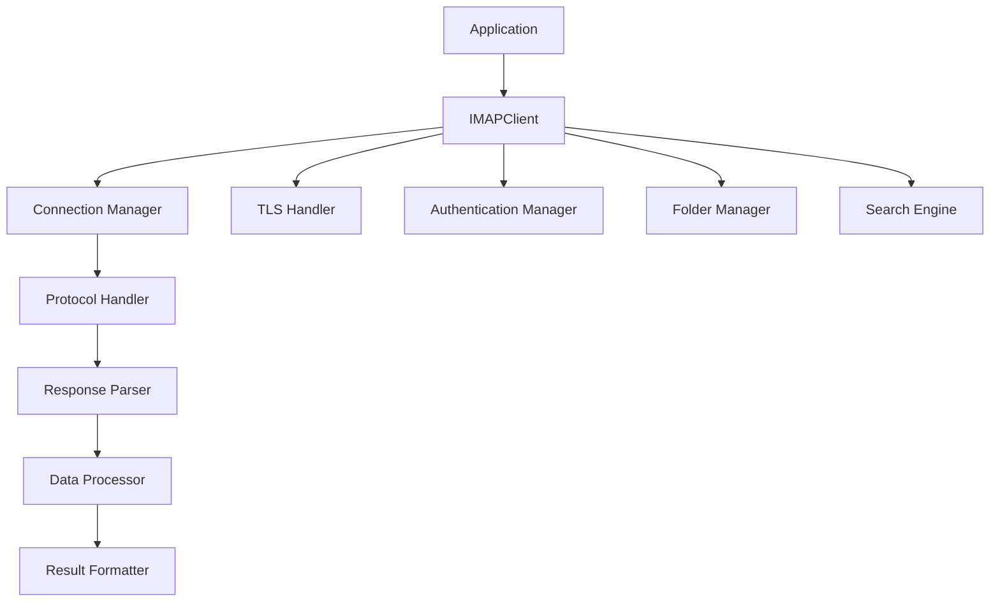

# `IMAPClient`

## IMAPClient Repository

### Tree
```
IMAPClient/
└── imapclient/
    ├── config.py
    ├── datetime_util.py
    ├── fixed_offset.py
    ├── imap4.py
    ├── imap_utf7.py
    ├── interact.py
    ├── response_lexer.py
    ├── response_parser.py
    ├── response_types.py
    ├── testable_imapclient.py
    ├── tls.py
    ├── util.py
    └── version.py
```

**imapclient/** - Core IMAP client implementation providing email server communication capabilities

### Purpose

The IMAPClient repository provides a comprehensive Python library for communicating with IMAP email servers. It enables applications to connect to email servers, authenticate users, manage folders, search messages, and retrieve email content in a robust and standardized manner.

This library addresses the need for reliable, standards-compliant IMAP client functionality in Python applications. It serves developers building email clients, synchronization services, automated email processing systems, and any application requiring programmatic access to email servers.

Target users include:
- Email client developers
- Email synchronization services
- Automated email processing systems
- Developers integrating email functionality into applications

The repository positions itself as a standalone library that can be easily integrated into Python projects requiring IMAP capabilities, offering both high-level convenience methods and low-level protocol access.

### Architecture



The architecture follows a layered approach with the following key abstractions:
- **Connection Layer**: Manages socket connections and TLS encryption
- **Protocol Layer**: Handles IMAP command construction and response parsing
- **Parsing Layer**: Converts raw protocol responses into structured Python objects
- **Business Logic Layer**: Provides high-level email management operations
- **Utility Layer**: Offers supporting functions for dates, encoding, and configuration

### Entry Points

**Importable API:**
- `imapclient.IMAPClient` - Main class for IMAP server communication
- `imapclient.response_parser.parse_response()` - Response parsing utility
- `imapclient.tls.start_tls()` - TLS connection establishment
- `imapclient.util.format_date()` - Date formatting helper

**CLI Interface:**
- `imapclient.interact` - Interactive client interface

### Core Features

1. **IMAP Server Communication** - Connect to and communicate with IMAP servers using standard protocols
2. **Secure Connections** - Support for TLS/SSL encrypted connections
3. **Email Management** - Folder operations, message retrieval, and email manipulation
4. **Message Search** - Advanced search capabilities with various criteria
5. **Response Parsing** - Robust parsing of IMAP protocol responses into Python objects
6. **Testing Support** - Mockable client for unit testing without real server dependencies
7. **UTF-7 Encoding** - Proper handling of internationalized folder names and email addresses

### Dependencies

**Internal Dependencies:**
- Components within the `imapclient` package depend on each other to form a cohesive IMAP client implementation
- The design emphasizes modularity, with separate concerns for connection handling, protocol parsing, response processing, and utility functions

**External Dependencies:**
- Standard library modules: `socket`, `ssl`, `datetime`, `logging` for core functionality

### Configuration

The system supports configuration through:
- Environment variables for connection settings
- Runtime parameters for connection timeouts and authentication
- Configuration files for persistent settings
- Command-line arguments in interactive mode

### Extension Points

The system supports extension through:
- Plugin architecture for custom authentication mechanisms
- Hook points for custom response processing
- Configuration-driven behavior modification

---

## Modules

- [`imapclient`](imapclient.md)

