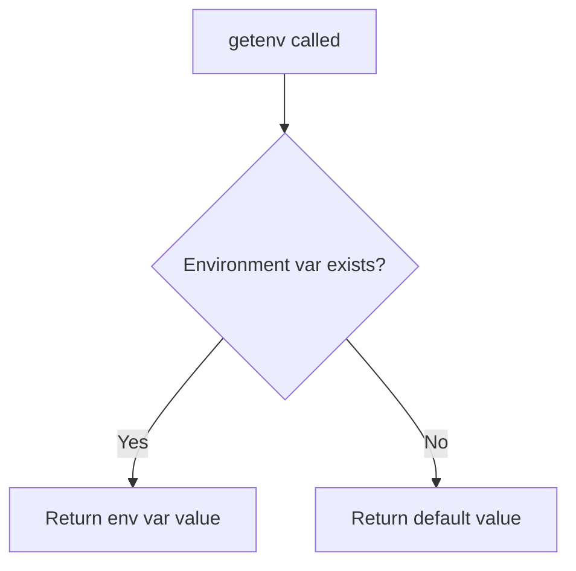
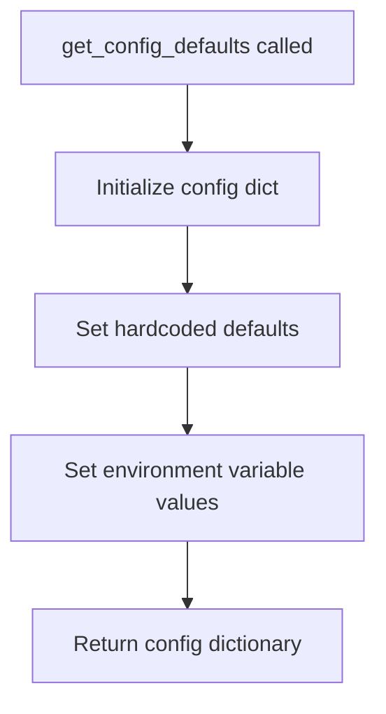
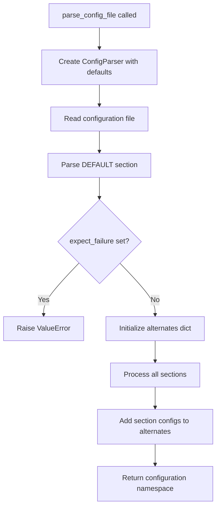
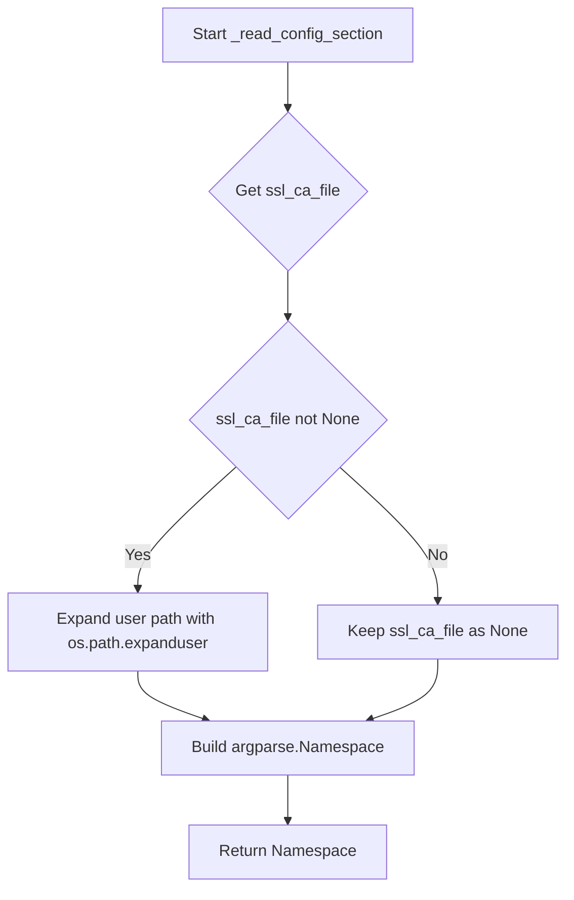
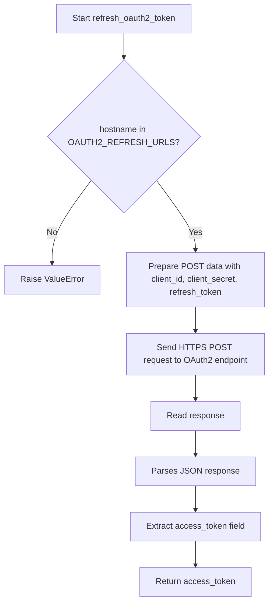
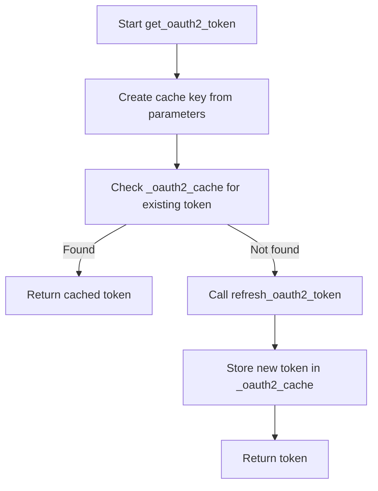

# `config.py`

## `imapclient.config.getenv` · *function*

## Summary:
Retrieves environment variable values with a standardized prefix for IMAP client configuration.

## Description:
Fetches environment variables prefixed with "imapclient_" to support configuration management in the IMAP client library. This utility function centralizes environment variable access with a consistent naming convention, making configuration management more predictable and maintainable.

## Args:
    name (str): The configuration parameter name to look up in environment variables.
    default (Optional[str]): The fallback value to return if the environment variable is not set.

## Returns:
    Optional[str]: The value of the environment variable if found, or the default value if not found.

## Raises:
    None: This function does not raise any exceptions.

## Constraints:
    Preconditions:
        - The name parameter must be a valid string
        - The default parameter can be None or a string value
    Postconditions:
        - Returns either the environment variable value or the provided default
        - Never raises exceptions regardless of input

## Side Effects:
    None: This function only accesses environment variables and has no external state mutations.

## Control Flow:


## Examples:
    # Get IMAP server host with default fallback
    host = getenv("host", "localhost")
    
    # Get SSL flag with default False
    ssl_enabled = getenv("ssl", "false")
    
    # Get username with no default (returns None if not set)
    username = getenv("username", None)
```

## `imapclient.config.get_config_defaults` · *function*

## Summary:
Returns a dictionary containing default configuration values for an IMAP client connection, with environment variable overrides for sensitive credentials.

## Description:
Provides a standardized set of default configuration parameters for IMAP client connections. This function centralizes configuration management by combining hardcoded defaults with environment variable overrides for security-sensitive fields like usernames and passwords. The returned dictionary serves as the foundation for IMAP client initialization and can be overridden by user-provided configurations.

This logic is extracted into its own function to enforce a clear separation between configuration defaults and application logic, making the configuration management reusable and testable. It also ensures consistent default values across different parts of the IMAP client implementation.

## Args:
    None: This function takes no parameters.

## Returns:
    Dict[str, Any]: A dictionary mapping configuration parameter names to their default values. Keys include:
        - "username": Environment variable value for "username" or None
        - "password": Environment variable value for "password" or None  
        - "ssl": Boolean True (SSL enabled by default)
        - "ssl_check_hostname": Boolean True (hostname checking enabled by default)
        - "ssl_verify_cert": Boolean True (certificate verification enabled by default)
        - "ssl_ca_file": None (no custom CA file by default)
        - "timeout": None (no timeout by default)
        - "starttls": Boolean False (STARTTLS disabled by default)
        - "stream": Boolean False (streaming disabled by default)
        - "oauth2": Boolean False (OAuth2 disabled by default)
        - "oauth2_client_id": Environment variable value for "oauth2_client_id" or None
        - "oauth2_client_secret": Environment variable value for "oauth2_client_secret" or None
        - "oauth2_refresh_token": Environment variable value for "oauth2_refresh_token" or None
        - "expect_failure": None (no expected failure by default)

## Raises:
    None: This function does not raise any exceptions.

## Constraints:
    Preconditions:
        - The environment variable lookup mechanism (getenv) must be properly initialized
        - All configuration keys must be valid string identifiers
    Postconditions:
        - Always returns a dictionary with all expected configuration keys
        - Returned dictionary contains only basic types (str, bool, None)

## Side Effects:
    - Accesses environment variables through the getenv utility function
    - No external state mutations beyond environment variable reads

## Control Flow:


## Examples:
    # Get default configuration
    defaults = get_config_defaults()
    
    # Override specific settings
    config = {**defaults, "timeout": 30, "ssl": False}
    
    # Use with IMAP client
    client = IMAPClient(host="imap.example.com", **config)
```

## `imapclient.config.parse_config_file` · *function*

## Summary:
Parses a configuration file and returns structured IMAP client settings as an argparse.Namespace object.

## Description:
Reads a configuration file using configparser and extracts IMAP client settings from the DEFAULT section and all other sections. The function processes the DEFAULT section first, validates it doesn't contain expect_failure, then builds a dictionary of alternate configurations from all remaining sections. This allows for flexible configuration management where users can define multiple connection profiles in a single configuration file.

The function is designed to be called during application startup or configuration loading phases when IMAP client settings need to be loaded from a persistent configuration file.

## Args:
    filename (str): Path to the configuration file to parse. Must be a valid file path readable by the process.

## Returns:
    argparse.Namespace: A namespace object containing:
        - Configuration settings from the DEFAULT section
        - An 'alternates' attribute that maps section names to their parsed configuration namespaces
        - All configuration values are properly typed and validated according to IMAP client requirements

## Raises:
    ValueError: When the DEFAULT section contains an 'expect_failure' setting, which is not allowed.

## Constraints:
    Preconditions:
        - The filename parameter must point to a readable file
        - The configuration file must be in valid INI format
        - The DEFAULT section must not contain an 'expect_failure' setting
        
    Postconditions:
        - Returns a valid argparse.Namespace with all configuration values parsed
        - The alternates dictionary contains entries for all sections in the configuration file
        - All configuration values are properly typed and validated

## Side Effects:
    - Reads from the filesystem to load the configuration file
    - May expand user home directory references in paths (through _read_config_section)

## Control Flow:


## Examples:
```python
# Basic usage with a configuration file
# config.ini:
# [DEFAULT]
# host = imap.example.com
# port = 993
# ssl = true
# username = user@example.com
# password = secret
#
# [work]
# host = work.imap.example.com
# port = 993
# ssl = true
#
# [personal]
# host = personal.imap.example.com
# port = 993
# ssl = true

config = parse_config_file('config.ini')
# config contains DEFAULT settings plus config.alternates['work'] and config.alternates['personal']
```

## `imapclient.config.get_string_config_defaults` · *function*

## Summary:
Converts configuration default values to their string representations for consistent serialization.

## Description:
Transforms the configuration defaults dictionary returned by `get_config_defaults()` into a string-only dictionary. This function ensures all configuration values are represented as strings, converting boolean values to lowercase "true"/"false" and falsy values to empty strings. This is particularly useful when configuration needs to be serialized for command-line interfaces, configuration files, or other systems that require string-based parameters.

This logic is extracted into its own function to provide a clean separation between configuration value types and their string representations, enabling consistent serialization without modifying the original configuration structure.

## Args:
    None: This function takes no parameters.

## Returns:
    Dict[str, str]: A dictionary mapping configuration parameter names to their string representations. Values are converted according to these rules:
        - Boolean True becomes "true"
        - Boolean False becomes "false" 
        - None, empty string, or other falsy values become ""
        - Non-empty string values remain unchanged as strings

## Raises:
    None: This function does not raise any exceptions.

## Constraints:
    Preconditions:
        - The `get_config_defaults()` function must be available and return a valid dictionary
        - All keys in the returned dictionary must be strings
    Postconditions:
        - Always returns a dictionary with the same keys as `get_config_defaults()`
        - All values in the returned dictionary are strings

## Side Effects:
    None: This function has no side effects beyond calling `get_config_defaults()`.

## Control Flow:
```mermaid
flowchart TD
    A[get_string_config_defaults called] --> B[Call get_config_defaults()]
    B --> C[Iterate through key-value pairs]
    C --> D{Value is True?}
    D -->|Yes| E[v = "true"]
    D -->|No| F{Value is False?}
    F -->|Yes| G[v = "false"]
    F -->|No| H{Value is falsy?}
    H -->|Yes| I[v = ""]
    H -->|No| J[v remains unchanged]
    J --> K[Store key-value in output dict]
    G --> K
    I --> K
    K --> L[Return string dictionary]
```

## Examples:
    # Basic usage
    string_defaults = get_string_config_defaults()
    # Returns: {"username": "", "password": "", "ssl": "true", "timeout": "", ...}
    
    # Usage in command-line argument parsing
    parser = argparse.ArgumentParser()
    for key, value in get_string_config_defaults().items():
        parser.add_argument(f"--{key}", default=value, help=f"Configuration for {key}")
```

## `imapclient.config._read_config_section` · *function*

## Summary:
Parses an IMAP client configuration section from a ConfigParser and returns structured settings as an argparse.Namespace.

## Description:
Extracts and converts configuration values from a specified section of a configparser object into a standardized namespace format suitable for IMAP client initialization. This function encapsulates the logic for parsing various configuration types (strings, booleans, integers, floats) while handling optional values gracefully. It serves as a bridge between raw configuration data and the structured arguments needed by IMAP client implementations.

## Args:
    parser (configparser.ConfigParser): The configuration parser containing the configuration sections
    section (str): The name of the configuration section to parse

## Returns:
    argparse.Namespace: A namespace object containing all parsed configuration values with the following attributes:
        - host (str): IMAP server hostname
        - port (Optional[int]): IMAP server port number
        - ssl (bool): Whether to use SSL/TLS connection
        - starttls (bool): Whether to use STARTTLS encryption
        - ssl_check_hostname (bool): Whether to verify SSL certificate hostname
        - ssl_verify_cert (bool): Whether to verify SSL certificate validity
        - ssl_ca_file (Optional[str]): Path to CA certificate file for SSL verification
        - timeout (Optional[float]): Connection timeout in seconds
        - stream (bool): Whether to use streaming mode
        - username (str): Authentication username
        - password (str): Authentication password
        - oauth2 (bool): Whether to use OAuth2 authentication
        - oauth2_client_id (str): OAuth2 client ID
        - oauth2_client_secret (str): OAuth2 client secret
        - oauth2_refresh_token (str): OAuth2 refresh token
        - expect_failure (str): Expected failure behavior specification

## Raises:
    configparser.NoOptionError: When a required configuration option is missing from the section
    ValueError: When a configuration value cannot be converted to the expected type (e.g., invalid integer or float)

## Constraints:
    Preconditions:
        - The parser must be properly initialized with configuration data
        - The specified section must exist in the parser
        - All required configuration options must be present in the section
    
    Postconditions:
        - Returns a valid argparse.Namespace with all configuration values properly parsed
        - SSL CA file paths are expanded using os.path.expanduser() when present

## Side Effects:
    - Expands user home directory references in ssl_ca_file path using os.path.expanduser()
    - Reads configuration values from the provided ConfigParser instance

## Control Flow:


## Examples:
```python
# Basic usage with a populated ConfigParser
import configparser
import argparse

parser = configparser.ConfigParser()
parser.add_section('imap')
parser.set('imap', 'host', 'imap.example.com')
parser.set('imap', 'port', '993')
parser.set('imap', 'ssl', 'true')
parser.set('imap', 'username', 'user@example.com')
parser.set('imap', 'password', 'secret')

config = _read_config_section(parser, 'imap')
print(config.host)  # Output: 'imap.example.com'
print(config.port)  # Output: 993
print(config.ssl)   # Output: True

# Example with optional values
parser.set('imap', 'timeout', '30.5')
parser.set('imap', 'ssl_ca_file', '~/certs/ca.pem')
config_with_optional = _read_config_section(parser, 'imap')
print(config_with_optional.timeout)  # Output: 30.5
print(config_with_optional.ssl_ca_file)  # Output: '/home/user/certs/ca.pem' (expanded path)
```

## `imapclient.config.refresh_oauth2_token` · *function*

## Summary:
Exchanges a refresh token for a new OAuth2 access token with the appropriate authorization server.

## Description:
This function implements the OAuth2 refresh token flow by making a POST request to the OAuth2 authorization server's refresh endpoint. It is used to obtain a new access token when the previous one has expired, enabling continued access to IMAP services without requiring user re-authentication.

The function requires the hostname to determine which OAuth2 endpoint to contact, as different IMAP providers (like Gmail, Outlook, etc.) have different authorization server URLs. The refresh operation is performed securely over HTTPS.

## Args:
    hostname (str): The IMAP server hostname that determines the OAuth2 refresh endpoint URL to use.
    client_id (str): The OAuth2 client identifier registered with the authorization server.
    client_secret (str): The OAuth2 client secret associated with the client identifier.
    refresh_token (str): The refresh token previously obtained during the OAuth2 authorization process.

## Returns:
    str: The newly generated OAuth2 access token that can be used for authenticating IMAP operations.

## Raises:
    ValueError: When the hostname is not recognized and no OAuth2 refresh URL is configured for that hostname.

## Constraints:
    Preconditions:
        - The hostname must be a recognized IMAP server hostname with a corresponding OAuth2 refresh endpoint
        - All parameters must be valid strings
        - The refresh token must be valid and not yet expired
    
    Postconditions:
        - Returns a valid OAuth2 access token string
        - The returned token is suitable for immediate use in IMAP authentication

## Side Effects:
    - Makes an outbound HTTPS network request to the OAuth2 authorization server
    - Performs HTTP POST request with OAuth2 client credentials and refresh token
    - Reads response data from the network
    - May raise urllib.error.HTTPError or urllib.error.URLError if network communication fails

## Control Flow:


## `imapclient.config.get_oauth2_token` · *function*

## Summary:
Retrieves an OAuth2 access token for IMAP authentication, using a cache to avoid unnecessary token refreshes.

## Description:
This function implements a caching mechanism for OAuth2 access tokens used in IMAP authentication. It first checks if a valid token exists in an internal cache for the given authentication parameters. If a cached token is available, it returns it immediately. Otherwise, it calls the refresh_oauth2_token function to obtain a new token, stores it in the cache for future use, and returns it.

The caching strategy prevents redundant network requests to OAuth2 servers when the same authentication parameters are used repeatedly, improving performance and reducing API usage.

## Args:
    hostname (str): The IMAP server hostname that determines the OAuth2 refresh endpoint URL to use.
    client_id (str): The OAuth2 client identifier registered with the authorization server.
    client_secret (str): The OAuth2 client secret associated with the client identifier.
    refresh_token (str): The refresh token previously obtained during the OAuth2 authorization process.

## Returns:
    str: The OAuth2 access token that can be used for authenticating IMAP operations.

## Raises:
    ValueError: When the hostname is not recognized and no OAuth2 refresh URL is configured for that hostname, or when refresh_oauth2_token raises this exception.

## Constraints:
    Preconditions:
        - All parameters must be valid strings
        - The refresh token must be valid and not yet expired
        - The hostname must be a recognized IMAP server hostname with a corresponding OAuth2 refresh endpoint
    
    Postconditions:
        - Returns a valid OAuth2 access token string
        - The returned token is suitable for immediate use in IMAP authentication
        - If a new token was fetched, it is stored in the internal cache for subsequent calls

## Side Effects:
    - Makes an outbound HTTPS network request to the OAuth2 authorization server via refresh_oauth2_token
    - Performs HTTP POST request with OAuth2 client credentials and refresh token
    - May read response data from the network
    - Modifies internal cache state by storing new tokens
    - May raise urllib.error.HTTPError or urllib.error.URLError if network communication fails

## Control Flow:


## `imapclient.config.create_client_from_config` · *function*

## Summary
Creates and configures an IMAP client instance based on provided configuration parameters, with optional authentication support.

## Description
This function serves as a centralized factory for creating IMAP client instances with proper SSL/TLS configuration and authentication handling. It encapsulates the complexity of setting up IMAP connections with various security options and authentication mechanisms (OAuth2 vs traditional username/password).

The function is designed to be reusable across different parts of an application that need to establish IMAP connections, ensuring consistent connection setup and proper error handling with resource cleanup.

## Args
- conf (argparse.Namespace): Configuration namespace containing connection parameters including host, port, SSL settings, authentication details, and timeout values
- login (bool, optional): Flag indicating whether to perform authentication after client creation. Defaults to True

## Returns
- imapclient.IMAPClient: Configured IMAP client instance ready for use, or disconnected client if login=False

## Raises
- AssertionError: When required configuration values are missing (host, OAuth2 credentials, username, password)
- Exception: Propagates any exceptions that occur during TLS negotiation or authentication processes

## Constraints
- Preconditions:
  - conf.host must be specified and non-empty
  - When using OAuth2 authentication, all OAuth2 credentials (client_id, client_secret, refresh_token) must be provided
  - When using traditional authentication, both username and password must be provided
- Postconditions:
  - Returns a properly initialized IMAPClient instance
  - If login=True, the client is authenticated and ready for IMAP operations
  - If login=False, the client is created but not authenticated

## Side Effects
- Creates SSL context with specified verification settings
- Makes network connections for TLS negotiation and authentication
- May make outbound HTTPS requests for OAuth2 token refresh
- Calls shutdown() on client if authentication fails
- May perform HTTP requests to OAuth2 authorization servers

## Control Flow
```mermaid
flowchart TD
    A[Start create_client_from_config] --> B{conf.host present?}
    B -- No --> C[AssertionError: missing host]
    B -- Yes --> D[Create SSL context if SSL enabled]
    D --> E[Create IMAPClient instance]
    E --> F{login=False?}
    F -- Yes --> G[Return client]
    F -- No --> H{conf.starttls?}
    H -- Yes --> I[client.starttls()]
    I --> J{conf.oauth2?}
    J -- Yes --> K[Validate OAuth2 credentials]
    K --> L[Get OAuth2 token]
    L --> M[client.oauth2_login()]
    J -- No --> N{conf.stream?}
    N -- No --> O[Validate username/password]
    O --> P[client.login()]
    P --> Q[Return client]
    M --> Q
```

