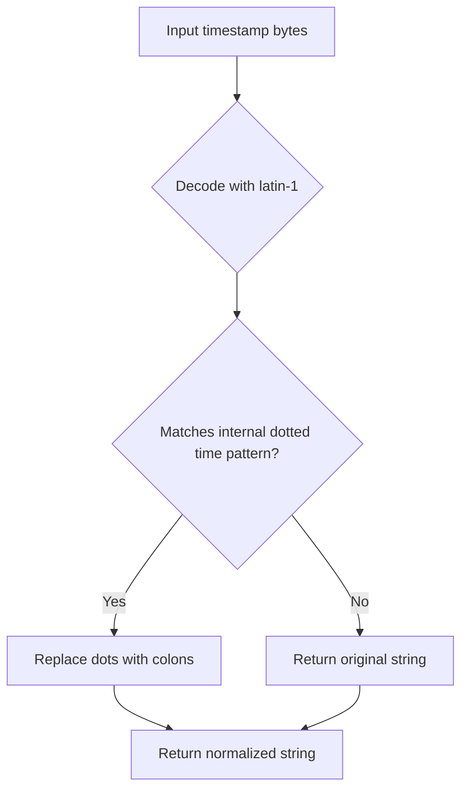
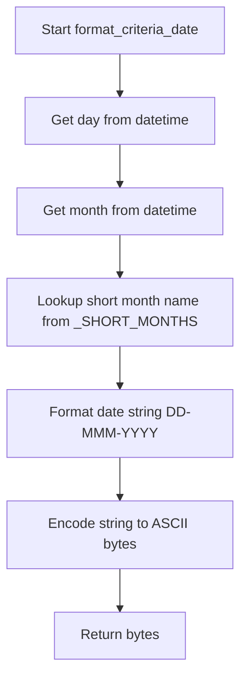

# `datetime_util.py`

## `imapclient.datetime_util.parse_to_datetime` · *function*

## Summary:
Parses an email timestamp byte string into a timezone-aware datetime object, with optional normalization to system local timezone.

## Description:
Converts email timestamp data in bytes format to a Python datetime object, handling timezone information and optional normalization. This function processes timestamp bytes by first normalizing dotted time formats using `_munge()`, then parsing the result with `parsedate_tz()` to extract date/time components and timezone offset. If timezone information is present and normalization is requested, the resulting datetime is converted to the system's local timezone using `datetime_to_native()`.

The function is designed to handle various email timestamp formats commonly encountered in IMAP responses, ensuring proper timezone interpretation and conversion.

## Args:
    timestamp (bytes): Email timestamp in bytes format that may contain dotted time components or standard time formats
    normalise (bool): Flag indicating whether to normalize timezone-aware datetime to system local timezone. Defaults to True.

## Returns:
    datetime: A timezone-aware datetime object representing the parsed timestamp. If normalise=True and timezone information is present, returns a naive datetime in system local timezone.

## Raises:
    ValueError: When the timestamp bytes cannot be parsed into a valid datetime format by `parsedate_tz()`.

## Constraints:
    Preconditions:
    - Input timestamp must be a bytes object containing valid email timestamp data
    - Input timestamp must be decodable using latin-1 encoding
    - The timestamp format must be recognizable by `email.utils.parsedate_tz()`
    
    Postconditions:
    - Return value is always a datetime object
    - If timezone information is present in input, return value will have timezone info
    - If normalise=True and timezone info is present, return value will be naive (no timezone info)

## Side Effects:
    None

## Control Flow:
```mermaid
flowchart TD
    A[Input timestamp bytes] --> B[_munge(timestamp)]
    B --> C[parsedate_tz()]
    C --> D{Parsed successfully?}
    D -->|No| E[ValueError]
    D -->|Yes| F{Timezone offset present?}
    F -->|No| G[Create datetime without tzinfo]
    F -->|Yes| H[Create datetime with FixedOffset tzinfo]
    G --> I{Normalise requested?}
    H --> I
    I -->|No| J[Return datetime]
    I -->|Yes| K[datetime_to_native()]
    K --> J
```

## Examples:
    # Parse timestamp with timezone information
    >>> parse_to_datetime(b"Mon, 01 Jan 2024 12:30:45 +0000")
    datetime.datetime(2024, 1, 1, 12, 30, 45, tzinfo=FixedOffset(0))
    
    # Parse timestamp with timezone and normalize to local timezone
    >>> parse_to_datetime(b"Mon, 01 Jan 2024 12:30:45 +0000", normalise=True)
    datetime.datetime(2024, 1, 1, 12, 30, 45)  # Naive datetime in local timezone
    
    # Parse timestamp without timezone
    >>> parse_to_datetime(b"Mon, 01 Jan 2024 12:30:45")
    datetime.datetime(2024, 1, 1, 12, 30, 45)
```

## `imapclient.datetime_util.datetime_to_native` · *function*

## Summary:
Converts a timezone-aware datetime object to a naive datetime object in the system's local timezone.

## Description:
This function transforms a datetime object that contains timezone information into a naive datetime object (without timezone info) that represents the same moment in time but in the system's local timezone. It's used to normalize datetime objects for processing that requires timezone-naive representations.

The function is typically called when working with datetime objects that need to be converted to the local system timezone for display or further processing that doesn't require timezone awareness.

## Args:
    dt (datetime): A timezone-aware datetime object to convert to naive datetime in system timezone

## Returns:
    datetime: A naive datetime object representing the same moment in time as the input, but in the system's local timezone

## Raises:
    AttributeError: If the input dt does not have timezone information or if astimezone method is not available

## Constraints:
    Preconditions:
        - Input dt must be a datetime object
        - Input dt must be timezone-aware (have tzinfo set)
    Postconditions:
        - Return value is always a naive datetime object (tzinfo=None)
        - Return value represents the same instant in time as input
        - Return value is in the system's local timezone

## Side Effects:
    None

## Control Flow:
```mermaid
flowchart TD
    A[Input datetime dt] --> B{dt has tzinfo?}
    B -- No --> C[AttributeError]
    B -- Yes --> D[Call dt.astimezone(FixedOffset.for_system())]
    D --> E[Replace tzinfo=None]
    E --> F[Return naive datetime]
```

## Examples:
```python
from datetime import datetime, timezone
from imapclient.datetime_util import datetime_to_native

# Convert UTC datetime to local timezone
utc_dt = datetime(2023, 1, 15, 12, 0, 0, tzinfo=timezone.utc)
local_dt = datetime_to_native(utc_dt)
# Result: naive datetime in system's local timezone

# Convert already timezone-aware datetime to local timezone
est_dt = datetime(2023, 1, 15, 12, 0, 0, tzinfo=timezone(-timedelta(hours=5)))
local_dt = datetime_to_native(est_dt)
# Result: naive datetime in system's local timezone
```

## `imapclient.datetime_util.datetime_to_INTERNALDATE` · *function*

## Summary:
Converts a Python datetime object to IMAP INTERNALDATE string format with proper timezone information.

## Description:
Transforms a Python datetime object into a string formatted according to the IMAP INTERNALDATE specification. This function ensures the datetime has timezone information by adding system timezone if missing, then formats it using a specific pattern that includes the day, abbreviated month name, year, time, and timezone offset. This format is commonly used in IMAP email protocols for date/time representation.

## Args:
    dt (datetime): A datetime object to convert to INTERNALDATE format. If the datetime has no timezone information, it will be augmented with the system's local timezone.

## Returns:
    str: A string representing the datetime in IMAP INTERNALDATE format, such as "01-Jan-2023 12:30:45 +0000". The format follows the pattern: DD-MMM-YYYY HH:MM:SS ±HHMM where MMM is the abbreviated month name (e.g., Jan, Feb, Mar, etc.).

## Raises:
    None explicitly raised in the function body.

## Constraints:
    Preconditions:
    - Input must be a datetime object
    - The datetime object may or may not have timezone information
    
    Postconditions:
    - Output is always a string in valid IMAP INTERNALDATE format
    - The returned string includes proper timezone offset information
    - Month names are represented using standard 3-letter abbreviations (Jan, Feb, Mar, etc.)

## Side Effects:
    None

## Control Flow:
```mermaid
flowchart TD
    A[Input datetime] --> B{Has tzinfo?}
    B -- No --> C[Add system timezone using FixedOffset.for_system()]
    B -- Yes --> D[Skip timezone addition]
    C --> E[Construct format string with _SHORT_MONTHS[dt.month]]
    D --> E
    E --> F[Apply strftime formatting]
    F --> G[Return formatted string]
```

## Examples:
    >>> from datetime import datetime
    >>> dt = datetime(2023, 1, 15, 14, 30, 45)
    >>> datetime_to_INTERNALDATE(dt)
    '15-Jan-2023 14:30:45 +0000'
    
    >>> from datetime import datetime, timezone
    >>> dt = datetime(2023, 1, 15, 14, 30, 45, tzinfo=timezone.utc)
    >>> datetime_to_INTERNALDATE(dt)
    '15-Jan-2023 14:30:45 +0000'

## `imapclient.datetime_util._munge` · *function*

## Summary:
Converts dotted time format in email timestamps to standard colon-separated format.

## Description:
Processes email timestamp bytes by decoding them with latin-1 encoding and normalizing time format. When the decoded timestamp matches a specific dotted time pattern, dots in time components are replaced with colons to produce a standard time representation compatible with email parsing utilities.

## Args:
    timestamp (bytes): Email timestamp in bytes format that may contain dotted time components

## Returns:
    str: Processed timestamp string where dotted time components have been converted to colon-separated format, or the original string if no conversion was applied

## Raises:
    UnicodeDecodeError: When the timestamp bytes cannot be decoded using latin-1 encoding

## Constraints:
    Preconditions:
    - Input must be a bytes object containing valid timestamp data
    - The bytes must be decodable using latin-1 encoding
    
    Postconditions:
    - Output is always a string
    - If the decoded timestamp matches the internal dotted time pattern, dots in time components are replaced with colons
    - If the decoded timestamp does not match the pattern, the original decoded string is returned unchanged

## Side Effects:
    None

## Control Flow:


## Examples:
    # Example: Converting dotted time to colon-separated format
    >>> _munge(b"Mon, 01 Jan 2024 12.30.45 +0000")
    "Mon, 01 Jan 2024 12:30:45 +0000"
    
    # Example: Timestamp without dotted time format remains unchanged
    >>> _munge(b"Mon, 01 Jan 2024 12:30:45 +0000")
    "Mon, 01 Jan 2024 12:30:45 +0000"
```

## `imapclient.datetime_util.format_criteria_date` · *function*

## Summary:
Formats a datetime object into a standardized IMAP date string format and encodes it as ASCII bytes.

## Description:
Converts a datetime object into a date string formatted as DD-MMM-YYYY (e.g., "01-Jan-2023") where MMM represents abbreviated month names, then encodes the result as ASCII bytes. This function is used to prepare date criteria for IMAP search operations, specifically formatting dates according to IMAP protocol requirements.

## Args:
    dt (datetime): A datetime object containing the date to be formatted.

## Returns:
    bytes: The formatted date string encoded as ASCII bytes in the format DD-MMM-YYYY.

## Raises:
    IndexError: If the datetime object's month attribute is not in the valid range [1, 12] which would cause an index error when accessing _SHORT_MONTHS.

## Constraints:
    Preconditions:
    - The input datetime object must be valid
    - The datetime object's month attribute must be between 1 and 12 (inclusive) to avoid IndexError when accessing _SHORT_MONTHS
    - The datetime object's day attribute must be valid for the given month
    
    Postconditions:
    - The returned bytes represent a properly formatted IMAP date string
    - The month abbreviation is taken from a predefined list of short month names (_SHORT_MONTHS)

## Side Effects:
    None

## Control Flow:


## Examples:
    # Basic usage
    from datetime import datetime
    dt = datetime(2023, 1, 15)
    result = format_criteria_date(dt)
    # Returns: b'15-Jan-2023'
    
    # Another example
    dt = datetime(2024, 12, 25)
    result = format_criteria_date(dt)
    # Returns: b'25-Dec-2024'

