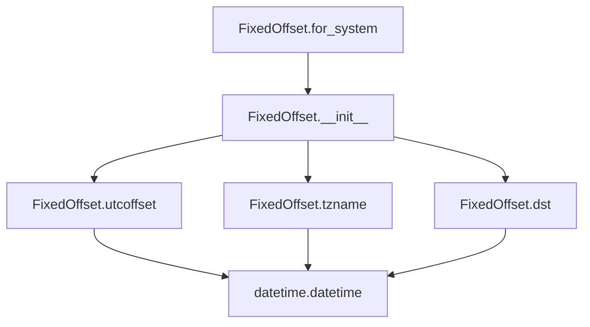

# `fixed_offset.py`

## `imapclient.fixed_offset.FixedOffset` · *class*

## Summary:
A timezone info class that represents a fixed timezone offset from UTC.

## Description:
The FixedOffset class implements the datetime.tzinfo abstract base class to provide timezone information for a fixed offset from UTC. It's commonly used to create timezone-aware datetime objects with a specific, unchanging offset. This class is particularly useful when working with email protocols like IMAP that require precise timezone handling.

## State:
- `__offset`: datetime.timedelta - stores the timezone offset from UTC
- `__name`: str - formatted timezone name in HHMM or -HHMM format

## Lifecycle:
- Creation: Instantiate with a minutes offset (positive or negative) or use the classmethod `for_system()` to create from system timezone
- Usage: Pass instances to datetime constructors to create timezone-aware datetime objects
- Destruction: No special cleanup required; follows standard Python object lifecycle

## Method Map:


## Raises:
- None explicitly raised by __init__
- The class methods follow the datetime.tzinfo interface requirements

## Example:
```python
from imapclient.fixed_offset import FixedOffset
import datetime

# Create a fixed offset of UTC+5:30
tz = FixedOffset(330)  # 5.5 hours in minutes
dt = datetime.datetime(2023, 1, 1, 12, 0, 0, tzinfo=tz)

# Create from system timezone
system_tz = FixedOffset.for_system()
```

### `imapclient.fixed_offset.FixedOffset.__init__` · *method*

## Summary:
Initializes a FixedOffset object with a time offset in minutes and computes its formatted name representation.

## Description:
Constructs a FixedOffset instance by converting the provided minute offset into a datetime.timedelta object and generating a standardized name string in the format "+HHMM" or "-HHMM" based on the offset's sign.

## Args:
    minutes (float): Time offset in minutes, can be positive or negative to represent UTC offsets.

## Returns:
    None: This method does not return any value.

## Raises:
    No explicit exceptions are raised by this method.

## State Changes:
    Attributes READ: None
    Attributes WRITTEN: 
        - self.__offset: Stores the time offset as a datetime.timedelta object
        - self.__name: Stores the formatted name string representation

## Constraints:
    Preconditions: The minutes parameter should be a valid numeric value representing a time offset.
    Postconditions: The instance will have self.__offset set to datetime.timedelta(minutes=minutes) and self.__name set to a formatted string representation.

## Side Effects:
    None: This method performs no I/O operations or external service calls.

### `imapclient.fixed_offset.FixedOffset.utcoffset` · *method*

## Summary:
Returns the fixed UTC offset for this timezone instance.

## Description:
This method implements the `datetime.tzinfo.utcoffset()` interface requirement. It returns the pre-computed UTC offset that was set during object initialization. This offset represents the difference between local time and UTC time for this timezone.

The method is called internally by Python's datetime processing when determining the UTC offset of datetime objects that use this timezone. It accepts a datetime parameter (which is ignored) as required by the tzinfo interface specification.

## Args:
    _ (Optional[datetime.datetime]): A datetime object representing the date/time for which the offset is requested. This parameter is unused and ignored by this implementation.

## Returns:
    datetime.timedelta: The fixed UTC offset that was configured during object construction.

## Raises:
    None: This method does not raise any exceptions.

## State Changes:
    Attributes READ: self.__offset
    Attributes WRITTEN: None

## Constraints:
    Preconditions: The FixedOffset instance must have been properly initialized with a valid minutes value.
    Postconditions: The returned timedelta will always be the same value as configured during initialization.

## Side Effects:
    None: This method performs no I/O operations or external service calls. It only accesses internal state.

### `imapclient.fixed_offset.FixedOffset.tzname` · *method*

## Summary:
Returns the name of this fixed timezone offset as a formatted string.

## Description:
This method implements the required interface for `datetime.tzinfo.tzname()` to provide the textual representation of this fixed timezone offset. It returns the pre-computed timezone name that was constructed during object initialization.

## Args:
    _: Optional[datetime.datetime] - A datetime object (ignored in this implementation)

## Returns:
    str - The formatted timezone name (e.g., "+0500", "-0800") representing this fixed offset

## Raises:
    None - This method does not raise any exceptions

## State Changes:
    Attributes READ: self.__name
    Attributes WRITTEN: None

## Constraints:
    Preconditions: The FixedOffset instance must have been properly initialized with a valid minutes offset
    Postconditions: The returned string is always a valid formatted timezone name

## Side Effects:
    None - This method performs no I/O operations or external service calls

### `imapclient.fixed_offset.FixedOffset.dst` · *method*

## Summary:
Returns the daylight saving time offset for this fixed timezone, which is always zero.

## Description:
This method implements the datetime.tzinfo interface requirement for determining the daylight saving time offset. As a FixedOffset timezone represents a constant offset from UTC with no daylight saving time adjustments, this method consistently returns zero.

## Args:
    _ (Optional[datetime.datetime]): A datetime object representing the date/time for which DST is being calculated. This parameter is unused in the implementation.

## Returns:
    datetime.timedelta: A zero timedelta representing no daylight saving time offset.

## Raises:
    None: This method does not raise any exceptions.

## State Changes:
    Attributes READ: None
    Attributes WRITTEN: None

## Constraints:
    Preconditions: None
    Postconditions: The returned timedelta is always zero.

## Side Effects:
    None: This method performs no I/O operations or external service calls.

### `imapclient.fixed_offset.FixedOffset.for_system` · *method*

## Summary:
Creates a FixedOffset instance representing the system's current timezone offset.

## Description:
A class method that constructs a FixedOffset object based on the system's local timezone settings. It determines whether daylight saving time is currently in effect and selects the appropriate timezone offset (standard or daylight saving) before creating the FixedOffset instance with the offset expressed in minutes.

## Args:
    cls: The FixedOffset class itself (implicit first argument for classmethod)

## Returns:
    FixedOffset: An instance representing the system's current timezone offset in minutes

## Raises:
    None explicitly raised

## State Changes:
    None - This is a factory method that creates and returns a new instance

## Constraints:
    Preconditions:
    - The system's time zone information must be accessible via the time module
    - The system must have valid timezone configuration
    
    Postconditions:
    - Returns a FixedOffset instance with the correct offset in minutes
    - The offset is negative for timezones east of UTC (as per standard convention)

## Side Effects:
    None - This method only uses standard library time module functions and doesn't perform I/O or mutate external state

