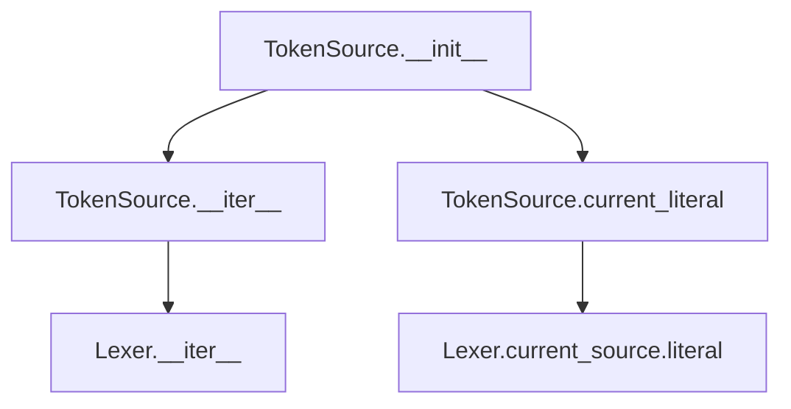
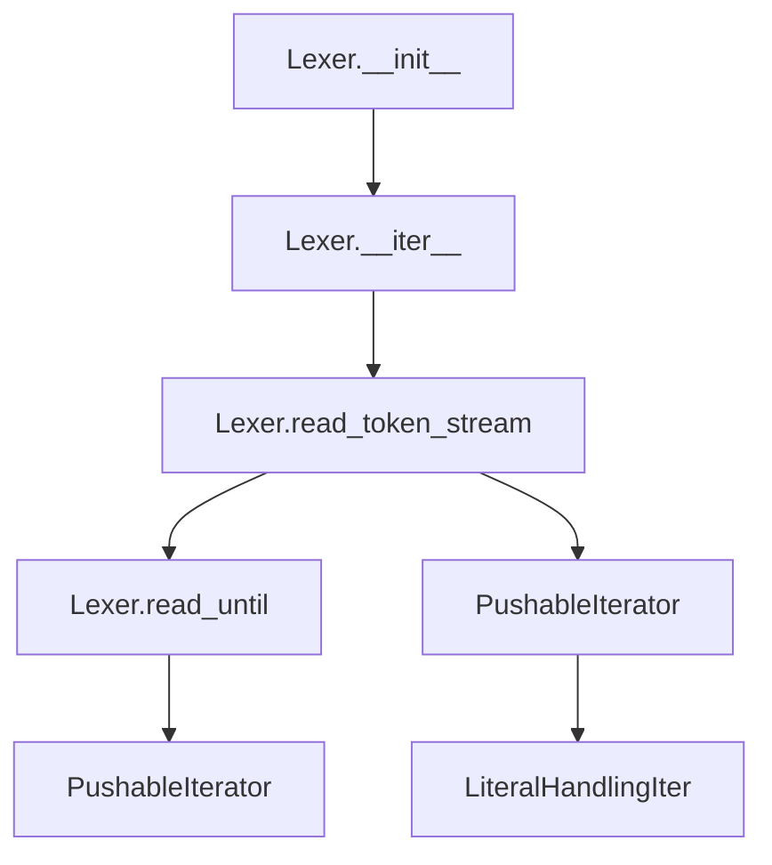
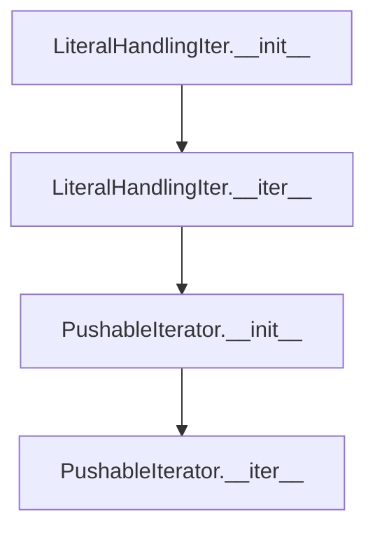
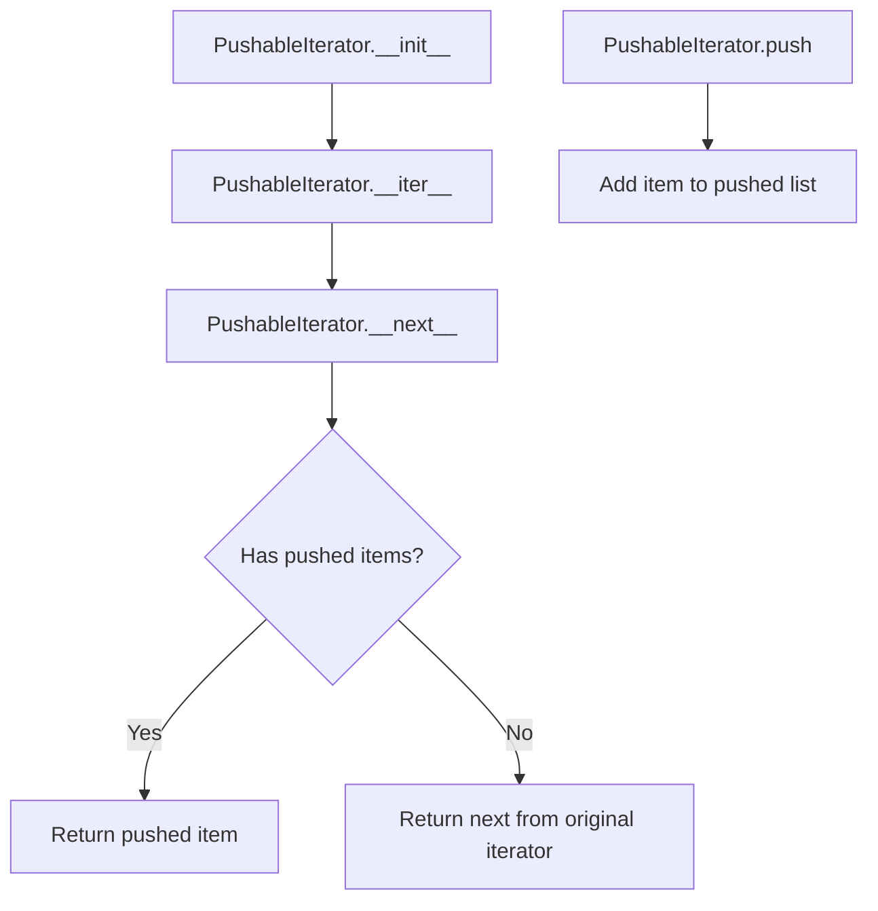

# `response_lexer.py`

## `imapclient.response_lexer.TokenSource` · *class*

## Summary:
A wrapper class that provides iteration and access to current literal data from an IMAP protocol response lexer.

## Description:
The TokenSource class serves as a convenient interface for iterating over tokens produced by an IMAP protocol response lexer and accessing metadata about the current token source. It encapsulates a Lexer instance and provides both iteration capabilities and access to the current literal data being processed.

This class is typically used in IMAP client implementations where responses need to be parsed token by token while maintaining awareness of literal data chunks that may be embedded within the protocol messages.

## State:
- `lex`: Lexer instance that performs the actual tokenization of IMAP protocol responses
- `src`: Iterator over the tokens produced by the lexer

## Lifecycle:
- Creation: Instantiate with a List[bytes] representing IMAP protocol response data
- Usage: Iterate over the TokenSource instance to consume tokens, or access the current_literal property to inspect the current source's literal data
- Destruction: No explicit cleanup required; relies on Python's garbage collection

## Method Map:


## Raises:
- `StopIteration`: Propagated from underlying lexer iterator when input is exhausted
- `ValueError`: May be raised by the underlying Lexer when encountering malformed IMAP protocol syntax

## Example:
```python
# Create a TokenSource with IMAP response data
response_data = [b"* OK [CAPABILITY IMAP4REV1]\r\n"]
token_source = TokenSource(response_data)

# Iterate through tokens
for token in token_source:
    print(token)

# Access current literal data (if available)
current_literal = token_source.current_literal
```

### `imapclient.response_lexer.TokenSource.__init__` · *method*

## Summary:
Initializes a TokenSource object with IMAP protocol response data for tokenization and iteration.

## Description:
Constructs a TokenSource instance that prepares internal state for tokenizing IMAP protocol response data. This method initializes the internal lexer and iterator needed for consuming tokens from IMAP responses while maintaining access to literal data portions.

The TokenSource class is designed to work with IMAP protocol responses that may contain literal data chunks, making it suitable for parsing complex server responses that include large data payloads indicated by the `{size}` syntax.

## Args:
    text (List[bytes]): A list of byte sequences representing IMAP protocol response data to be tokenized.

## Returns:
    None: This method initializes the object's internal state and does not return a value.

## Raises:
    StopIteration: May be propagated from the underlying lexer iterator when input is exhausted.

## State Changes:
    Attributes READ: None
    Attributes WRITTEN: 
    - self.lex: Assigned a new Lexer instance initialized with the provided text
    - self.src: Assigned an iterator created from the newly constructed lexer

## Constraints:
    Preconditions: The input text parameter must be a valid List[bytes] containing IMAP protocol response data.
    Postconditions: The TokenSource instance is ready for iteration and literal data access via its properties.

## Side Effects:
    None: This method performs no I/O operations or external service calls. It only initializes internal object state.

### `imapclient.response_lexer.TokenSource.current_literal` · *method*

## Summary:
Returns the literal data associated with the current token source, or None if no literal data is present.

## Description:
Provides access to the literal data portion of the currently active token source in the IMAP protocol response parsing process. This property is used during IMAP response tokenization to retrieve literal data chunks that may be embedded within protocol messages.

The method is called during the parsing phase of IMAP protocol responses, typically when processing tokens that contain literal data such as message bodies or large data payloads indicated by the `{size}` syntax in IMAP responses.

## Args:
    None

## Returns:
    Optional[bytes]: The literal data associated with the current token source, or None if no literal data is present.

## Raises:
    None

## State Changes:
    Attributes READ: self.lex, self.lex.current_source
    Attributes WRITTEN: None

## Constraints:
    Preconditions: The TokenSource instance must have been properly initialized with a Lexer
    Postconditions: The returned value is either bytes containing literal data or None, with no modification to the object's state

## Side Effects:
    None

### `imapclient.response_lexer.TokenSource.__iter__` · *method*

## Summary:
Returns the iterator over tokenized IMAP protocol response bytes.

## Description:
Provides iteration capability for the TokenSource by exposing its internal token iterator. This method enables the TokenSource to be used in for-loops and other iteration contexts, allowing consumers to process IMAP protocol response tokens sequentially.

The method is part of the standard Python iterator protocol implementation, making TokenSource instances iterable objects. It simply returns the pre-computed iterator stored in self.src, which was initialized in the constructor from the underlying Lexer.

## Args:
    None

## Returns:
    Iterator[bytes]: An iterator that yields individual token bytes from the IMAP protocol response.

## Raises:
    None

## State Changes:
    Attributes READ: self.src
    Attributes WRITTEN: None

## Constraints:
    Preconditions: The TokenSource must have been properly initialized with valid input text.
    Postconditions: The returned iterator will yield bytes tokens in the order they appear in the original IMAP response.

## Side Effects:
    None

## `imapclient.response_lexer.Lexer` · *class*

## Summary:
A lexical analyzer for IMAP protocol responses that breaks input byte sequences into tokens while handling special IMAP syntax like quoted strings, bracketed sections, and escaped characters.

## Description:
The Lexer class processes IMAP protocol responses by converting byte sequences into a stream of tokens. It handles IMAP-specific syntax elements including quoted strings (enclosed in double quotes), bracketed sections (enclosed in square brackets), and escaped characters. The lexer is designed to work with IMAP protocol responses that may contain literal data, making it suitable for parsing complex IMAP server responses.

This class serves as a fundamental parsing component in IMAP client implementations, providing a clean interface for tokenizing protocol messages before higher-level parsing can occur.

## State:
- `sources`: Generator producing LiteralHandlingIter instances for each input chunk
- `current_source`: Currently active LiteralHandlingIter instance being processed, or None if not processing

## Lifecycle:
- Creation: Instantiate with a list of bytes representing IMAP protocol responses
- Usage: Iterate over the Lexer instance to receive parsed tokens as bytes
- Destruction: No explicit cleanup required; relies on Python's garbage collection

## Method Map:


## Raises:
- `ValueError`: Raised by `read_until` when encountering unclosed delimiters (like unmatched quotes or brackets)
- `StopIteration`: Propagated from underlying iterators when input is exhausted

## Example:
```python
# Create a lexer with IMAP response data
response_data = [b"* OK [CAPABILITY IMAP4REV1]\r\n"]
lexer = Lexer(response_data)

# Iterate through tokens
tokens = list(lexer)
# Result would include tokens like b"*", b"OK", b"[CAPABILITY", b"IMAP4REV1]", b"\r\n"
```

### `imapclient.response_lexer.Lexer.__init__` · *method*

## Summary:
Initializes a Lexer instance with a list of byte chunks or response tuples for tokenization.

## Description:
The `__init__` method sets up the internal state of a Lexer object by preparing the input data sources. It takes a list of byte sequences (which may be simple responses or tuples containing both response text and literal data) and converts each into a `LiteralHandlingIter` for processing, while initializing the current source tracker to None. This method prepares the lexer for tokenizing IMAP protocol responses that may contain literal data.

## Args:
    text (List[bytes]): A list of byte sequences representing IMAP protocol response data. Each item can be either:
        - Raw bytes representing a simple response without literal data
        - A tuple of (response_text_bytes, literal_data_bytes) where response_text_bytes ends with a closing brace indicating literal data

## Returns:
    None: This method initializes the object's internal state and does not return a value.

## Raises:
    None explicitly raised: The method itself does not raise exceptions, though underlying operations in `LiteralHandlingIter` may raise `ProtocolError` when processing tuples with malformed literal data indicators.

## State Changes:
    Attributes READ: None
    Attributes WRITTEN: 
    - `self.sources`: Set to a generator expression producing `LiteralHandlingIter` instances from the input text chunks
    - `self.current_source`: Set to `None` initially

## Constraints:
    Preconditions:
    - The `text` parameter must be a list of bytes or tuples of bytes
    - Each item in the list should represent valid IMAP protocol response data
    - When tuples are provided, the first element must end with '}' to indicate literal data
    
    Postconditions:
    - `self.sources` is initialized as a generator of `LiteralHandlingIter` objects
    - `self.current_source` is initialized to `None`

## Side Effects:
    None: This method performs no I/O operations or external service calls. It only initializes internal object state.

### `imapclient.response_lexer.Lexer.read_until` · *method*

## Summary:
Extracts a token from a character stream up to and including a specified end character, with backslash escape handling.

## Description:
This method reads characters sequentially from the provided stream iterator until it encounters the specified end character. When escape is enabled (default), backslash characters are processed specially:
- If a backslash is followed by the end character, only the end character is included in the result (the backslash is consumed)
- If a backslash is followed by another backslash, both backslashes are included in the result
- If a backslash is followed by any other character, the backslash is included in the result and the following character is also included
- Invalid escape sequences (backslash followed by anything other than backslash or end_char) are preserved as-is

The method raises a ValueError if the end character is not found in the stream, indicating a malformed IMAP response.

This method is part of the IMAP response lexer's token parsing infrastructure, used to extract delimited content such as quoted strings and bracketed expressions from IMAP protocol responses.

## Args:
    stream_i (PushableIterator): An iterator that supports pushing characters back, used to read characters from the input stream
    end_char (int): The ASCII code of the character that signals the end of the token to be read
    escape (bool): Whether to process escape sequences; defaults to True

## Returns:
    bytearray: A byte array containing all characters read from the stream, including the terminating end character

## Raises:
    ValueError: When the end character is not found in the stream, indicating a malformed IMAP response

## State Changes:
    Attributes READ: None
    Attributes WRITTEN: None

## Constraints:
    Preconditions:
        - The stream_i parameter must be a valid PushableIterator supporting the next() method
        - The end_char parameter must be a valid ASCII integer code
        - The stream must contain the end character to avoid raising ValueError
    Postconditions:
        - The returned bytearray contains the complete token including the end character
        - The stream position advances past the end character
        - Escape sequences are handled according to IMAP protocol rules

## Side Effects:
    I/O: Reads from the provided stream iterator, potentially advancing its internal state
    External service calls: None
    Mutations to objects outside self: None

### `imapclient.response_lexer.Lexer.read_token_stream` · *method*

## Summary:
Parses a character stream into tokens, handling whitespace, word characters, square brackets, and quoted strings according to IMAP protocol rules.

## Description:
Processes an input stream of characters to extract tokens, skipping leading whitespace and properly handling special character sequences like square brackets and quoted strings. This method is part of the IMAP response lexer that converts raw byte streams into structured tokens for further processing.

The method is designed to be called during the tokenization phase of IMAP protocol parsing, where it consumes a PushableIterator and produces an iterator of bytearrays representing individual tokens. It handles several token types:
- Regular word tokens composed of non-special characters
- Bracketed expressions enclosed in square brackets
- Quoted strings enclosed in double quotes
- Single-character tokens (like operators or delimiters)

## Args:
    stream_i (PushableIterator): An iterator that supports pushing characters back into the stream, allowing lookahead and backtracking during token parsing.

## Returns:
    Iterator[bytearray]: An iterator yielding bytearrays, each representing a parsed token from the input stream.

## Raises:
    ValueError: When encountering unclosed quoted strings or bracketed expressions.

## State Changes:
    Attributes READ: None
    Attributes WRITTEN: None

## Constraints:
    Preconditions: 
    - The input stream_i must be a valid PushableIterator
    - The stream should contain valid IMAP protocol data
    
    Postconditions:
    - All tokens are yielded as bytearrays
    - The method properly handles nested structures like quoted strings and bracketed expressions
    - The stream position advances correctly through consumed characters

## Side Effects:
    None directly observable, but may involve iteration over the input stream which could have side effects if the stream is backed by external resources.

### `imapclient.response_lexer.Lexer.__iter__` · *method*

## Summary:
Returns an iterator that processes all input sources and yields parsed tokens as bytes.

## Description:
Implements the iterator protocol for the Lexer class, processing each source in sequence to extract and yield tokens. This method serves as the main entry point for consuming parsed tokens from the lexer's input sources.

## Args:
    None

## Returns:
    Iterator[bytes]: An iterator that yields individual tokens as bytes objects.

## Raises:
    ValueError: May be raised by underlying parsing methods when encountering malformed input or unclosed delimiters.

## State Changes:
    Attributes READ: self.sources, self.current_source
    Attributes WRITTEN: self.current_source (updated for each source)

## Constraints:
    Preconditions: The Lexer instance must be properly initialized with valid input text.
    Postconditions: Each call to this method will process all sources exactly once in order.

## Side Effects:
    None

## `imapclient.response_lexer.LiteralHandlingIter` · *class*

## Summary:
A wrapper class that processes IMAP protocol responses with optional literal data and returns a pushable iterator for parsing.

## Description:
The LiteralHandlingIter class is designed to handle IMAP protocol responses that may contain literal data. It parses response records that can be either raw bytes or tuples containing both the response text and literal data. When a tuple is provided, it validates that the response text ends with a closing brace (indicating literal data) and stores both the text and literal data. When raw bytes are provided, it treats them as a simple response without literal data.

This class serves as a bridge between raw IMAP protocol responses and the parsing logic that needs to process these responses with potential literal data handling capabilities.

## State:
- `src_text`: bytes representing the main response text
- `literal`: Optional bytes representing literal data associated with the response, or None if no literal data is present

## Lifecycle:
- Creation: Instantiate with either bytes (simple response) or Tuple[bytes, bytes] (response with literal data)
- Usage: Call `__iter__()` to obtain a PushableIterator for parsing the response text
- Destruction: No explicit cleanup required; relies on Python's garbage collection

## Method Map:


## Raises:
- `ProtocolError`: Raised by `assert_imap_protocol` when the response text doesn't end with '}' indicating literal data in tuple format

## Example:
```python
# Simple response without literal data
simple_response = b"* OK [CAPABILITY IMAP4REV1]"
handler = LiteralHandlingIter(simple_response)
iterator = iter(handler)  # Returns PushableIterator over simple_response

# Response with literal data
response_with_literal = (b"* 1 FETCH (RFC822 {12}\r\n", b"Hello World!")
handler = LiteralHandlingIter(response_with_literal)
iterator = iter(handler)  # Returns PushableIterator over the first part of the tuple
```

### `imapclient.response_lexer.LiteralHandlingIter.__init__` · *method*

## Summary:
Initializes a LiteralHandlingIter object with an IMAP response record, setting up internal state for handling literal data in IMAP protocol responses.

## Description:
This constructor processes an IMAP response record and configures the object's internal state for subsequent literal handling operations. It distinguishes between IMAP responses containing literal data (represented as tuples) and those without literal data (represented as plain bytes).

## Args:
    resp_record (Union[Tuple[bytes, bytes], bytes]): An IMAP response record that can either be:
        - A tuple of (src_text, literal) where src_text is the response text ending with "}" and literal is the actual literal data
        - Plain bytes representing a response without literal data

## Returns:
    None: This method initializes instance attributes and does not return a value.

## Raises:
    exceptions.ProtocolError: When resp_record is a tuple and src_text does not end with "}" character, indicating an invalid IMAP protocol response.

## State Changes:
    Attributes READ: None
    Attributes WRITTEN: 
        - self.src_text: Set to the response text portion of the record
        - self.literal: Set to the literal data when resp_record is a tuple, or None when it's plain bytes

## Constraints:
    Preconditions:
        - When resp_record is a tuple, the first element (src_text) must end with b"}" to be valid IMAP protocol
        - The resp_record parameter must be either a tuple of bytes or bytes
    
    Postconditions:
        - self.src_text is always set to some bytes value
        - self.literal is set to either bytes or None depending on the input type

## Side Effects:
    None: This method performs no I/O operations or external service calls. It only sets internal object attributes.

### `imapclient.response_lexer.LiteralHandlingIter.__iter__` · *method*

## Summary:
Returns a pushable iterator over the source text content for parsing operations.

## Description:
This method creates and returns a PushableIterator instance that wraps the source text content stored in the LiteralHandlingIter instance. The returned iterator allows for forward iteration through the bytes while providing the ability to push items back onto the front of the iteration sequence, which is essential for implementing IMAP protocol parsing logic that requires lookahead or backtracking capabilities.

This method serves as the entry point for obtaining an iterator from a LiteralHandlingIter instance, enabling parsing operations to consume bytes sequentially while maintaining flexibility for protocol-specific parsing requirements.

## Args:
    None

## Returns:
    PushableIterator: An iterator over the bytes in self.src_text that supports pushing items back onto the iteration sequence.

## Raises:
    None

## State Changes:
    Attributes READ: self.src_text
    Attributes WRITTEN: None

## Constraints:
    Preconditions: 
    - The LiteralHandlingIter instance must have been properly initialized with a valid resp_record parameter
    - self.src_text must contain valid bytes data
    
    Postconditions:
    - The returned PushableIterator is properly initialized with self.src_text
    - The iterator maintains the same byte sequence as the original source text

## Side Effects:
    None

## `imapclient.response_lexer.PushableIterator` · *class*

## Summary:
A pushable iterator that allows pushing items back onto the front of an iteration sequence.

## Description:
The PushableIterator class wraps an iterable (typically bytes) and provides an iterator interface that can "push" items back onto the front of the iteration sequence. This is particularly useful for parsing protocols where lookahead or backtracking is needed. Items pushed back are returned before advancing to the next item from the original iterator.

## State:
- `it`: An iterator over the original input data (converted from bytes)
- `pushed`: A list of integers representing items that have been pushed back onto the iterator
- `NO_MORE`: A sentinel object used to indicate end-of-iteration

## Lifecycle:
- Creation: Instantiate with bytes input to create an iterator over byte values
- Usage: Call `next()` to retrieve the next integer value, which comes from either the pushed-back buffer or the underlying iterator. Use `push(item)` to add items back to the front of the sequence
- Destruction: No explicit cleanup required; uses standard Python iterator protocol

## Method Map:


## Raises:
- None explicitly raised by __init__
- Standard StopIteration raised by __next__ when iteration is exhausted

## Example:
```python
# Create iterator from bytes
data = b'hello'
it = PushableIterator(data)

# Get items sequentially
first = next(it)  # Returns 104 (ASCII 'h')
second = next(it)  # Returns 101 (ASCII 'e')

# Push an item back
it.push(104)  # Push 'h' back

# Next item will be the pushed item
third = next(it)  # Returns 104 (ASCII 'h') again
```

### `imapclient.response_lexer.PushableIterator.__init__` · *method*

## Summary:
Initializes a pushable iterator with bytes input, setting up the underlying iterator and empty push-back buffer.

## Description:
Constructs a PushableIterator instance by converting the provided bytes into an iterator and initializing an empty list to store pushed-back items. This method establishes the foundational state for the iterator, enabling subsequent push and pop operations while maintaining the original byte sequence for forward iteration.

## Args:
    it (bytes): The bytes sequence to iterate over. Each byte is converted to its integer representation for iteration.

## Returns:
    None: This method initializes the object's state and does not return a value.

## Raises:
    None: This method does not explicitly raise exceptions.

## State Changes:
    Attributes READ: None
    Attributes WRITTEN: 
    - self.it: Set to an iterator over the provided bytes
    - self.pushed: Initialized as an empty list to store pushed-back items

## Constraints:
    Preconditions: The input `it` parameter must be of type bytes
    Postconditions: The instance is properly initialized with a working iterator and empty push-back buffer

## Side Effects:
    None: This method only initializes internal state attributes and performs no I/O or external operations.

### `imapclient.response_lexer.PushableIterator.__iter__` · *method*

## Summary:
Implements Python's iterator protocol to make the PushableIterator class iterable.

## Description:
This method is part of Python's iterator protocol implementation, enabling instances of PushableIterator to be used in for-loops and other iteration contexts. When called, it returns the PushableIterator instance itself, making the class properly iterable. This is a standard pattern for implementing custom iterators in Python.

The PushableIterator class extends basic iteration by allowing elements to be pushed back onto the iterator via the `push()` method, which is useful for parsing IMAP protocol responses where lookahead is needed.

## Args:
    None

## Returns:
    PushableIterator: The PushableIterator instance itself, satisfying Python's iterator protocol.

## Raises:
    None

## State Changes:
    Attributes READ: None
    Attributes WRITTEN: None

## Constraints:
    Preconditions: None
    Postconditions: The returned instance is identical to self, maintaining the iterator's identity.

## Side Effects:
    None

### `imapclient.response_lexer.PushableIterator.__next__` · *method*

## Summary:
Returns the next integer value from the pushed-back buffer or the underlying iterator.

## Description:
Implements the iterator protocol's `__next__` method for `PushableIterator`. This method provides values in priority order: first from any previously pushed-back values (stored in `self.pushed`), then from the underlying iterator (`self.it`). This allows for lookahead and backtracking in parsing operations.

## Args:
    None

## Returns:
    int: The next integer value from either the pushed-back buffer or the underlying iterator.

## Raises:
    StopIteration: When the underlying iterator is exhausted and no values remain in the pushed-back buffer.

## State Changes:
    Attributes READ: self.pushed, self.it
    Attributes WRITTEN: self.pushed (when popping values)

## Constraints:
    Preconditions: The instance must be properly initialized with an iterator in `self.it`
    Postconditions: If `self.pushed` was not empty, one item is removed from it; otherwise, the next item from `self.it` is returned

## Side Effects:
    None

### `imapclient.response_lexer.PushableIterator.push` · *method*

## Summary:
Adds an integer item to the front of the iterator's push-back buffer.

## Description:
Appends the specified integer item to the internal list of pushed-back items. When the iterator's next() method is subsequently called, pushed items are returned before items from the original source iterator.

## Args:
    item (int): The integer value to add to the push-back buffer.

## Returns:
    None: This method does not return a value.

## Raises:
    None: This method does not raise any exceptions.

## State Changes:
    Attributes READ: None
    Attributes WRITTEN: self.pushed (appends item to the list)

## Constraints:
    Preconditions: The object must be properly initialized with a pushed list attribute.
    Postconditions: The item is appended to the self.pushed list, making it available for subsequent iteration.

## Side Effects:
    None: This method only modifies the internal state of the object.

