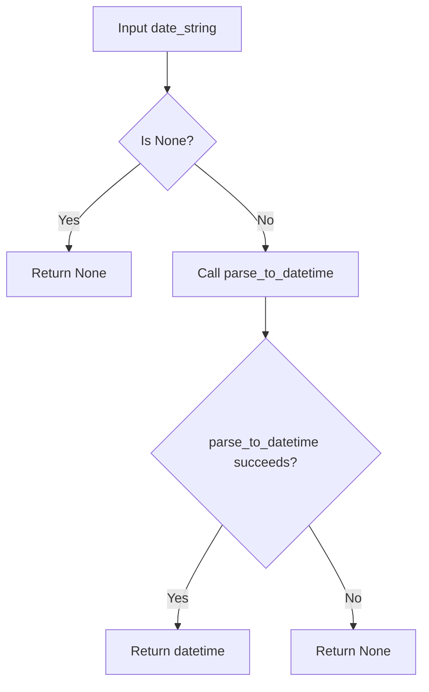
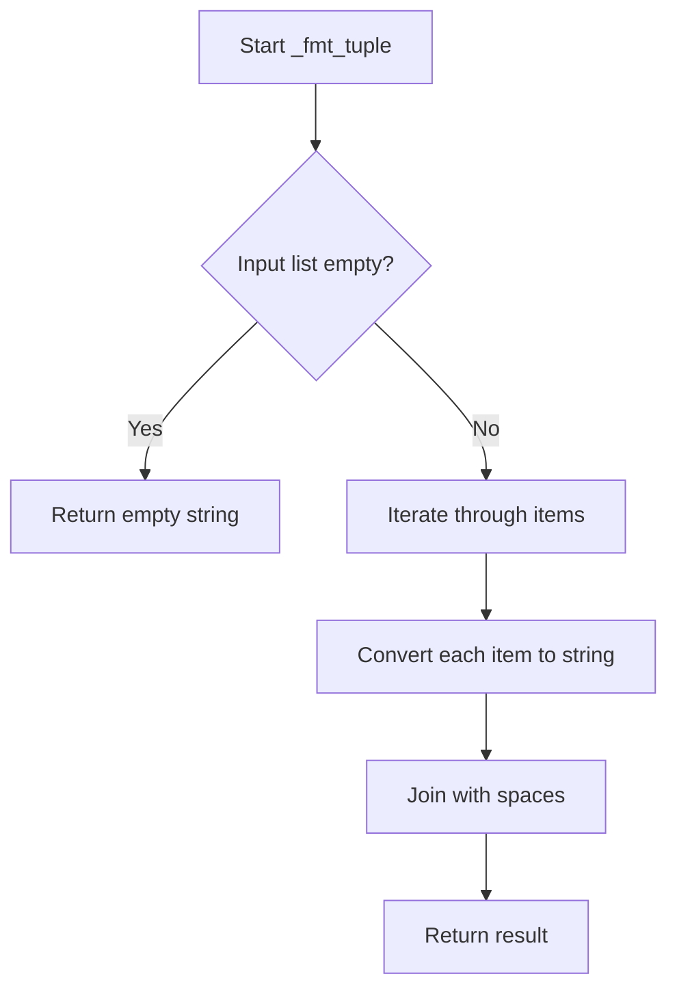

# `response_parser.py`

## `imapclient.response_parser.parse_response` · *function*

## Summary:
Converts raw IMAP protocol response data into a structured tuple of parsed Python objects.

## Description:
Parses a list of IMAP protocol response bytes into a tuple of Python-native objects representing the structured response. This function serves as the primary interface for converting IMAP protocol syntax into usable Python data types.

The function handles the special case where input data is `[None]` by returning an empty tuple, which typically represents an empty response or null response from the IMAP server. For all other inputs, it delegates to `gen_parsed_response` to perform the actual tokenization and parsing.

This logic is extracted into its own function rather than being inlined because it provides a clean abstraction layer that separates the response parsing entry point from the detailed token processing logic, making the code more modular and testable.

## Args:
    data (List[bytes]): Raw IMAP protocol response data represented as a list of byte strings, where each byte string represents a line or chunk of the protocol response

## Returns:
    Tuple[_Atom, ...]: A tuple containing parsed Python objects representing the IMAP protocol response, where each element can be:
        - None for NIL tokens in the protocol
        - bytes for literal data, quoted strings, or raw tokens
        - int for numeric tokens
        - tuple for nested tuple structures

## Raises:
    ProtocolError: When protocol violations are encountered during token parsing, either directly from the atom function or when a ValueError occurs during parsing that gets wrapped in a ProtocolError

## Constraints:
    - Precondition: The input data parameter must be a valid list of IMAP protocol response bytes
    - Precondition: Each byte string in the input list should represent a complete or partial IMAP protocol token or response line
    - Postcondition: The returned tuple will contain parsed Python objects matching the semantic meaning of the original IMAP protocol tokens

## Side Effects:
    None

## Control Flow:
```mermaid
flowchart TD
    A[Start parse_response] --> B{data == [None]?}
    B -- Yes --> C[Return empty tuple]
    B -- No --> D[Call gen_parsed_response(data)]
    D --> E[Convert generator to tuple]
    E --> F[Return parsed tuple]
```

## Examples:
    >>> # Basic usage with simple response
    ... response = [b'* OK [CAPABILITY IMAP4REV1]\r\n']
    ... parsed = parse_response(response)
    ... print(parsed)
    (b'*', b'OK', b'[CAPABILITY', b'IMAP4REV1]')
    
    >>> # Usage with literal data
    ... response = [b'* 1 FETCH (BODY[] {13}\r\nHello world\r\n)']
    ... parsed = parse_response(response)
    ... print(parsed)
    (b'*', b'1', b'FETCH', (b'BODY[]', b'Hello world'))
    
    >>> # Empty response case
    ... response = [None]
    ... parsed = parse_response(response)
    ... print(parsed)
    ()
```

## `imapclient.response_parser.parse_message_list` · *function*

## Summary:
Parses IMAP message ID lists from server responses into structured SearchIds objects.

## Description:
Extracts message identifiers from IMAP protocol responses and optionally processes additional metadata such as modification sequences. This function handles the parsing of message list responses that typically occur during IMAP SEARCH operations or when retrieving message sequences from a mailbox.

The logic is extracted into its own function to provide a clean abstraction layer for message ID parsing, separating the concerns of raw response handling from structured data interpretation. This makes the parsing logic reusable and testable independently from other response parsing operations.

## Args:
    data (List[Union[bytes, str]]): A single-element list containing the raw IMAP response data for message IDs, either as bytes or string representation.

## Returns:
    SearchIds: An object containing parsed message IDs as integers, with optional modseq attribute for modification sequence information and additional items appended.

## Raises:
    ValueError: When the input data contains zero or multiple elements, or when the message data doesn't match the expected format pattern.

## Constraints:
    - Precondition: Input data must be a list with exactly one element
    - Precondition: The single element must be either bytes or string containing valid message ID data
    - Postcondition: Returned SearchIds object will contain parsed integer message IDs
    - Postcondition: If present, modseq information will be stored in the modseq attribute of the SearchIds object

## Side Effects:
    None

## Control Flow:
```mermaid
flowchart TD
    A[Start parse_message_list] --> B{len(data) != 1?}
    B -- Yes --> C[Raise ValueError]
    B -- No --> D{message_data empty?}
    D -- Yes --> E[Return empty SearchIds]
    D -- No --> F{message_data bytes?}
    F -- Yes --> G[Decode to ASCII string]
    F -- No --> H[Continue with string]
    H --> I[Match _msg_id_pattern]
    I -- No match --> J[Raise ValueError]
    I -- Match --> K[Parse message IDs]
    K --> L[Extract extra data]
    L --> M{Extra data exists?}
    M -- Yes --> N[Parse extra with parse_response]
    N --> O[Process parsed items]
    O --> P{Item is modseq?}
    P -- Yes --> Q[Set ids.modseq]
    P -- No --> R{Item is int?}
    R -- Yes --> S[Append to ids]
    R -- No --> T[Ignore]
    M -- No --> U[Return ids]
    Q --> U
    S --> U
```

## Examples:
    >>> # Basic usage with message IDs
    ... data = [b'1 2 3 4 5']
    ... result = parse_message_list([data])
    ... print(result)
    [1, 2, 3, 4, 5]
    
    >>> # Usage with modseq information
    ... data = [b'1 2 3 (MODSEQ 12345)']
    ... result = parse_message_list([data])
    ... print(result)
    [1, 2, 3]
    >>> print(result.modseq)
    12345
    
    >>> # Empty response case
    ... result = parse_message_list([b''])
    ... print(result)
    []

## `imapclient.response_parser.gen_parsed_response` · *function*

## Summary:
Generates parsed IMAP protocol response atoms from raw byte tokens by processing them through the atom parser.

## Description:
Processes a list of raw IMAP protocol response bytes into parsed Python objects by iterating through tokens and converting each using the atom parser. This function serves as the main entry point for parsing IMAP protocol responses into structured Python data types.

The function is designed to handle IMAP protocol responses that may contain various token types including literals, quoted strings, numeric values, NIL values, and tuple structures. It leverages the TokenSource iterator to consume tokens sequentially and the atom function to convert each token into its appropriate Python representation.

This logic is extracted into its own function rather than being inlined because it provides a clean separation between token iteration and token parsing, making the parsing logic reusable and testable independently.

## Args:
    text (List[bytes]): Raw IMAP protocol response data represented as a list of byte strings, where each byte string represents a line or chunk of the protocol response

## Returns:
    Iterator[_Atom]: An iterator yielding parsed Python objects representing the IMAP protocol tokens, where each object can be:
        - None for NIL tokens
        - bytes for literal data, quoted strings, or raw tokens
        - int for numeric tokens
        - tuple for nested tuple structures

## Raises:
    ProtocolError: When protocol violations are encountered during token parsing, either directly from the atom function or when a ValueError occurs during parsing that gets wrapped in a ProtocolError

## Constraints:
    - Precondition: The input text parameter must be a valid list of IMAP protocol response bytes
    - Precondition: Each byte string in the input list should represent a complete or partial IMAP protocol token or response line
    - Postcondition: The returned iterator will yield parsed Python objects matching the semantic meaning of the original IMAP protocol tokens

## Side Effects:
    None

## Control Flow:
```mermaid
flowchart TD
    A[Start gen_parsed_response] --> B{text is empty?}
    B -- Yes --> C[Return empty iterator]
    B -- No --> D[Create TokenSource from text]
    D --> E[Iterate through tokens in TokenSource]
    E --> F[Call atom(src, token) for each token]
    F --> G{atom raises ProtocolError?}
    G -- Yes --> H[Raise ProtocolError]
    G -- No --> I{atom raises ValueError?}
    I -- Yes --> J[Wrap ValueError in ProtocolError]
    I -- No --> K[Yield parsed atom]
    K --> E
```

## Examples:
    >>> # Basic usage with simple response
    ... response = [b'* OK [CAPABILITY IMAP4REV1]\r\n']
    ... parsed = list(gen_parsed_response(response))
    ... print(parsed)
    [b'*', b'OK', b'[CAPABILITY', b'IMAP4REV1]']
    
    >>> # Usage with literal data
    ... response = [b'* 1 FETCH (BODY[] {13}\r\nHello world\r\n)']
    ... parsed = list(gen_parsed_response(response))
    ... print(parsed)
    [b'*', b'1', b'FETCH', (b'BODY[]', b'Hello world')]

## `imapclient.response_parser.parse_fetch_response` · *function*

## Summary:
Parses IMAP FETCH command responses into a structured dictionary mapping message identifiers to their attribute-value pairs.

## Description:
Processes raw IMAP protocol FETCH responses into a nested dictionary structure where keys are message identifiers (either sequence numbers or UIDs) and values are dictionaries containing the parsed attributes for each message. This function handles the complex parsing of IMAP FETCH responses, including special handling for UID, INTERNALDATE, ENVELOPE, BODY, and BODYSTRUCTURE attributes.

The function is designed to work with the output of `gen_parsed_response()` and processes sequences of message data, extracting message IDs and their associated attributes. It supports flexible key selection between sequence numbers and UIDs based on the `uid_is_key` parameter, and provides automatic conversion of special date and envelope data formats.

This logic is extracted into its own function rather than being inlined because it encapsulates the entire parsing logic for IMAP FETCH responses, providing a clean separation between raw response parsing and structured data extraction. It also centralizes the handling of IMAP-specific data types and error conditions.

## Args:
    text (List[bytes]): Raw IMAP protocol response data from a FETCH command, typically containing message sequences and their attributes
    normalise_times (bool): When True, converts timezone-aware datetimes to system local timezone; when False, preserves original timezone information. Defaults to True
    uid_is_key (bool): When True, uses UID as the primary key in the returned dictionary; when False, uses sequence number. Defaults to True

## Returns:
    defaultdict[int, Dict[bytes, Union[bytes, int, datetime.datetime, Address, Envelope, BodyData]]]: A dictionary where:
        - Keys are message identifiers (sequence numbers or UIDs based on uid_is_key parameter)
        - Values are dictionaries mapping attribute names (as bytes) to their parsed values
        - Attribute values can be bytes, int, datetime.datetime, Address, Envelope, or BodyData objects
        - Empty input returns an empty defaultdict

## Raises:
    ProtocolError: When encountering malformed IMAP protocol responses, including:
        - Unexpected end of response (StopIteration)
        - Invalid message ID format
        - Invalid UID format
        - Bad response type (non-tuple)
        - Uneven number of response items

## Constraints:
    Preconditions:
    - Input text must be a list of bytes representing valid IMAP protocol response data
    - Each message in the response must have a valid sequence number or UID
    - Response data must follow IMAP protocol conventions for FETCH responses
    
    Postconditions:
    - Returns a defaultdict with properly parsed message data
    - Message identifiers are correctly mapped to their attributes
    - Special attributes (INTERNALDATE, ENVELOPE, BODY, BODYSTRUCTURE) are converted to appropriate Python objects
    - When uid_is_key=True, message keys are UIDs; when False, keys are sequence numbers

## Side Effects:
    None

## Control Flow:
```mermaid
flowchart TD
    A[Start parse_fetch_response] --> B{text == [None]?}
    B -->|Yes| C[Return empty defaultdict]
    B -->|No| D[Call gen_parsed_response(text)]
    D --> E[Initialize parsed_response defaultdict]
    E --> F[Loop while True]
    F --> G{Next response item available?}
    G -->|No| H[Break loop]
    G -->|Yes| I[Get msg_id/seq with _int_or_error]
    I --> J{Next response item available?}
    J -->|No| K[Raise ProtocolError: unexpected EOF]
    J -->|Yes| L[Get msg_response tuple]
    L --> M{msg_response is tuple?}
    M -->|No| N[Raise ProtocolError: bad response type]
    M -->|Yes| O{len(msg_response) % 2 == 0?}
    O -->|No| P[Raise ProtocolError: uneven number of response items]
    O -->|Yes| Q[Initialize msg_data dict with SEQ]
    Q --> R[Loop through msg_response 2 at a time]
    R --> S[msg_attribute = msg_response[i]]
    S --> T[word = msg_attribute.upper()]
    T --> U{word == b"UID"?}
    U -->|Yes| V[Get uid with _int_or_error]
    V --> W{uid_is_key?}
    W -->|Yes| X[msg_id = uid]
    W -->|No| Y[msg_data[word] = uid]
    X --> Z[Continue loop]
    Y --> Z
    U -->|No| AA{word == b"INTERNALDATE"?}
    AA -->|Yes| AB[msg_data[word] = _convert_INTERNALDATE(value, normalise_times)]
    AA -->|No| AC{word == b"ENVELOPE"?}
    AC -->|Yes| AD[msg_data[word] = _convert_ENVELOPE(value, normalise_times)]
    AC -->|No| AE{word in (b"BODY", b"BODYSTRUCTURE")?}
    AE -->|Yes| AF[msg_data[word] = BodyData.create(value)]
    AE -->|No| AG[msg_data[word] = value]
    AG --> AH[Update parsed_response[msg_id] with msg_data]
    AH --> F
```

## Examples:
    # Basic usage with sequence numbers
    >>> response = [b'* 1 FETCH (UID 1234 INTERNALDATE "01-Jan-2024 12:30:45 +0000" SUBJECT "Test")']
    >>> result = parse_fetch_response(response)
    >>> print(result[1]["UID"])
    1234
    >>> print(result[1]["INTERNALDATE"])
    datetime.datetime(2024, 1, 1, 12, 30, 45, tzinfo=FixedOffset(0))
    
    # Usage with UIDs as keys
    >>> response = [b'* 1 FETCH (UID 1234 INTERNALDATE "01-Jan-2024 12:30:45 +0000" SUBJECT "Test")']
    >>> result = parse_fetch_response(response, uid_is_key=True)
    >>> print(result[1234]["SEQ"])
    1
    
    # Handling multiple messages
    >>> response = [
    ...     b'* 1 FETCH (UID 1234 SUBJECT "First")',
    ...     b'* 2 FETCH (UID 1235 SUBJECT "Second")'
    ... ]
    >>> result = parse_fetch_response(response)
    >>> print(len(result))
    2
    >>> print(result[1234]["SUBJECT"])
    b"First"

## `imapclient.response_parser._int_or_error` · *function*

## Summary
Converts an atom value to an integer, raising a protocol error if conversion fails.

## Description
This utility function attempts to convert an IMAP protocol atom value to an integer. It is used during IMAP response parsing when integer values are expected but might not be properly formatted. The function provides consistent error handling for invalid integer conversions by raising a ProtocolError with descriptive context.

## Args
    value (_Atom): The atom value to convert to an integer. This is typically a string or numeric value from IMAP protocol responses.
    error_text (str): A descriptive error message prefix to include in the ProtocolError if conversion fails.

## Returns
    int: The converted integer value when successful.

## Raises
    ProtocolError: When the value cannot be converted to an integer, with an error message containing the error_text and the problematic value representation.

## Constraints
    Preconditions: The value parameter must be convertible to an integer, or a ProtocolError will be raised.
    Postconditions: Either returns a valid integer or raises a ProtocolError.

## Side Effects
    None

## Control Flow
```mermaid
flowchart TD
    A[Call _int_or_error] --> B{Try int(value)}
    B -->|Success| C[Return int(value)]
    B -->|Failure| D[Raise ProtocolError]
```

## Examples
    # Successful conversion
    result = _int_or_error("123", "Invalid sequence number")
    # Returns: 123
    
    # Failed conversion
    try:
        _int_or_error("abc", "Invalid sequence number")
    except ProtocolError as e:
        print(str(e))  # Prints: "Invalid sequence number: 'abc'"
```

## `imapclient.response_parser._convert_INTERNALDATE` · *function*

## Summary:
Converts an IMAP INTERNALDATE string representation into a timezone-aware Python datetime object.

## Description:
Parses an IMAP INTERNALDATE timestamp (provided as an atom) into a Python datetime object. This function serves as a wrapper around `parse_to_datetime` to handle IMAP-specific date parsing with proper error handling. The function is designed to process date strings received from IMAP servers and convert them into standardized Python datetime objects for further processing.

This logic is extracted into its own function to provide centralized date parsing behavior with consistent error handling and to abstract away the complexity of dealing with IMAP's INTERNALDATE format and potential parsing failures.

## Args:
    date_string (_Atom): The IMAP INTERNALDATE timestamp as an atom (typically bytes). May be None.
    normalise_times (bool): Flag indicating whether to normalize timezone-aware datetimes to system local timezone. Defaults to True.

## Returns:
    Optional[datetime.datetime]: A timezone-aware datetime object representing the parsed timestamp, or None if the input is None or parsing fails.

## Raises:
    None: This function catches ValueError exceptions internally and returns None instead.

## Constraints:
    Preconditions:
    - Input date_string must be either None or a valid IMAP INTERNALDATE format
    - When date_string is not None, it should be compatible with the parse_to_datetime function's expectations
    
    Postconditions:
    - Returns None when input is None
    - Returns None when parsing fails due to invalid format
    - Returns a properly parsed datetime object when successful

## Side Effects:
    None

## Control Flow:


## Examples:
    # Successful parsing
    >>> _convert_INTERNALDATE(b"01-Jan-2024 12:30:45 +0000")
    datetime.datetime(2024, 1, 1, 12, 30, 45, tzinfo=FixedOffset(0))
    
    # Parsing with normalization
    >>> _convert_INTERNALDATE(b"01-Jan-2024 12:30:45 +0000", normalise_times=False)
    datetime.datetime(2024, 1, 1, 12, 30, 45, tzinfo=FixedOffset(0))
    
    # None input
    >>> _convert_INTERNALDATE(None)
    None
    
    # Invalid format (returns None)
    >>> _convert_INTERNALDATE(b"invalid-date-format")
    None
```

## `imapclient.response_parser._convert_ENVELOPE` · *function*

## Summary:
Converts an IMAP ENVELOPE response tuple into a structured Envelope object with parsed date, subject, and address information.

## Description:
Processes raw IMAP ENVELOPE response data into a standardized Envelope object. This function extracts and parses the date, subject, and various address fields (from, sender, reply-to, to, cc, bcc) from the IMAP response tuple. It handles datetime parsing with optional timezone normalization and converts address tuples into Address objects.

The function is designed to be a utility for parsing IMAP protocol responses and extracting meaningful email metadata. It's extracted into its own function to encapsulate the complex parsing logic for ENVELOPE data structures, making the main parsing logic cleaner and more maintainable.

## Args:
    envelope_response (_Atom): Raw IMAP ENVELOPE response data as a tuple containing:
        - Index 0: Date string (bytes) or None
        - Index 1: Subject string (bytes)
        - Index 2-7: Address lists (tuples of address tuples) or None
        - Index 8: In-reply-to string (bytes)
        - Index 9: Message-ID string (bytes)
    normalise_times (bool): Whether to normalize timezone-aware datetimes to system local timezone. Defaults to True.

## Returns:
    Envelope: Structured envelope data containing parsed date, subject, and address information.

## Raises:
    None explicitly raised, though ValueError may be raised internally by parse_to_datetime() which is caught and ignored.

## Constraints:
    Preconditions:
    - envelope_response must be a tuple-like structure with at least 10 elements
    - envelope_response[0] must be bytes or None when present
    - envelope_response[1], [8], [9] must be bytes
    - envelope_response[2:8] must be tuples or None when present
    - envelope_response[2:8][n] must be tuples or None when present
    
    Postconditions:
    - Returns an Envelope object with properly parsed fields
    - Date field will be None if parsing fails or input is None
    - All address fields will be None or tuples of Address objects
    - Subject, in_reply_to, and message_id will be preserved as bytes

## Side Effects:
    None

## Control Flow:
```mermaid
flowchart TD
    A[Start _convert_ENVELOPE] --> B{envelope_response[0] exists?}
    B -->|No| C[dt = None]
    B -->|Yes| D[Parse date with parse_to_datetime]
    D --> E{Parse successful?}
    E -->|No| F[dt = None]
    E -->|Yes| G[dt = parsed datetime]
    F --> H[Continue]
    G --> H
    H --> I[Extract subject=envelope_response[1]]
    I --> J[Extract in_reply_to=envelope_response[8]]
    J --> K[Extract message_id=envelope_response[9]]
    K --> L[Process address lists (indices 2-7)]
    L --> M{addr_list exists?}
    M -->|No| N[addresses.append(None)]
    M -->|Yes| O[Process addr_tuple elements]
    O --> P{addr_tuple exists?}
    P -->|No| Q[Skip]
    P -->|Yes| R[Create Address object]
    Q --> S[Continue loop]
    R --> S
    S --> T{End of addr_list?}
    T -->|No| U[Process next addr_tuple]
    T -->|Yes| V[addresses.append(tuple(addrs))]
    U --> T
    V --> W[Build and return Envelope]
```

## Examples:
    # Basic usage with complete envelope data
    >>> envelope_data = (
    ...     b"Mon, 01 Jan 2024 12:30:45 +0000",
    ...     b"Test Subject",
    ...     ((b"John Doe", b"", b"john", b"example.com"),),
    ...     None,
    ...     None,
    ...     None,
    ...     None,
    ...     None,
    ...     b"<reply@example.com>",
    ...     b"<message-id@example.com>"
    ... )
    >>> result = _convert_ENVELOPE(envelope_data)
    >>> print(result.subject)
    b"Test Subject"
    >>> print(result.date)
    datetime.datetime(2024, 1, 1, 12, 30, 45, tzinfo=FixedOffset(0))
``

## `imapclient.response_parser.atom` · *function*

## Summary:
Parses IMAP protocol tokens into appropriate Python native types, converting protocol-specific representations into standard Python objects.

## Description:
Converts IMAP protocol tokens into their corresponding Python representations. This function serves as the core token-to-type conversion mechanism in the IMAP response parser, handling various protocol-specific formats including NIL values, literal data, quoted strings, numeric values, and tuple structures.

The function works as part of a recursive parsing system where it can be called by `parse_tuple` to process individual elements within tuple structures, and can itself recognize tuple-starting tokens to initiate deeper parsing.

## Args:
    src (TokenSource): Source of IMAP protocol tokens providing access to literal data when needed
    token (bytes): The raw IMAP protocol token to be parsed

## Returns:
    _Atom: A Python object representing the parsed token, which can be:
        - None for NIL tokens
        - bytes for literal data, quoted strings, or raw tokens
        - int for numeric tokens
        - tuple for nested tuple structures (when token is b"(")

## Raises:
    ProtocolError: When literal size mismatches occur or when no literal corresponds to a literal token

## Constraints:
    - Precondition: The token parameter must be a valid IMAP protocol token
    - Precondition: When processing literal tokens (starting with {), the TokenSource must have current_literal data available
    - Postcondition: The returned value accurately represents the semantic meaning of the input token in Python type system

## Side Effects:
    None

## Control Flow:
```mermaid
flowchart TD
    A[Start atom] --> B{token == b"("}
    B -- Yes --> C[Call parse_tuple(src)]
    B -- No --> D{token == b"NIL"}
    D -- Yes --> E[Return None]
    D -- No --> F{token starts with b"{"}
    F -- Yes --> G[Validate literal size]
    G --> H{Literal size matches?}
    H -- No --> I[Raise ProtocolError]
    H -- Yes --> J[Return literal_text]
    F -- No --> K{token is quoted string}
    K -- Yes --> L[Return token without quotes]
    K -- No --> M{token is digit}
    M -- Yes --> N{Valid numeric format?}
    N -- Yes --> O[Return int(token)]
    N -- No --> P[Return token]
    M -- No --> Q[Return token]
```

## Examples:
    >>> # Parse NIL token
    ... atom(src, b"NIL")
    None
    
    >>> # Parse integer token
    ... atom(src, b"42")
    42
    
    >>> # Parse quoted string
    ... atom(src, b'"Hello World"')
    b'Hello World'
    
    >>> # Parse literal token
    ... src.current_literal = b'Hello world'
    ... atom(src, b'{11}')
    b'Hello world'
    
    >>> # Parse tuple (calls parse_tuple internally)
    ... atom(src, b'(')
    (...)
```

## `imapclient.response_parser.parse_tuple` · *function*

## Summary:
Parses a tuple structure from a stream of IMAP protocol tokens, converting them into a nested tuple of appropriate Python types.

## Description:
Processes a sequence of IMAP protocol tokens from a TokenSource until encountering a closing parenthesis, building and returning a tuple of parsed atoms. This function handles nested tuple structures by recursively calling itself when an opening parenthesis is encountered.

The function is part of the IMAP response parsing infrastructure and is responsible for converting IMAP protocol tuples (which may contain nested structures) into Python tuple objects with appropriate type conversions.

## Args:
    src (TokenSource): An iterator over IMAP protocol tokens that provides access to the current literal data when needed

## Returns:
    _Atom: A tuple containing the parsed atoms from the token stream, with appropriate type conversions applied to each element

## Raises:
    ProtocolError: When the tuple structure is incomplete (no closing parenthesis found) or when literal size mismatches occur

## Constraints:
    - Precondition: The TokenSource must contain valid IMAP protocol tokens that form a proper tuple structure
    - Precondition: The first token from the source must not be a closing parenthesis
    - Postcondition: The returned tuple contains all parsed atoms in order from the token stream
    - Postcondition: If a nested tuple is encountered, it will be recursively parsed and returned as a nested tuple

## Side Effects:
    None

## Control Flow:
```mermaid
flowchart TD
    A[Start parse_tuple] --> B[Initialize empty list out]
    B --> C[Iterate through tokens from src]
    C --> D{Token equals b")"?}
    D -- Yes --> E[Return tuple(out)]
    D -- No --> F[Call atom(src, token)]
    F --> G[Append result to out]
    G --> C
    C --> H{End of token source?}
    H -- Yes --> I[Raise ProtocolError]
```

## Examples:
    >>> # Parsing a simple tuple
    ... src = TokenSource([b"1", b"2", b"3", b")"])
    ... parse_tuple(src)
    (1, 2, 3)
    
    >>> # Parsing a nested tuple
    ... src = TokenSource([b"1", b"(", b"2", b"3", b")", b")"])
    ... parse_tuple(src)
    (1, (2, 3))
    
    >>> # Parsing tuple with mixed types
    ... src = TokenSource([b"INBOX", b"NIL", b"42", b")"])
    ... parse_tuple(src)
    (b'INBOX', None, 42)
```

## `imapclient.response_parser._fmt_tuple` · *function*

## Summary:
Converts a list of IMAP protocol tokens into a space-delimited string representation.

## Description:
This utility function transforms a list of IMAP protocol tokens (represented as `_Atom` objects) into a single string by joining them with spaces. It serves as a formatting helper for processing IMAP server responses where tokenized data needs to be reconstructed into readable string form.

## Args:
    t (List[_Atom]): A list of IMAP protocol tokens to be joined into a string

## Returns:
    str: A space-delimited string containing all elements from the input list

## Raises:
    None explicitly raised

## Constraints:
    - Input list must contain only objects that support string conversion
    - All elements in the list must be convertible to strings via `str()`

## Side Effects:
    None

## Control Flow:


## Examples:
    >>> _fmt_tuple(['INBOX', 'UNSEEN'])
    'INBOX UNSEEN'
    
    >>> _fmt_tuple(['FLAGGED', 'NOT', 'DELETED'])
    'FLAGGED NOT DELETED'
    
    >>> _fmt_tuple([])
    ''
```

