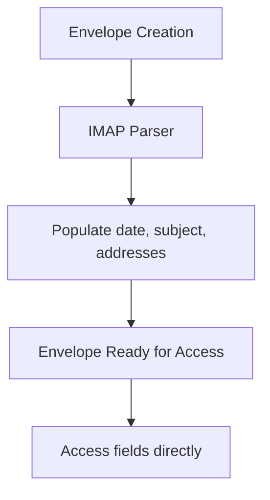
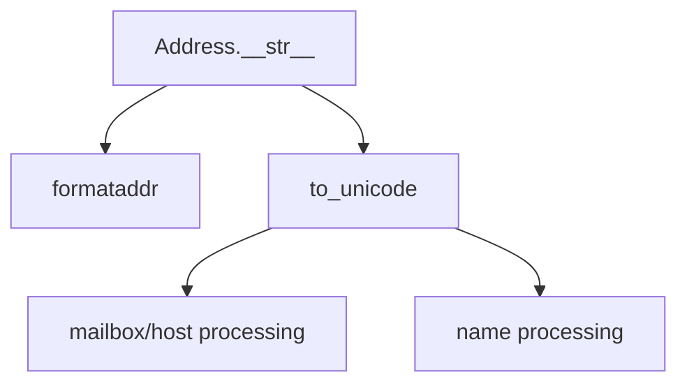
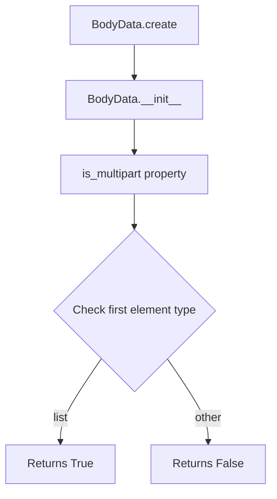

# `response_types.py`

## `imapclient.response_types.Envelope` · *class*

## Summary:
Represents email envelope information from IMAP FETCH responses, containing metadata about an email message.

## Description:
The Envelope class is a data structure that encapsulates the envelope information of an email message as returned by IMAP servers. It contains standard email metadata fields such as date, subject, sender information, and message identifiers. This class is typically created by IMAP parsing functions and used internally by the IMAP client to represent email envelope data.

The class is designed to hold binary-encoded email information (as is standard in IMAP protocols) and expects Address objects for email address fields. It serves as a structured data container for email metadata without significant behavioral logic. Based on the imports and structure, this class is likely implemented as a dataclass.

## State:
- date: Optional[datetime.datetime] - The timestamp when the email was sent, or None if not available
- subject: bytes - The subject line of the email in binary format
- from_: Optional[Tuple["Address", ...]] - The sender's email address(es) as Address objects, or None if not available
- sender: Optional[Tuple["Address", ...]] - The email sender's address(es) as Address objects, or None if not available  
- reply_to: Optional[Tuple["Address", ...]] - Reply-to address(es) as Address objects, or None if not available
- to: Optional[Tuple["Address", ...]] - Recipient address(es) as Address objects, or None if not available
- cc: Optional[Tuple["Address", ...]] - CC recipient address(es) as Address objects, or None if not available
- bcc: Optional[Tuple["Address", ...]] - BCC recipient address(es) as Address objects, or None if not available
- in_reply_to: bytes - Reference to parent message ID in binary format
- message_id: bytes - Unique identifier for the message in binary format

All fields except date and in_reply_to/message_id are optional tuples of Address objects, allowing for multiple addresses in each field. The binary format is preserved to match IMAP protocol requirements.

## Lifecycle:
- Creation: Typically instantiated by IMAP parsing functions that populate the fields with parsed email envelope data. Likely constructed via dataclass mechanisms.
- Usage: Fields are accessed directly for retrieving email metadata; no special method invocation sequence required
- Destruction: Follows normal Python object lifecycle with automatic garbage collection

## Method Map:


## Raises:
- None explicitly raised by the class itself
- However, accessing Address objects' methods may raise UnicodeDecodeError if bytes cannot be decoded properly
- When creating Address objects from raw bytes, to_unicode() may raise UnicodeDecodeError

## Example:
```python
# Typical usage would be:
envelope = Envelope(
    date=datetime.datetime(2023, 1, 15, 10, 30, 0),
    subject=b"Meeting Notes",
    from_=(Address(name=b"John Doe", route=b"", mailbox=b"john", host=b"example.com"),),
    sender=None,
    reply_to=None,
    to=None,
    cc=None,
    bcc=None,
    in_reply_to=b"<message-id@example.com>",
    message_id=b"<unique-message-id@example.com>"
)
```

## `imapclient.response_types.Address` · *class*

## Summary:
Represents an email address with name, route, mailbox, and host components for IMAP responses.

## Description:
The Address class is a data structure that encapsulates the components of an email address as returned by IMAP servers. It is designed to handle email address information in binary format (bytes) and provides proper string representation for display purposes. This class is typically created by IMAP parsing functions and used internally by the IMAP client to represent email addresses in various contexts such as sender, recipient, or author fields.

## State:
- name: bytes - The display name portion of the email address
- route: bytes - The routing information for the email address (typically empty in most cases)
- mailbox: bytes - The mailbox portion of the email address (username part)
- host: bytes - The host/domain portion of the email address

All attributes are initialized as bytes and are expected to be processed through to_unicode() for string conversion.

## Lifecycle:
- Creation: Instances are typically created by IMAP parsing functions and constructors that populate the four byte attributes
- Usage: The instance is primarily used through its __str__ method for display purposes
- Destruction: No special cleanup required; follows normal Python object lifecycle

## Method Map:


## Raises:
- None explicitly raised by __str__ method
- However, to_unicode() may raise UnicodeDecodeError if bytes cannot be decoded as ASCII

## Example:
```python
# Typical usage would be:
address = Address(name=b"John Doe", route=b"", mailbox=b"john", host=b"example.com")
print(str(address))  # Would display formatted email address
```

### `imapclient.response_types.Address.__str__` · *method*

## Summary:
Converts an Address object to a formatted email address string.

## Description:
This method transforms an Address object into a properly formatted email address string suitable for use in email headers. It handles both cases where both mailbox and host are present, and cases where only one is available. The method uses utility functions to ensure proper Unicode handling and formats the result according to RFC standards using email.utils.formataddr.

## Args:
    None

## Returns:
    str: A formatted email address string in the format "Name <mailbox@host>" or just "mailbox@host" when name is not present.

## Raises:
    None explicitly raised

## State Changes:
    Attributes READ: self.mailbox, self.host, self.name
    Attributes WRITTEN: None

## Constraints:
    Preconditions: The Address object must have the attributes name, mailbox, and host defined (though they can be None/empty).
    Postconditions: Returns a properly formatted string representation of the email address.

## Side Effects:
    None

## `imapclient.response_types.SearchIds` · *class*

## Summary:
Represents a list of IMAP search result message IDs with optional modification sequence tracking.

## Description:
A specialized list type for IMAP search results that extends Python's built-in list of integers to include a modification sequence number. This class is used to store message identifiers returned by IMAP SEARCH commands while maintaining metadata about the mailbox state at the time of the search.

## State:
- `modseq`: Optional[int] - Modification sequence number tracking the state of the mailbox when the search was performed. Defaults to None and can be set to an integer value when available.

## Lifecycle:
- Creation: Instantiate with zero or more integer arguments representing message IDs, or with an iterable of integers
- Usage: Behaves like a standard list of integers with additional modseq attribute access
- Destruction: Inherits standard list cleanup behavior

## Method Map:
```mermaid
graph TD
    A[SearchIds.__init__] --> B[super().__init__]
    A --> C[self.modseq = None]
```

## Raises:
- No explicit exceptions raised by __init__
- Inherited exceptions from List[int] construction (e.g., TypeError for invalid arguments)

## Example:
```python
# Create empty SearchIds
ids = SearchIds()

# Create with message IDs
ids = SearchIds(1, 2, 3, 4, 5)

# Create from iterable
ids = SearchIds([10, 20, 30])

# Access as list
print(len(ids))  # 5
print(ids[0])    # 1

# Set modification sequence
ids.modseq = 12345

# Check modification sequence
print(ids.modseq)  # 12345
```

### `imapclient.response_types.SearchIds.__init__` · *method*

## Summary:
Initializes a SearchIds instance with optional message IDs and sets the modification sequence to None.

## Description:
Constructs a SearchIds object that extends Python's built-in list to store IMAP message identifiers along with optional modification sequence tracking. This method delegates initialization to the parent list class and initializes the modseq attribute to None, indicating no modification sequence information is available at instantiation time. The constructor accepts variable arguments that are compatible with Python's list constructor.

## Args:
    *args (Any): Variable length argument list that can accept zero or more message IDs (integers) or an iterable containing message IDs. When a single argument is provided and it's iterable, it will be treated as an iterable of message IDs.

## Returns:
    None: This method initializes the object in-place and does not return a value.

## Raises:
    TypeError: If arguments cannot be converted to integers or if incompatible types are provided to the parent list constructor.
    ValueError: If the parent list constructor encounters invalid values during initialization.

## State Changes:
    Attributes READ: None
    Attributes WRITTEN: 
    - self.modseq: Sets the modification sequence number to None

## Constraints:
    Preconditions:
    - Arguments must be compatible with Python's list constructor (integers or iterables of integers)
    - Parent class initialization must succeed
    
    Postconditions:
    - self is initialized as a list-like object containing message IDs
    - self.modseq is set to None (indicating no modification sequence information)

## Side Effects:
    None: This method performs no I/O operations or external service calls. It only initializes object state.

## `imapclient.response_types.BodyData` · *class*

## Summary:
Represents parsed IMAP message body data, supporting both single-part and multipart message structures.

## Description:
The BodyData class provides a structured representation of IMAP message body content, capable of handling both simple (single-part) and complex (multipart) message structures. It's designed to parse and represent the hierarchical structure of email message bodies returned by IMAP servers.

This class is typically instantiated through the `create` classmethod rather than direct construction, as it needs to properly parse nested tuple structures from IMAP responses. The `is_multipart` property serves as a critical indicator for distinguishing between different message body structures in IMAP protocol parsing.

## State:
- Inherits from `_BodyDataType` (assumed to be a data class or base type)
- Stores parsed IMAP body data in a tuple-like structure
- The first element determines whether the data is multipart (`is_multipart` property)
- When multipart, the first element is a list containing sub-parts
- When single-part, the first element contains the body structure data

## Lifecycle:
- Creation: Instances are created via the `create` classmethod, which recursively parses IMAP response tuples
- Usage: The `is_multipart` property is used to determine the message structure type during IMAP protocol parsing
- Destruction: Inherits standard Python object cleanup behavior

## Method Map:


## Raises:
- No explicit exceptions documented in the provided code
- The `create` method assumes proper tuple structure from IMAP responses
- May raise exceptions from underlying tuple operations or type checking if malformed data is provided

## Example:
```python
# Creating a BodyData instance from IMAP response
response_tuple = (
    ('text', 'plain', ('charset', 'us-ascii'), None, None, '7bit', 123),
    ('text', 'html', ('charset', 'us-ascii'), None, None, '7bit', 456)
)
body_data = BodyData.create(response_tuple)

# Determining message structure type for IMAP parsing
if body_data.is_multipart:
    print("Message has multiple parts - process recursively")
else:
    print("Message is single part - process normally")
```

### `imapclient.response_types.BodyData.create` · *method*

## Summary:
Constructs a BodyData instance from an IMAP server response tuple, recursively processing multipart email message structures.

## Description:
This class method functions as a factory for BodyData instances, specifically designed to parse IMAP server response tuples into structured email message representations. When processing multipart email messages, it identifies nested tuple structures by checking if the first element is a tuple, then recursively processes each part until encountering bytes data which signals the end of structural elements.

The method implements a two-phase approach: for multipart responses (where response[0] is a tuple), it iterates through elements collecting structural parts until a bytes object is encountered, then recursively builds BodyData instances for those parts. For simple responses, it directly instantiates a BodyData object with the entire response.

## Args:
    cls: The BodyData class (used for classmethod)
    response (Tuple[_Atom, ...]): IMAP server response tuple containing email message data. _Atom represents IMAP protocol atoms such as strings, integers, or nested tuples that form the structure of email message parts.

## Returns:
    BodyData: A BodyData instance representing the parsed email message. For multipart messages, returns a hierarchical structure where inner tuples are recursively converted to BodyData instances.

## Raises:
    None explicitly documented - depends on underlying BodyData constructor behavior

## State Changes:
    Attributes READ: None (this is a factory method that creates new instances)
    Attributes WRITTEN: None (this is a factory method that creates new instances)

## Constraints:
    Preconditions:
    - response must be a tuple of _Atom objects
    - response[0] must be either a tuple (indicating multipart) or a scalar value
    - The response structure must be compatible with BodyData's expected initialization format
    
    Postconditions:
    - Returns a valid BodyData instance
    - For multipart responses, returns a hierarchical structure with nested BodyData objects
    - For simple responses, returns a flat BodyData instance
    - The returned instance preserves the semantic structure of the original IMAP response

## Side Effects:
    None - This is a pure factory method that doesn't perform I/O or modify external state

### `imapclient.response_types.BodyData.is_multipart` · *method*

## Summary:
Determines whether the body data represents a multipart message structure in IMAP protocol parsing.

## Description:
Checks if the body data is structured as a multipart message by examining whether the first element is a list. In IMAP protocol responses, multipart messages (such as emails with attachments) have a nested list structure for their body parts, while single-part messages have a simpler structure. This method is used during IMAP message parsing to distinguish between different message types.

This method is part of the BodyData class which represents parsed IMAP message body data structures. It's a utility method that helps determine the appropriate processing path for different message formats.

## Args:
    None

## Returns:
    bool: True if the body data represents a multipart message (first element is a list), False otherwise.

## Raises:
    None

## State Changes:
    Attributes READ: self[0] - accesses the first element of the BodyData instance
    Attributes WRITTEN: None

## Constraints:
    Preconditions: The BodyData instance must be initialized and have at least one element accessible via indexing
    Postconditions: Returns a boolean value indicating multipart status without modifying the instance state

## Side Effects:
    None

