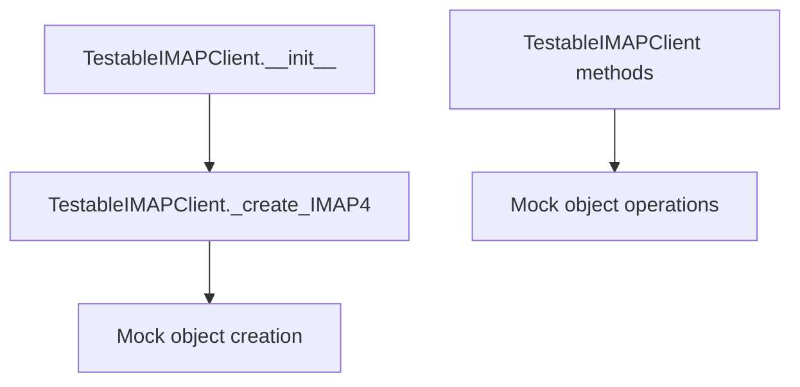

# `testable_imapclient.py`

## `imapclient.testable_imapclient.TestableIMAPClient` · *class*

## Summary:
A testable extension of IMAPClient that provides mockable IMAP functionality for unit testing.

## Description:
TestableIMAPClient is a subclass of IMAPClient designed specifically for testing purposes. It overrides the internal _create_IMAP4 method to provide a mock implementation that can be used in unit tests without requiring actual network connections or real mail servers.

This class enables testing of IMAP-related code without the overhead or dependencies of a real IMAP server connection. The overridden _create_IMAP4 method returns a mock object that simulates IMAP operations.

## State:
- Host parameter: Set to "somehost" in __init__, hardcoded for testing purposes
- Connection state: Managed by parent IMAPClient class, but uses mocked IMAP4 connection
- Mock object: Returned by _create_IMAP4 method for testing purposes

## Lifecycle:
- Creation: Instantiated without arguments, automatically connects to "somehost"
- Usage: Used like a regular IMAPClient, but all IMAP operations are mocked
- Destruction: Inherits standard IMAPClient cleanup behavior

## Method Map:


## Raises:
- Any exceptions that IMAPClient.__init__ might raise when connecting to "somehost"
- Any exceptions that might occur during normal IMAPClient operation

## Example:
```python
# Create testable client
client = TestableIMAPClient()

# Use like regular IMAPClient (but with mocked operations)
client.login("user", "password")
client.select_folder("INBOX")
messages = client.search(["UNSEEN"])

# All operations are mocked and don't require actual IMAP server
```

### `imapclient.testable_imapclient.TestableIMAPClient.__init__` · *method*

## Summary:
Initializes a testable IMAP client by delegating to the parent IMAPClient constructor with a fixed hostname.

## Description:
This constructor initializes the TestableIMAPClient instance by calling the parent IMAPClient constructor with the argument "somehost". This approach enables testing of IMAP-related functionality without requiring actual network connectivity to a mail server. The fixed hostname "somehost" is used to avoid dependency on external mail servers during testing.

## Args:
    None

## Returns:
    None

## Raises:
    Exception: Any exceptions that may be raised by the parent IMAPClient.__init__ method when called with the "somehost" argument.

## State Changes:
    Attributes READ: None
    Attributes WRITTEN: Parent class attributes initialized through super().__init__()

## Constraints:
    Preconditions: None
    Postconditions: The instance is initialized as an IMAPClient with "somehost" as the hostname parameter.

## Side Effects:
    None

### `imapclient.testable_imapclient.TestableIMAPClient._create_IMAP4` · *method*

## Summary:
Creates and returns a new mock IMAP4 client instance for testing purposes.

## Description:
This method serves as a factory for creating MockIMAP4 instances, enabling the TestableIMAPClient to provide a testable interface without requiring actual IMAP server connections. The method isolates the creation logic, making it easier to substitute different mock implementations during testing and ensuring consistent mock object initialization.

## Args:
    None

## Returns:
    MockIMAP4: A new instance of the MockIMAP4 class, which simulates IMAP protocol communication for testing.

## Raises:
    None explicitly raised

## State Changes:
    Attributes READ: None
    Attributes WRITTEN: None

## Constraints:
    Preconditions: None
    Postconditions: Always returns a new MockIMAP4 instance with default initialization

## Side Effects:
    None - This method only creates and returns an object without performing I/O operations or external service calls.

## `imapclient.testable_imapclient.MockIMAP4` · *class*

## Summary:
A mock IMAP4 client used for testing purposes that simulates IMAP protocol communication.

## Description:
This class extends unittest.mock.Mock to provide a test double for IMAPClient instances. It's designed to simulate IMAP protocol interactions during testing without requiring actual network connections. The mock accumulates sent data and maintains state that would normally be managed by a real IMAP server.

## State:
- use_uid: bool, always set to True, indicating UID-based operations are enabled
- sent: bytes, accumulates all data sent via the send() method
- tagged_commands: dict, stores command-tag mappings for tracking IMAP protocol commands
- _starttls_done: bool, tracks whether STARTTLS negotiation has been completed

## Lifecycle:
- Creation: Instantiated like any Mock object, typically by test code to replace real IMAPClient instances
- Usage: Test code calls methods on this mock, which may invoke the send() method to accumulate data
- Destruction: Managed automatically by Python's garbage collection or context managers

## Method Map:
```mermaid
graph TD
    A[MockIMAP4.__init__] --> B[Mock.__init__]
    A --> C[use_uid = True]
    A --> D[sent = b""]
    A --> E[tagged_commands = {}]
    A --> F[_starttls_done = False]
    G[send(data)] --> H[sent += data]
    I[_new_tag()] --> J[return "tag"]
```

## Raises:
- No explicit exceptions raised by __init__
- All methods inherit Mock behavior, potentially raising AttributeError for undefined methods

## Example:
```python
# Create mock instance
mock_client = MockIMAP4()

# Send data (accumulates in self.sent)
mock_client.send(b"LOGIN user pass\r\n")

# Check accumulated data
print(mock_client.sent)  # b"LOGIN user pass\r\n"

# Access other mock features
mock_client.login.return_value = b"* OK [CAPABILITY IMAP4REV1]"
```

### `imapclient.testable_imapclient.MockIMAP4.__init__` · *method*

## Summary:
Initializes a mock IMAP4 client instance with UID support enabled and tracking capabilities for sent commands and tagged operations.

## Description:
This constructor initializes a mock IMAP4 client that extends the base IMAPClient functionality. It configures the client to use UID operations by default and establishes internal tracking mechanisms for monitoring command transmission and tagged IMAP operations. The method serves as the entry point for setting up the mock client's initial state and is typically called during object instantiation.

## Args:
    *args: Variable length argument list passed to the parent IMAPClient constructor
    **kwargs: Arbitrary keyword arguments passed to the parent IMAPClient constructor

## Returns:
    None: This is a constructor method that initializes instance state

## Raises:
    Exception: Any exceptions raised by the parent IMAPClient.__init__ method

## State Changes:
    Attributes READ: None
    Attributes WRITTEN: 
        - self.use_uid: Set to True to enable UID operations
        - self.sent: Initialized to empty bytes for command accumulation
        - self.tagged_commands: Initialized to empty dictionary for command tracking
        - self._starttls_done: Initialized to False for TLS state tracking

## Constraints:
    Preconditions: None specific to this method
    Postconditions: The instance is initialized with UID support enabled and tracking attributes set

## Side Effects:
    None: This method performs no external I/O or service calls, only internal state initialization

### `imapclient.testable_imapclient.MockIMAP4.send` · *method*

## Summary:
Accumulates outgoing data bytes into the instance's sent buffer for testing purposes.

## Description:
This method captures data that would normally be sent over an IMAP connection by appending it to the internal `sent` buffer. It serves as a mock implementation that allows test code to verify what data was transmitted without requiring actual network communication.

## Args:
    data (bytes): The raw bytes to append to the internal sent buffer

## Returns:
    None: This method does not return any value

## Raises:
    None: This method does not raise any exceptions

## State Changes:
    Attributes READ: None
    Attributes WRITTEN: self.sent

## Constraints:
    Preconditions: The instance must have a `sent` attribute initialized as bytes
    Postconditions: The `sent` attribute will contain the concatenation of all previously sent data plus the new data

## Side Effects:
    None: This method only modifies the instance's internal state and has no external I/O or side effects

### `imapclient.testable_imapclient.MockIMAP4._new_tag` · *method*

## Summary:
Generates and returns a fixed tag string for use in IMAP command identification during testing.

## Description:
This method provides a simple, deterministic tag value for IMAP commands in mock testing scenarios. It's designed to be overridden or replaced in production implementations but returns a constant "tag" string in this mock implementation. The method is typically called during IMAP command construction to assign unique identifiers to commands for tracking responses.

## Args:
    None

## Returns:
    str: Always returns the string "tag" for consistent test behavior.

## Raises:
    None

## State Changes:
    Attributes READ: None
    Attributes WRITTEN: None

## Constraints:
    Preconditions: None
    Postconditions: Always returns the same string value "tag"

## Side Effects:
    None

