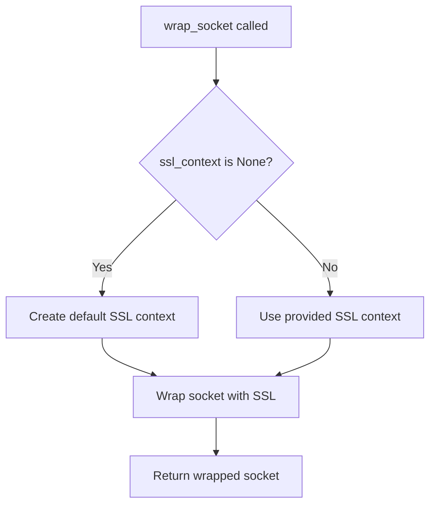

# `tls.py`

## `imapclient.tls.wrap_socket` · *function*

## Summary:
Establishes a secure SSL/TLS connection on a given socket using the specified SSL context and hostname.

## Description:
Wraps a plain socket with SSL/TLS encryption for secure communication. This function provides a standardized way to create encrypted connections while allowing flexibility in SSL context configuration. When no SSL context is provided, it automatically creates a default context appropriate for server authentication.

## Args:
    sock (socket.socket): The underlying socket to wrap with SSL/TLS encryption
    ssl_context (Optional[ssl.SSLContext]): SSL context to use for encryption. If None, a default context is created using ssl.create_default_context() with SERVER_AUTH purpose
    host (str): The hostname of the server to connect to, used for server hostname verification in the SSL handshake

## Returns:
    socket.socket: A new socket object wrapped with SSL/TLS encryption that can be used for secure communication

## Raises:
    ssl.SSLError: If the SSL handshake fails or certificate validation fails
    OSError: If there are network-related errors during the SSL wrapping process

## Constraints:
    Preconditions:
        - The sock parameter must be a valid, connected socket
        - The host parameter must be a valid hostname string
        - The ssl_context parameter, if provided, must be a valid ssl.SSLContext instance
    
    Postconditions:
        - The returned socket is ready for secure communication
        - The SSL context is properly configured for the connection

## Side Effects:
    - Establishes a secure network connection through SSL/TLS encryption
    - May perform network I/O during the SSL handshake process
    - No external state mutations or file operations

## Control Flow:


## Examples:
```python
import socket
import ssl
from imapclient.tls import wrap_socket

# Basic usage with automatic context creation
sock = socket.socket(socket.AF_INET, socket.SOCK_STREAM)
sock.connect(('imap.example.com', 993))
secure_sock = wrap_socket(sock, None, 'imap.example.com')

# Usage with custom SSL context
context = ssl.create_default_context()
context.check_hostname = True
context.verify_mode = ssl.CERT_REQUIRED
secure_sock = wrap_socket(sock, context, 'imap.example.com')
```

## `imapclient.tls.IMAP4_TLS` · *class*

## Summary:
IMAP4_TLS is a secure IMAP client that extends the standard IMAP4 class to provide SSL/TLS encrypted communication with IMAP servers.

## Description:
This class implements a secure IMAP client that establishes encrypted connections to IMAP servers using SSL/TLS protocols. It extends the standard imaplib.IMAP4 class to add TLS support while maintaining compatibility with existing IMAP operations. The class is designed to be used when secure communication with IMAP servers is required, particularly for accessing email accounts over untrusted networks.

The class is typically instantiated by IMAPClient when TLS encryption is requested, and it handles all the low-level SSL/TLS connection management internally.

## State:
- ssl_context: ssl.SSLContext - The SSL context used for secure connections. Can be None to use default settings.
- _timeout: Optional[float] - Default timeout value used for socket operations when no explicit timeout is provided.
- host: str - The hostname of the IMAP server being connected to.
- port: int - The port number of the IMAP server being connected to.
- sock: socket.socket - The underlying socket connection to the IMAP server.
- file: io.BufferedReader - Buffered reader for reading responses from the IMAP server.

## Lifecycle:
- Creation: Instantiate with host, port, ssl_context, and optional timeout parameters
- Usage: Call open() to establish connection, then use standard IMAP operations
- Destruction: Call shutdown() or use as context manager to clean up resources

## Method Map:
```mermaid
flowchart TD
    A[IMAP4_TLS.__init__] --> B[IMAP4.__init__]
    A --> C[Set ssl_context and _timeout]
    B --> D[IMAP4_TLS.open]
    D --> E[socket.create_connection]
    E --> F[wrap_socket]
    F --> G[sock.makefile("rb")]
    G --> H[IMAP4_TLS.read]
    H --> I[IMAP4_TLS.readline]
    I --> J[IMAP4_TLS.send]
    J --> K[IMAP4_TLS.shutdown]
```

## Raises:
- ssl.SSLError: Raised when SSL handshake fails or certificate validation fails during connection establishment
- OSError: Raised when network-related errors occur during socket connection or SSL wrapping
- socket.timeout: Raised when socket operations exceed the specified timeout

## Example:
```python
import ssl
from imapclient import IMAP4_TLS

# Create secure IMAP connection
ssl_context = ssl.create_default_context()
imap = IMAP4_TLS('imap.example.com', 993, ssl_context, timeout=30.0)

# Establish connection
imap.open()

# Perform IMAP operations
imap.login('username', 'password')
imap.select_folder('INBOX')
messages = imap.search(['UNSEEN'])

# Clean up
imap.logout()
imap.shutdown()
```

### `imapclient.tls.IMAP4_TLS.__init__` · *method*

## Summary:
Initializes an IMAP4_TLS connection with SSL context and timeout settings.

## Description:
This constructor establishes the initial configuration for an IMAP4_TLS connection by setting up SSL context, timeout, and connecting to the specified IMAP server. It inherits from the standard imaplib.IMAP4 class and extends it with TLS capabilities.

## Args:
    host (str): The hostname or IP address of the IMAP server to connect to.
    port (int): The port number on which the IMAP server is listening.
    ssl_context (ssl.SSLContext or None): SSL context configuration for secure connections, or None to use default settings.
    timeout (float or None): Connection timeout in seconds, or None for no timeout.

## Returns:
    None: This method initializes the object state and does not return a value.

## Raises:
    None explicitly raised in this method, though underlying socket operations may raise exceptions.

## State Changes:
    Attributes READ: None
    Attributes WRITTEN: 
        - self.ssl_context: Set to the provided SSL context
        - self._timeout: Set to the provided timeout value
        - self.file: Declared as io.BufferedReader (initialization happens in parent class)

## Constraints:
    Preconditions:
        - host must be a valid string representing a network address
        - port must be a positive integer
        - ssl_context must be either an ssl.SSLContext object or None
        - timeout must be a positive float or None
    Postconditions:
        - The object is initialized with the provided connection parameters
        - Parent IMAP4 class initialization is completed
        - SSL context and timeout are stored for future use

## Side Effects:
    - Establishes network connection to the IMAP server during initialization
    - May perform DNS resolution of the host name
    - Sets up SSL/TLS configuration for secure communication

### `imapclient.tls.IMAP4_TLS.open` · *method*

## Summary:
Establishes a secure TLS connection to an IMAP server by creating a socket connection, wrapping it with SSL/TLS encryption, and preparing a file-like interface for communication.

## Description:
This method initializes a secure connection to an IMAP server using TLS encryption. It creates a TCP socket connection to the specified host and port, wraps it with SSL/TLS encryption using the configured SSL context, and prepares a buffered file-like object for reading IMAP protocol responses. This method is typically called during the initialization or reconnection phase of an IMAP client session.

The method is separated from the constructor to allow for flexible connection management, enabling the client to establish connections to different servers or retry connections with different parameters without requiring a new instance.

## Args:
    host (str): The hostname or IP address of the IMAP server. Defaults to an empty string.
    port (int): The port number to connect to. Defaults to 993 (standard IMAPS port).
    timeout (Optional[float]): Connection timeout in seconds. If None, uses the instance's default timeout.

## Returns:
    None: This method does not return a value.

## Raises:
    OSError: If the socket connection fails or network-related issues occur.
    ssl.SSLError: If the SSL/TLS handshake fails or certificate validation fails.
    socket.timeout: If the connection times out according to the specified timeout.

## State Changes:
    Attributes READ:
        - self._timeout: Used when no explicit timeout is provided
        - self.ssl_context: Used to configure the SSL/TLS encryption layer
    Attributes WRITTEN:
        - self.host: Set to the provided host parameter
        - self.port: Set to the provided port parameter
        - self.sock: Set to the SSL-wrapped socket object
        - self.file: Set to a file-like object created from the SSL socket

## Constraints:
    Preconditions:
        - The host parameter must be a valid hostname or IP address string
        - The port parameter must be a valid port number (1-65535)
        - If timeout is provided, it must be a positive number or None
        - The SSL context (self.ssl_context) should be properly configured if provided
        
    Postconditions:
        - The instance has a secure TLS connection established
        - All communication with the IMAP server will be encrypted
        - The instance is ready to send and receive IMAP protocol commands

## Side Effects:
    - Initiates a network connection to the specified IMAP server
    - Performs SSL/TLS handshake with the server
    - Creates and stores socket and file objects for subsequent communication
    - May block during network I/O operations (connection establishment and SSL handshake)

### `imapclient.tls.IMAP4_TLS.read` · *method*

## Summary:
Reads a specified number of bytes from the underlying SSL socket connection.

## Description:
Reads up to `size` bytes from the buffered file-like object (`self.file`) that represents the secure TLS connection to the IMAP server. This method provides low-level access to the network stream for reading IMAP protocol responses and data.

This method is part of a set of I/O operations that work with the buffered file interface created during the TLS connection setup. It's typically called by higher-level IMAP protocol parsing methods that need to consume raw data from the server.

## Args:
    size (int): The maximum number of bytes to read from the connection. Must be a non-negative integer.

## Returns:
    bytes: The bytes read from the connection. May return fewer bytes than requested if EOF is encountered or if less data is available.

## Raises:
    OSError: If the underlying socket connection is closed or becomes unavailable during the read operation.
    io.BlockingIOError: If the read operation would block and the socket is in non-blocking mode.

## State Changes:
    Attributes READ:
        - self.file: The buffered file-like object used for reading from the TLS connection
    Attributes WRITTEN:
        - No attributes are modified by this method

## Constraints:
    Preconditions:
        - The IMAP connection must be established (i.e., `self.file` must be initialized)
        - The `size` parameter must be a non-negative integer
        - The underlying socket connection must be active and readable
        
    Postconditions:
        - The method returns the requested number of bytes (or fewer if EOF is reached)
        - The internal file position of `self.file` advances by the number of bytes read

## Side Effects:
    - Performs blocking I/O operation on the underlying network connection
    - May block until data is available or the connection is closed
    - Reads data from the network stream, consuming bytes from the connection buffer

### `imapclient.tls.IMAP4_TLS.readline` · *method*

## Summary:
Reads a single line from the secure IMAP connection's buffered input stream.

## Description:
This method reads a line of data from the underlying secure socket connection, returning it as bytes. It is used during IMAP protocol communication to receive response lines from the server. The method delegates directly to the buffered file handle's readline() method.

## Args:
    None

## Returns:
    bytes: A bytes object containing one line of data from the connection, including the trailing newline character ('\n') if present.

## Raises:
    io.BlockingIOError: If the operation would block on a non-blocking file descriptor
    io.UnsupportedOperation: If the underlying file is not readable
    AttributeError: If self.file is not properly initialized (e.g., if open() was not called)

## State Changes:
    Attributes READ: self.file
    Attributes WRITTEN: None

## Constraints:
    Preconditions:
        - The IMAP4_TLS instance must be properly initialized with a valid SSL connection
        - The `open()` method must have been called successfully to establish the connection
        - The `self.file` attribute must be a valid BufferedReader instance
    
    Postconditions:
        - The method advances the file pointer to the beginning of the next line
        - The returned bytes object contains the complete line including the newline character

## Side Effects:
    - Performs I/O operations on the underlying secure socket connection
    - May block if data is not immediately available
    - Reads from the network connection and buffers the result

### `imapclient.tls.IMAP4_TLS.send` · *method*

## Summary:
Sends raw data over the established TLS socket connection to the IMAP server.

## Description:
This method transmits the provided data buffer through the secure socket connection that was established during the IMAP session setup. It serves as a low-level communication interface for sending IMAP protocol commands and data to the mail server.

## Args:
    data (Buffer): A buffer containing the data to be sent over the socket connection. This can be bytes, bytearray, or other buffer-like objects.

## Returns:
    None: This method does not return any value.

## Raises:
    socket.error: Raised when there are issues with the underlying socket connection, such as connection drops or network errors.
    OSError: Raised when there are general I/O errors during the send operation.

## State Changes:
    Attributes READ: 
        - self.sock: The underlying TLS socket connection used for transmission
    Attributes WRITTEN: None

## Constraints:
    Preconditions:
        - The IMAP session must be properly opened via the `open()` method before calling this method
        - The `self.sock` attribute must be initialized and connected to the IMAP server
    Postconditions:
        - The data is transmitted through the secure socket connection
        - No return value indicates successful transmission (though socket errors may still occur)

## Side Effects:
    - Network I/O operation that transmits data to the remote IMAP server
    - May raise socket-related exceptions if the connection is broken or unavailable

### `imapclient.tls.IMAP4_TLS.shutdown` · *method*

## Summary:
Closes the IMAP connection and releases associated resources.

## Description:
This method performs cleanup operations to properly close the IMAP connection. It delegates to the parent class's shutdown method to handle standard IMAP connection termination, ensuring that underlying network resources are released appropriately.

## Args:
    None

## Returns:
    None

## Raises:
    None explicitly raised

## State Changes:
    Attributes READ: None
    Attributes WRITTEN: None

## Constraints:
    Preconditions: The IMAP connection must be established (socket and file buffer should be initialized)
    Postconditions: The connection is closed and associated resources are released

## Side Effects:
    Closes the underlying socket connection and file buffer
    Releases network resources associated with the IMAP session

