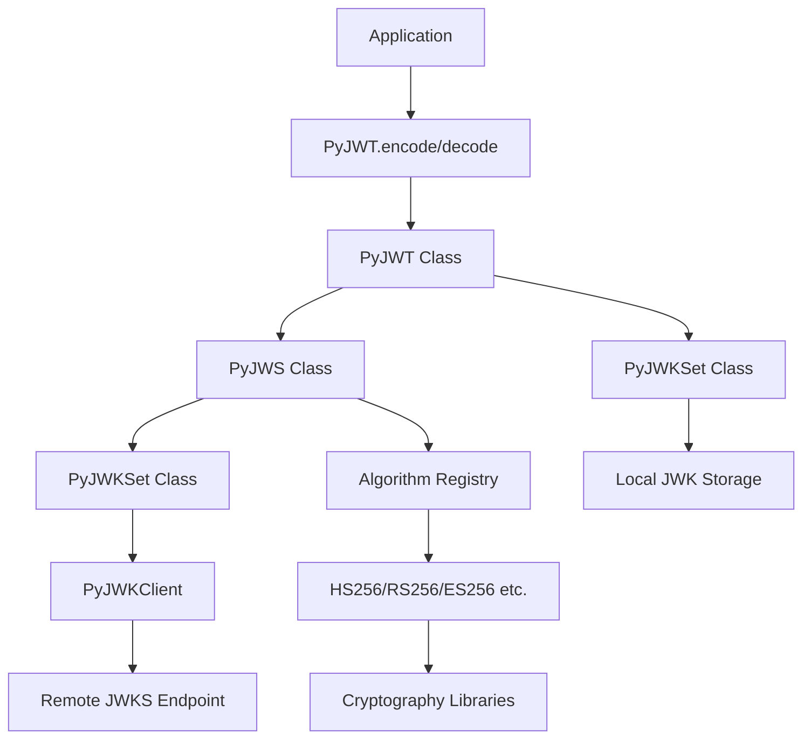

# `PyJWT`

## Repository-Level Documentation: PyJWT

### Tree Structure
```
PyJWT/
├── docs/           # Documentation configuration and build files
│   └── conf.py     # Sphinx configuration for documentation builds
└── jwt/            # Main JWT implementation package
    ├── api_jwk.py      # JSON Web Key (JWK) and JWK Set implementations
    ├── api_jws.py      # JSON Web Signature (JWS) operations
    ├── api_jwt.py      # JSON Web Token (JWT) encoding and decoding
    ├── exceptions.py   # Custom exception classes for JWT operations
    ├── help.py         # Environment information utilities
    ├── jwk_set_cache.py # Caching mechanism for JWK sets
    ├── jwks_client.py   # Client for fetching and managing JWK sets from remote endpoints
    └── warnings.py     # Deprecation warnings for future changes
```

### Purpose
PyJWT is a Python library that implements the JSON Web Token (JWT) standard as defined in RFC 7519, along with the JSON Web Signature (JWS) standard from RFC 7515. It provides a secure and standardized way to encode claims into tokens that can be digitally signed or encrypted.

The library addresses the need for secure authentication and authorization in distributed systems by offering:
- Secure token creation with cryptographic signatures
- Robust token validation with claim verification
- Support for multiple cryptographic algorithms (HS256, RS256, ES256, etc.)
- Integration with JSON Web Key Sets (JWKS) for public key management
- Comprehensive error handling and security-focused design

Target users include developers building authentication systems, microservices architectures, and applications requiring secure token-based communication. It's particularly valuable in OAuth 2.0 implementations, API authentication, and single sign-on (SSO) solutions.

PyJWT positions itself as a foundational security library in the Python ecosystem, providing the core JWT functionality that many higher-level frameworks and services depend upon.

### Architecture


The architecture follows a layered approach:
1. **API Layer**: High-level `PyJWT` class provides user-facing encode/decode methods
2. **Signature Layer**: `PyJWS` handles JWS operations and cryptographic signing/verification
3. **Key Management Layer**: `PyJWKSet` and `PyJWKClient` manage key sets and key retrieval
4. **Algorithm Layer**: Registry pattern for cryptographic algorithm implementations
5. **Infrastructure Layer**: Caching, error handling, and utility components

### Entry Points
- **Importable API**: `from jwt import encode, decode, decode_complete, get_unverified_header`
  - Provides high-level JWT operations for encoding and decoding tokens
  - Target audience: Application developers using JWT for authentication/authorization
- **Module API**: Direct imports from `jwt.api_jwt`, `jwt.api_jws`, `jwt.api_jwk`
  - Provides fine-grained control over JWT operations
  - Target audience: Framework developers and advanced users
- **CLI Utility**: `python -m jwt.help`
  - Displays system and environment information for debugging
  - Target audience: Developers troubleshooting JWT integration issues

### Core Features
1. **JWT Encoding & Decoding** - `PyJWT.encode()` and `PyJWT.decode()` with standard claim validation
   - Implements RFC 7519 JWT specification
   - Module: `jwt.api_jwt`

2. **JWS Signing & Verification** - `PyJWS` for low-level signature operations
   - Implements RFC 7515 JWS specification
   - Module: `jwt.api_jws`

3. **JWK Set Management** - `PyJWKSet` for handling collections of JSON Web Keys
   - Supports key sets from dictionaries, JSON strings, and remote endpoints
   - Module: `jwt.api_jwk`

4. **Remote Key Management** - `PyJWKClient` for fetching and caching JWK sets
   - Fetches keys from remote JWKS endpoints
   - Implements caching with configurable lifespans
   - Module: `jwt.jwks_client`

5. **Algorithm Support** - Multiple cryptographic algorithms (HS256, RS256, ES256, etc.)
   - Extensible algorithm registry
   - Module: `jwt.api_jws`

6. **Security Validation** - Comprehensive claim validation (exp, iat, nbf, iss, aud)
   - Built-in validation of standard JWT claims
   - Module: `jwt.api_jwt`

### Dependencies
- **Standard Library**: `base64`, `collections`, `copy`, `datetime`, `hashlib`, `json`, `os`, `platform`, `ssl`, `sys`, `time`, `urllib`, `typing`, `warnings`
- **External Libraries**: 
  - `cryptography` (for cryptographic operations)
  - `requests` (for HTTP requests in PyJWKClient)
- **Version Constraints**: 
  - Requires Python 3.7+
  - Cryptography library version >= 3.3.0 recommended for best security

### Configuration
The library supports configuration through:
- Environment variables for key management and security settings
- Runtime parameters in API calls (algorithms, options, headers)
- Module-level constants for default behaviors
- Caching parameters for JWK set management

### Extension Points
1. **Algorithm Plugins**: Implement custom cryptographic algorithms by extending the Algorithm base class
2. **Custom Exceptions**: Extend `PyJWTError` for domain-specific error handling
3. **Key Providers**: Implement custom key retrieval strategies for `PyJWKClient`
4. **Validation Options**: Customize claim validation through the options parameter in decode methods
5. **Caching Strategies**: Replace or extend `JWKSetCache` for custom caching behavior

---

## Modules

- [`docs`](docs.md)
- [`jwt`](jwt.md)

