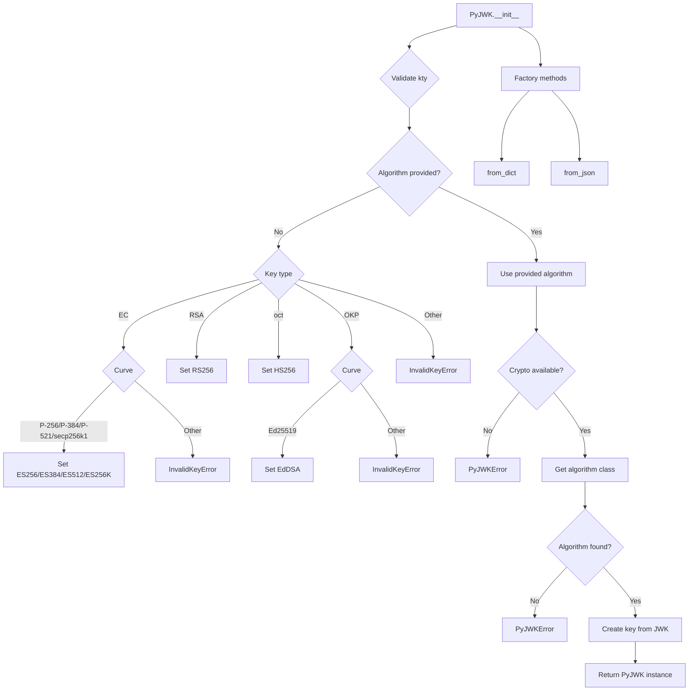
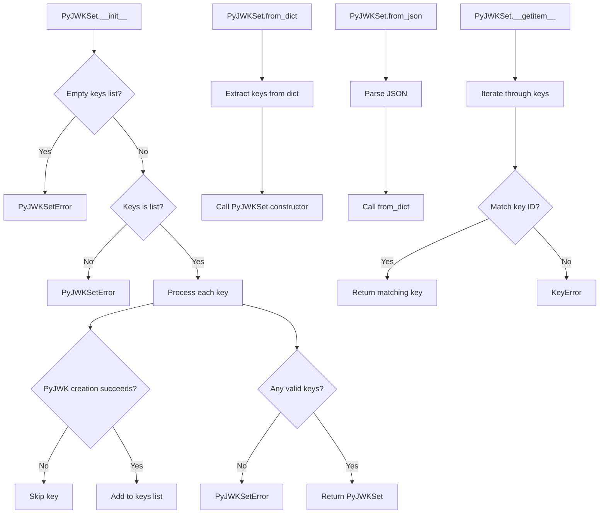

# `api_jwk.py`

## `jwt.api_jwk.PyJWK` · *class*

## Summary:
Represents a JSON Web Key (JWK) with associated cryptographic algorithm and key material.

## Description:
The PyJWK class encapsulates a JSON Web Key and its corresponding cryptographic algorithm. It handles the parsing and validation of JWK data, automatically determining the appropriate algorithm based on key type and curve parameters when not explicitly provided. This class serves as a bridge between raw JWK data and the cryptographic operations that can be performed with it.

## State:
- _algorithms: dict - Mapping of algorithm names to their corresponding algorithm classes
- _jwk_data: JWKDict - Raw JSON Web Key data dictionary containing key parameters
- Algorithm: class - The cryptographic algorithm class associated with this key
- key: object - The actual cryptographic key instance created from JWK data

## Lifecycle:
Creation: Instantiate using PyJWK() constructor with JWK data and optional algorithm, or via factory methods from_dict() or from_json().
Usage: Access properties like key_type, key_id, and public_key_use. The key and Algorithm attributes are available for cryptographic operations.
Destruction: No explicit cleanup required; standard Python garbage collection applies.

## Method Map:


## Raises:
- InvalidKeyError: When required key parameters (kty, crv) are missing or unsupported
- PyJWKError: When cryptographic algorithms require dependencies that aren't installed, or when unable to find an algorithm for the key

## Example:
```python
# Create from dictionary
jwk_dict = {
    "kty": "RSA",
    "n": "0vx7agoebGcQSuuPiLJXZptN9nndrQmbXEps2aiAFbWhM78LhWx4cbbfAAtVT86zwu1RK7aPFFxuhDR1L6tSoc_BJECPebWKRXjBZCiFV4n3oknjhMstn64vk/2Vl4fN2n9QOHe2oZ6Ofv8Xw7mR236y1JFvKs2i43GQ55YlU87721q5dH8g==",
    "e": "AQAB",
    "alg": "RS256",
    "kid": "my-key-id"
}
key = PyJWK.from_dict(jwk_dict)

# Access key properties
print(key.key_type)  # RSA
print(key.key_id)    # my-key-id
print(key.public_key_use)  # None

# Create from JSON string
jwk_json = '{"kty":"EC","crv":"P-256","x":"MKBCTNIcKUSDii11ySs3526iDZ8AiTo7Tu6KPAqv7D4","y":"4Etl6SRW2YiLUrN5vfvVH2p3b13dUNZU01u49322555"}'
key2 = PyJWK.from_json(jwk_json)
```

### `jwt.api_jwk.PyJWK.__init__` · *method*

## Summary:
Initializes a PyJWK object by validating JWK data and determining the appropriate cryptographic algorithm.

## Description:
This constructor method sets up a PyJWK instance by processing JWK (JSON Web Key) data to determine the correct cryptographic algorithm for key operations. It validates required fields, automatically detects algorithms based on key type and curve parameters, and prepares the internal state for cryptographic operations.

## Args:
    jwk_data (JWKDict): Dictionary containing JSON Web Key data with required fields like 'kty' (key type)
    algorithm (str | None): Optional cryptographic algorithm name. If not provided, will be auto-detected based on key type and curve

## Returns:
    None: This method initializes the object's internal state and does not return a value

## Raises:
    InvalidKeyError: When required JWK fields are missing (e.g., 'kty' field) or unsupported key types/curves are encountered
    PyJWKError: When cryptographic dependencies are missing or when an algorithm cannot be found for the given key

## State Changes:
    Attributes READ: self._jwk_data, self._algorithms
    Attributes WRITTEN: self._algorithms, self._jwk_data, self.Algorithm, self.key

## Constraints:
    Preconditions: 
    - jwk_data must be a dictionary-like object containing valid JWK fields
    - Required fields include 'kty' (key type) for validation
    - If algorithm is not provided, jwk_data must contain sufficient information to auto-detect it
    
    Postconditions:
    - self._algorithms contains the default algorithm registry
    - self._jwk_data stores the provided JWK data
    - self.Algorithm references the appropriate algorithm class for cryptographic operations
    - self.key contains the properly initialized cryptographic key

## Side Effects:
    None: This method performs no I/O operations or external service calls. It only initializes internal object state.

### `jwt.api_jwk.PyJWK.from_dict` · *method*

## Summary:
Creates a PyJWK instance from a dictionary representation of a JSON Web Key.

## Description:
This static method serves as a factory constructor for creating PyJWK instances from dictionary-formatted JWK data. It provides a clean interface for instantiating JWK objects without directly calling the PyJWK constructor. The method delegates to the PyJWK constructor which handles validation, algorithm detection, and key processing.

## Args:
    obj (JWKDict): A dictionary containing the JSON Web Key data
    algorithm (str | None, optional): The algorithm to use for this key. If not provided, the algorithm will be inferred from the key data

## Returns:
    PyJWK: A new PyJWK instance initialized with the provided key data

## Raises:
    InvalidKeyError: When the key data is invalid or missing required fields
    PyJWKError: When the requested algorithm is not supported or cryptography is not available

## State Changes:
    Attributes READ: None
    Attributes WRITTEN: None (the returned instance has its own state)

## Constraints:
    Preconditions: The obj parameter must be a valid dictionary containing JWK data
    Postconditions: A valid PyJWK instance is returned with proper algorithm and key initialization

## Side Effects:
    None

### `jwt.api_jwk.PyJWK.from_json` · *method*

## Summary:
Creates a PyJWK instance from a JSON string representation of a JSON Web Key.

## Description:
This static method serves as a factory constructor for creating PyJWK instances from JSON-formatted JWK data. It parses the input JSON string into a Python dictionary and then delegates to the PyJWK.from_dict() method to handle the actual instantiation process. This method provides a convenient way to construct JWK objects directly from JSON payloads without manually parsing the JSON first.

## Args:
    data (str): A JSON string containing the JSON Web Key data
    algorithm (None, optional): The algorithm to use for this key. If not provided, the algorithm will be inferred from the key data

## Returns:
    PyJWK: A new PyJWK instance initialized with the parsed key data

## Raises:
    json.JSONDecodeError: When the input data is not valid JSON
    InvalidKeyError: When the parsed key data is invalid or missing required fields
    PyJWKError: When the requested algorithm is not supported or cryptography is not available

## State Changes:
    Attributes READ: None
    Attributes WRITTEN: None (the returned instance has its own state)

## Constraints:
    Preconditions: The data parameter must be a valid JSON string containing JWK data
    Postconditions: A valid PyJWK instance is returned with proper algorithm and key initialization

## Side Effects:
    None

### `jwt.api_jwk.PyJWK.key_type` · *method*

## Summary:
Returns the key type identifier from the JSON Web Key data.

## Description:
Provides access to the "kty" (key type) field from the JWK data dictionary. This property is essential for identifying the cryptographic key type (such as RSA, EC, oct, OKP) and is commonly used by the JWT library to determine appropriate algorithms and processing methods for key operations.

## Args:
    None

## Returns:
    str | None: The key type string if present in the JWK data, otherwise None.

## Raises:
    None

## State Changes:
    Attributes READ: self._jwk_data
    Attributes WRITTEN: None

## Constraints:
    Preconditions: The PyJWK instance must be properly initialized with valid JWK data.
    Postconditions: The returned value is either a string representing the key type or None.

## Side Effects:
    None

### `jwt.api_jwk.PyJWK.key_id` · *method*

## Summary:
Returns the key identifier from the JSON Web Key data.

## Description:
Provides access to the "kid" (key ID) field from the JWK data dictionary. This property is commonly used to identify specific keys in a key set for token validation and signing operations.

## Args:
    None

## Returns:
    str | None: The key identifier string if present in the JWK data, otherwise None.

## Raises:
    None

## State Changes:
    Attributes READ: self._jwk_data
    Attributes WRITTEN: None

## Constraints:
    Preconditions: The PyJWK instance must be properly initialized with valid JWK data.
    Postconditions: The returned value is either a string representing the key ID or None.

## Side Effects:
    None

### `jwt.api_jwk.PyJWK.public_key_use` · *method*

## Summary:
Returns the key usage indicator for this JWK, indicating whether the key is intended for signing or encryption.

## Description:
This property provides access to the "use" field from the JSON Web Key data structure. The "use" field specifies the intended use of the key according to the JWK standard, typically having values of "sig" (signature) or "enc" (encryption). This property is commonly used to validate key compatibility with cryptographic operations.

## Args:
    None

## Returns:
    str | None: The key usage value ("sig", "enc", etc.) if present in the JWK data, or None if the field is not specified.

## Raises:
    None

## State Changes:
    Attributes READ: self._jwk_data
    Attributes WRITTEN: None

## Constraints:
    Preconditions: The PyJWK instance must be properly initialized with valid JWK data
    Postconditions: The returned value is either a string representing the key use or None

## Side Effects:
    None

## `jwt.api_jwk.PyJWKSet` · *class*

## Summary:
Manages a collection of JSON Web Keys (JWKs) and provides access to individual keys by key ID.

## Description:
The PyJWKSet class represents a JSON Web Key Set, which is a collection of JWK objects. It provides mechanisms for creating key sets from various data formats and accessing individual keys by their key ID. This class is commonly used in JWT (JSON Web Token) processing to manage cryptographic keys for signing and verification operations.

The class automatically filters out invalid or unusable keys during initialization, ensuring that only valid JWK objects are stored in the key set. It supports construction from lists of JWK dictionaries, JSON objects, or JSON strings.

## State:
- keys: list[PyJWK] - A list containing PyJWK objects, each representing an individual JSON Web Key in this key set
- Each PyJWK object maintains its own internal state regarding key type, algorithm, and cryptographic material

## Lifecycle:
Creation: Instances can be created using the constructor with a list of JWK dictionaries, or via static factory methods from_dict() or from_json(). 
Usage: Keys can be accessed using bracket notation with a key ID (e.g., key_set["key-id"]) or by iterating over the keys list.
Destruction: No special cleanup required; standard Python garbage collection applies.

## Method Map:


## Raises:
- PyJWKSetError: Raised when the JWK Set is empty, contains invalid data, or has no usable keys
- KeyError: Raised when attempting to access a key that doesn't exist in the key set

## Example:
```python
# Create from list of JWK dictionaries
jwk_list = [
    {
        "kty": "RSA",
        "n": "0vx7agoebGcQSuuPiLJXZptN9nndrQmbXEps2aiAFbWhM78LhWx4cbbfAAtVT86zwu1RK7aPFFxuhDR1L6tSoc_BJECPebWKRXjBZCiFV4n3oknjhMstn64vk/2Vl4fN2n9QOHe2oZ6Ofv8Xw7mR236y1JFvKs2i43GQ55YlU87721q5dH8g==",
        "e": "AQAB",
        "alg": "RS256",
        "kid": "my-key-id"
    }
]
key_set = PyJWKSet(jwk_list)

# Access key by kid
key = key_set["my-key-id"]

# Create from JSON
json_data = '''
{
    "keys": [
        {
            "kty": "EC",
            "crv": "P-256",
            "x": "MKBCTNIcKUSDii11ySs3526iDZ8AiTo7Tu6KPAqv7D4",
            "y": "4Etl6SRW2YiLUrN5vfvVH2p3b13dUNZU01u49322555",
            "alg": "ES256",
            "kid": "ec-key-1"
        }
    ]
}
'''
key_set2 = PyJWKSet.from_json(json_data)
key2 = key_set2["ec-key-1"]
```

### `jwt.api_jwk.PyJWKSet.__init__` · *method*

## Summary:
Initializes a JSON Web Key Set with a list of JWK dictionaries, attempting to create PyJWK objects while gracefully handling invalid keys.

## Description:
This method constructs a PyJWKSet object by processing a list of JSON Web Key dictionaries. It validates the input parameters, attempts to create PyJWK objects for each key in the list, and skips invalid keys during processing. The method is typically invoked indirectly through the static factory methods `from_dict()` or `from_json()` during the construction of JWK sets from external data sources. During key creation, cryptographic validation may fail due to missing dependencies or unsupported algorithms, causing those keys to be skipped.

## Args:
    keys (list[JWKDict]): A list of JSON Web Key dictionaries to initialize the set with

## Returns:
    None: This method initializes the object's state and does not return a value

## Raises:
    PyJWKSetError: Raised when the input keys list is empty, not a list type, or contains no usable keys after processing

## State Changes:
    Attributes READ: None
    Attributes WRITTEN: self.keys - Populated with PyJWK objects created from valid input keys, potentially excluding some entries due to processing errors

## Constraints:
    Preconditions:
    - The keys parameter must be a list-like object
    - Each item in the keys list must be a valid JWK dictionary structure
    - The keys list cannot be empty
    
    Postconditions:
    - self.keys will contain a list of PyJWK objects that were successfully processed
    - If successful, self.keys will contain at least one valid key (though not necessarily all keys from input)
    - If unsuccessful, a PyJWKSetError will be raised

## Side Effects:
    None: This method performs no I/O operations or external service calls. It only processes the input data and creates internal PyJWK objects.

### `jwt.api_jwk.PyJWKSet.from_dict` · *method*

## Summary:
Creates a PyJWKSet instance from a dictionary representation containing JWK keys.

## Description:
This static method serves as a factory constructor for creating PyJWKSet instances from JSON-like dictionary representations. It extracts the "keys" array from the input dictionary and uses it to initialize a new PyJWKSet object. This method enables deserialization of JWK sets from various data formats that can be represented as dictionaries.

## Args:
    obj (dict[str, Any]): A dictionary containing JWK key data, expected to have a "keys" key mapping to a list of JWK dictionaries.

## Returns:
    PyJWKSet: A new PyJWKSet instance initialized with the keys extracted from the input dictionary.

## Raises:
    PyJWKSetError: When the input dictionary doesn't contain valid JWK set data or when no usable keys are found after processing.

## State Changes:
    Attributes READ: None
    Attributes WRITTEN: None (creates new instance, doesn't modify existing state)

## Constraints:
    Preconditions: The input dictionary should contain a "keys" field that maps to a list of valid JWK dictionaries.
    Postconditions: The returned PyJWKSet instance contains valid JWK objects that were successfully processed from the input data.

## Side Effects:
    None

### `jwt.api_jwk.PyJWKSet.from_json` · *method*

## Summary:
Creates a PyJWKSet instance from a JSON string representation of a JWK set.

## Description:
This static method serves as a factory constructor for creating PyJWKSet instances from JSON-formatted JWK set data. It parses the input JSON string into a Python dictionary and delegates to the `from_dict` method to construct the final PyJWKSet object. This method enables deserialization of JWK sets from JSON strings commonly used in JWT operations and key management systems.

## Args:
    data (str): A JSON string containing the JWK set data, expected to have a "keys" field mapping to a list of JWK dictionaries.

## Returns:
    PyJWKSet: A new PyJWKSet instance initialized with the keys parsed from the JSON string.

## Raises:
    json.JSONDecodeError: When the input string is not valid JSON format.
    PyJWKSetError: When the parsed JSON doesn't contain valid JWK set data or when no usable keys are found after processing.

## State Changes:
    Attributes READ: None
    Attributes WRITTEN: None (creates new instance, doesn't modify existing state)

## Constraints:
    Preconditions: The input data parameter must be a valid JSON string representing a JWK set structure.
    Postconditions: A valid PyJWKSet instance is returned with all valid JWK objects successfully processed from the JSON data.

## Side Effects:
    None

### `jwt.api_jwk.PyJWKSet.__getitem__` · *method*

## Summary:
Retrieves a JSON Web Key from the key set by its unique key identifier (kid).

## Description:
Provides dictionary-like access to the JWK set by key ID, allowing users to retrieve specific keys from the collection. This method enables efficient lookup of cryptographic keys within a key set without requiring manual iteration.

## Args:
    kid (str): The unique identifier (kid) of the key to retrieve from the key set.

## Returns:
    PyJWK: The JSON Web Key object matching the provided key identifier.

## Raises:
    KeyError: When no key in the key set has a key_id matching the provided identifier.

## State Changes:
    Attributes READ: self.keys
    Attributes WRITTEN: None

## Constraints:
    Preconditions: The PyJWKSet must have been initialized with keys and contain at least one valid key.
    Postconditions: The returned PyJWK object is a reference to the key stored within the key set, maintaining consistency with the original key data.

## Side Effects:
    None

## `jwt.api_jwk.PyJWTSetWithTimestamp` · *class*

## Summary:
Wraps a PyJWKSet with a timestamp to track when the key set was created or last accessed.

## Description:
The PyJWTSetWithTimestamp class serves as a wrapper around a PyJWKSet object, adding a timestamp that records when the key set was initialized. This timestamp is useful for implementing cache expiration, key rotation tracking, or monitoring when key sets were last accessed. The class provides methods to retrieve both the wrapped key set and the associated timestamp.

This class is typically instantiated by internal components of the JWT library when managing cached key sets or when creating temporary key set representations with freshness information.

## State:
- jwk_set: PyJWKSet - The wrapped JSON Web Key Set object that contains the cryptographic keys
- timestamp: float - A monotonic timestamp (seconds since an unspecified epoch) indicating when this wrapper was created

## Lifecycle:
Creation: Instances are created by passing a PyJWKSet object to the constructor. The timestamp is automatically recorded using time.monotonic().
Usage: Typically used to retrieve either the wrapped key set via get_jwk_set() or the timestamp via get_timestamp(). These methods can be called in any order.
Destruction: No special cleanup required; standard Python garbage collection applies.

## Method Map:
```mermaid
graph TD
    A[PyJWTSetWithTimestamp.__init__] --> B[Store jwk_set parameter]
    B --> C[Record timestamp with time.monotonic()]
    C --> D[Return instance]
    
    E[PyJWTSetWithTimestamp.get_jwk_set] --> F[Return self.jwk_set]
    
    G[PyJWTSetWithTimestamp.get_timestamp] --> H[Return self.timestamp]
```

## Raises:
- None explicitly raised by the constructor
- The underlying PyJWKSet object may raise exceptions during its own initialization, but these are propagated through the wrapper

## Example:
```python
# Create a PyJWKSet (typically done internally by the JWT library)
jwk_dict = {
    "keys": [
        {
            "kty": "RSA",
            "n": "0vx7agoebGcQSuuPiLJXZptN9nndrQmbXEps2aiAFbWhM78LhWx4cbbfAAtVT86zwu1RK7aPFFxuhDR1L6tSoc_BJECPebWKRXjBZCiFV4n3oknjhMstn64vk/2Vl4fN2n9QOHe2oZ6Ofv8Xw7mR236y1JFvKs2i43GQ55YlU87721q5dH8g==",
            "e": "AQAB",
            "alg": "RS256",
            "kid": "my-key-id"
        }
    ]
}

# Internally, the library creates a PyJWTSetWithTimestamp
key_set = PyJWKSet.from_json(json.dumps(jwk_dict))
wrapped_key_set = PyJWTSetWithTimestamp(key_set)

# Retrieve the wrapped key set and timestamp
retrieved_key_set = wrapped_key_set.get_jwk_set()
timestamp = wrapped_key_set.get_timestamp()
print(f"Key set retrieved at {timestamp} seconds")
```

### `jwt.api_jwk.PyJWTSetWithTimestamp.__init__` · *method*

## Summary:
Initializes a timestamped wrapper around a JSON Web Key Set to track when the key set was created.

## Description:
Constructs a PyJWTSetWithTimestamp instance that wraps a PyJWKSet object and records the current monotonic timestamp. This timestamp enables tracking of when the key set was initialized, which is useful for cache management, key rotation monitoring, and freshness validation.

The constructor stores the provided JWK set and captures the current time using `time.monotonic()` to establish a baseline for tracking the key set's age or freshness.

## Args:
    jwk_set (PyJWKSet): The JSON Web Key Set object to wrap and timestamp. Must be a valid PyJWKSet instance.

## Returns:
    None: This method initializes the instance and does not return a value.

## Raises:
    None: This method does not explicitly raise exceptions, though the underlying PyJWKSet constructor may raise exceptions if the provided data is invalid.

## State Changes:
    Attributes READ: None
    Attributes WRITTEN: 
    - self.jwk_set: Stores the provided PyJWKSet object
    - self.timestamp: Records the monotonic timestamp of when this instance was created

## Constraints:
    Preconditions:
    - The jwk_set parameter must be a valid PyJWKSet instance
    - The jwk_set parameter must not be None
    
    Postconditions:
    - The instance will have self.jwk_set equal to the provided jwk_set parameter
    - The instance will have self.timestamp set to a monotonic timestamp value
    - Both attributes will be accessible for subsequent method calls

## Side Effects:
    None: This method performs no I/O operations, external service calls, or mutations to objects outside the instance being constructed.

### `jwt.api_jwk.PyJWTSetWithTimestamp.get_jwk_set` · *method*

## Summary:
Returns the underlying JSON Web Key Set stored in this timestamped wrapper.

## Description:
Provides access to the wrapped PyJWKSet object while maintaining the timestamp metadata. This method enables external code to retrieve the actual key set without exposing the internal timestamp attribute directly.

## Args:
    None

## Returns:
    PyJWKSet: The JSON Web Key Set object that was originally provided during initialization.

## Raises:
    None

## State Changes:
    Attributes READ: self.jwk_set
    Attributes WRITTEN: None

## Constraints:
    Preconditions: The instance must have been properly initialized with a valid PyJWKSet object.
    Postconditions: The returned PyJWKSet object is identical to the one stored internally.

## Side Effects:
    None

### `jwt.api_jwk.PyJWTSetWithTimestamp.get_timestamp` · *method*

## Summary:
Returns the timestamp associated with this JWT key set, representing when the key set was created or last updated.

## Description:
Retrieves the monotonic timestamp that indicates when this PyJWTSetWithTimestamp instance was initialized. This timestamp is typically used to track the age or freshness of the key set for caching and validation purposes.

## Args:
    None

## Returns:
    float: A floating-point number representing the timestamp value obtained from time.monotonic() when this instance was created.

## Raises:
    None

## State Changes:
    Attributes READ: self.timestamp
    Attributes WRITTEN: None

## Constraints:
    Preconditions:
    - The PyJWTSetWithTimestamp instance must have been properly initialized
    - The self.timestamp attribute must have been set during initialization
    
    Postconditions:
    - The returned timestamp value remains constant throughout the lifetime of this instance
    - The timestamp represents a monotonic clock value, not a wall-clock time

## Side Effects:
    None: This method performs no I/O operations or external service calls. It only accesses an internal attribute.

