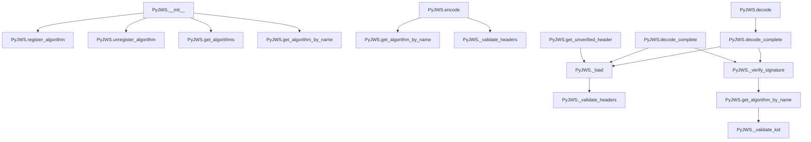

# `api_jws.py`

## `jwt.api_jws.PyJWS` · *class*

## Summary:
A class for encoding and decoding JSON Web Signatures (JWS) with support for various cryptographic algorithms.

## Description:
The PyJWS class provides functionality for creating and verifying JSON Web Signatures according to RFC 7515. It serves as the main interface for JWT signing operations, supporting multiple cryptographic algorithms through a plugin architecture. This class is typically instantiated by the JWT library itself or by users who need to perform low-level JWS operations directly.

The class maintains a registry of available algorithms and provides methods for encoding payloads into signed tokens and decoding existing tokens while optionally verifying their signatures.

## State:
- `_algorithms`: dict[str, Algorithm] - Maps algorithm names to their implementation objects
- `_valid_algs`: set[str] - Set containing names of currently valid/allowed algorithms
- `options`: dict[str, Any] - Configuration options for token processing, including signature verification settings

## Lifecycle:
- Creation: Instantiate with optional algorithms list and options dictionary
- Usage: Call encode() to create signed tokens, decode() to verify and extract payloads, or decode_complete() for full token information
- Destruction: No special cleanup required; uses standard Python garbage collection

## Method Map:


## Raises:
- `ValueError`: When attempting to register an algorithm that already exists
- `TypeError`: When trying to register a non-Algorithm object
- `KeyError`: When attempting to unregister a non-existent algorithm
- `DecodeError`: When JWT token format is invalid or parsing fails
- `InvalidAlgorithmError`: When algorithm is not specified, not allowed, or not supported
- `InvalidSignatureError`: When signature verification fails
- `NotImplementedError`: When a required cryptographic algorithm is not available due to missing dependencies

## Example:
```python
from jwt.api_jws import PyJWS

# Create a JWS instance with specific algorithms
jws = PyJWS(algorithms=['HS256', 'RS256'])

# Encode a payload
payload = b'{"sub":"1234567890","name":"John Doe","iat":1516239022}'
token = jws.encode(payload, 'secret-key', algorithm='HS256')

# Decode and verify the token
decoded = jws.decode(token, 'secret-key', algorithms=['HS256'])
print(decoded)  # {'sub': '1234567890', 'name': 'John Doe', 'iat': 1516239022}
```

### `jwt.api_jws.PyJWS.__init__` · *method*

## Summary:
Initializes a PyJWS instance with specified algorithms and verification options, setting up the valid algorithm registry and default configuration.

## Description:
Configures the PyJWS object by establishing the set of allowed cryptographic algorithms and initializing default verification options. This constructor prepares the instance for JWT encoding and decoding operations by filtering available algorithms based on user specifications and merging default options with any provided overrides.

## Args:
    algorithms (list[str] | None): Optional list of algorithm names to allow for signing/verification. If None, all default algorithms are permitted. Algorithm names must correspond to registered algorithm implementations.
    options (dict[str, Any] | None): Optional dictionary of configuration options that override default verification settings. If None, only default options are used.

## Returns:
    None: This method initializes instance state and does not return a value.

## Raises:
    None: This method does not raise exceptions directly, though underlying operations may raise exceptions from the algorithms registry.

## State Changes:
    Attributes READ: None
    Attributes WRITTEN: 
    - self._algorithms: dict[str, Algorithm] - Filtered dictionary of available algorithms, containing only those specified in the algorithms parameter or all default algorithms if none specified
    - self._valid_algs: set[str] - Set of valid algorithm names that are currently allowed for use
    - self.options: dict[str, Any] - Merged configuration options including defaults and user-provided settings

## Constraints:
    Preconditions: 
    - The algorithms parameter, if provided, must contain valid algorithm names that exist in the default algorithm registry
    - All algorithm names in the algorithms list must be strings
    - Options parameter, if provided, must be a dictionary-like object
    
    Postconditions:
    - self._algorithms contains only algorithms specified in the algorithms parameter or all default algorithms if none specified
    - self._valid_algs contains the set of algorithm names that are currently allowed
    - self.options contains merged default and user-provided options

## Side Effects:
    None: This method performs no I/O operations or external service calls. It only manipulates internal object state.

### `jwt.api_jws.PyJWS._get_default_options` · *method*

## Summary:
Returns the default verification options for JWT operations, specifically enabling signature verification by default.

## Description:
This private method provides the default configuration options for JWT verification processes. It establishes the baseline behavior for signature validation, ensuring that signatures are verified unless explicitly disabled. The method is called during object initialization and during decoding operations to merge default settings with user-provided options.

## Args:
    None

## Returns:
    dict[str, bool]: A dictionary containing default verification options with the key "verify_signature" set to True, indicating that signature verification is enabled by default.

## Raises:
    None

## State Changes:
    Attributes READ: None
    Attributes WRITTEN: None

## Constraints:
    Preconditions: None
    Postconditions: The returned dictionary always contains exactly one key-value pair: {"verify_signature": True}

## Side Effects:
    None

### `jwt.api_jws.PyJWS.register_algorithm` · *method*

## Summary:
Registers a new cryptographic algorithm with the JWS implementation for use in signing and verifying JWT tokens.

## Description:
This method allows extending the JWS implementation with custom or additional cryptographic algorithms beyond the default set. It validates that the algorithm object is of the correct type and that the algorithm identifier is not already registered, then stores the algorithm in internal collections for future use.

## Args:
    alg_id (str): Unique identifier for the algorithm (e.g., "RS256", "ES384")
    alg_obj (Algorithm): Instance of an Algorithm subclass implementing the cryptographic operations

## Returns:
    None: This method does not return any value

## Raises:
    ValueError: If an algorithm with the specified ID is already registered
    TypeError: If the provided object is not an instance of the Algorithm class

## State Changes:
    Attributes READ: self._algorithms, self._valid_algs
    Attributes WRITTEN: self._algorithms, self._valid_algs

## Constraints:
    Preconditions: 
    - The alg_id must be a string that is not already present in self._algorithms
    - The alg_obj must be an instance of the Algorithm class
    Postconditions:
    - The algorithm is added to self._algorithms dictionary with alg_id as key
    - The alg_id is added to self._valid_algs set

## Side Effects:
    None: This method only modifies internal state and does not perform I/O or external service calls

### `jwt.api_jws.PyJWS.unregister_algorithm` · *method*

## Summary:
Removes a registered algorithm from the available algorithm set and valid algorithms list.

## Description:
This method unregisters a cryptographic algorithm by removing it from both the internal algorithms registry and the list of valid algorithms. It ensures that the specified algorithm ID exists before attempting removal, raising an error if it's not currently registered.

## Args:
    alg_id (str): The identifier of the algorithm to be unregistered

## Returns:
    None: This method does not return any value

## Raises:
    KeyError: Raised when the specified algorithm ID is not currently registered in the system

## State Changes:
    Attributes READ: self._algorithms, self._valid_algs
    Attributes WRITTEN: self._algorithms, self._valid_algs

## Constraints:
    Preconditions: The algorithm identified by alg_id must be currently registered in self._algorithms
    Postconditions: After execution, alg_id will not be present in either self._algorithms or self._valid_algs

## Side Effects:
    None: This method only modifies internal state and has no external side effects

### `jwt.api_jws.PyJWS.get_algorithms` · *method*

## Summary:
Returns a list of algorithm names that are currently valid for JWT signing operations.

## Description:
This method provides access to the set of algorithms that the PyJWS instance accepts for signing and verification operations. It's primarily used internally by the JWT processing pipeline to validate algorithms and by external code that needs to know which algorithms are supported.

## Args:
    None

## Returns:
    list[str]: A list of strings representing the names of valid algorithms currently configured for this PyJWS instance.

## Raises:
    None

## State Changes:
    Attributes READ: self._valid_algs
    Attributes WRITTEN: None

## Constraints:
    Preconditions: The PyJWS instance must be properly initialized with valid algorithm configuration.
    Postconditions: The returned list is a copy of the internal set, so modifications to it won't affect the internal state.

## Side Effects:
    None

### `jwt.api_jws.PyJWS.get_algorithm_by_name` · *method*

## Summary:
Retrieves an algorithm object by its name from the registered algorithms dictionary, handling cases where cryptography is required but unavailable.

## Description:
This method serves as a lookup mechanism for algorithm objects within the PyJWS instance. It attempts to retrieve an algorithm by name from the internal `_algorithms` dictionary. If the algorithm is not found, it provides specific error handling for algorithms that require cryptographic libraries when those libraries are not available.

The method is called during JWT encoding and decoding operations when an algorithm needs to be resolved by name for signature verification or creation. This separation allows for centralized algorithm management and proper error handling for cryptographic dependencies.

## Args:
    alg_name (str): The name of the algorithm to retrieve (e.g., "HS256", "RS256")

## Returns:
    Algorithm: The algorithm object associated with the given name

## Raises:
    NotImplementedError: When the algorithm is not supported or not found in the registry, with specific messages:
        - If the algorithm requires cryptography but cryptography is not installed
        - If the algorithm is not registered in the system

## State Changes:
    Attributes READ: self._algorithms
    Attributes WRITTEN: None

## Constraints:
    Preconditions:
        - The PyJWS instance must have been initialized with valid algorithms
        - The alg_name parameter must be a string representing a valid algorithm identifier
    Postconditions:
        - If successful, returns a valid Algorithm object
        - If unsuccessful, raises NotImplementedError with appropriate context

## Side Effects:
    None

### `jwt.api_jws.PyJWS.encode` · *method*

## Summary:
Encodes a JWT token by creating a signed message from the provided payload, key, and algorithm.

## Description:
Creates a JSON Web Token (JWT) by combining a header, payload, and signature into a compact serialized format. The method handles both standard and detached payload scenarios, supports various cryptographic algorithms, and allows customization of header parameters. This method is responsible for the core JWT encoding process that produces a base64url-encoded string representation of the token.

The encoding process follows these steps:
1. Constructs a header with typ and alg parameters, resolving the algorithm according to precedence: explicit algorithm parameter > headers["alg"] > default "HS256"
2. Merges custom headers if provided, validating them via _validate_headers
3. Serializes the header to JSON and base64url-encodes it
4. Base64url-encodes the payload (unless in detached mode where raw payload is used)
5. Signs the header.payload concatenation with the provided key using the selected algorithm
6. Base64url-encodes the signature and appends it to form the complete token

## Args:
    payload (bytes): The payload data to be encoded in the JWT token
    key (AllowedPrivateKeys | str | bytes): The cryptographic key used for signing the token
    algorithm (str | None, optional): The signing algorithm to use. Defaults to "HS256". If None, defaults to "none"
    headers (dict[str, Any] | None, optional): Additional header parameters to include in the JWT. Defaults to None
    json_encoder (type[json.JSONEncoder] | None, optional): Custom JSON encoder for serializing header data. Defaults to None
    is_payload_detached (bool, optional): Whether to use detached payload mode. Defaults to False
    sort_headers (bool, optional): Whether to sort header keys when serializing. Defaults to True

## Returns:
    str: A base64url-encoded JWT token string in the format "header.payload.signature"

## Raises:
    NotImplementedError: When the specified algorithm is not supported or cryptography is required but not installed
    InvalidAlgorithmError: When the algorithm is not in the list of valid algorithms
    InvalidTokenError: When header validation fails (e.g., invalid kid header)

## State Changes:
    Attributes READ: self.header_typ, self._algorithms, self._valid_algs
    Attributes WRITTEN: None

## Constraints:
    Preconditions:
    - The payload must be bytes
    - The key must be compatible with the specified algorithm
    - If detached payload mode is used, the payload should be provided separately
    - The algorithm must be registered in the PyJWS instance
    - Headers must be a dictionary-like object if provided
    
    Postconditions:
    - Returns a properly formatted JWT string with three base64url-encoded segments
    - The returned token contains valid header, payload, and signature segments
    - Header processing respects the precedence order: explicit algorithm > header algorithm > default algorithm
    - When is_payload_detached=True, the payload segment is empty in the final token

## Side Effects:
    None: This method performs no I/O operations or external service calls beyond cryptographic operations

### `jwt.api_jws.PyJWS.decode_complete` · *method*

## Summary:
Decodes a JWT token and returns its constituent components including payload, header, and signature.

## Description:
This method parses a JSON Web Token (JWT) string or bytes and extracts its three main components: payload, header, and signature. It also performs optional signature verification if enabled via the verify_signature option. Unlike the `decode` method which only returns the payload, this method provides access to all components of the JWT for inspection or further processing.

The method handles JWTs with the b64 header set to false by requiring a detached_payload parameter. It also validates that required arguments are provided when signature verification is enabled.

## Args:
    jwt (str | bytes): The JWT string or bytes to decode. Must be a valid JWT with three or four segments separated by dots.
    key (AllowedPublicKeys | str | bytes): The key used for signature verification. Defaults to empty string.
    algorithms (list[str] | None): List of allowed algorithms for signature verification. Required when verify_signature option is enabled.
    options (dict[str, Any] | None): Dictionary of options that override default settings. Defaults to None.
    detached_payload (bytes | None): The payload when b64 header is set to false. Required when b64 header is False.
    **kwargs: Additional keyword arguments (deprecated since version 3).

## Returns:
    dict[str, Any]: A dictionary containing:
        - "payload" (bytes): The decoded payload segment
        - "header" (dict[str, Any]): The parsed header as a dictionary
        - "signature" (bytes): The decoded signature segment

## Raises:
    DecodeError: When the JWT is malformed, contains invalid padding, or fails to parse properly. Specifically raised when:
        - Input is not a string or bytes
        - JWT doesn't contain enough segments
        - Header segment has invalid base64url padding
        - Header segment is not valid JSON
        - Header is not a dictionary
        - Payload segment has invalid base64url padding
        - Signature segment has invalid base64url padding
        - b64 header is False but detached_payload is not provided
        - verify_signature is True but algorithms parameter is not provided
    InvalidAlgorithmError: When the algorithm specified in the header is not allowed or not supported.
    InvalidSignatureError: When signature verification fails.

## State Changes:
    - Attributes READ: self.options
    - Attributes WRITTEN: None

## Constraints:
    - Preconditions:
        - The jwt parameter must be either a string or bytes type
        - When verify_signature is enabled and algorithms is None, an exception is raised
        - When header.b64 is False, detached_payload must be provided
    - Postconditions:
        - If signature verification is performed, it succeeds or raises an exception
        - The returned dictionary contains properly decoded components

## Side Effects:
    - Issues deprecation warning when kwargs are provided
    - Calls internal methods _load and _verify_signature

### `jwt.api_jws.PyJWS.decode` · *method*

## Summary:
Decodes a JSON Web Token and returns only the payload portion.

## Description:
This method decodes a JWT string or bytes using the configured algorithms and key, then extracts and returns only the payload portion of the token. It serves as a convenience method that provides access to the token's payload without requiring the caller to extract it from the complete decoded dictionary returned by `decode_complete`.

## Args:
    jwt (str | bytes): The JWT string or bytes to decode.
    key (AllowedPublicKeys | str | bytes): The key to use for signature verification. Defaults to empty string.
    algorithms (list[str] | None): List of allowed algorithms for signature verification. Required when signature verification is enabled.
    options (dict[str, Any] | None): Optional configuration for decoding behavior.
    detached_payload (bytes | None): The detached payload when the token has b64 header set to false.
    **kwargs: Deprecated keyword arguments that will be removed in pyjwt version 3.

## Returns:
    Any: The decoded payload portion of the JWT token.

## Raises:
    DecodeError: If the token is malformed or invalid.
    InvalidAlgorithmError: If the algorithm specified in the token is not allowed or supported.
    InvalidSignatureError: If the token signature verification fails.
    InvalidTokenError: If the token is invalid in some other way.

## State Changes:
    Attributes READ: None
    Attributes WRITTEN: None

## Constraints:
    Preconditions:
        - When signature verification is enabled (default), the `algorithms` parameter must be provided.
        - The JWT must be properly formatted with three dot-separated segments.
    Postconditions:
        - Returns the payload portion of the decoded JWT.
        - The returned payload is the raw decoded bytes or parsed JSON object.

## Side Effects:
    - Issues a deprecation warning if additional kwargs are passed.
    - May perform cryptographic signature verification if enabled.

### `jwt.api_jws.PyJWS.get_unverified_header` · *method*

## Summary:
Extracts and validates the header portion of a JWT without performing signature verification.

## Description:
Retrieves the header component from a JSON Web Token (JWT) string or bytes without validating the token's signature. This method is useful when you need to inspect JWT headers (such as algorithm or key ID) before deciding whether to perform full signature validation.

## Args:
    jwt (str | bytes): The JWT string or bytes to parse. Must be a valid JWT with three dot-separated base64url-encoded segments.

## Returns:
    dict[str, Any]: A dictionary containing the parsed JWT header fields. The returned dictionary is a copy of the internal header representation.

## Raises:
    DecodeError: If the JWT string is malformed or contains invalid base64url segments.
    InvalidTokenError: If the header contains invalid fields (e.g., invalid kid type).

## State Changes:
    Attributes READ: None
    Attributes WRITTEN: None

## Constraints:
    Preconditions: The jwt parameter must be a valid JWT string or bytes with three dot-separated segments.
    Postconditions: The returned header dictionary is validated and safe to use.

## Side Effects:
    None

### `jwt.api_jws.PyJWS._load` · *method*

## Summary:
Parses a JWT string into its constituent components: payload, signing input, header, and signature.

## Description:
Extracts and decodes the four main components of a JSON Web Token (JWT) - header, payload, signature, and signing input - from a JWT string or bytes. This method serves as a foundational parsing utility used by various JWT decoding operations within the PyJWS class.

## Args:
    jwt (str | bytes): The JWT string or bytes to parse. Must be a valid JWT with three or four segments separated by dots.

## Returns:
    tuple[bytes, bytes, dict[str, Any], bytes]: A tuple containing:
        - payload (bytes): The decoded payload segment
        - signing_input (bytes): The concatenation of header and payload segments (without signature)
        - header (dict[str, Any]): The parsed header as a dictionary
        - signature (bytes): The decoded signature segment

## Raises:
    DecodeError: If the JWT is malformed, contains invalid padding, or fails to parse properly. Specifically raised when:
        - Input is not a string or bytes
        - JWT doesn't contain enough segments
        - Header segment has invalid base64url padding
        - Header segment is not valid JSON
        - Header is not a dictionary
        - Payload segment has invalid base64url padding
        - Signature segment has invalid base64url padding

## State Changes:
    - Attributes READ: None
    - Attributes WRITTEN: None

## Constraints:
    - Preconditions: The jwt parameter must be either a string or bytes type
    - Postconditions: The returned tuple elements are properly decoded and validated according to JWT specifications

## Side Effects:
    - None

### `jwt.api_jws.PyJWS._verify_signature` · *method*

## Summary:
Verifies the cryptographic signature of a JWT token against the provided key and algorithm.

## Description:
This method performs signature verification for a JWT token by validating the algorithm specified in the header and checking the cryptographic signature against the provided key. It is called internally by the `decode_complete` and `decode` methods during JWT token validation.

The method serves as a dedicated verification step that separates signature validation logic from the main decoding flow, making the code more modular and easier to test.

## Args:
    signing_input (bytes): The raw bytes of the signing input (header.payload) used for signature verification.
    header (dict[str, Any]): The decoded JWT header containing the algorithm specification ('alg' field).
    signature (bytes): The raw bytes of the signature to verify.
    key (AllowedPublicKeys | str | bytes): The key used for signature verification, can be a string, bytes, or public key object.
    algorithms (list[str] | None): Optional list of allowed algorithms for validation. If provided, the header's algorithm must be in this list.

## Returns:
    None: This method does not return any value but raises exceptions on verification failure.

## Raises:
    InvalidAlgorithmError: Raised when the algorithm is not specified in the header, when the specified algorithm is not in the allowed algorithms list, or when the algorithm is not supported.
    InvalidSignatureError: Raised when the signature verification fails.

## State Changes:
    Attributes READ: None - This method only reads parameters passed to it.
    Attributes WRITTEN: None - This method does not modify any instance attributes.

## Constraints:
    Preconditions:
        - The header dictionary must contain an 'alg' key
        - The signing_input, header, and signature parameters must be properly formatted bytes
        - If algorithms parameter is provided, the header's algorithm must be in that list
    Postconditions:
        - If execution completes successfully, the signature is valid for the given input and key
        - If execution raises an exception, the signature verification failed or the algorithm was invalid

## Side Effects:
    None: This method performs no I/O operations or external service calls. It only performs in-memory cryptographic operations.

### `jwt.api_jws.PyJWS._validate_headers` · *method*

## Summary:
Validates JWT header parameters, specifically checking the Key ID (kid) header if present.

## Description:
This method performs validation on JWT headers by checking for the presence of a Key ID (kid) header parameter. When a kid header is present, it delegates validation to the internal `_validate_kid` method which ensures the kid is a string. This validation occurs during JWT encoding and header extraction processes to maintain security and consistency of header parameters.

## Args:
    headers (dict[str, Any]): A dictionary containing JWT header parameters to validate

## Returns:
    None: This method does not return any value

## Raises:
    InvalidTokenError: Raised by `_validate_kid` when the kid header is present but is not a string type

## State Changes:
    Attributes READ: None
    Attributes WRITTEN: None

## Constraints:
    Preconditions: 
    - The headers parameter must be a dictionary-like object
    - When kid header is present, it must be a string type
    
    Postconditions:
    - If kid header is present, it will be validated to ensure it's a string
    - No modifications are made to the PyJWS instance state

## Side Effects:
    None: This method performs no I/O operations or external service calls

### `jwt.api_jws.PyJWS._validate_kid` · *method*

## Summary:
Validates that the Key ID header parameter is a string type.

## Description:
This method ensures that the Key ID (kid) header parameter in a JWT is of string type. It is called internally by the JWT validation process when a kid header is present. The validation prevents non-string values from being used as key identifiers, maintaining consistency and security in JWT processing.

## Args:
    kid (Any): The Key ID header parameter to validate, which can be any type

## Returns:
    None: This method does not return any value

## Raises:
    InvalidTokenError: Raised when the kid header parameter is present but is not a string type

## State Changes:
    Attributes READ: None
    Attributes WRITTEN: None

## Constraints:
    Preconditions:
    - The method should only be called with a kid parameter (typically from header validation)
    - The kid parameter can be any type, but if present, must be a string
    
    Postconditions:
    - If kid is provided, it will be validated to ensure it's a string
    - No modifications are made to the PyJWS instance state

## Side Effects:
    None: This method performs no I/O operations or external service calls

