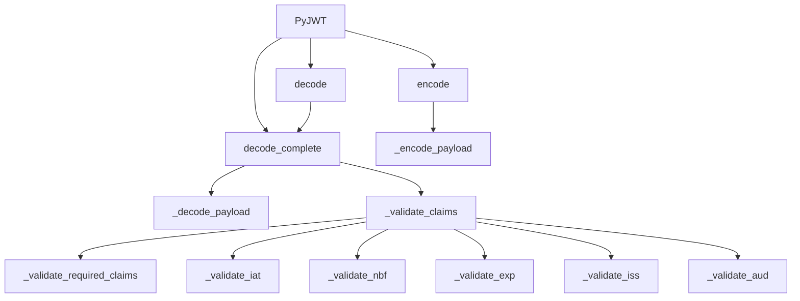

# `api_jwt.py`

## `jwt.api_jwt.PyJWT` · *class*

## Summary:
A JSON Web Token (JWT) implementation that provides methods for encoding and decoding JWT tokens with configurable validation options.

## Description:
The PyJWT class serves as the main interface for working with JSON Web Tokens. It provides functionality to encode data into JWT format and decode JWT tokens while validating their claims according to configurable options. The class is designed to handle standard JWT claims such as expiration time (exp), issued at (iat), not before (nbf), issuer (iss), and audience (aud).

This class acts as a facade over the underlying JWS (JSON Web Signature) implementation, providing a higher-level interface with built-in validation capabilities. It allows users to customize verification behavior through options and supports both synchronous encoding and decoding operations.

## State:
- `options`: dict[str, Any] - Configuration options for JWT verification that are merged with per-call options. Contains keys like "verify_signature", "verify_exp", "verify_nbf", "verify_iat", "verify_aud", "verify_iss", and "require". These options control which JWT claims are validated during decoding.

## Lifecycle:
- Creation: Instantiate with optional configuration options via `__init__(options)` 
- Usage: Call `encode()` to create JWT tokens, or `decode()`/`decode_complete()` to parse and validate tokens
- Destruction: No explicit cleanup required; follows standard Python object lifecycle

## Method Map:


## Raises:
- `TypeError`: When payload is not a dictionary in encode() method
- `DecodeError`: When JWT decoding fails due to invalid format or structure
- `ExpiredSignatureError`: When token expiration time has passed
- `ImmatureSignatureError`: When token is not yet valid (issued or not before time in future)
- `InvalidAudienceError`: When audience validation fails
- `InvalidIssuedAtError`: When issued at claim is not a valid integer
- `InvalidIssuerError`: When issuer validation fails
- `MissingRequiredClaimError`: When required claims are missing from payload

## Example:
```python
# Create a JWT instance
jwt = PyJWT()

# Encode a payload
payload = {"sub": "1234567890", "name": "John Doe", "iat": 1516239022}
token = jwt.encode(payload, "secret-key", algorithm="HS256")

# Decode and validate the token
decoded = jwt.decode(token, "secret-key", algorithms=["HS256"])
print(decoded)  # {"sub": "1234567890", "name": "John Doe", "iat": 1516239022}

# Decode with complete information
complete_info = jwt.decode_complete(token, "secret-key", algorithms=["HS256"])
print(complete_info['payload'])  # The decoded payload
print(complete_info['header'])   # The decoded header
```

### `jwt.api_jwt.PyJWT.__init__` · *method*

## Summary:
Initializes a PyJWT instance with configurable verification options.

## Description:
The constructor method sets up the PyJWT object with default verification options that can be customized through the options parameter. This method prepares the object's configuration state for subsequent JWT encoding and decoding operations.

## Args:
    options (dict[str, Any] | None): Optional dictionary of verification options that override default settings. If None, an empty dictionary is used. Common options include "verify_signature", "verify_exp", "verify_nbf", "verify_iat", "verify_aud", "verify_iss", and "require".

## Returns:
    None: This method does not return a value.

## Raises:
    None: This method does not raise any exceptions.

## State Changes:
    Attributes READ: None
    Attributes WRITTEN: self.options - Stores the merged dictionary of default and provided options

## Constraints:
    Preconditions: None
    Postconditions: The self.options attribute is initialized as a dictionary containing merged default and provided options.

## Side Effects:
    None: This method performs no I/O operations or external service calls.

### `jwt.api_jwt.PyJWT._get_default_options` · *method*

## Summary:
Returns a dictionary containing default verification options for JWT decoding operations.

## Description:
This static method provides the default configuration for JWT claim verification settings. It is used internally by the PyJWT class to establish baseline verification behavior that can be overridden by user-provided options. The returned dictionary contains boolean flags for various JWT claim validations and a list for required claims.

## Args:
    None

## Returns:
    dict[str, bool | list[str]]: A dictionary with the following keys:
        - "verify_signature": bool - Whether to verify the JWT signature (default: True)
        - "verify_exp": bool - Whether to verify the expiration time claim (default: True)
        - "verify_nbf": bool - Whether to verify the not-before time claim (default: True)
        - "verify_iat": bool - Whether to verify the issued-at time claim (default: True)
        - "verify_aud": bool - Whether to verify the audience claim (default: True)
        - "verify_iss": bool - Whether to verify the issuer claim (default: True)
        - "require": list[str] - List of claim names that must be present in the token (default: [])

## Raises:
    None

## State Changes:
    None

## Constraints:
    None

## Side Effects:
    None

### `jwt.api_jwt.PyJWT.encode` · *method*

## Summary:
Encodes a JWT payload into a signed token string using the specified key and algorithm.

## Description:
Converts a dictionary payload into a JSON Web Token (JWT) by serializing the payload, processing datetime claims, and signing the result with the provided key and algorithm. This method is the primary interface for creating JWT tokens in the PyJWT library.

## Args:
    payload (dict[str, Any]): The payload dictionary to encode as a JWT. Must be a dictionary object.
    key (AllowedPrivateKeys | str | bytes): The key used for signing the JWT. Can be a private key, string, or bytes.
    algorithm (str | None, optional): The signing algorithm to use. Defaults to "HS256".
    headers (dict[str, Any] | None, optional): Optional headers to include in the JWT. Defaults to None.
    json_encoder (type[json.JSONEncoder] | None, optional): Custom JSON encoder class for payload serialization. Defaults to None.
    sort_headers (bool, optional): Whether to sort headers alphabetically. Defaults to True.

## Returns:
    str: A JWT token string containing the encoded and signed payload.

## Raises:
    TypeError: If the payload is not a dictionary object.

## State Changes:
    Attributes READ: None
    Attributes WRITTEN: None

## Constraints:
    Preconditions:
        - The payload parameter must be a dictionary
        - The payload dictionary should contain valid JSON-serializable values
        - Time claims (exp, iat, nbf) that are datetime objects will be converted to Unix timestamps
    Postconditions:
        - The returned string is a valid JWT token
        - The payload is properly serialized and signed

## Side Effects:
    None

### `jwt.api_jwt.PyJWT._encode_payload` · *method*

## Summary:
Converts a payload dictionary to a JSON-encoded byte string with compact formatting.

## Description:
Encodes the provided payload dictionary into a JSON-formatted byte string using compact separators (no extra whitespace) for efficient JWT payload serialization. This method is called internally by the `encode` method to prepare the payload before JWS signing.

## Args:
    payload (dict[str, Any]): The payload dictionary to encode
    headers (dict[str, Any] | None, optional): Optional headers to include in the encoding process. Defaults to None.
    json_encoder (type[json.JSONEncoder] | None, optional): Custom JSON encoder class to use for serialization. Defaults to None.

## Returns:
    bytes: A JSON-encoded byte string representation of the payload with compact formatting (no extra whitespace).

## Raises:
    None explicitly raised by this method.

## State Changes:
    Attributes READ: None
    Attributes WRITTEN: None

## Constraints:
    Preconditions:
        - The payload parameter must be a dictionary
        - The payload dictionary should not contain non-serializable objects unless handled by the custom json_encoder
    Postconditions:
        - The returned bytes represent a valid JSON serialization of the input payload
        - The JSON output uses compact formatting with minimal whitespace

## Side Effects:
    None

### `jwt.api_jwt.PyJWT.decode_complete` · *method*

## Summary:
Decodes a JWT token completely, including signature verification and claim validation, returning all components in a structured dictionary.

## Description:
Performs complete decoding of a JWT token by first verifying its signature using the provided key and algorithms, then parsing and validating all claims according to configured options and validation parameters. This method is the primary interface for fully validating JWT tokens and is called internally by the `decode()` method. It returns a comprehensive dictionary containing the decoded header, payload, signature, and the validated payload as a Python dictionary.

This method is part of the PyJWT class and serves as the core implementation for JWT decoding with full verification capabilities. It combines low-level JWS decoding with claim validation to provide a complete security verification process.

## Args:
    jwt (str | bytes): The JWT token string or bytes to decode
    key (AllowedPublicKeys | str | bytes): The key used for signature verification, defaults to empty string
    algorithms (list[str] | None): List of allowed algorithms for signature verification, required when signature verification is enabled
    options (dict[str, Any] | None): Dictionary of verification options that override default settings
    verify (bool | None): Deprecated parameter - use `options` dictionary instead
    detached_payload (bytes | None): Optional detached payload for signature verification
    audience (str | Iterable[str] | None): Expected audience value(s) for validation, or None to skip audience validation
    issuer (str | None): Expected issuer value for validation, or None to skip issuer validation
    leeway (float | timedelta): Time margin in seconds for time-based claim validation, defaults to 0
    **kwargs (Any): Deprecated keyword arguments that will be removed in version 3

## Returns:
    dict[str, Any]: A dictionary containing:
        - "header": Decoded JWT header as a dictionary
        - "payload": Decoded JWT payload as a Python dictionary (validated)
        - "signature": Raw signature bytes
        - All other components from the original decoded structure

## Raises:
    DecodeError: When the JWT structure is invalid or signature verification fails
    ExpiredSignatureError: When the token's expiration claim has passed
    ImmatureSignatureError: When the token's not-before or issued-at claims indicate future validity
    InvalidAudienceError: When the audience claim does not match expected value(s)
    InvalidIssuerError: When the issuer claim does not match expected value
    MissingRequiredClaimError: When required claims are missing from the payload
    TypeError: When audience parameter is not a string, iterable, or None

## State Changes:
    Attributes READ: self.options - reads default verification options from the PyJWT instance
    Attributes WRITTEN: None - this method does not modify instance state

## Constraints:
    Preconditions:
        - When signature verification is enabled, algorithms must be provided
        - The jwt parameter must be a valid JWT token string or bytes
        - If audience is provided, it must be a string, iterable, or None
        - If leeway is a timedelta, it must be convertible to seconds
        
    Postconditions:
        - Returns a complete dictionary with all decoded components
        - All enabled validations pass successfully or raise appropriate exceptions
        - The returned payload is a properly parsed Python dictionary

## Side Effects:
    None: This method performs no I/O operations or external service calls

### `jwt.api_jwt.PyJWT._decode_payload` · *method*

## Summary:
Parses a JSON string payload from a decoded JWT dictionary into a Python dictionary object.

## Description:
Extracts and deserializes the JSON payload string contained within the decoded JWT dictionary. This method serves as a dedicated utility for safely parsing JWT payloads while providing clear error messages for malformed or invalid payloads. It is called during the JWT decoding process by `decode_complete()` to convert the raw JSON string representation of the payload into a usable Python dictionary.

## Args:
    decoded (dict[str, Any]): A dictionary containing at least a "payload" key with a JSON string value representing the JWT payload.

## Returns:
    dict[str, Any]: A Python dictionary representation of the parsed JWT payload.

## Raises:
    DecodeError: If the payload string is not valid JSON or if the parsed result is not a dictionary object.

## State Changes:
    Attributes READ: None
    Attributes WRITTEN: None

## Constraints:
    Preconditions: 
    - The `decoded` parameter must be a dictionary containing a "payload" key
    - The value of `decoded["payload"]` must be a string containing valid JSON
    - The parsed JSON must represent a dictionary object
    
    Postconditions:
    - Returns a properly parsed Python dictionary
    - Raises appropriate DecodeError for invalid inputs

## Side Effects:
    None

### `jwt.api_jwt.PyJWT.decode` · *method*

## Summary:
Extracts and returns the payload from a JSON Web Token (JWT) string or bytes.

## Description:
This method decodes a JWT token and returns only the payload portion, discarding the header and signature. It serves as a convenience method for users who only need the payload data without accessing other JWT components. The method performs all standard JWT validation checks including signature verification, expiration time checks, and audience/issuer validation when configured.

This method delegates to `decode_complete` internally to handle the actual decoding and validation process, then extracts just the payload portion from the result.

## Args:
    jwt (str | bytes): The JWT string or bytes to decode. Must be a valid JWT with three or four segments separated by dots.
    key (AllowedPublicKeys | str | bytes): The key used for signature verification. Defaults to empty string.
    algorithms (list[str] | None): List of allowed algorithms for signature verification. Required when signature verification is enabled.
    options (dict[str, Any] | None): Dictionary of options that override default settings. Defaults to None.
    verify (bool | None): Whether to verify the signature. Deprecated since version 2.0 - use options instead.
    detached_payload (bytes | None): The payload when b64 header is set to false. Required when b64 header is False.
    audience (str | Iterable[str] | None): Expected audience claim value(s) for validation.
    issuer (str | None): Expected issuer claim value for validation.
    leeway (float | timedelta): Acceptable time margin for expiration and not-before checks.
    **kwargs (Any): Additional keyword arguments (deprecated since version 3).

## Returns:
    Any: The decoded payload data, typically a dictionary containing the JWT claims.

## Raises:
    DecodeError: When the JWT is malformed, contains invalid padding, or fails to parse properly.
    ExpiredSignatureError: When the token's expiration time has passed.
    ImmatureSignatureError: When the token is not yet valid (issued in the future).
    InvalidAudienceError: When the audience claim does not match expected values.
    InvalidIssuerError: When the issuer claim does not match expected value.
    MissingRequiredClaimError: When a required claim is missing from the payload.
    InvalidAlgorithmError: When the algorithm specified in the header is not allowed or not supported.
    InvalidSignatureError: When signature verification fails.

## State Changes:
    - Attributes READ: self.options
    - Attributes WRITTEN: None

## Constraints:
    - Preconditions:
        - The jwt parameter must be either a string or bytes type
        - When verify_signature is enabled and algorithms is None, an exception is raised
        - When header.b64 is False, detached_payload must be provided
    - Postconditions:
        - If signature verification is performed, it succeeds or raises an exception
        - The returned payload is properly decoded and validated

## Side Effects:
    - Issues deprecation warning when kwargs are provided
    - Calls internal methods including decode_complete and validation functions

### `jwt.api_jwt.PyJWT._validate_claims` · *method*

## Summary:
Validates JWT claims including issued-at, not-before, expiration, issuer, and audience against configured options and provided parameters.

## Description:
This method performs comprehensive validation of JWT claims by checking time-based claims (issued-at, not-before, expiration) and identity claims (issuer, audience) against the provided validation parameters and configuration options. It is called during the JWT decoding process in the `decode_complete` method to ensure token integrity and proper timing.

## Args:
    payload (dict[str, Any]): The decoded JWT payload containing claim values to validate
    options (dict[str, Any]): Configuration options controlling which validations to perform
    audience (str | Iterable[str] | None): Expected audience value(s) for validation, or None to skip audience validation
    issuer (str | None): Expected issuer value for validation, or None to skip issuer validation
    leeway (float | timedelta): Time margin in seconds for time-based claim validation, defaults to 0

## Returns:
    None: This method does not return a value but raises exceptions on validation failure

## Raises:
    TypeError: Raised when audience parameter is not a string, iterable, or None
    MissingRequiredClaimError: Raised when required claims are missing from payload
    ImmatureSignatureError: Raised when issued-at or not-before claims indicate future validity
    ExpiredSignatureError: Raised when expiration claim indicates past validity
    InvalidIssuerError: Raised when issuer claim does not match expected value
    InvalidAudienceError: Raised when audience claim does not match expected value

## State Changes:
    Attributes READ: None - this method only reads from parameters
    Attributes WRITTEN: None - this method does not modify object state

## Constraints:
    Preconditions:
        - The payload dictionary must contain valid claim values for validation
        - Options dictionary must contain boolean flags for validation control
        - Audience parameter must be a string, iterable, or None
        - Leeway parameter must be convertible to float seconds
    Postconditions:
        - All enabled validations pass successfully or raise appropriate exceptions
        - Method completes without modifying instance state

## Side Effects:
    None: This method performs no I/O operations or external service calls

### `jwt.api_jwt.PyJWT._validate_required_claims` · *method*

## Summary:
Validates that all required claims specified in the options are present in the JWT payload.

## Description:
This method checks whether all claims listed in the 'require' option are present in the provided payload. It is used during JWT decoding to ensure that mandatory claims are included in the token. This validation occurs as part of the standard JWT verification process before the token is considered valid.

## Args:
    payload (dict[str, Any]): The decoded JWT payload dictionary containing claim-value pairs
    options (dict[str, Any]): Configuration options dictionary that contains a 'require' key with a list of required claim names

## Returns:
    None: This method does not return any value

## Raises:
    MissingRequiredClaimError: Raised when any claim listed in options['require'] is missing from the payload

## State Changes:
    Attributes READ: None - this method only reads from parameters
    Attributes WRITTEN: None - this method does not modify any instance attributes

## Constraints:
    Preconditions:
        - The payload parameter must be a dictionary
        - The options parameter must be a dictionary containing a 'require' key with a list of claim names
        - All claim names in options['require'] must be strings
    
    Postconditions:
        - If execution completes without raising an exception, all required claims are present in the payload
        - The method does not alter either the payload or options dictionaries

## Side Effects:
    None: This method performs no I/O operations or external service calls

### `jwt.api_jwt.PyJWT._validate_iat` · *method*

## Summary:
Validates that the token's issued-at timestamp is not in the future, accounting for clock skew with a configurable leeway period.

## Description:
This method performs validation on the "issued at" (iat) claim of a JWT payload to ensure the token was not issued in the future. It accounts for potential clock differences between systems by allowing a configurable leeway period. This validation prevents tokens from being used before they were issued, which could indicate replay attacks or system clock issues.

The method is called during JWT decoding/validation processes when checking token freshness and validity. It's separated into its own method to encapsulate the specific validation logic for the issued-at timestamp, making the validation process modular and reusable.

## Args:
    payload (dict[str, Any]): The decoded JWT payload containing the 'iat' claim to validate
    now (float): Current timestamp (in seconds since epoch) used as reference for validation
    leeway (float): Time in seconds to allow for clock skew when comparing iat against current time

## Returns:
    None: This method does not return any value but raises exceptions on validation failure

## Raises:
    InvalidIssuedAtError: When the 'iat' claim cannot be converted to an integer
    ImmatureSignatureError: When the 'iat' timestamp is greater than (now + leeway), indicating the token was issued in the future

## State Changes:
    Attributes READ: None - this method only reads from the payload parameter
    Attributes WRITTEN: None - this method does not modify any instance attributes

## Constraints:
    Preconditions:
        - The payload dictionary must contain an 'iat' key
        - The 'iat' value must be convertible to an integer
        - The 'now' parameter must represent a valid timestamp
        - The 'leeway' parameter must be a non-negative number
    
    Postconditions:
        - If validation passes, the token's issued-at timestamp is confirmed to be valid
        - If validation fails, an appropriate exception is raised

## Side Effects:
    None: This method performs no I/O operations or external service calls. It only reads from the payload parameter and raises exceptions.

### `jwt.api_jwt.PyJWT._validate_nbf` · *method*

## Summary:
Validates that a JWT token's Not Before claim is not in the future, accounting for clock skew with a configurable leeway period.

## Description:
This method performs validation on the "Not Before" (nbf) claim of a JWT payload to ensure the token is not being used before its designated validity start time. It compares the nbf timestamp against the current time plus leeway allowance to account for potential clock differences between systems. This validation occurs during JWT decoding when the `verify_nbf` option is enabled.

The method is called internally by the `_validate_claims` method as part of the standard JWT validation process. It's separated into its own method to encapsulate the specific validation logic for the Not Before timestamp, making the validation process modular and reusable.

## Args:
    payload (dict[str, Any]): The decoded JWT payload containing the "nbf" claim to validate
    now (float): Current Unix timestamp used as reference for validation
    leeway (float): Time in seconds to allow for clock skew when comparing nbf against current time

## Returns:
    None: This method does not return a value but raises exceptions on validation failure

## Raises:
    DecodeError: Raised when the "nbf" claim is present but cannot be converted to an integer
    ImmatureSignatureError: Raised when the token's Not Before timestamp is greater than (now + leeway), indicating the token is not yet valid

## State Changes:
    Attributes READ: None - this method only reads from the payload parameter
    Attributes WRITTEN: None - this method does not modify any instance attributes

## Constraints:
    Preconditions:
        - The payload dictionary must contain an "nbf" key
        - The "nbf" value must be convertible to an integer
        - The "now" parameter must represent a valid Unix timestamp
        - The "leeway" parameter must be a non-negative number
    
    Postconditions:
        - If validation passes, the token's Not Before timestamp is confirmed to be valid
        - If validation fails, an appropriate exception is raised

## Side Effects:
    None: This method performs no I/O operations or external service calls. It only reads from the payload parameter and raises exceptions.

### `jwt.api_jwt.PyJWT._validate_exp` · *method*

## Summary:
Validates that a JWT token has not expired by checking the expiration time claim against the current time with leeway allowance.

## Description:
This method performs expiration validation on a JWT payload by extracting the "exp" (expiration time) claim and comparing it to the current timestamp. It ensures that tokens that have exceeded their validity period are rejected. This validation occurs during the JWT decoding process when the `verify_exp` option is enabled.

## Args:
    payload (dict[str, Any]): The decoded JWT payload containing the "exp" claim to validate
    now (float): The current Unix timestamp to compare against the expiration time
    leeway (float): Time in seconds to allow for clock skew between token creation and validation

## Returns:
    None: This method does not return a value but raises exceptions on validation failure

## Raises:
    DecodeError: Raised when the "exp" claim is present but cannot be converted to an integer
    ExpiredSignatureError: Raised when the token's expiration time has passed (considering leeway)

## State Changes:
    Attributes READ: None - this method only reads from the payload parameter
    Attributes WRITTEN: None - this method does not modify any instance attributes

## Constraints:
    Preconditions:
        - The payload dictionary must contain an "exp" key
        - The "exp" value must be convertible to an integer
        - The now parameter must be a valid Unix timestamp
        - The leeway parameter must be a non-negative number
    Postconditions:
        - If no exception is raised, the token's expiration time is valid (not yet expired)

## Side Effects:
    None: This method performs no I/O operations or external service calls. It only performs in-memory validation.

### `jwt.api_jwt.PyJWT._validate_aud` · *method*

## Summary:
Validates audience claims in a JWT payload against expected audience values.

## Description:
This method ensures that the audience claim in a JWT payload matches the expected audience value(s). It supports both strict and flexible validation modes, handling various data types for audience claims and expected audiences. The method is called during JWT decoding/validation to verify that the token is intended for the correct recipient(s).

## Args:
    payload (dict[str, Any]): The decoded JWT payload containing the 'aud' claim
    audience (str | Iterable[str] | None): The expected audience value(s) to validate against, or None to skip validation
    strict (bool): When True, enforces strict validation rules including exact string matching and format validation

## Returns:
    None: This method does not return a value but raises exceptions on validation failure

## Raises:
    InvalidAudienceError: Raised when audience validation fails in either strict or non-strict mode
    MissingRequiredClaimError: Raised when the 'aud' claim is missing from the payload but audience validation is required

## State Changes:
    Attributes READ: None - this method only reads from parameters
    Attributes WRITTEN: None - this method does not modify object state

## Constraints:
    Preconditions:
        - The payload dictionary must contain the 'aud' claim when audience is not None
        - In strict mode, both audience and audience_claims must be strings
        - audience_claims in payload must be either a string or list of strings
    Postconditions:
        - Method returns successfully if audience validation passes
        - Method raises appropriate exception if validation fails

## Side Effects:
    None: This method performs no I/O operations or external service calls

### `jwt.api_jwt.PyJWT._validate_iss` · *method*

## Summary:
Validates that the issuer claim in a JWT payload matches the expected issuer value.

## Description:
This method performs issuer validation for JWT tokens by checking that the "iss" claim in the payload matches the expected issuer. It is called during JWT decoding when issuer verification is enabled. The method raises appropriate exceptions when validation fails, ensuring token authenticity and proper issuer identification.

## Args:
    payload (dict[str, Any]): The decoded JWT payload containing claims
    issuer (Any): The expected issuer value to validate against

## Returns:
    None: This method does not return a value

## Raises:
    MissingRequiredClaimError: When the "iss" claim is missing from the payload
    InvalidIssuerError: When the issuer claim in the payload does not match the expected issuer

## State Changes:
    Attributes READ: None
    Attributes WRITTEN: None

## Constraints:
    Preconditions:
        - The payload parameter must be a dictionary containing JWT claims
        - If issuer is not None, the payload must contain an "iss" claim
    Postconditions:
        - If validation passes, the issuer claim is confirmed to match the expected issuer
        - If validation fails, an appropriate exception is raised

## Side Effects:
    None: This method performs no I/O operations or external service calls

