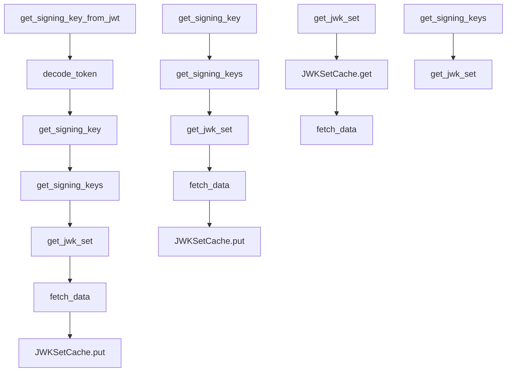

# `jwks_client.py`

## `jwt.jwks_client.PyJWKClient` · *class*

## Summary:
A client for fetching, caching, and managing JSON Web Key Sets (JWKS) from remote endpoints for JWT signature verification.

## Description:
The PyJWKClient class provides a robust interface for retrieving JSON Web Key Sets (JWKS) from a specified URI and managing the caching of these keys for efficient JWT signature validation. It supports both caching of the entire JWK set and individual signing keys, with configurable lifespans and cache sizes. The client is designed to handle common JWT validation scenarios including fetching keys by key ID and extracting keys directly from JWT tokens.

This class is typically instantiated by JWT validation libraries or applications that need to verify JWT signatures using public key cryptography. It abstracts away the complexity of HTTP requests, JSON parsing, and key caching while providing intelligent fallback mechanisms when keys are not found or have expired.

## State:
- uri: str - The URL endpoint from which JWKS data is fetched
- jwk_set_cache: Optional[JWKSetCache] - Cache for storing the complete JWK set with expiration control, or None if caching is disabled
- headers: Dict[str, Any] - HTTP headers to include in requests to the JWKS endpoint
- timeout: int - HTTP request timeout in seconds
- ssl_context: Optional[SSLContext] - SSL context for secure connections, or None for default behavior
- get_signing_key: Callable - The get_signing_key method, optionally wrapped with lru_cache for key caching

## Lifecycle:
Creation: Instantiate with a URI and optional configuration parameters. The client can be configured to cache JWK sets and/or individual signing keys with specified lifespans and cache sizes.
Usage: Call get_signing_key() to retrieve a specific signing key by key ID, or get_signing_key_from_jwt() to extract and retrieve the signing key from a JWT token's header. The client automatically handles refreshing cached data when needed.
Destruction: No explicit cleanup required; standard Python garbage collection handles resource management.

## Method Map:


## Raises:
- PyJWKClientError: Raised when the JWKS endpoint returns invalid data (not a JSON object) or when cache lifespan is invalid (<= 0)
- PyJWKClientConnectionError: Raised when HTTP requests fail due to network issues, timeouts, or server errors
- PyJWKSetError: Raised when the JWK set cannot be parsed from the received data (inherited from PyJWKSet.from_dict)

## Example:
```python
# Create a client with caching enabled
client = PyJWKClient('https://example.com/.well-known/jwks.json', 
                     cache_keys=True, 
                     max_cached_keys=32,
                     cache_jwk_set=True,
                     lifespan=3600)

# Get a signing key by key ID
key = client.get_signing_key('key-id-123')

# Get a signing key from a JWT token (extracts kid from header)
token = 'eyJhbGciOiJIUzI1NiIsInR5cCI6IkpXVCJ9...'
key = client.get_signing_key_from_jwt(token)

# Refresh the cache manually
signing_keys = client.get_signing_keys(refresh=True)
```

### `jwt.jwks_client.PyJWKClient.__init__` · *method*

## Summary:
Initializes a PyJWKClient instance with configuration options for fetching and caching JSON Web Key Sets.

## Description:
Configures the PyJWKClient with settings for connecting to a JWKS endpoint, managing caching behavior, and handling HTTP requests. This method sets up internal state including URI, headers, timeout, and SSL context, while optionally enabling caching for JWK sets and signing keys.

## Args:
    uri (str): The URI of the JSON Web Key Set endpoint.
    cache_keys (bool): Whether to cache signing keys using LRU cache. Defaults to False.
    max_cached_keys (int): Maximum number of signing keys to cache when cache_keys=True. Defaults to 16.
    cache_jwk_set (bool): Whether to cache the entire JWK set. Defaults to True.
    lifespan (int): Cache lifespan in seconds for JWK sets. Defaults to 300. Must be greater than 0 when cache_jwk_set=True.
    headers (Optional[Dict[str, Any]]): HTTP headers to include in requests. Defaults to None.
    timeout (int): Request timeout in seconds. Defaults to 30.
    ssl_context (Optional[SSLContext]): SSL context for secure connections. Defaults to None.

## Returns:
    None: This method initializes instance attributes and does not return a value.

## Raises:
    PyJWKClientError: When cache_jwk_set=True and lifespan is less than or equal to 0.

## State Changes:
    Attributes READ: self.headers (when checking if None)
    Attributes WRITTEN: self.uri, self.jwk_set_cache, self.headers, self.timeout, self.ssl_context

## Constraints:
    Preconditions: 
    - When cache_jwk_set=True, lifespan must be greater than 0
    - uri must be a valid string URL
    - headers, if provided, must be a dictionary-like object
    Postconditions:
    - self.uri is set to the provided uri parameter
    - self.jwk_set_cache is initialized as either a JWKSetCache instance or None
    - self.headers is initialized as a dictionary (defaulting to empty dict)
    - self.timeout is set to the provided timeout value
    - self.ssl_context is set to the provided ssl_context value

## Side Effects:
    None: This method performs no I/O operations or external service calls. It only initializes internal state.

### `jwt.jwks_client.PyJWKClient.fetch_data` · *method*

## Summary:
Fetches and parses JSON Web Key Set data from a remote URI, handling network connections and caching.

## Description:
Retrieves JSON Web Key Set data from the configured URI using HTTP/HTTPS requests. This method performs the core network I/O operation for fetching JWK sets and handles connection-related errors by raising specialized exceptions. The fetched data is parsed as JSON and returned for further processing by the JWK client.

This method is designed as a separate component to encapsulate the network fetching logic, enabling clean separation between data retrieval and JWK set processing. It also manages caching of fetched data through the associated JWKSetCache instance.

## Args:
    None

## Returns:
    Any: The parsed JSON data representing the JWK Set, typically a dictionary containing key material and metadata.

## Raises:
    PyJWKClientConnectionError: When network connection fails due to URL errors, timeouts, or other connection-related issues during data retrieval from the configured URI.

## State Changes:
    Attributes READ: self.uri, self.headers, self.timeout, self.ssl_context, self.jwk_set_cache
    Attributes WRITTEN: None

## Constraints:
    Preconditions:
        - The instance must have a valid URI configured in self.uri
        - Network connectivity must be available for the configured URI
        - The server at the configured URI must return valid JSON data
    Postconditions:
        - If caching is enabled, the fetched data is stored in the cache
        - The returned data is a valid JSON object (dictionary)

## Side Effects:
    - Performs network I/O operations by making HTTP/HTTPS requests to the configured URI
    - May make external service calls to fetch data from remote servers
    - Writes to cache if caching is enabled (via self.jwk_set_cache.put())

### `jwt.jwks_client.PyJWKClient.get_jwk_set` · *method*

## Summary:
Retrieves and processes JSON Web Key Set data, either from cache or by fetching fresh data from the configured URI.

## Description:
Fetches JSON Web Key Set (JWKS) data from either the internal cache or by making an HTTP/HTTPS request to the configured URI. This method serves as the primary interface for obtaining JWK sets used in JWT signing key operations. It implements caching logic to avoid unnecessary network requests while providing a refresh option to force fresh data retrieval.

The method first attempts to retrieve cached data when caching is enabled and refresh is False. If no cached data exists or refresh is True, it fetches fresh data using the underlying fetch_data() method. The retrieved data is validated to ensure it's a JSON object (dictionary) before being converted into a PyJWKSet instance for use by other methods in the client.

This method is separated from the fetch_data() method to provide caching logic and validation while keeping the data fetching responsibility in a dedicated method.

## Args:
    refresh (bool, optional): When True, bypasses caching and forces a fresh data fetch from the URI. Defaults to False.

## Returns:
    PyJWKSet: A PyJWKSet instance containing the parsed JSON Web Key Set data, ready for key lookup operations.

## Raises:
    PyJWKClientError: When the JWKS endpoint does not return a valid JSON object (dictionary).

## State Changes:
    Attributes READ: self.jwk_set_cache, self.fetch_data
    Attributes WRITTEN: None

## Constraints:
    Preconditions:
        - The PyJWKClient instance must be properly initialized with a valid URI
        - Network connectivity must be available if fetching fresh data is required
        - The server at the configured URI must return valid JSON data
    Postconditions:
        - If caching is enabled, the fetched data is stored in the cache
        - The returned PyJWKSet instance contains valid JWK objects

## Side Effects:
    - Makes HTTP/HTTPS requests to the configured URI when no cached data is available or refresh is True
    - May perform network I/O operations to fetch data from remote servers
    - Writes to cache if caching is enabled (via self.jwk_set_cache.put())

### `jwt.jwks_client.PyJWKClient.get_signing_key` · *method*

## Summary:
Retrieves a signing key from the JWKS endpoint that matches the specified key ID, refreshing the key set if necessary.

## Description:
This method attempts to find a signing key in the cached or fetched JWKS (JSON Web Key Set) that matches the provided key ID. If no matching key is found in the initial set, it will refresh the key set from the JWKS endpoint and try again. This method is commonly used during JWT validation to obtain the appropriate key for signature verification.

## Args:
    kid (str): The key ID to match against signing keys in the JWKS.

## Returns:
    PyJWK: The matching signing key from the JWKS.

## Raises:
    PyJWKClientError: When no signing key matching the provided key ID can be found, even after refreshing the key set.

## State Changes:
    Attributes READ: self.uri, self.jwk_set_cache, self.headers, self.timeout, self.ssl_context
    Attributes WRITTEN: None

## Constraints:
    Preconditions: The PyJWKClient instance must have been initialized with a valid URI pointing to a JWKS endpoint.
    Postconditions: Either a matching PyJWK object is returned, or an exception is raised.

## Side Effects:
    I/O: Makes HTTP requests to the configured JWKS endpoint via urllib.request.
    External service calls: Fetches data from the remote JWKS endpoint when no cached keys are available or when refreshing is required.

### `jwt.jwks_client.PyJWKClient.get_signing_key_from_jwt` · *method*

## Summary:
Extracts and returns the signing key associated with a JWT token's key identifier.

## Description:
This method decodes a JWT token without signature verification to extract the header information, specifically the key identifier (kid). It then retrieves the corresponding signing key from the JWKS (JSON Web Key Set) using the extracted key identifier.

This method serves as a utility for obtaining the appropriate signing key for JWT validation purposes, allowing the system to dynamically select the correct key based on the token's metadata.

## Args:
    token (str): A JSON Web Token string to extract the signing key for.

## Returns:
    PyJWK: The signing key object corresponding to the token's key identifier.

## Raises:
    Exception: May raise exceptions from the underlying JWT decoding or key retrieval processes.

## State Changes:
    Attributes READ: None
    Attributes WRITTEN: None

## Constraints:
    Preconditions: 
    - The token must be a valid JWT string
    - The token header must contain a 'kid' field
    - The JWKS must be accessible and contain the key identified by 'kid'
    
    Postconditions:
    - Returns a valid PyJWK object if the key is found
    - The returned key is suitable for signature verification

## Side Effects:
    - May perform network requests to fetch the JWKS if not cached
    - May update internal cache state when fetching new JWKS data

### `jwt.jwks_client.PyJWKClient.match_kid` · *method*

## Summary:
Matches a signing key from a list by its key identifier (kid).

## Description:
Searches through a collection of JSON Web Keys to find the one with a matching key identifier. This utility function is used by the PyJWKClient to locate the appropriate signing key for JWT verification based on the key ID specified in the JWT header.

## Args:
    signing_keys (List[PyJWK]): Collection of JSON Web Key objects to search through
    kid (str): The key identifier to match against the key_id attribute of each PyJWK object

## Returns:
    Optional[PyJWK]: The matching PyJWK object if found, or None if no key with the specified kid exists in the collection

## Raises:
    None: This function does not raise any exceptions

## State Changes:
    None: This function is stateless and does not modify any object attributes

## Constraints:
    Preconditions:
        - The signing_keys list should contain valid PyJWK objects
        - Each PyJWK object in the list should have a valid key_id attribute
        - The kid parameter should be a non-empty string
    
    Postconditions:
        - Returns either a PyJWK object with matching key_id or None
        - Does not alter the input signing_keys list or any of its elements

## Side Effects:
    None: This function performs no I/O operations, external service calls, or mutations to objects outside its parameters

