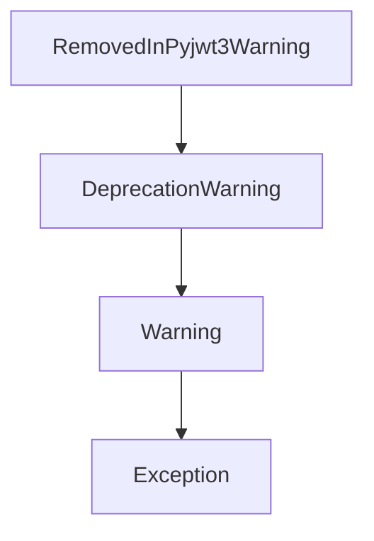

# `warnings.py`

## `jwt.warnings.RemovedInPyjwt3Warning` · *class*

## Summary:
A deprecation warning class indicating features that will be removed in PyJWT version 3.0.

## Description:
This class serves as a specialized warning type to indicate that certain features or behaviors in the PyJWT library will be deprecated and removed in version 3.0. It inherits from Python's built-in `DeprecationWarning` class, making it compatible with Python's warning system while providing a more specific categorization for PyJWT-related deprecations.

The class is intended to be used by the PyJWT library itself to warn users about upcoming breaking changes, allowing them to prepare for migration to newer APIs or behaviors before the features are completely removed in version 3.0.

## State:
- This class has no instance attributes beyond those inherited from `DeprecationWarning`
- The class itself is a simple extension with no additional state management
- Inherits all standard `DeprecationWarning` behavior and properties

## Lifecycle:
- Creation: Instantiated like any other warning class using `RemovedInPyjwt3Warning("message")`
- Usage: Typically created and raised by the PyJWT library internally when deprecated functionality is encountered
- Destruction: No special cleanup required; follows normal Python garbage collection

## Method Map:


## Raises:
- This class itself does not raise exceptions during instantiation
- It is designed to be raised as an exception during runtime when deprecated functionality is detected

## Example:
```python
# Typical usage within PyJWT library
import warnings

# When deprecated functionality is detected
warnings.warn(
    "The 'old_algorithm' parameter is deprecated and will be removed in PyJWT 3.0",
    RemovedInPyjwt3Warning,
    stacklevel=2
)
```

