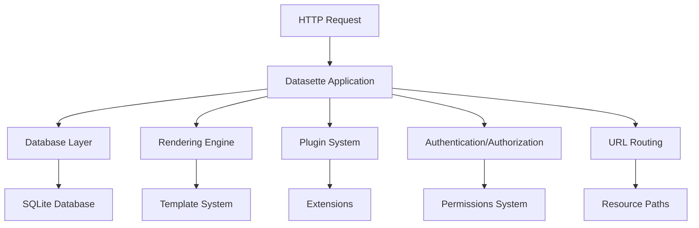

# `datasette`

## Repository Overview

### Tree Structure
```
datasette/
├── publish/          # Publishing utilities for datasette
├── utils/            # General utility functions
├── views/            # View-related components
├── actor_auth_cookie.py     # Authentication cookie management
├── blob_renderer.py         # Binary data blob rendering
├── database.py              # Database connection and query execution
├── default_magic_parameters.py  # Default magic parameters for queries
├── default_menu_links.py      # Default menu link configurations
├── default_permissions.py     # Default permission policies
├── forbidden.py               # Forbidden access handling
├── handle_exception.py        # Exception handling and formatting
├── inspect.py                 # Inspection utilities for datasets
├── plugins.py                 # Plugin management and extension points
├── renderer.py                # Core rendering engine for data presentation
├── sql_functions.py           # Custom SQL functions and utilities
├── tracer.py                  # Tracing and logging utilities
└── url_builder.py             # URL construction utilities
```

### Purpose

Datasette is a Python web application that makes data accessible through a web interface and API. It solves the problem of making structured data easily shareable and queryable by providing a simple way to serve SQLite databases over HTTP with a rich web UI and RESTful API.

**Target Users:**
- Data scientists and analysts who want to share datasets
- Developers building data-driven web applications
- Researchers needing to make data publicly accessible
- Organizations wanting to provide controlled access to databases

**Scenarios:**
- Sharing SQLite databases with others through a web interface
- Building custom data exploration tools
- Creating APIs for structured data access
- Providing read-only access to databases with fine-grained permissions

**Position in Ecosystem:**
Datasette operates as a standalone tool that can be run directly from the command line, but also serves as a library that can be integrated into larger Python applications. It bridges the gap between raw database storage and user-friendly data access interfaces.

### Architecture



**Key Abstractions:**
- **Database Abstraction**: The `Database` class provides unified access to SQLite databases with support for both read and write operations
- **Rendering Engine**: The `renderer.py` module handles presentation of data in various formats (HTML, JSON, CSV, etc.)
- **Plugin Architecture**: The `plugins.py` module enables extension of core functionality
- **Exception Handling**: Centralized error handling through `handle_exception.py`
- **URL Construction**: Consistent URL building through `url_builder.py`

### Entry Points

**CLI Commands:**
- `datasette serve [DATABASE]` - Serve a SQLite database over HTTP
- `datasette publish [DATABASE]` - Publish a database to various platforms
- `datasette inspect [DATABASE]` - Inspect database schema and metadata

**Importable APIs:**
- `datasette.Database` - Core database access class
- `datasette.render_template` - Template rendering interface
- `datasette.plugins.load_plugins` - Plugin loading mechanism
- `datasette.handle_exception` - Exception handling function

**Service Endpoints:**
- `/` - Main dashboard with database overview
- `/database` - Database-specific views
- `/database/table` - Table data access
- `/database/table.json` - JSON API endpoint
- `/database/query` - Custom query interface

### Core Features

1. **Database Access**: Asynchronous SQLite database operations with connection pooling
2. **Web Interface**: Rich HTML interface for browsing and querying data
3. **API Endpoints**: RESTful JSON APIs for programmatic access
4. **Plugin System**: Extensible architecture for adding custom functionality
5. **Authentication & Permissions**: Fine-grained access control mechanisms
6. **Data Export**: Multiple export formats (CSV, JSON, etc.)
7. **Custom SQL Functions**: Extended SQL capabilities through custom functions
8. **URL Routing**: Consistent URL construction for all resources

### Dependencies

**Core Dependencies:**
- `sqlite3` - Built-in Python module for SQLite database operations
- `aiohttp` - Async HTTP server framework
- `jinja2` - Template rendering engine
- `click` - Command-line interface builder
- `toml` - Configuration file parsing

**Version Constraints:**
- Requires Python 3.8+
- SQLite version supporting modern features (3.30+ recommended)
- aiohttp version compatible with async/await syntax

### Configuration

**Configuration Files:**
- `datasette.toml` - Main configuration file for Datasette settings
- `.datasette` - Per-database configuration directory

**Environment Variables:**
- `DATASETTE_SECRET` - Secret key for signing session cookies
- `DATASETTE_CORS` - Enable/disable CORS headers
- `DATASETTE_DEBUG` - Enable debug mode with enhanced error reporting

### Extension Points

**Plugins:**
- Custom SQL functions via `datasette.register_sql_function()`
- New API endpoints through plugin hooks
- Custom template filters and globals
- New authentication backends

**Hooks:**
- `prepare_connection` - Modify database connections
- `prepare_jinja2_environment` - Customize template rendering
- `register_routes` - Add new HTTP routes
- `actor_from_request` - Custom authentication logic

**Subclassing:**
- Extend `Database` class for custom database behaviors
- Override `Renderer` methods for custom presentation logic
- Inherit from base exception classes for custom error handling

---

## Modules

- [`datasette`](datasette.md)
- [`datasette/publish`](datasette/publish.md)
- [`datasette/utils`](datasette/utils.md)
- [`datasette/views`](datasette/views.md)

