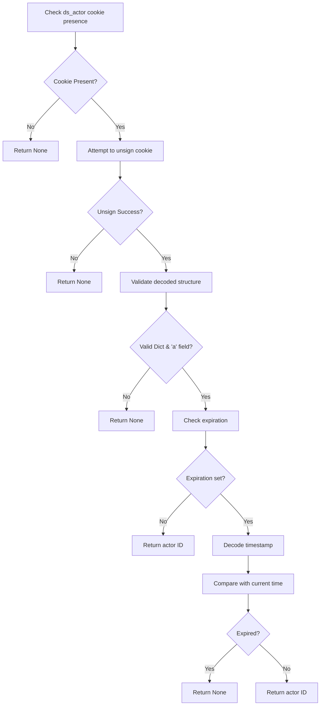

# `actor_auth_cookie.py`

## `datasette.actor_auth_cookie.actor_from_request` · *function*

## Summary:
Extracts and validates an authenticated actor identifier from a signed HTTP cookie.

## Description:
Retrieves the "ds_actor" cookie from an HTTP request, verifies its cryptographic signature, and extracts the actor identifier if valid and not expired. This function implements secure cookie-based authentication by validating signed tokens that contain actor information and optional expiration timestamps.

## Args:
    datasette (Datasette): The Datasette application instance providing the unsigning mechanism
    request (Request): HTTP request object containing cookies to validate

## Returns:
    str or None: The actor identifier if the cookie is valid and unexpired, None otherwise

## Raises:
    None explicitly raised - handles BadSignature exception internally

## Constraints:
    Preconditions:
        - The datasette instance must have a valid unsign method configured
        - The request object must support cookie access via .cookies attribute
    Postconditions:
        - Returns None if no ds_actor cookie is present
        - Returns None if cookie signature validation fails
        - Returns None if decoded data is malformed or missing required fields
        - Returns None if expiration timestamp has passed

## Side Effects:
    None - This function performs no I/O operations or state mutations

## Control Flow:


## Examples:
```python
# Valid actor cookie
actor = actor_from_request(datasette, request_with_valid_actor_cookie)
# Returns: "user123" (the actor identifier)

# Missing actor cookie
actor = actor_from_request(datasette, request_without_actor_cookie)
# Returns: None

# Expired actor cookie
actor = actor_from_request(datasette, request_with_expired_actor_cookie)
# Returns: None
```

