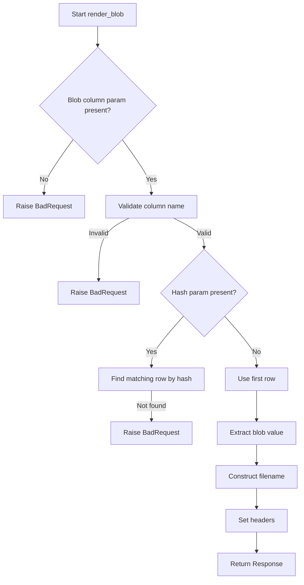

# `blob_renderer.py`

## `datasette.blob_renderer.render_blob` · *function*

## Summary:
Renders binary blob data from a database row as a downloadable file response.

## Description:
Handles requests to download binary content stored in database columns. Validates required parameters, finds the appropriate blob data (either by hash verification or using the first row), constructs a filename for the download, and returns an HTTP response with the binary content.

This function is designed to be used as a Datasette plugin hook for rendering blob data in a web interface. It ensures secure access to binary content by optionally validating content hashes and provides proper HTTP headers for file downloads.

## Args:
    datasette (Datasette): Datasette application instance
    database (str): Database name
    rows (list[dict]): List of database rows containing the blob data
    columns (list[str]): List of column names available in the result set
    request (Request): ASGI request object containing query parameters
    table (str or None): Table name for constructing filename
    view_name (str): Name of the view being rendered

## Returns:
    Response: ASGI Response object containing the binary blob data with appropriate headers for file download

## Raises:
    BadRequest: When required query parameters are missing or invalid column names are provided, or when hash validation fails

## Constraints:
    Preconditions:
    - Request must contain a valid blob column parameter
    - Specified blob column must exist in the columns list
    - If hash parameter is provided, the blob content must match the hash in the database
    
    Postconditions:
    - Returns a properly formatted Response with binary content
    - Response includes Content-Disposition header for file download
    - Response includes security headers (X-Content-Type-Options)

## Side Effects:
    None - This function is pure and doesn't modify any external state

## Control Flow:


## Examples:
```python
# Typical usage in Datasette plugin context
# GET /database/table?blob=content&hash=abc123
# Returns downloadable file with binary content

# Without hash validation
# GET /database/table?blob=content
# Returns first row's binary content as downloadable file
```

## `datasette.blob_renderer.register_output_renderer` · *function*

## Summary:
Registers a blob output renderer configuration for Datasette's plugin system.

## Description:
Returns a configuration dictionary that registers a blob renderer with Datasette's output rendering system. This function is intended to be used as a plugin hook to enable blob data rendering capabilities in Datasette applications.

The returned configuration specifies that files with the ".blob" extension should use the `render_blob` function for rendering, and the `can_render` function determines when this renderer should be activated.

## Args:
    None

## Returns:
    dict: Configuration dictionary with keys:
        - "extension" (str): File extension identifier ("blob")
        - "render" (function): Reference to the `render_blob` function for rendering blob data
        - "can_render" (function): Lambda function that always returns False, indicating this renderer is not auto-enabled

## Raises:
    None

## Constraints:
    Preconditions:
    - The `render_blob` function must be defined in the same module
    - This function should only be called during Datasette plugin initialization
    
    Postconditions:
    - Returns a properly formatted configuration dictionary
    - All required keys are present in the returned dictionary

## Side Effects:
    None - This function is pure and doesn't modify any external state

## Control Flow:
```mermaid
flowchart TD
    A[Start register_output_renderer] --> B[Return config dict]
    B --> C{"extension": "blob"}
    B --> D{"render": render_blob}
    B --> E{"can_render": lambda: False}
    C --> F[End]
    D --> F
    E --> F
```

## Examples:
```python
# Typical usage in Datasette plugin context
renderer_config = register_output_renderer()
# Result: {"extension": "blob", "render": render_blob, "can_render": lambda: False}
```

